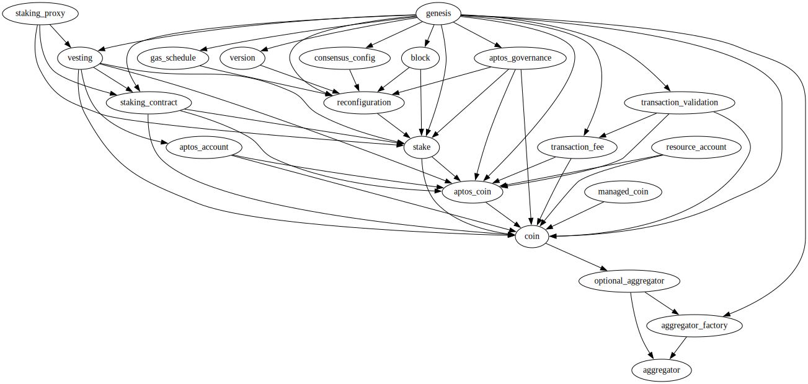
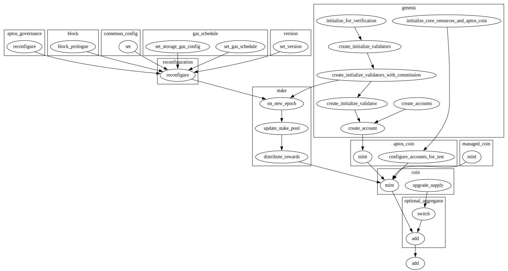

# Module `0x1::aggregator`

This module provides an API for aggregatable integers that allow addition,
subtraction, and reading.

Design rationale (V1)
=====================
Aggregator can be seen as a parellizable integer that supports addition,
subtraction and reading. The first version (V1) of aggregator has the
the following specification.

add(value: u128)
Speculatively adds a <code>value</code> to aggregator. This is a cheap operation
which is parallelizable. If the result of addition overflows a <code>limit</code>
(one of aggregator's fields), an error is produced and the execution
aborts.

sub(value: u128)
Speculatively subtracts a <code>value</code> from aggregator. This is a cheap
operation which is parallelizable. If the result goes below zero, an
error is produced and the execution aborts.

read(): u128
Reads (materializes) the value of an aggregator. This is an expensive
operation which usually involves reading from the storage.

destroy()
Destroys and aggregator, also cleaning up storage if necessary.

Note that there is no constructor in <code><a href="aggregator.md#0x1_aggregator_Aggregator">Aggregator</a></code> API. This is done on purpose.
For every aggregator, we need to know where its value is stored on chain.
Currently, Move does not allow fine grained access to struct fields. For
example, given a struct

struct Foo<A> has key {
a: A,
b: u128,
}

there is no way of getting a value of <code>Foo::a</code> without hardcoding the layout
of <code>Foo</code> and the field offset. To mitigate this problem, one can use a table.
Every item stored in the table is uniqely identified by (handle, key) pair:
<code>handle</code> identifies a table instance, <code>key</code> identifies an item within the table.

So how is this related to aggregator? Well, aggregator can reuse the table's
approach for fine-grained storage. However, since native functions only see a
reference to aggregator, we must ensure that both <code>handle</code> and <code>key</code> are
included as fields. Therefore, the struct looks like

struct Aggregator {
handle: u128,
key: u128,
..
}

Remaining question is how to generate this (handle, key) pair. For that, we have
a dedicated struct called <code>AggregatorFactory</code> which is responsible for constructing
aggregators. See <code><a href="aggregator_factory.md#0x1_aggregator_factory">aggregator_factory</a>.<b>move</b></code> for more details.

Advice to users (V1)
====================
Users are encouraged to use "cheap" operations (e.g. additions) to exploit the
parallelism in execution.

-  [Struct `Aggregator`](#0x1_aggregator_Aggregator)
-  [Constants](#@Constants_0)
-  [Function `limit`](#0x1_aggregator_limit)
-  [Function `add`](#0x1_aggregator_add)
-  [Function `sub`](#0x1_aggregator_sub)
-  [Function `read`](#0x1_aggregator_read)
-  [Function `destroy`](#0x1_aggregator_destroy)
-  [Specification](#@Specification_1)
    -  [Function `add`](#@Specification_1_add)
    -  [Function `sub`](#@Specification_1_sub)
    -  [Function `read`](#@Specification_1_read)
    -  [Function `destroy`](#@Specification_1_destroy)

<pre><code></code></pre>

Show all the modules that "aggregator" depends on directly or indirectly

Show all the modules that depend on "aggregator" directly or indirectly

## Struct `Aggregator`

<pre><code><b>struct</b> <a href="aggregator.md#0x1_aggregator_Aggregator">Aggregator</a> <b>has</b> store
</code></pre>

Fields

<dl>
<dt>
<code>handle: <b>address</b></code>
</dt>
<dd>

</dd>
<dt>
<code>key: <b>address</b></code>
</dt>
<dd>

</dd>
<dt>
<code>limit: u128</code>
</dt>
<dd>

</dd>
</dl>

## Constants

When the value of aggregator (actual or accumulated) overflows (raised by native code).

<pre><code><b>const</b> <a href="aggregator.md#0x1_aggregator_EAGGREGATOR_OVERFLOW">EAGGREGATOR_OVERFLOW</a>: u64 = 1;
</code></pre>

When the value of aggregator (actual or accumulated) underflows, i.e goes below zero (raised by native code).

<pre><code><b>const</b> <a href="aggregator.md#0x1_aggregator_EAGGREGATOR_UNDERFLOW">EAGGREGATOR_UNDERFLOW</a>: u64 = 2;
</code></pre>

When aggregator feature is not supported (raised by native code).

<pre><code><b>const</b> <a href="aggregator.md#0x1_aggregator_ENOT_SUPPORTED">ENOT_SUPPORTED</a>: u64 = 3;
</code></pre>

## Function `limit`

Returns <code>limit</code> exceeding which aggregator overflows.

<pre><code><b>public</b> <b>fun</b> <a href="aggregator.md#0x1_aggregator_limit">limit</a>(<a href="aggregator.md#0x1_aggregator">aggregator</a>: &<a href="aggregator.md#0x1_aggregator_Aggregator">aggregator::Aggregator</a>): u128
</code></pre>

Implementation

<pre><code><b>public</b> <b>fun</b> <a href="aggregator.md#0x1_aggregator_limit">limit</a>(<a href="aggregator.md#0x1_aggregator">aggregator</a>: &<a href="aggregator.md#0x1_aggregator_Aggregator">Aggregator</a>): u128 {
    <a href="aggregator.md#0x1_aggregator">aggregator</a>.limit
}
</code></pre>

Show all the functions that "limit" calls

Show all the functions that call "limit"

## Function `add`

Adds <code>value</code> to aggregator. Aborts on overflowing the limit.

<pre><code><b>public</b> <b>fun</b> <a href="aggregator.md#0x1_aggregator_add">add</a>(<a href="aggregator.md#0x1_aggregator">aggregator</a>: &<b>mut</b> <a href="aggregator.md#0x1_aggregator_Aggregator">aggregator::Aggregator</a>, value: u128)
</code></pre>

Implementation

<pre><code><b>public</b> <b>native</b> <b>fun</b> <a href="aggregator.md#0x1_aggregator_add">add</a>(<a href="aggregator.md#0x1_aggregator">aggregator</a>: &<b>mut</b> <a href="aggregator.md#0x1_aggregator_Aggregator">Aggregator</a>, value: u128);
</code></pre>

Show all the functions that "add" calls

Show all the functions that call "add"

## Function `sub`

Subtracts <code>value</code> from aggregator. Aborts on going below zero.

<pre><code><b>public</b> <b>fun</b> <a href="aggregator.md#0x1_aggregator_sub">sub</a>(<a href="aggregator.md#0x1_aggregator">aggregator</a>: &<b>mut</b> <a href="aggregator.md#0x1_aggregator_Aggregator">aggregator::Aggregator</a>, value: u128)
</code></pre>

Implementation

<pre><code><b>public</b> <b>native</b> <b>fun</b> <a href="aggregator.md#0x1_aggregator_sub">sub</a>(<a href="aggregator.md#0x1_aggregator">aggregator</a>: &<b>mut</b> <a href="aggregator.md#0x1_aggregator_Aggregator">Aggregator</a>, value: u128);
</code></pre>

Show all the functions that "sub" calls

Show all the functions that call "sub"

## Function `read`

Returns a value stored in this aggregator.

<pre><code><b>public</b> <b>fun</b> <a href="aggregator.md#0x1_aggregator_read">read</a>(<a href="aggregator.md#0x1_aggregator">aggregator</a>: &<a href="aggregator.md#0x1_aggregator_Aggregator">aggregator::Aggregator</a>): u128
</code></pre>

Implementation

<pre><code><b>public</b> <b>native</b> <b>fun</b> <a href="aggregator.md#0x1_aggregator_read">read</a>(<a href="aggregator.md#0x1_aggregator">aggregator</a>: &<a href="aggregator.md#0x1_aggregator_Aggregator">Aggregator</a>): u128;
</code></pre>

Show all the functions that "read" calls

Show all the functions that call "read"

## Function `destroy`

Destroys an aggregator and removes it from its <code>AggregatorFactory</code>.

<pre><code><b>public</b> <b>fun</b> <a href="aggregator.md#0x1_aggregator_destroy">destroy</a>(<a href="aggregator.md#0x1_aggregator">aggregator</a>: <a href="aggregator.md#0x1_aggregator_Aggregator">aggregator::Aggregator</a>)
</code></pre>

Implementation

<pre><code><b>public</b> <b>native</b> <b>fun</b> <a href="aggregator.md#0x1_aggregator_destroy">destroy</a>(<a href="aggregator.md#0x1_aggregator">aggregator</a>: <a href="aggregator.md#0x1_aggregator_Aggregator">Aggregator</a>);
</code></pre>

Show all the functions that "destroy" calls

Show all the functions that call "destroy"

## Specification

<pre><code><b>pragma</b> verify = <b>false</b>;
</code></pre>

### Function `add`

<pre><code><b>public</b> <b>fun</b> <a href="aggregator.md#0x1_aggregator_add">add</a>(<a href="aggregator.md#0x1_aggregator">aggregator</a>: &<b>mut</b> <a href="aggregator.md#0x1_aggregator_Aggregator">aggregator::Aggregator</a>, value: u128)
</code></pre>

<pre><code><b>pragma</b> opaque;
</code></pre>

### Function `sub`

<pre><code><b>public</b> <b>fun</b> <a href="aggregator.md#0x1_aggregator_sub">sub</a>(<a href="aggregator.md#0x1_aggregator">aggregator</a>: &<b>mut</b> <a href="aggregator.md#0x1_aggregator_Aggregator">aggregator::Aggregator</a>, value: u128)
</code></pre>

<pre><code><b>pragma</b> opaque;
</code></pre>

### Function `read`

<pre><code><b>public</b> <b>fun</b> <a href="aggregator.md#0x1_aggregator_read">read</a>(<a href="aggregator.md#0x1_aggregator">aggregator</a>: &<a href="aggregator.md#0x1_aggregator_Aggregator">aggregator::Aggregator</a>): u128
</code></pre>

<pre><code><b>pragma</b> opaque;
</code></pre>

### Function `destroy`

<pre><code><b>public</b> <b>fun</b> <a href="aggregator.md#0x1_aggregator_destroy">destroy</a>(<a href="aggregator.md#0x1_aggregator">aggregator</a>: <a href="aggregator.md#0x1_aggregator_Aggregator">aggregator::Aggregator</a>)
</code></pre>

<pre><code><b>pragma</b> opaque;
</code></pre>

[move-book]: https://move-language.github.io/move/introduction.html
