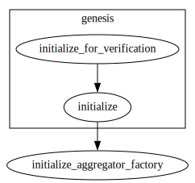
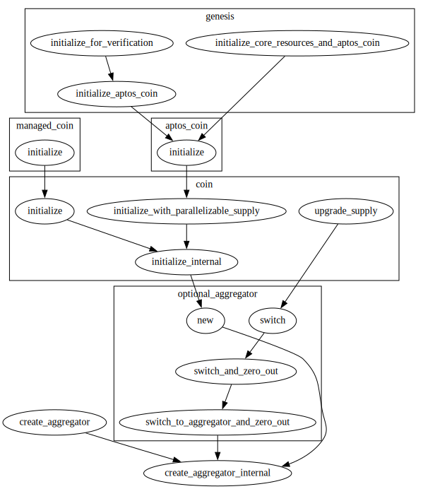
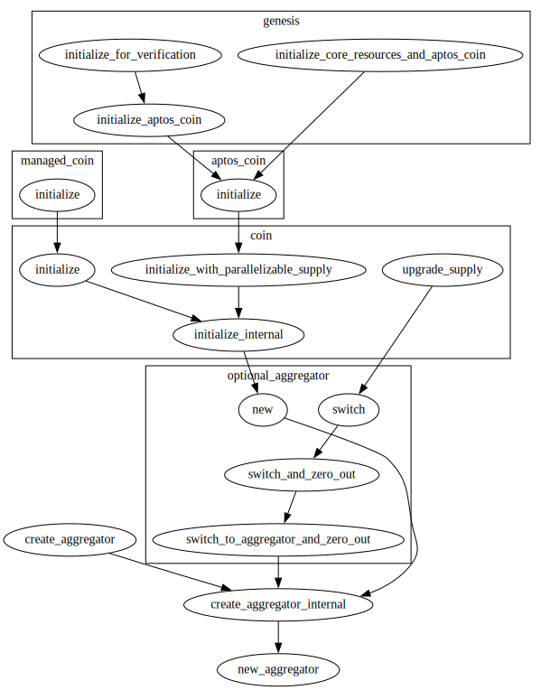

# Module `0x1::aggregator_factory`

This module provides foundations to create aggregators in the system.

Design rationale (V1)
=====================
First, we encourage the reader to see rationale of <code>Aggregator</code> in
<code><a href="aggregator.md#0x1_aggregator">aggregator</a>.<b>move</b></code>.

Recall that the value of any aggregator can be identified in storage by
(handle, key) pair. How this pair can be generated? Short answer: with
<code><a href="aggregator_factory.md#0x1_aggregator_factory_AggregatorFactory">AggregatorFactory</a></code>!

<code><a href="aggregator_factory.md#0x1_aggregator_factory_AggregatorFactory">AggregatorFactory</a></code> is a struct that can be stored as a resource on some
account and which contains a <code>phantom_table</code> field. When the factory is
initialized, we initialize this table. Importantly, table initialization
only generates a uniue table <code>handle</code> - something we can reuse.

When the user wants to create a new aggregator, he/she calls a constructor
provided by the factory (<code><a href="aggregator_factory.md#0x1_aggregator_factory_create_aggregator">create_aggregator</a>(..)</code>). This constructor generates
a unique key, which with the handle is used to initialize <code>Aggregator</code> struct.

Use cases
=========
We limit the usage of <code><a href="aggregator_factory.md#0x1_aggregator_factory_AggregatorFactory">AggregatorFactory</a></code> by only storing it on the core
account.

When something whants to use an aggregator, the factory is queried and an
aggregator instance is created. Once aggregator is no longer in use, it
should be destroyed by the user.

-  [Resource `AggregatorFactory`](#0x1_aggregator_factory_AggregatorFactory)
-  [Constants](#@Constants_0)
-  [Function `initialize_aggregator_factory`](#0x1_aggregator_factory_initialize_aggregator_factory)
-  [Function `create_aggregator_internal`](#0x1_aggregator_factory_create_aggregator_internal)
-  [Function `create_aggregator`](#0x1_aggregator_factory_create_aggregator)
-  [Function `new_aggregator`](#0x1_aggregator_factory_new_aggregator)
-  [Specification](#@Specification_1)
    -  [Function `new_aggregator`](#@Specification_1_new_aggregator)

<pre><code><b>use</b> <a href="aggregator.md#0x1_aggregator">0x1::aggregator</a>;
<b>use</b> <a href="../../aptos-stdlib/../move-stdlib/doc/error.md#0x1_error">0x1::error</a>;
<b>use</b> <a href="system_addresses.md#0x1_system_addresses">0x1::system_addresses</a>;
<b>use</b> <a href="../../aptos-stdlib/doc/table.md#0x1_table">0x1::table</a>;
</code></pre>

Show all the modules that "aggregator_factory" depends on directly or indirectly

Show all the modules that depend on "aggregator_factory" directly or indirectly

## Resource `AggregatorFactory`

Struct that creates aggregators.

<pre><code><b>struct</b> <a href="aggregator_factory.md#0x1_aggregator_factory_AggregatorFactory">AggregatorFactory</a> <b>has</b> key
</code></pre>

Fields

<dl>
<dt>
<code>phantom_table: <a href="../../aptos-stdlib/doc/table.md#0x1_table_Table">table::Table</a>&lt;<b>address</b>, u128&gt;</code>
</dt>
<dd>

</dd>
</dl>

## Constants

When aggregator factory is not published yet.

<pre><code><b>const</b> <a href="aggregator_factory.md#0x1_aggregator_factory_EAGGREGATOR_FACTORY_NOT_FOUND">EAGGREGATOR_FACTORY_NOT_FOUND</a>: u64 = 1;
</code></pre>

## Function `initialize_aggregator_factory`

Can only be called during genesis.
Creates a new factory for aggregators.

<pre><code><b>public</b>(<b>friend</b>) <b>fun</b> <a href="aggregator_factory.md#0x1_aggregator_factory_initialize_aggregator_factory">initialize_aggregator_factory</a>(aptos_framework: &<a href="../../aptos-stdlib/../move-stdlib/doc/signer.md#0x1_signer">signer</a>)
</code></pre>

Implementation

<pre><code><b>public</b>(<b>friend</b>) <b>fun</b> <a href="aggregator_factory.md#0x1_aggregator_factory_initialize_aggregator_factory">initialize_aggregator_factory</a>(aptos_framework: &<a href="../../aptos-stdlib/../move-stdlib/doc/signer.md#0x1_signer">signer</a>) {
    <a href="system_addresses.md#0x1_system_addresses_assert_aptos_framework">system_addresses::assert_aptos_framework</a>(aptos_framework);
    <b>let</b> <a href="aggregator_factory.md#0x1_aggregator_factory">aggregator_factory</a> = <a href="aggregator_factory.md#0x1_aggregator_factory_AggregatorFactory">AggregatorFactory</a> {
        phantom_table: <a href="../../aptos-stdlib/doc/table.md#0x1_table_new">table::new</a>()
    };
    <b>move_to</b>(aptos_framework, <a href="aggregator_factory.md#0x1_aggregator_factory">aggregator_factory</a>);
}
</code></pre>

Show all the functions that "initialize_aggregator_factory" calls

Show all the functions that call "initialize_aggregator_factory"

## Function `create_aggregator_internal`

Creates a new aggregator instance which overflows on exceeding a <code>limit</code>.

<pre><code><b>public</b>(<b>friend</b>) <b>fun</b> <a href="aggregator_factory.md#0x1_aggregator_factory_create_aggregator_internal">create_aggregator_internal</a>(limit: u128): <a href="aggregator.md#0x1_aggregator_Aggregator">aggregator::Aggregator</a>
</code></pre>

Implementation

<pre><code><b>public</b>(<b>friend</b>) <b>fun</b> <a href="aggregator_factory.md#0x1_aggregator_factory_create_aggregator_internal">create_aggregator_internal</a>(limit: u128): Aggregator <b>acquires</b> <a href="aggregator_factory.md#0x1_aggregator_factory_AggregatorFactory">AggregatorFactory</a> {
    <b>assert</b>!(
        <b>exists</b>&lt;<a href="aggregator_factory.md#0x1_aggregator_factory_AggregatorFactory">AggregatorFactory</a>&gt;(@aptos_framework),
        <a href="../../aptos-stdlib/../move-stdlib/doc/error.md#0x1_error_not_found">error::not_found</a>(<a href="aggregator_factory.md#0x1_aggregator_factory_EAGGREGATOR_FACTORY_NOT_FOUND">EAGGREGATOR_FACTORY_NOT_FOUND</a>)
    );

    <b>let</b> <a href="aggregator_factory.md#0x1_aggregator_factory">aggregator_factory</a> = <b>borrow_global_mut</b>&lt;<a href="aggregator_factory.md#0x1_aggregator_factory_AggregatorFactory">AggregatorFactory</a>&gt;(@aptos_framework);
    <a href="aggregator_factory.md#0x1_aggregator_factory_new_aggregator">new_aggregator</a>(<a href="aggregator_factory.md#0x1_aggregator_factory">aggregator_factory</a>, limit)
}
</code></pre>

Show all the functions that "create_aggregator_internal" calls

Show all the functions that call "create_aggregator_internal"

## Function `create_aggregator`

This is currently a function closed for public. This can be updated in the future by on-chain governance
to allow any signer to call.

<pre><code><b>public</b> <b>fun</b> <a href="aggregator_factory.md#0x1_aggregator_factory_create_aggregator">create_aggregator</a>(<a href="account.md#0x1_account">account</a>: &<a href="../../aptos-stdlib/../move-stdlib/doc/signer.md#0x1_signer">signer</a>, limit: u128): <a href="aggregator.md#0x1_aggregator_Aggregator">aggregator::Aggregator</a>
</code></pre>

Implementation

<pre><code><b>public</b> <b>fun</b> <a href="aggregator_factory.md#0x1_aggregator_factory_create_aggregator">create_aggregator</a>(<a href="account.md#0x1_account">account</a>: &<a href="../../aptos-stdlib/../move-stdlib/doc/signer.md#0x1_signer">signer</a>, limit: u128): Aggregator <b>acquires</b> <a href="aggregator_factory.md#0x1_aggregator_factory_AggregatorFactory">AggregatorFactory</a> {
    // Only Aptos Framework (0x1) <a href="account.md#0x1_account">account</a> can call this for now.
    <a href="system_addresses.md#0x1_system_addresses_assert_aptos_framework">system_addresses::assert_aptos_framework</a>(<a href="account.md#0x1_account">account</a>);
    <a href="aggregator_factory.md#0x1_aggregator_factory_create_aggregator_internal">create_aggregator_internal</a>(limit)
}
</code></pre>

Show all the functions that "create_aggregator" calls

Show all the functions that call "create_aggregator"

## Function `new_aggregator`

<pre><code><b>fun</b> <a href="aggregator_factory.md#0x1_aggregator_factory_new_aggregator">new_aggregator</a>(<a href="aggregator_factory.md#0x1_aggregator_factory">aggregator_factory</a>: &<b>mut</b> <a href="aggregator_factory.md#0x1_aggregator_factory_AggregatorFactory">aggregator_factory::AggregatorFactory</a>, limit: u128): <a href="aggregator.md#0x1_aggregator_Aggregator">aggregator::Aggregator</a>
</code></pre>

Implementation

<pre><code><b>native</b> <b>fun</b> <a href="aggregator_factory.md#0x1_aggregator_factory_new_aggregator">new_aggregator</a>(<a href="aggregator_factory.md#0x1_aggregator_factory">aggregator_factory</a>: &<b>mut</b> <a href="aggregator_factory.md#0x1_aggregator_factory_AggregatorFactory">AggregatorFactory</a>, limit: u128): Aggregator;
</code></pre>

Show all the functions that "new_aggregator" calls

Show all the functions that call "new_aggregator"

## Specification

<pre><code><b>pragma</b> verify = <b>false</b>;
</code></pre>

### Function `new_aggregator`

<pre><code><b>fun</b> <a href="aggregator_factory.md#0x1_aggregator_factory_new_aggregator">new_aggregator</a>(<a href="aggregator_factory.md#0x1_aggregator_factory">aggregator_factory</a>: &<b>mut</b> <a href="aggregator_factory.md#0x1_aggregator_factory_AggregatorFactory">aggregator_factory::AggregatorFactory</a>, limit: u128): <a href="aggregator.md#0x1_aggregator_Aggregator">aggregator::Aggregator</a>
</code></pre>

<pre><code><b>pragma</b> opaque;
</code></pre>

[move-book]: https://move-language.github.io/move/introduction.html
