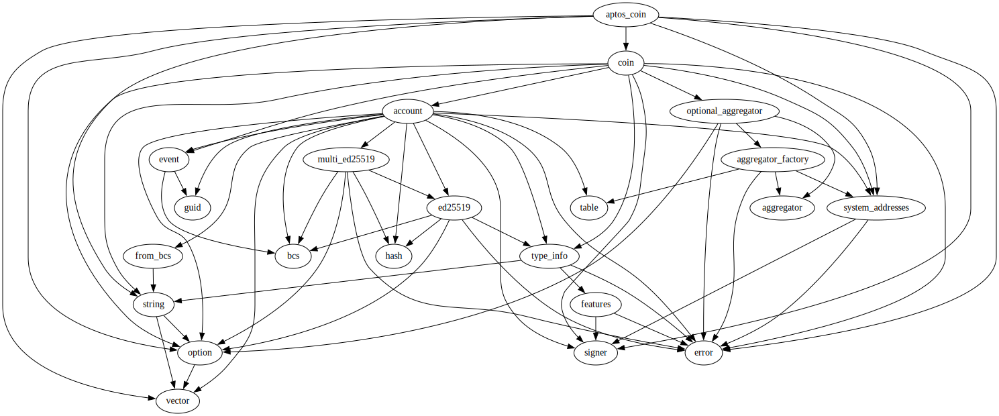
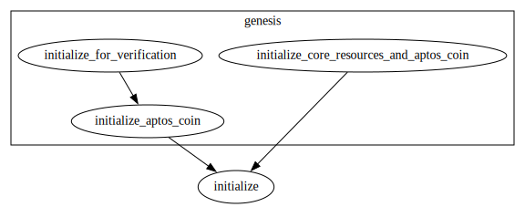
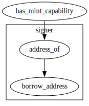
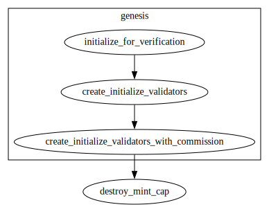
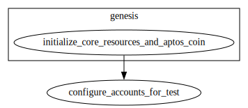
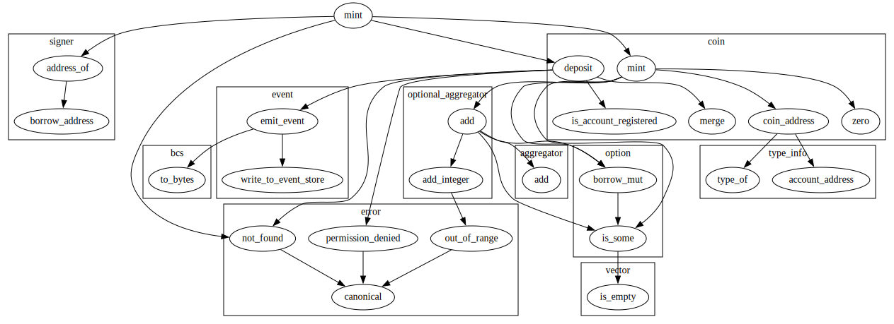
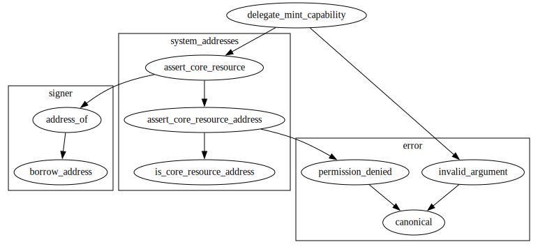
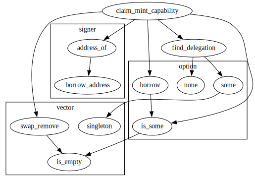

# Module `0x1::aptos_coin`

This module defines a minimal and generic Coin and Balance.
modified from https://github.com/move-language/move/tree/main/language/documentation/tutorial

-  [Resource `AptosCoin`](#0x1_aptos_coin_AptosCoin)
-  [Resource `MintCapStore`](#0x1_aptos_coin_MintCapStore)
-  [Struct `DelegatedMintCapability`](#0x1_aptos_coin_DelegatedMintCapability)
-  [Resource `Delegations`](#0x1_aptos_coin_Delegations)
-  [Constants](#@Constants_0)
-  [Function `initialize`](#0x1_aptos_coin_initialize)
-  [Function `has_mint_capability`](#0x1_aptos_coin_has_mint_capability)
-  [Function `destroy_mint_cap`](#0x1_aptos_coin_destroy_mint_cap)
-  [Function `configure_accounts_for_test`](#0x1_aptos_coin_configure_accounts_for_test)
-  [Function `mint`](#0x1_aptos_coin_mint)
-  [Function `delegate_mint_capability`](#0x1_aptos_coin_delegate_mint_capability)
-  [Function `claim_mint_capability`](#0x1_aptos_coin_claim_mint_capability)
-  [Function `find_delegation`](#0x1_aptos_coin_find_delegation)

<pre><code><b>use</b> <a href="coin.md#0x1_coin">0x1::coin</a>;
<b>use</b> <a href="../../aptos-stdlib/../move-stdlib/doc/error.md#0x1_error">0x1::error</a>;
<b>use</b> <a href="../../aptos-stdlib/../move-stdlib/doc/option.md#0x1_option">0x1::option</a>;
<b>use</b> <a href="../../aptos-stdlib/../move-stdlib/doc/signer.md#0x1_signer">0x1::signer</a>;
<b>use</b> <a href="../../aptos-stdlib/../move-stdlib/doc/string.md#0x1_string">0x1::string</a>;
<b>use</b> <a href="system_addresses.md#0x1_system_addresses">0x1::system_addresses</a>;
<b>use</b> <a href="../../aptos-stdlib/../move-stdlib/doc/vector.md#0x1_vector">0x1::vector</a>;
</code></pre>

Show all the modules that "aptos_coin" depends on directly or indirectly

Show all the modules that depend on "aptos_coin" directly or indirectly

## Resource `AptosCoin`

<pre><code><b>struct</b> <a href="aptos_coin.md#0x1_aptos_coin_AptosCoin">AptosCoin</a> <b>has</b> key
</code></pre>

Fields

<dl>
<dt>
<code>dummy_field: bool</code>
</dt>
<dd>

</dd>
</dl>

## Resource `MintCapStore`

<pre><code><b>struct</b> <a href="aptos_coin.md#0x1_aptos_coin_MintCapStore">MintCapStore</a> <b>has</b> key
</code></pre>

Fields

<dl>
<dt>
<code>mint_cap: <a href="coin.md#0x1_coin_MintCapability">coin::MintCapability</a>&lt;<a href="aptos_coin.md#0x1_aptos_coin_AptosCoin">aptos_coin::AptosCoin</a>&gt;</code>
</dt>
<dd>

</dd>
</dl>

## Struct `DelegatedMintCapability`

Delegation token created by delegator and can be claimed by the delegatee as MintCapability.

<pre><code><b>struct</b> <a href="aptos_coin.md#0x1_aptos_coin_DelegatedMintCapability">DelegatedMintCapability</a> <b>has</b> store
</code></pre>

Fields

<dl>
<dt>
<code><b>to</b>: <b>address</b></code>
</dt>
<dd>

</dd>
</dl>

## Resource `Delegations`

The container stores the current pending delegations.

<pre><code><b>struct</b> <a href="aptos_coin.md#0x1_aptos_coin_Delegations">Delegations</a> <b>has</b> key
</code></pre>

Fields

<dl>
<dt>
<code>inner: <a href="../../aptos-stdlib/../move-stdlib/doc/vector.md#0x1_vector">vector</a>&lt;<a href="aptos_coin.md#0x1_aptos_coin_DelegatedMintCapability">aptos_coin::DelegatedMintCapability</a>&gt;</code>
</dt>
<dd>

</dd>
</dl>

## Constants

Mint capability has already been delegated to this specified address

<pre><code><b>const</b> <a href="aptos_coin.md#0x1_aptos_coin_EALREADY_DELEGATED">EALREADY_DELEGATED</a>: u64 = 2;
</code></pre>

Cannot find delegation of mint capability to this account

<pre><code><b>const</b> <a href="aptos_coin.md#0x1_aptos_coin_EDELEGATION_NOT_FOUND">EDELEGATION_NOT_FOUND</a>: u64 = 3;
</code></pre>

Account does not have mint capability

<pre><code><b>const</b> <a href="aptos_coin.md#0x1_aptos_coin_ENO_CAPABILITIES">ENO_CAPABILITIES</a>: u64 = 1;
</code></pre>

## Function `initialize`

Can only called during genesis to initialize the Aptos coin.

<pre><code><b>public</b>(<b>friend</b>) <b>fun</b> <a href="aptos_coin.md#0x1_aptos_coin_initialize">initialize</a>(aptos_framework: &<a href="../../aptos-stdlib/../move-stdlib/doc/signer.md#0x1_signer">signer</a>): (<a href="coin.md#0x1_coin_BurnCapability">coin::BurnCapability</a>&lt;<a href="aptos_coin.md#0x1_aptos_coin_AptosCoin">aptos_coin::AptosCoin</a>&gt;, <a href="coin.md#0x1_coin_MintCapability">coin::MintCapability</a>&lt;<a href="aptos_coin.md#0x1_aptos_coin_AptosCoin">aptos_coin::AptosCoin</a>&gt;)
</code></pre>

Implementation

<pre><code><b>public</b>(<b>friend</b>) <b>fun</b> <a href="aptos_coin.md#0x1_aptos_coin_initialize">initialize</a>(aptos_framework: &<a href="../../aptos-stdlib/../move-stdlib/doc/signer.md#0x1_signer">signer</a>): (BurnCapability&lt;<a href="aptos_coin.md#0x1_aptos_coin_AptosCoin">AptosCoin</a>&gt;, MintCapability&lt;<a href="aptos_coin.md#0x1_aptos_coin_AptosCoin">AptosCoin</a>&gt;) {
    <a href="system_addresses.md#0x1_system_addresses_assert_aptos_framework">system_addresses::assert_aptos_framework</a>(aptos_framework);

    <b>let</b> (burn_cap, freeze_cap, mint_cap) = <a href="coin.md#0x1_coin_initialize_with_parallelizable_supply">coin::initialize_with_parallelizable_supply</a>&lt;<a href="aptos_coin.md#0x1_aptos_coin_AptosCoin">AptosCoin</a>&gt;(
        aptos_framework,
        <a href="../../aptos-stdlib/../move-stdlib/doc/string.md#0x1_string_utf8">string::utf8</a>(b"Aptos Coin"),
        <a href="../../aptos-stdlib/../move-stdlib/doc/string.md#0x1_string_utf8">string::utf8</a>(b"APT"),
        8, /* decimals */
        <b>true</b>, /* monitor_supply */
    );

    // Aptos framework needs mint cap <b>to</b> mint coins <b>to</b> initial validators. This will be revoked once the validators
    // have been initialized.
    <b>move_to</b>(aptos_framework, <a href="aptos_coin.md#0x1_aptos_coin_MintCapStore">MintCapStore</a> { mint_cap });

    <a href="coin.md#0x1_coin_destroy_freeze_cap">coin::destroy_freeze_cap</a>(freeze_cap);
    (burn_cap, mint_cap)
}
</code></pre>

Show all the functions that "initialize" calls

Show all the functions that call "initialize"

## Function `has_mint_capability`

<pre><code><b>public</b> <b>fun</b> <a href="aptos_coin.md#0x1_aptos_coin_has_mint_capability">has_mint_capability</a>(<a href="account.md#0x1_account">account</a>: &<a href="../../aptos-stdlib/../move-stdlib/doc/signer.md#0x1_signer">signer</a>): bool
</code></pre>

Implementation

<pre><code><b>public</b> <b>fun</b> <a href="aptos_coin.md#0x1_aptos_coin_has_mint_capability">has_mint_capability</a>(<a href="account.md#0x1_account">account</a>: &<a href="../../aptos-stdlib/../move-stdlib/doc/signer.md#0x1_signer">signer</a>): bool {
    <b>exists</b>&lt;<a href="aptos_coin.md#0x1_aptos_coin_MintCapStore">MintCapStore</a>&gt;(<a href="../../aptos-stdlib/../move-stdlib/doc/signer.md#0x1_signer_address_of">signer::address_of</a>(<a href="account.md#0x1_account">account</a>))
}
</code></pre>

Show all the functions that "has_mint_capability" calls

Show all the functions that call "has_mint_capability"

## Function `destroy_mint_cap`

Only called during genesis to destroy the aptos framework account's mint capability once all initial validators
and accounts have been initialized during genesis.

<pre><code><b>public</b>(<b>friend</b>) <b>fun</b> <a href="aptos_coin.md#0x1_aptos_coin_destroy_mint_cap">destroy_mint_cap</a>(aptos_framework: &<a href="../../aptos-stdlib/../move-stdlib/doc/signer.md#0x1_signer">signer</a>)
</code></pre>

Implementation

<pre><code><b>public</b>(<b>friend</b>) <b>fun</b> <a href="aptos_coin.md#0x1_aptos_coin_destroy_mint_cap">destroy_mint_cap</a>(aptos_framework: &<a href="../../aptos-stdlib/../move-stdlib/doc/signer.md#0x1_signer">signer</a>) <b>acquires</b> <a href="aptos_coin.md#0x1_aptos_coin_MintCapStore">MintCapStore</a> {
    <a href="system_addresses.md#0x1_system_addresses_assert_aptos_framework">system_addresses::assert_aptos_framework</a>(aptos_framework);
    <b>let</b> <a href="aptos_coin.md#0x1_aptos_coin_MintCapStore">MintCapStore</a> { mint_cap } = <b>move_from</b>&lt;<a href="aptos_coin.md#0x1_aptos_coin_MintCapStore">MintCapStore</a>&gt;(@aptos_framework);
    <a href="coin.md#0x1_coin_destroy_mint_cap">coin::destroy_mint_cap</a>(mint_cap);
}
</code></pre>

Show all the functions that "destroy_mint_cap" calls

Show all the functions that call "destroy_mint_cap"

## Function `configure_accounts_for_test`

Can only be called during genesis for tests to grant mint capability to aptos framework and core resources
accounts.

<pre><code><b>public</b>(<b>friend</b>) <b>fun</b> <a href="aptos_coin.md#0x1_aptos_coin_configure_accounts_for_test">configure_accounts_for_test</a>(aptos_framework: &<a href="../../aptos-stdlib/../move-stdlib/doc/signer.md#0x1_signer">signer</a>, core_resources: &<a href="../../aptos-stdlib/../move-stdlib/doc/signer.md#0x1_signer">signer</a>, mint_cap: <a href="coin.md#0x1_coin_MintCapability">coin::MintCapability</a>&lt;<a href="aptos_coin.md#0x1_aptos_coin_AptosCoin">aptos_coin::AptosCoin</a>&gt;)
</code></pre>

Implementation

<pre><code><b>public</b>(<b>friend</b>) <b>fun</b> <a href="aptos_coin.md#0x1_aptos_coin_configure_accounts_for_test">configure_accounts_for_test</a>(
    aptos_framework: &<a href="../../aptos-stdlib/../move-stdlib/doc/signer.md#0x1_signer">signer</a>,
    core_resources: &<a href="../../aptos-stdlib/../move-stdlib/doc/signer.md#0x1_signer">signer</a>,
    mint_cap: MintCapability&lt;<a href="aptos_coin.md#0x1_aptos_coin_AptosCoin">AptosCoin</a>&gt;,
) {
    <a href="system_addresses.md#0x1_system_addresses_assert_aptos_framework">system_addresses::assert_aptos_framework</a>(aptos_framework);

    // Mint the core resource <a href="account.md#0x1_account">account</a> <a href="aptos_coin.md#0x1_aptos_coin_AptosCoin">AptosCoin</a> for gas so it can execute system transactions.
    <a href="coin.md#0x1_coin_register">coin::register</a>&lt;<a href="aptos_coin.md#0x1_aptos_coin_AptosCoin">AptosCoin</a>&gt;(core_resources);
    <b>let</b> coins = <a href="coin.md#0x1_coin_mint">coin::mint</a>&lt;<a href="aptos_coin.md#0x1_aptos_coin_AptosCoin">AptosCoin</a>&gt;(
        18446744073709551615,
        &mint_cap,
    );
    <a href="coin.md#0x1_coin_deposit">coin::deposit</a>&lt;<a href="aptos_coin.md#0x1_aptos_coin_AptosCoin">AptosCoin</a>&gt;(<a href="../../aptos-stdlib/../move-stdlib/doc/signer.md#0x1_signer_address_of">signer::address_of</a>(core_resources), coins);

    <b>move_to</b>(core_resources, <a href="aptos_coin.md#0x1_aptos_coin_MintCapStore">MintCapStore</a> { mint_cap });
    <b>move_to</b>(core_resources, <a href="aptos_coin.md#0x1_aptos_coin_Delegations">Delegations</a> { inner: <a href="../../aptos-stdlib/../move-stdlib/doc/vector.md#0x1_vector_empty">vector::empty</a>() });
}
</code></pre>

Show all the functions that "configure_accounts_for_test" calls

Show all the functions that call "configure_accounts_for_test"

## Function `mint`

Only callable in tests and testnets where the core resources account exists.
Create new coins and deposit them into dst_addr's account.

<pre><code><b>public</b> entry <b>fun</b> <a href="aptos_coin.md#0x1_aptos_coin_mint">mint</a>(<a href="account.md#0x1_account">account</a>: &<a href="../../aptos-stdlib/../move-stdlib/doc/signer.md#0x1_signer">signer</a>, dst_addr: <b>address</b>, amount: u64)
</code></pre>

Implementation

<pre><code><b>public</b> entry <b>fun</b> <a href="aptos_coin.md#0x1_aptos_coin_mint">mint</a>(
    <a href="account.md#0x1_account">account</a>: &<a href="../../aptos-stdlib/../move-stdlib/doc/signer.md#0x1_signer">signer</a>,
    dst_addr: <b>address</b>,
    amount: u64,
) <b>acquires</b> <a href="aptos_coin.md#0x1_aptos_coin_MintCapStore">MintCapStore</a> {
    <b>let</b> account_addr = <a href="../../aptos-stdlib/../move-stdlib/doc/signer.md#0x1_signer_address_of">signer::address_of</a>(<a href="account.md#0x1_account">account</a>);

    <b>assert</b>!(
        <b>exists</b>&lt;<a href="aptos_coin.md#0x1_aptos_coin_MintCapStore">MintCapStore</a>&gt;(account_addr),
        <a href="../../aptos-stdlib/../move-stdlib/doc/error.md#0x1_error_not_found">error::not_found</a>(<a href="aptos_coin.md#0x1_aptos_coin_ENO_CAPABILITIES">ENO_CAPABILITIES</a>),
    );

    <b>let</b> mint_cap = &<b>borrow_global</b>&lt;<a href="aptos_coin.md#0x1_aptos_coin_MintCapStore">MintCapStore</a>&gt;(account_addr).mint_cap;
    <b>let</b> coins_minted = <a href="coin.md#0x1_coin_mint">coin::mint</a>&lt;<a href="aptos_coin.md#0x1_aptos_coin_AptosCoin">AptosCoin</a>&gt;(amount, mint_cap);
    <a href="coin.md#0x1_coin_deposit">coin::deposit</a>&lt;<a href="aptos_coin.md#0x1_aptos_coin_AptosCoin">AptosCoin</a>&gt;(dst_addr, coins_minted);
}
</code></pre>

Show all the functions that "mint" calls

Show all the functions that call "mint"

## Function `delegate_mint_capability`

Only callable in tests and testnets where the core resources account exists.
Create delegated token for the address so the account could claim MintCapability later.

<pre><code><b>public</b> entry <b>fun</b> <a href="aptos_coin.md#0x1_aptos_coin_delegate_mint_capability">delegate_mint_capability</a>(<a href="account.md#0x1_account">account</a>: <a href="../../aptos-stdlib/../move-stdlib/doc/signer.md#0x1_signer">signer</a>, <b>to</b>: <b>address</b>)
</code></pre>

Implementation

<pre><code><b>public</b> entry <b>fun</b> <a href="aptos_coin.md#0x1_aptos_coin_delegate_mint_capability">delegate_mint_capability</a>(<a href="account.md#0x1_account">account</a>: <a href="../../aptos-stdlib/../move-stdlib/doc/signer.md#0x1_signer">signer</a>, <b>to</b>: <b>address</b>) <b>acquires</b> <a href="aptos_coin.md#0x1_aptos_coin_Delegations">Delegations</a> {
    <a href="system_addresses.md#0x1_system_addresses_assert_core_resource">system_addresses::assert_core_resource</a>(&<a href="account.md#0x1_account">account</a>);
    <b>let</b> delegations = &<b>mut</b> <b>borrow_global_mut</b>&lt;<a href="aptos_coin.md#0x1_aptos_coin_Delegations">Delegations</a>&gt;(@core_resources).inner;
    <b>let</b> i = 0;
    <b>while</b> (i &lt; <a href="../../aptos-stdlib/../move-stdlib/doc/vector.md#0x1_vector_length">vector::length</a>(delegations)) {
        <b>let</b> element = <a href="../../aptos-stdlib/../move-stdlib/doc/vector.md#0x1_vector_borrow">vector::borrow</a>(delegations, i);
        <b>assert</b>!(element.<b>to</b> != <b>to</b>, <a href="../../aptos-stdlib/../move-stdlib/doc/error.md#0x1_error_invalid_argument">error::invalid_argument</a>(<a href="aptos_coin.md#0x1_aptos_coin_EALREADY_DELEGATED">EALREADY_DELEGATED</a>));
        i = i + 1;
    };
    <a href="../../aptos-stdlib/../move-stdlib/doc/vector.md#0x1_vector_push_back">vector::push_back</a>(delegations, <a href="aptos_coin.md#0x1_aptos_coin_DelegatedMintCapability">DelegatedMintCapability</a> { <b>to</b> });
}
</code></pre>

Show all the functions that "delegate_mint_capability" calls

Show all the functions that call "delegate_mint_capability"

## Function `claim_mint_capability`

Only callable in tests and testnets where the core resources account exists.
Claim the delegated mint capability and destroy the delegated token.

<pre><code><b>public</b> entry <b>fun</b> <a href="aptos_coin.md#0x1_aptos_coin_claim_mint_capability">claim_mint_capability</a>(<a href="account.md#0x1_account">account</a>: &<a href="../../aptos-stdlib/../move-stdlib/doc/signer.md#0x1_signer">signer</a>)
</code></pre>

Implementation

<pre><code><b>public</b> entry <b>fun</b> <a href="aptos_coin.md#0x1_aptos_coin_claim_mint_capability">claim_mint_capability</a>(<a href="account.md#0x1_account">account</a>: &<a href="../../aptos-stdlib/../move-stdlib/doc/signer.md#0x1_signer">signer</a>) <b>acquires</b> <a href="aptos_coin.md#0x1_aptos_coin_Delegations">Delegations</a>, <a href="aptos_coin.md#0x1_aptos_coin_MintCapStore">MintCapStore</a> {
    <b>let</b> maybe_index = <a href="aptos_coin.md#0x1_aptos_coin_find_delegation">find_delegation</a>(<a href="../../aptos-stdlib/../move-stdlib/doc/signer.md#0x1_signer_address_of">signer::address_of</a>(<a href="account.md#0x1_account">account</a>));
    <b>assert</b>!(<a href="../../aptos-stdlib/../move-stdlib/doc/option.md#0x1_option_is_some">option::is_some</a>(&maybe_index), <a href="aptos_coin.md#0x1_aptos_coin_EDELEGATION_NOT_FOUND">EDELEGATION_NOT_FOUND</a>);
    <b>let</b> idx = *<a href="../../aptos-stdlib/../move-stdlib/doc/option.md#0x1_option_borrow">option::borrow</a>(&maybe_index);
    <b>let</b> delegations = &<b>mut</b> <b>borrow_global_mut</b>&lt;<a href="aptos_coin.md#0x1_aptos_coin_Delegations">Delegations</a>&gt;(@core_resources).inner;
    <b>let</b> <a href="aptos_coin.md#0x1_aptos_coin_DelegatedMintCapability">DelegatedMintCapability</a> { <b>to</b>: _ } = <a href="../../aptos-stdlib/../move-stdlib/doc/vector.md#0x1_vector_swap_remove">vector::swap_remove</a>(delegations, idx);

    // Make a <b>copy</b> of mint cap and give it <b>to</b> the specified <a href="account.md#0x1_account">account</a>.
    <b>let</b> mint_cap = <b>borrow_global</b>&lt;<a href="aptos_coin.md#0x1_aptos_coin_MintCapStore">MintCapStore</a>&gt;(@core_resources).mint_cap;
    <b>move_to</b>(<a href="account.md#0x1_account">account</a>, <a href="aptos_coin.md#0x1_aptos_coin_MintCapStore">MintCapStore</a> { mint_cap });
}
</code></pre>

Show all the functions that "claim_mint_capability" calls

Show all the functions that call "claim_mint_capability"

## Function `find_delegation`

<pre><code><b>fun</b> <a href="aptos_coin.md#0x1_aptos_coin_find_delegation">find_delegation</a>(addr: <b>address</b>): <a href="../../aptos-stdlib/../move-stdlib/doc/option.md#0x1_option_Option">option::Option</a>&lt;u64&gt;
</code></pre>

Implementation

<pre><code><b>fun</b> <a href="aptos_coin.md#0x1_aptos_coin_find_delegation">find_delegation</a>(addr: <b>address</b>): Option&lt;u64&gt; <b>acquires</b> <a href="aptos_coin.md#0x1_aptos_coin_Delegations">Delegations</a> {
    <b>let</b> delegations = &<b>borrow_global</b>&lt;<a href="aptos_coin.md#0x1_aptos_coin_Delegations">Delegations</a>&gt;(@core_resources).inner;
    <b>let</b> i = 0;
    <b>let</b> len = <a href="../../aptos-stdlib/../move-stdlib/doc/vector.md#0x1_vector_length">vector::length</a>(delegations);
    <b>let</b> index = <a href="../../aptos-stdlib/../move-stdlib/doc/option.md#0x1_option_none">option::none</a>();
    <b>while</b> (i &lt; len) {
        <b>let</b> element = <a href="../../aptos-stdlib/../move-stdlib/doc/vector.md#0x1_vector_borrow">vector::borrow</a>(delegations, i);
        <b>if</b> (element.<b>to</b> == addr) {
            index = <a href="../../aptos-stdlib/../move-stdlib/doc/option.md#0x1_option_some">option::some</a>(i);
            <b>break</b>
        };
        i = i + 1;
    };
    index
}
</code></pre>

Show all the functions that "find_delegation" calls

Show all the functions that call "find_delegation"

[move-book]: https://move-language.github.io/move/introduction.html
