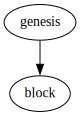
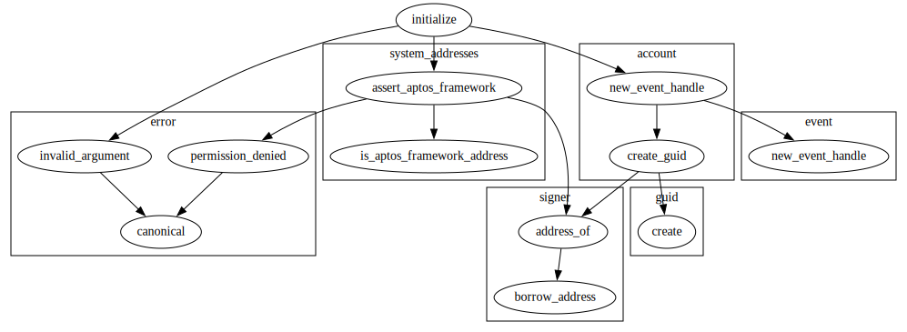
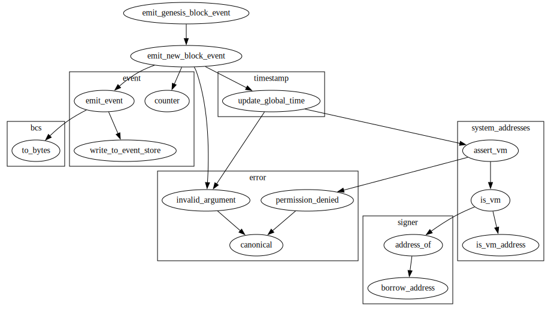
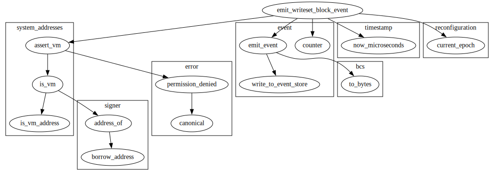

# Module `0x1::block`

This module defines a struct storing the metadata of the block and new block events.

-  [Resource `BlockResource`](#0x1_block_BlockResource)
-  [Struct `NewBlockEvent`](#0x1_block_NewBlockEvent)
-  [Struct `UpdateEpochIntervalEvent`](#0x1_block_UpdateEpochIntervalEvent)
-  [Constants](#@Constants_0)
-  [Function `initialize`](#0x1_block_initialize)
-  [Function `update_epoch_interval_microsecs`](#0x1_block_update_epoch_interval_microsecs)
-  [Function `get_epoch_interval_secs`](#0x1_block_get_epoch_interval_secs)
-  [Function `block_prologue`](#0x1_block_block_prologue)
-  [Function `get_current_block_height`](#0x1_block_get_current_block_height)
-  [Function `emit_new_block_event`](#0x1_block_emit_new_block_event)
-  [Function `emit_genesis_block_event`](#0x1_block_emit_genesis_block_event)
-  [Function `emit_writeset_block_event`](#0x1_block_emit_writeset_block_event)
-  [Specification](#@Specification_1)
    -  [Function `block_prologue`](#@Specification_1_block_prologue)
    -  [Function `emit_new_block_event`](#@Specification_1_emit_new_block_event)
    -  [Function `emit_genesis_block_event`](#@Specification_1_emit_genesis_block_event)

<pre><code><b>use</b> <a href="account.md#0x1_account">0x1::account</a>;
<b>use</b> <a href="../../aptos-stdlib/../move-stdlib/doc/error.md#0x1_error">0x1::error</a>;
<b>use</b> <a href="event.md#0x1_event">0x1::event</a>;
<b>use</b> <a href="../../aptos-stdlib/../move-stdlib/doc/option.md#0x1_option">0x1::option</a>;
<b>use</b> <a href="reconfiguration.md#0x1_reconfiguration">0x1::reconfiguration</a>;
<b>use</b> <a href="stake.md#0x1_stake">0x1::stake</a>;
<b>use</b> <a href="state_storage.md#0x1_state_storage">0x1::state_storage</a>;
<b>use</b> <a href="system_addresses.md#0x1_system_addresses">0x1::system_addresses</a>;
<b>use</b> <a href="timestamp.md#0x1_timestamp">0x1::timestamp</a>;
</code></pre>

Show all the modules that "block" depends on directly or indirectly

Show all the modules that depend on "block" directly or indirectly

## Resource `BlockResource`

Should be in-sync with BlockResource rust struct in new_block.rs

<pre><code><b>struct</b> <a href="block.md#0x1_block_BlockResource">BlockResource</a> <b>has</b> key
</code></pre>

Fields

<dl>
<dt>
<code>height: u64</code>
</dt>
<dd>
 Height of the current block
</dd>
<dt>
<code>epoch_interval: u64</code>
</dt>
<dd>
 Time period between epochs.
</dd>
<dt>
<code>new_block_events: <a href="event.md#0x1_event_EventHandle">event::EventHandle</a>&lt;<a href="block.md#0x1_block_NewBlockEvent">block::NewBlockEvent</a>&gt;</code>
</dt>
<dd>
 Handle where events with the time of new blocks are emitted
</dd>
<dt>
<code>update_epoch_interval_events: <a href="event.md#0x1_event_EventHandle">event::EventHandle</a>&lt;<a href="block.md#0x1_block_UpdateEpochIntervalEvent">block::UpdateEpochIntervalEvent</a>&gt;</code>
</dt>
<dd>

</dd>
</dl>

## Struct `NewBlockEvent`

Should be in-sync with NewBlockEvent rust struct in new_block.rs

<pre><code><b>struct</b> <a href="block.md#0x1_block_NewBlockEvent">NewBlockEvent</a> <b>has</b> drop, store
</code></pre>

Fields

<dl>
<dt>
<code><a href="../../aptos-stdlib/doc/hash.md#0x1_hash">hash</a>: <b>address</b></code>
</dt>
<dd>

</dd>
<dt>
<code>epoch: u64</code>
</dt>
<dd>

</dd>
<dt>
<code>round: u64</code>
</dt>
<dd>

</dd>
<dt>
<code>height: u64</code>
</dt>
<dd>

</dd>
<dt>
<code>previous_block_votes_bitvec: <a href="../../aptos-stdlib/../move-stdlib/doc/vector.md#0x1_vector">vector</a>&lt;u8&gt;</code>
</dt>
<dd>

</dd>
<dt>
<code>proposer: <b>address</b></code>
</dt>
<dd>

</dd>
<dt>
<code>failed_proposer_indices: <a href="../../aptos-stdlib/../move-stdlib/doc/vector.md#0x1_vector">vector</a>&lt;u64&gt;</code>
</dt>
<dd>

</dd>
<dt>
<code>time_microseconds: u64</code>
</dt>
<dd>
 On-chain time during the block at the given height
</dd>
</dl>

## Struct `UpdateEpochIntervalEvent`

Event emitted when a proposal is created.

<pre><code><b>struct</b> <a href="block.md#0x1_block_UpdateEpochIntervalEvent">UpdateEpochIntervalEvent</a> <b>has</b> drop, store
</code></pre>

Fields

<dl>
<dt>
<code>old_epoch_interval: u64</code>
</dt>
<dd>

</dd>
<dt>
<code>new_epoch_interval: u64</code>
</dt>
<dd>

</dd>
</dl>

## Constants

<pre><code><b>const</b> <a href="block.md#0x1_block_MAX_U64">MAX_U64</a>: u64 = 18446744073709551615;
</code></pre>

An invalid proposer was provided. Expected the proposer to be the VM or an active validator.

<pre><code><b>const</b> <a href="block.md#0x1_block_EINVALID_PROPOSER">EINVALID_PROPOSER</a>: u64 = 2;
</code></pre>

The number of new block events does not equal the current block height.

<pre><code><b>const</b> <a href="block.md#0x1_block_ENUM_NEW_BLOCK_EVENTS_DOES_NOT_MATCH_BLOCK_HEIGHT">ENUM_NEW_BLOCK_EVENTS_DOES_NOT_MATCH_BLOCK_HEIGHT</a>: u64 = 1;
</code></pre>

Epoch interval cannot be 0.

<pre><code><b>const</b> <a href="block.md#0x1_block_EZERO_EPOCH_INTERVAL">EZERO_EPOCH_INTERVAL</a>: u64 = 3;
</code></pre>

## Function `initialize`

This can only be called during Genesis.

<pre><code><b>public</b>(<b>friend</b>) <b>fun</b> <a href="block.md#0x1_block_initialize">initialize</a>(aptos_framework: &<a href="../../aptos-stdlib/../move-stdlib/doc/signer.md#0x1_signer">signer</a>, epoch_interval_microsecs: u64)
</code></pre>

Implementation

<pre><code><b>public</b>(<b>friend</b>) <b>fun</b> <a href="block.md#0x1_block_initialize">initialize</a>(aptos_framework: &<a href="../../aptos-stdlib/../move-stdlib/doc/signer.md#0x1_signer">signer</a>, epoch_interval_microsecs: u64) {
    <a href="system_addresses.md#0x1_system_addresses_assert_aptos_framework">system_addresses::assert_aptos_framework</a>(aptos_framework);
    <b>assert</b>!(epoch_interval_microsecs &gt; 0, <a href="../../aptos-stdlib/../move-stdlib/doc/error.md#0x1_error_invalid_argument">error::invalid_argument</a>(<a href="block.md#0x1_block_EZERO_EPOCH_INTERVAL">EZERO_EPOCH_INTERVAL</a>));

    <b>move_to</b>&lt;<a href="block.md#0x1_block_BlockResource">BlockResource</a>&gt;(
        aptos_framework,
        <a href="block.md#0x1_block_BlockResource">BlockResource</a> {
            height: 0,
            epoch_interval: epoch_interval_microsecs,
            new_block_events: <a href="account.md#0x1_account_new_event_handle">account::new_event_handle</a>&lt;<a href="block.md#0x1_block_NewBlockEvent">NewBlockEvent</a>&gt;(aptos_framework),
            update_epoch_interval_events: <a href="account.md#0x1_account_new_event_handle">account::new_event_handle</a>&lt;<a href="block.md#0x1_block_UpdateEpochIntervalEvent">UpdateEpochIntervalEvent</a>&gt;(aptos_framework),
        }
    );
}
</code></pre>

Show all the functions that "initialize" calls

Show all the functions that call "initialize"

## Function `update_epoch_interval_microsecs`

Update the epoch interval.
Can only be called as part of the Aptos governance proposal process established by the AptosGovernance module.

<pre><code><b>public</b> <b>fun</b> <a href="block.md#0x1_block_update_epoch_interval_microsecs">update_epoch_interval_microsecs</a>(aptos_framework: &<a href="../../aptos-stdlib/../move-stdlib/doc/signer.md#0x1_signer">signer</a>, new_epoch_interval: u64)
</code></pre>

Implementation

<pre><code><b>public</b> <b>fun</b> <a href="block.md#0x1_block_update_epoch_interval_microsecs">update_epoch_interval_microsecs</a>(
    aptos_framework: &<a href="../../aptos-stdlib/../move-stdlib/doc/signer.md#0x1_signer">signer</a>,
    new_epoch_interval: u64,
) <b>acquires</b> <a href="block.md#0x1_block_BlockResource">BlockResource</a> {
    <a href="system_addresses.md#0x1_system_addresses_assert_aptos_framework">system_addresses::assert_aptos_framework</a>(aptos_framework);
    <b>assert</b>!(new_epoch_interval &gt; 0, <a href="../../aptos-stdlib/../move-stdlib/doc/error.md#0x1_error_invalid_argument">error::invalid_argument</a>(<a href="block.md#0x1_block_EZERO_EPOCH_INTERVAL">EZERO_EPOCH_INTERVAL</a>));

    <b>let</b> block_resource = <b>borrow_global_mut</b>&lt;<a href="block.md#0x1_block_BlockResource">BlockResource</a>&gt;(@aptos_framework);
    <b>let</b> old_epoch_interval = block_resource.epoch_interval;
    block_resource.epoch_interval = new_epoch_interval;

    <a href="event.md#0x1_event_emit_event">event::emit_event</a>&lt;<a href="block.md#0x1_block_UpdateEpochIntervalEvent">UpdateEpochIntervalEvent</a>&gt;(
        &<b>mut</b> block_resource.update_epoch_interval_events,
        <a href="block.md#0x1_block_UpdateEpochIntervalEvent">UpdateEpochIntervalEvent</a> { old_epoch_interval, new_epoch_interval },
    );
}
</code></pre>

Show all the functions that "update_epoch_interval_microsecs" calls

Show all the functions that call "update_epoch_interval_microsecs"

## Function `get_epoch_interval_secs`

Return epoch interval in seconds.

<pre><code><b>public</b> <b>fun</b> <a href="block.md#0x1_block_get_epoch_interval_secs">get_epoch_interval_secs</a>(): u64
</code></pre>

Implementation

<pre><code><b>public</b> <b>fun</b> <a href="block.md#0x1_block_get_epoch_interval_secs">get_epoch_interval_secs</a>(): u64 <b>acquires</b> <a href="block.md#0x1_block_BlockResource">BlockResource</a> {
    <b>borrow_global</b>&lt;<a href="block.md#0x1_block_BlockResource">BlockResource</a>&gt;(@aptos_framework).epoch_interval / 1000000
}
</code></pre>

Show all the functions that "get_epoch_interval_secs" calls

Show all the functions that call "get_epoch_interval_secs"

## Function `block_prologue`

Set the metadata for the current block.
The runtime always runs this before executing the transactions in a block.

<pre><code><b>fun</b> <a href="block.md#0x1_block_block_prologue">block_prologue</a>(vm: <a href="../../aptos-stdlib/../move-stdlib/doc/signer.md#0x1_signer">signer</a>, <a href="../../aptos-stdlib/doc/hash.md#0x1_hash">hash</a>: <b>address</b>, epoch: u64, round: u64, proposer: <b>address</b>, failed_proposer_indices: <a href="../../aptos-stdlib/../move-stdlib/doc/vector.md#0x1_vector">vector</a>&lt;u64&gt;, previous_block_votes_bitvec: <a href="../../aptos-stdlib/../move-stdlib/doc/vector.md#0x1_vector">vector</a>&lt;u8&gt;, <a href="timestamp.md#0x1_timestamp">timestamp</a>: u64)
</code></pre>

Implementation

<pre><code><b>fun</b> <a href="block.md#0x1_block_block_prologue">block_prologue</a>(
    vm: <a href="../../aptos-stdlib/../move-stdlib/doc/signer.md#0x1_signer">signer</a>,
    <a href="../../aptos-stdlib/doc/hash.md#0x1_hash">hash</a>: <b>address</b>,
    epoch: u64,
    round: u64,
    proposer: <b>address</b>,
    failed_proposer_indices: <a href="../../aptos-stdlib/../move-stdlib/doc/vector.md#0x1_vector">vector</a>&lt;u64&gt;,
    previous_block_votes_bitvec: <a href="../../aptos-stdlib/../move-stdlib/doc/vector.md#0x1_vector">vector</a>&lt;u8&gt;,
    <a href="timestamp.md#0x1_timestamp">timestamp</a>: u64
) <b>acquires</b> <a href="block.md#0x1_block_BlockResource">BlockResource</a> {
    // Operational constraint: can only be invoked by the VM.
    <a href="system_addresses.md#0x1_system_addresses_assert_vm">system_addresses::assert_vm</a>(&vm);

    // Blocks can only be produced by a valid proposer or by the VM itself for Nil blocks (no user txs).
    <b>assert</b>!(
        proposer == @vm_reserved || <a href="stake.md#0x1_stake_is_current_epoch_validator">stake::is_current_epoch_validator</a>(proposer),
        <a href="../../aptos-stdlib/../move-stdlib/doc/error.md#0x1_error_permission_denied">error::permission_denied</a>(<a href="block.md#0x1_block_EINVALID_PROPOSER">EINVALID_PROPOSER</a>),
    );

    <b>let</b> proposer_index = <a href="../../aptos-stdlib/../move-stdlib/doc/option.md#0x1_option_none">option::none</a>();
    <b>if</b> (proposer != @vm_reserved) {
        proposer_index = <a href="../../aptos-stdlib/../move-stdlib/doc/option.md#0x1_option_some">option::some</a>(<a href="stake.md#0x1_stake_get_validator_index">stake::get_validator_index</a>(proposer));
    };

    <b>let</b> block_metadata_ref = <b>borrow_global_mut</b>&lt;<a href="block.md#0x1_block_BlockResource">BlockResource</a>&gt;(@aptos_framework);
    block_metadata_ref.height = <a href="event.md#0x1_event_counter">event::counter</a>(&block_metadata_ref.new_block_events);

    <b>let</b> new_block_event = <a href="block.md#0x1_block_NewBlockEvent">NewBlockEvent</a> {
        <a href="../../aptos-stdlib/doc/hash.md#0x1_hash">hash</a>,
        epoch,
        round,
        height: block_metadata_ref.height,
        previous_block_votes_bitvec,
        proposer,
        failed_proposer_indices,
        time_microseconds: <a href="timestamp.md#0x1_timestamp">timestamp</a>,
    };
    <a href="block.md#0x1_block_emit_new_block_event">emit_new_block_event</a>(&vm, &<b>mut</b> block_metadata_ref.new_block_events, new_block_event);

    // Performance scores have <b>to</b> be updated before the epoch transition <b>as</b> the transaction that triggers the
    // transition is the last <a href="block.md#0x1_block">block</a> in the previous epoch.
    <a href="stake.md#0x1_stake_update_performance_statistics">stake::update_performance_statistics</a>(proposer_index, failed_proposer_indices);
    <a href="state_storage.md#0x1_state_storage_on_new_block">state_storage::on_new_block</a>(<a href="reconfiguration.md#0x1_reconfiguration_current_epoch">reconfiguration::current_epoch</a>());

    <b>if</b> (<a href="timestamp.md#0x1_timestamp">timestamp</a> - <a href="reconfiguration.md#0x1_reconfiguration_last_reconfiguration_time">reconfiguration::last_reconfiguration_time</a>() &gt;= block_metadata_ref.epoch_interval) {
        <a href="reconfiguration.md#0x1_reconfiguration_reconfigure">reconfiguration::reconfigure</a>();
    };
}
</code></pre>

Show all the functions that "block_prologue" calls

Show all the functions that call "block_prologue"

## Function `get_current_block_height`

Get the current block height

<pre><code><b>public</b> <b>fun</b> <a href="block.md#0x1_block_get_current_block_height">get_current_block_height</a>(): u64
</code></pre>

Implementation

<pre><code><b>public</b> <b>fun</b> <a href="block.md#0x1_block_get_current_block_height">get_current_block_height</a>(): u64 <b>acquires</b> <a href="block.md#0x1_block_BlockResource">BlockResource</a> {
    <b>borrow_global</b>&lt;<a href="block.md#0x1_block_BlockResource">BlockResource</a>&gt;(@aptos_framework).height
}
</code></pre>

Show all the functions that "get_current_block_height" calls

Show all the functions that call "get_current_block_height"

## Function `emit_new_block_event`

Emit the event and update height and global timestamp

<pre><code><b>fun</b> <a href="block.md#0x1_block_emit_new_block_event">emit_new_block_event</a>(vm: &<a href="../../aptos-stdlib/../move-stdlib/doc/signer.md#0x1_signer">signer</a>, event_handle: &<b>mut</b> <a href="event.md#0x1_event_EventHandle">event::EventHandle</a>&lt;<a href="block.md#0x1_block_NewBlockEvent">block::NewBlockEvent</a>&gt;, new_block_event: <a href="block.md#0x1_block_NewBlockEvent">block::NewBlockEvent</a>)
</code></pre>

Implementation

<pre><code><b>fun</b> <a href="block.md#0x1_block_emit_new_block_event">emit_new_block_event</a>(vm: &<a href="../../aptos-stdlib/../move-stdlib/doc/signer.md#0x1_signer">signer</a>, event_handle: &<b>mut</b> EventHandle&lt;<a href="block.md#0x1_block_NewBlockEvent">NewBlockEvent</a>&gt;, new_block_event: <a href="block.md#0x1_block_NewBlockEvent">NewBlockEvent</a>) {
    <a href="timestamp.md#0x1_timestamp_update_global_time">timestamp::update_global_time</a>(vm, new_block_event.proposer, new_block_event.time_microseconds);
    <b>assert</b>!(
        <a href="event.md#0x1_event_counter">event::counter</a>(event_handle) == new_block_event.height,
        <a href="../../aptos-stdlib/../move-stdlib/doc/error.md#0x1_error_invalid_argument">error::invalid_argument</a>(<a href="block.md#0x1_block_ENUM_NEW_BLOCK_EVENTS_DOES_NOT_MATCH_BLOCK_HEIGHT">ENUM_NEW_BLOCK_EVENTS_DOES_NOT_MATCH_BLOCK_HEIGHT</a>),
    );
    <a href="event.md#0x1_event_emit_event">event::emit_event</a>&lt;<a href="block.md#0x1_block_NewBlockEvent">NewBlockEvent</a>&gt;(event_handle, new_block_event);
}
</code></pre>

Show all the functions that "emit_new_block_event" calls

Show all the functions that call "emit_new_block_event"

## Function `emit_genesis_block_event`

Emit a <code><a href="block.md#0x1_block_NewBlockEvent">NewBlockEvent</a></code> event. This function will be invoked by genesis directly to generate the very first
reconfiguration event.

<pre><code><b>fun</b> <a href="block.md#0x1_block_emit_genesis_block_event">emit_genesis_block_event</a>(vm: <a href="../../aptos-stdlib/../move-stdlib/doc/signer.md#0x1_signer">signer</a>)
</code></pre>

Implementation

<pre><code><b>fun</b> <a href="block.md#0x1_block_emit_genesis_block_event">emit_genesis_block_event</a>(vm: <a href="../../aptos-stdlib/../move-stdlib/doc/signer.md#0x1_signer">signer</a>) <b>acquires</b> <a href="block.md#0x1_block_BlockResource">BlockResource</a> {
    <b>let</b> block_metadata_ref = <b>borrow_global_mut</b>&lt;<a href="block.md#0x1_block_BlockResource">BlockResource</a>&gt;(@aptos_framework);
    <b>let</b> genesis_id = @0x0;
    <a href="block.md#0x1_block_emit_new_block_event">emit_new_block_event</a>(
        &vm,
        &<b>mut</b> block_metadata_ref.new_block_events,
        <a href="block.md#0x1_block_NewBlockEvent">NewBlockEvent</a> {
            <a href="../../aptos-stdlib/doc/hash.md#0x1_hash">hash</a>: genesis_id,
            epoch: 0,
            round: 0,
            height: 0,
            previous_block_votes_bitvec: <a href="../../aptos-stdlib/../move-stdlib/doc/vector.md#0x1_vector_empty">vector::empty</a>(),
            proposer: @vm_reserved,
            failed_proposer_indices: <a href="../../aptos-stdlib/../move-stdlib/doc/vector.md#0x1_vector_empty">vector::empty</a>(),
            time_microseconds: 0,
        }
    );
}
</code></pre>

Show all the functions that "emit_genesis_block_event" calls

Show all the functions that call "emit_genesis_block_event"

## Function `emit_writeset_block_event`

Emit a <code><a href="block.md#0x1_block_NewBlockEvent">NewBlockEvent</a></code> event. This function will be invoked by write set script directly to generate the
new block event for WriteSetPayload.

<pre><code><b>public</b> <b>fun</b> <a href="block.md#0x1_block_emit_writeset_block_event">emit_writeset_block_event</a>(vm_signer: &<a href="../../aptos-stdlib/../move-stdlib/doc/signer.md#0x1_signer">signer</a>, fake_block_hash: <b>address</b>)
</code></pre>

Implementation

<pre><code><b>public</b> <b>fun</b> <a href="block.md#0x1_block_emit_writeset_block_event">emit_writeset_block_event</a>(vm_signer: &<a href="../../aptos-stdlib/../move-stdlib/doc/signer.md#0x1_signer">signer</a>, fake_block_hash: <b>address</b>) <b>acquires</b> <a href="block.md#0x1_block_BlockResource">BlockResource</a> {
    <a href="system_addresses.md#0x1_system_addresses_assert_vm">system_addresses::assert_vm</a>(vm_signer);
    <b>let</b> block_metadata_ref = <b>borrow_global_mut</b>&lt;<a href="block.md#0x1_block_BlockResource">BlockResource</a>&gt;(@aptos_framework);
    block_metadata_ref.height = <a href="event.md#0x1_event_counter">event::counter</a>(&block_metadata_ref.new_block_events);

    <a href="event.md#0x1_event_emit_event">event::emit_event</a>&lt;<a href="block.md#0x1_block_NewBlockEvent">NewBlockEvent</a>&gt;(
        &<b>mut</b> block_metadata_ref.new_block_events,
        <a href="block.md#0x1_block_NewBlockEvent">NewBlockEvent</a> {
            <a href="../../aptos-stdlib/doc/hash.md#0x1_hash">hash</a>: fake_block_hash,
            epoch: <a href="reconfiguration.md#0x1_reconfiguration_current_epoch">reconfiguration::current_epoch</a>(),
            round: <a href="block.md#0x1_block_MAX_U64">MAX_U64</a>,
            height: block_metadata_ref.height,
            previous_block_votes_bitvec: <a href="../../aptos-stdlib/../move-stdlib/doc/vector.md#0x1_vector_empty">vector::empty</a>(),
            proposer: @vm_reserved,
            failed_proposer_indices: <a href="../../aptos-stdlib/../move-stdlib/doc/vector.md#0x1_vector_empty">vector::empty</a>(),
            time_microseconds: <a href="timestamp.md#0x1_timestamp_now_microseconds">timestamp::now_microseconds</a>(),
        }
    );
}
</code></pre>

Show all the functions that "emit_writeset_block_event" calls

Show all the functions that call "emit_writeset_block_event"

## Specification

<pre><code><b>invariant</b> [suspendable] <a href="chain_status.md#0x1_chain_status_is_operating">chain_status::is_operating</a>() ==&gt; <b>exists</b>&lt;<a href="block.md#0x1_block_BlockResource">BlockResource</a>&gt;(@aptos_framework);
</code></pre>

### Function `block_prologue`

<pre><code><b>fun</b> <a href="block.md#0x1_block_block_prologue">block_prologue</a>(vm: <a href="../../aptos-stdlib/../move-stdlib/doc/signer.md#0x1_signer">signer</a>, <a href="../../aptos-stdlib/doc/hash.md#0x1_hash">hash</a>: <b>address</b>, epoch: u64, round: u64, proposer: <b>address</b>, failed_proposer_indices: <a href="../../aptos-stdlib/../move-stdlib/doc/vector.md#0x1_vector">vector</a>&lt;u64&gt;, previous_block_votes_bitvec: <a href="../../aptos-stdlib/../move-stdlib/doc/vector.md#0x1_vector">vector</a>&lt;u8&gt;, <a href="timestamp.md#0x1_timestamp">timestamp</a>: u64)
</code></pre>

<pre><code><b>requires</b> <a href="chain_status.md#0x1_chain_status_is_operating">chain_status::is_operating</a>();
<b>requires</b> <a href="system_addresses.md#0x1_system_addresses_is_vm">system_addresses::is_vm</a>(vm);
<b>requires</b> proposer == @vm_reserved || <a href="stake.md#0x1_stake_spec_is_current_epoch_validator">stake::spec_is_current_epoch_validator</a>(proposer);
<b>requires</b> <a href="timestamp.md#0x1_timestamp">timestamp</a> &gt;= <a href="reconfiguration.md#0x1_reconfiguration_last_reconfiguration_time">reconfiguration::last_reconfiguration_time</a>();
<b>requires</b> (proposer == @vm_reserved) ==&gt; (<a href="timestamp.md#0x1_timestamp_spec_now_microseconds">timestamp::spec_now_microseconds</a>() == <a href="timestamp.md#0x1_timestamp">timestamp</a>);
<b>requires</b> (proposer != @vm_reserved) ==&gt; (<a href="timestamp.md#0x1_timestamp_spec_now_microseconds">timestamp::spec_now_microseconds</a>() &lt; <a href="timestamp.md#0x1_timestamp">timestamp</a>);
<b>aborts_if</b> <b>false</b>;
</code></pre>

### Function `emit_new_block_event`

<pre><code><b>fun</b> <a href="block.md#0x1_block_emit_new_block_event">emit_new_block_event</a>(vm: &<a href="../../aptos-stdlib/../move-stdlib/doc/signer.md#0x1_signer">signer</a>, event_handle: &<b>mut</b> <a href="event.md#0x1_event_EventHandle">event::EventHandle</a>&lt;<a href="block.md#0x1_block_NewBlockEvent">block::NewBlockEvent</a>&gt;, new_block_event: <a href="block.md#0x1_block_NewBlockEvent">block::NewBlockEvent</a>)
</code></pre>

<pre><code><b>let</b> proposer = new_block_event.proposer;
<b>let</b> <a href="timestamp.md#0x1_timestamp">timestamp</a> = new_block_event.time_microseconds;
<b>requires</b> <a href="chain_status.md#0x1_chain_status_is_operating">chain_status::is_operating</a>();
<b>requires</b> <a href="system_addresses.md#0x1_system_addresses_is_vm">system_addresses::is_vm</a>(vm);
<b>requires</b> (proposer == @vm_reserved) ==&gt; (<a href="timestamp.md#0x1_timestamp_spec_now_microseconds">timestamp::spec_now_microseconds</a>() == <a href="timestamp.md#0x1_timestamp">timestamp</a>);
<b>requires</b> (proposer != @vm_reserved) ==&gt; (<a href="timestamp.md#0x1_timestamp_spec_now_microseconds">timestamp::spec_now_microseconds</a>() &lt; <a href="timestamp.md#0x1_timestamp">timestamp</a>);
<b>requires</b> <a href="event.md#0x1_event_counter">event::counter</a>(event_handle) == new_block_event.height;
<b>aborts_if</b> <b>false</b>;
</code></pre>

### Function `emit_genesis_block_event`

<pre><code><b>fun</b> <a href="block.md#0x1_block_emit_genesis_block_event">emit_genesis_block_event</a>(vm: <a href="../../aptos-stdlib/../move-stdlib/doc/signer.md#0x1_signer">signer</a>)
</code></pre>

<pre><code><b>requires</b> <a href="chain_status.md#0x1_chain_status_is_operating">chain_status::is_operating</a>();
<b>requires</b> <a href="system_addresses.md#0x1_system_addresses_is_vm">system_addresses::is_vm</a>(vm);
<b>requires</b> <a href="event.md#0x1_event_counter">event::counter</a>(<b>global</b>&lt;<a href="block.md#0x1_block_BlockResource">BlockResource</a>&gt;(@aptos_framework).new_block_events) == 0;
<b>requires</b> (<a href="timestamp.md#0x1_timestamp_spec_now_microseconds">timestamp::spec_now_microseconds</a>() == 0);
<b>aborts_if</b> <b>false</b>;
</code></pre>

[move-book]: https://move-language.github.io/move/introduction.html
