

# Module `0x1::coin`

This module provides the foundation for typesafe Coins.

-  [Struct `Coin`](#0x1_coin_Coin)
-  [Resource `CoinStore`](#0x1_coin_CoinStore)
-  [Resource `SupplyConfig`](#0x1_coin_SupplyConfig)
-  [Resource `CoinInfo`](#0x1_coin_CoinInfo)
-  [Struct `DepositEvent`](#0x1_coin_DepositEvent)
-  [Struct `WithdrawEvent`](#0x1_coin_WithdrawEvent)
-  [Struct `MintCapability`](#0x1_coin_MintCapability)
-  [Struct `FreezeCapability`](#0x1_coin_FreezeCapability)
-  [Struct `BurnCapability`](#0x1_coin_BurnCapability)
-  [Constants](#@Constants_0)
-  [Function `initialize_supply_config`](#0x1_coin_initialize_supply_config)
-  [Function `allow_supply_upgrades`](#0x1_coin_allow_supply_upgrades)
-  [Function `coin_address`](#0x1_coin_coin_address)
-  [Function `balance`](#0x1_coin_balance)
-  [Function `is_coin_initialized`](#0x1_coin_is_coin_initialized)
-  [Function `is_account_registered`](#0x1_coin_is_account_registered)
-  [Function `name`](#0x1_coin_name)
-  [Function `symbol`](#0x1_coin_symbol)
-  [Function `decimals`](#0x1_coin_decimals)
-  [Function `supply`](#0x1_coin_supply)
-  [Function `burn`](#0x1_coin_burn)
-  [Function `burn_from`](#0x1_coin_burn_from)
-  [Function `deposit`](#0x1_coin_deposit)
-  [Function `destroy_zero`](#0x1_coin_destroy_zero)
-  [Function `extract`](#0x1_coin_extract)
-  [Function `extract_all`](#0x1_coin_extract_all)
-  [Function `freeze_coin_store`](#0x1_coin_freeze_coin_store)
-  [Function `unfreeze_coin_store`](#0x1_coin_unfreeze_coin_store)
-  [Function `upgrade_supply`](#0x1_coin_upgrade_supply)
-  [Function `initialize`](#0x1_coin_initialize)
-  [Function `initialize_with_parallelizable_supply`](#0x1_coin_initialize_with_parallelizable_supply)
-  [Function `initialize_internal`](#0x1_coin_initialize_internal)
-  [Function `merge`](#0x1_coin_merge)
-  [Function `mint`](#0x1_coin_mint)
-  [Function `register`](#0x1_coin_register)
-  [Function `transfer`](#0x1_coin_transfer)
-  [Function `value`](#0x1_coin_value)
-  [Function `withdraw`](#0x1_coin_withdraw)
-  [Function `zero`](#0x1_coin_zero)
-  [Function `destroy_freeze_cap`](#0x1_coin_destroy_freeze_cap)
-  [Function `destroy_mint_cap`](#0x1_coin_destroy_mint_cap)
-  [Function `destroy_burn_cap`](#0x1_coin_destroy_burn_cap)
-  [Specification](#@Specification_1)
    -  [Function `initialize_supply_config`](#@Specification_1_initialize_supply_config)
    -  [Function `allow_supply_upgrades`](#@Specification_1_allow_supply_upgrades)
    -  [Function `coin_address`](#@Specification_1_coin_address)
    -  [Function `balance`](#@Specification_1_balance)
    -  [Function `is_coin_initialized`](#@Specification_1_is_coin_initialized)
    -  [Function `name`](#@Specification_1_name)
    -  [Function `symbol`](#@Specification_1_symbol)
    -  [Function `decimals`](#@Specification_1_decimals)
    -  [Function `supply`](#@Specification_1_supply)
    -  [Function `burn`](#@Specification_1_burn)
    -  [Function `burn_from`](#@Specification_1_burn_from)
    -  [Function `deposit`](#@Specification_1_deposit)
    -  [Function `destroy_zero`](#@Specification_1_destroy_zero)
    -  [Function `extract`](#@Specification_1_extract)
    -  [Function `extract_all`](#@Specification_1_extract_all)
    -  [Function `freeze_coin_store`](#@Specification_1_freeze_coin_store)
    -  [Function `unfreeze_coin_store`](#@Specification_1_unfreeze_coin_store)
    -  [Function `upgrade_supply`](#@Specification_1_upgrade_supply)
    -  [Function `initialize`](#@Specification_1_initialize)
    -  [Function `initialize_with_parallelizable_supply`](#@Specification_1_initialize_with_parallelizable_supply)
    -  [Function `initialize_internal`](#@Specification_1_initialize_internal)
    -  [Function `merge`](#@Specification_1_merge)
    -  [Function `mint`](#@Specification_1_mint)
    -  [Function `register`](#@Specification_1_register)
    -  [Function `transfer`](#@Specification_1_transfer)
    -  [Function `withdraw`](#@Specification_1_withdraw)

<pre><code><b>use</b> <a href="account.md#0x1_account">0x1::account</a>;
<b>use</b> <a href="../../aptos-stdlib/../move-stdlib/doc/error.md#0x1_error">0x1::error</a>;
<b>use</b> <a href="event.md#0x1_event">0x1::event</a>;
<b>use</b> <a href="../../aptos-stdlib/../move-stdlib/doc/option.md#0x1_option">0x1::option</a>;
<b>use</b> <a href="optional_aggregator.md#0x1_optional_aggregator">0x1::optional_aggregator</a>;
<b>use</b> <a href="../../aptos-stdlib/../move-stdlib/doc/signer.md#0x1_signer">0x1::signer</a>;
<b>use</b> <a href="../../aptos-stdlib/../move-stdlib/doc/string.md#0x1_string">0x1::string</a>;
<b>use</b> <a href="system_addresses.md#0x1_system_addresses">0x1::system_addresses</a>;
<b>use</b> <a href="../../aptos-stdlib/doc/type_info.md#0x1_type_info">0x1::type_info</a>;
</code></pre>

Show all the modules that "coin" depends on directly or indirectly

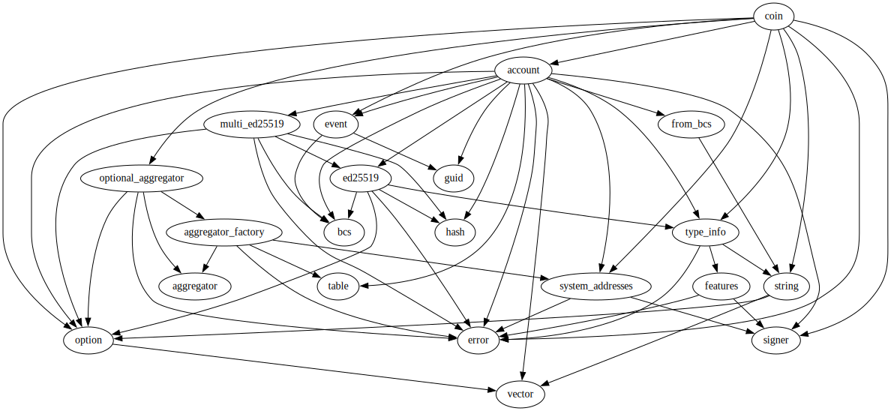

Show all the modules that depend on "coin" directly or indirectly

## Struct `Coin`

Core data structures
Main structure representing a coin/token in an account's custody.

<pre><code><b>struct</b> <a href="coin.md#0x1_coin_Coin">Coin</a>&lt;CoinType&gt; <b>has</b> store
</code></pre>

Fields

<dl>
<dt>
<code>value: u64</code>
</dt>
<dd>
 Amount of coin this address has.
</dd>
</dl>

## Resource `CoinStore`

A holder of a specific coin types and associated event handles.
These are kept in a single resource to ensure locality of data.

<pre><code><b>struct</b> <a href="coin.md#0x1_coin_CoinStore">CoinStore</a>&lt;CoinType&gt; <b>has</b> key
</code></pre>

Fields

<dl>
<dt>
<code><a href="coin.md#0x1_coin">coin</a>: <a href="coin.md#0x1_coin_Coin">coin::Coin</a>&lt;CoinType&gt;</code>
</dt>
<dd>

</dd>
<dt>
<code>frozen: bool</code>
</dt>
<dd>

</dd>
<dt>
<code>deposit_events: <a href="event.md#0x1_event_EventHandle">event::EventHandle</a>&lt;<a href="coin.md#0x1_coin_DepositEvent">coin::DepositEvent</a>&gt;</code>
</dt>
<dd>

</dd>
<dt>
<code>withdraw_events: <a href="event.md#0x1_event_EventHandle">event::EventHandle</a>&lt;<a href="coin.md#0x1_coin_WithdrawEvent">coin::WithdrawEvent</a>&gt;</code>
</dt>
<dd>

</dd>
</dl>

## Resource `SupplyConfig`

Configuration that controls the behavior of total coin supply. If the field
is set, coin creators are allowed to upgrade to parallelizable implementations.

<pre><code><b>struct</b> <a href="coin.md#0x1_coin_SupplyConfig">SupplyConfig</a> <b>has</b> key
</code></pre>

Fields

<dl>
<dt>
<code>allow_upgrades: bool</code>
</dt>
<dd>

</dd>
</dl>

## Resource `CoinInfo`

Information about a specific coin type. Stored on the creator of the coin's account.

<pre><code><b>struct</b> <a href="coin.md#0x1_coin_CoinInfo">CoinInfo</a>&lt;CoinType&gt; <b>has</b> key
</code></pre>

Fields

<dl>
<dt>
<code>name: <a href="../../aptos-stdlib/../move-stdlib/doc/string.md#0x1_string_String">string::String</a></code>
</dt>
<dd>

</dd>
<dt>
<code>symbol: <a href="../../aptos-stdlib/../move-stdlib/doc/string.md#0x1_string_String">string::String</a></code>
</dt>
<dd>
 Symbol of the coin, usually a shorter version of the name.
 For example, Singapore Dollar is SGD.
</dd>
<dt>
<code>decimals: u8</code>
</dt>
<dd>
 Number of decimals used to get its user representation.
 For example, if <code>decimals</code> equals <code>2</code>, a balance of <code>505</code> coins should
 be displayed to a user as <code>5.05</code> (<code>505 / 10 ** 2</code>).
</dd>
<dt>
<code>supply: <a href="../../aptos-stdlib/../move-stdlib/doc/option.md#0x1_option_Option">option::Option</a>&lt;<a href="optional_aggregator.md#0x1_optional_aggregator_OptionalAggregator">optional_aggregator::OptionalAggregator</a>&gt;</code>
</dt>
<dd>
 Amount of this coin type in existence.
</dd>
</dl>

## Struct `DepositEvent`

Event emitted when some amount of a coin is deposited into an account.

<pre><code><b>struct</b> <a href="coin.md#0x1_coin_DepositEvent">DepositEvent</a> <b>has</b> drop, store
</code></pre>

Fields

<dl>
<dt>
<code>amount: u64</code>
</dt>
<dd>

</dd>
</dl>

## Struct `WithdrawEvent`

Event emitted when some amount of a coin is withdrawn from an account.

<pre><code><b>struct</b> <a href="coin.md#0x1_coin_WithdrawEvent">WithdrawEvent</a> <b>has</b> drop, store
</code></pre>

Fields

<dl>
<dt>
<code>amount: u64</code>
</dt>
<dd>

</dd>
</dl>

## Struct `MintCapability`

Capability required to mint coins.

<pre><code><b>struct</b> <a href="coin.md#0x1_coin_MintCapability">MintCapability</a>&lt;CoinType&gt; <b>has</b> <b>copy</b>, store
</code></pre>

Fields

<dl>
<dt>
<code>dummy_field: bool</code>
</dt>
<dd>

</dd>
</dl>

## Struct `FreezeCapability`

Capability required to freeze a coin store.

<pre><code><b>struct</b> <a href="coin.md#0x1_coin_FreezeCapability">FreezeCapability</a>&lt;CoinType&gt; <b>has</b> <b>copy</b>, store
</code></pre>

Fields

<dl>
<dt>
<code>dummy_field: bool</code>
</dt>
<dd>

</dd>
</dl>

## Struct `BurnCapability`

Capability required to burn coins.

<pre><code><b>struct</b> <a href="coin.md#0x1_coin_BurnCapability">BurnCapability</a>&lt;CoinType&gt; <b>has</b> <b>copy</b>, store
</code></pre>

Fields

<dl>
<dt>
<code>dummy_field: bool</code>
</dt>
<dd>

</dd>
</dl>

## Constants

Maximum possible coin supply.

<pre><code><b>const</b> <a href="coin.md#0x1_coin_MAX_U128">MAX_U128</a>: u128 = 340282366920938463463374607431768211455;
</code></pre>

Address of account which is used to initialize a coin <code>CoinType</code> doesn't match the deployer of module

<pre><code><b>const</b> <a href="coin.md#0x1_coin_ECOIN_INFO_ADDRESS_MISMATCH">ECOIN_INFO_ADDRESS_MISMATCH</a>: u64 = 1;
</code></pre>

<code>CoinType</code> is already initialized as a coin

<pre><code><b>const</b> <a href="coin.md#0x1_coin_ECOIN_INFO_ALREADY_PUBLISHED">ECOIN_INFO_ALREADY_PUBLISHED</a>: u64 = 2;
</code></pre>

<code>CoinType</code> hasn't been initialized as a coin

<pre><code><b>const</b> <a href="coin.md#0x1_coin_ECOIN_INFO_NOT_PUBLISHED">ECOIN_INFO_NOT_PUBLISHED</a>: u64 = 3;
</code></pre>

Name of the coin is too long

<pre><code><b>const</b> <a href="coin.md#0x1_coin_ECOIN_NAME_TOO_LONG">ECOIN_NAME_TOO_LONG</a>: u64 = 12;
</code></pre>

Account already has <code><a href="coin.md#0x1_coin_CoinStore">CoinStore</a></code> registered for <code>CoinType</code>

<pre><code><b>const</b> <a href="coin.md#0x1_coin_ECOIN_STORE_ALREADY_PUBLISHED">ECOIN_STORE_ALREADY_PUBLISHED</a>: u64 = 4;
</code></pre>

Account hasn't registered <code><a href="coin.md#0x1_coin_CoinStore">CoinStore</a></code> for <code>CoinType</code>

<pre><code><b>const</b> <a href="coin.md#0x1_coin_ECOIN_STORE_NOT_PUBLISHED">ECOIN_STORE_NOT_PUBLISHED</a>: u64 = 5;
</code></pre>

Cannot upgrade the total supply of coins to different implementation.

<pre><code><b>const</b> <a href="coin.md#0x1_coin_ECOIN_SUPPLY_UPGRADE_NOT_SUPPORTED">ECOIN_SUPPLY_UPGRADE_NOT_SUPPORTED</a>: u64 = 11;
</code></pre>

Symbol of the coin is too long

<pre><code><b>const</b> <a href="coin.md#0x1_coin_ECOIN_SYMBOL_TOO_LONG">ECOIN_SYMBOL_TOO_LONG</a>: u64 = 13;
</code></pre>

Cannot destroy non-zero coins

<pre><code><b>const</b> <a href="coin.md#0x1_coin_EDESTRUCTION_OF_NONZERO_TOKEN">EDESTRUCTION_OF_NONZERO_TOKEN</a>: u64 = 7;
</code></pre>

CoinStore is frozen. Coins cannot be deposited or withdrawn

<pre><code><b>const</b> <a href="coin.md#0x1_coin_EFROZEN">EFROZEN</a>: u64 = 10;
</code></pre>

Not enough coins to complete transaction

<pre><code><b>const</b> <a href="coin.md#0x1_coin_EINSUFFICIENT_BALANCE">EINSUFFICIENT_BALANCE</a>: u64 = 6;
</code></pre>

Coin amount cannot be zero

<pre><code><b>const</b> <a href="coin.md#0x1_coin_EZERO_COIN_AMOUNT">EZERO_COIN_AMOUNT</a>: u64 = 9;
</code></pre>

<pre><code><b>const</b> <a href="coin.md#0x1_coin_MAX_COIN_NAME_LENGTH">MAX_COIN_NAME_LENGTH</a>: u64 = 32;
</code></pre>

<pre><code><b>const</b> <a href="coin.md#0x1_coin_MAX_COIN_SYMBOL_LENGTH">MAX_COIN_SYMBOL_LENGTH</a>: u64 = 10;
</code></pre>

## Function `initialize_supply_config`

Publishes supply configuration. Initially, upgrading is not allowed.

<pre><code><b>public</b>(<b>friend</b>) <b>fun</b> <a href="coin.md#0x1_coin_initialize_supply_config">initialize_supply_config</a>(aptos_framework: &<a href="../../aptos-stdlib/../move-stdlib/doc/signer.md#0x1_signer">signer</a>)
</code></pre>

Implementation

<pre><code><b>public</b>(<b>friend</b>) <b>fun</b> <a href="coin.md#0x1_coin_initialize_supply_config">initialize_supply_config</a>(aptos_framework: &<a href="../../aptos-stdlib/../move-stdlib/doc/signer.md#0x1_signer">signer</a>) {
    <a href="system_addresses.md#0x1_system_addresses_assert_aptos_framework">system_addresses::assert_aptos_framework</a>(aptos_framework);
    <b>move_to</b>(aptos_framework, <a href="coin.md#0x1_coin_SupplyConfig">SupplyConfig</a> { allow_upgrades: <b>false</b> });
}
</code></pre>

Show all the functions that "initialize_supply_config" calls

Show all the functions that call "initialize_supply_config"

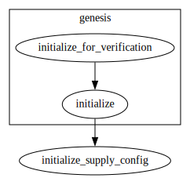

## Function `allow_supply_upgrades`

This should be called by on-chain governance to update the config and allow

<pre><code><b>public</b> <b>fun</b> <a href="coin.md#0x1_coin_allow_supply_upgrades">allow_supply_upgrades</a>(aptos_framework: &<a href="../../aptos-stdlib/../move-stdlib/doc/signer.md#0x1_signer">signer</a>, allowed: bool)
</code></pre>

Implementation

<pre><code><b>public</b> <b>fun</b> <a href="coin.md#0x1_coin_allow_supply_upgrades">allow_supply_upgrades</a>(aptos_framework: &<a href="../../aptos-stdlib/../move-stdlib/doc/signer.md#0x1_signer">signer</a>, allowed: bool) <b>acquires</b> <a href="coin.md#0x1_coin_SupplyConfig">SupplyConfig</a> {
    <a href="system_addresses.md#0x1_system_addresses_assert_aptos_framework">system_addresses::assert_aptos_framework</a>(aptos_framework);
    <b>let</b> allow_upgrades = &<b>mut</b> <b>borrow_global_mut</b>&lt;<a href="coin.md#0x1_coin_SupplyConfig">SupplyConfig</a>&gt;(@aptos_framework).allow_upgrades;
    *allow_upgrades = allowed;
}
</code></pre>

Show all the functions that "allow_supply_upgrades" calls

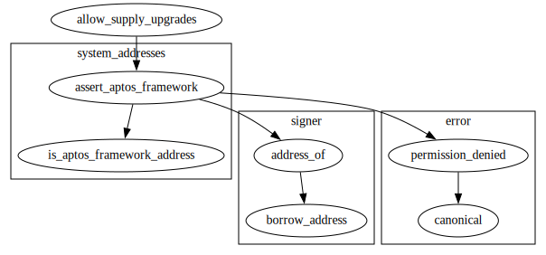

Show all the functions that call "allow_supply_upgrades"

## Function `coin_address`

A helper function that returns the address of CoinType.

<pre><code><b>fun</b> <a href="coin.md#0x1_coin_coin_address">coin_address</a>&lt;CoinType&gt;(): <b>address</b>
</code></pre>

Implementation

<pre><code><b>fun</b> <a href="coin.md#0x1_coin_coin_address">coin_address</a>&lt;CoinType&gt;(): <b>address</b> {
    <b>let</b> <a href="../../aptos-stdlib/doc/type_info.md#0x1_type_info">type_info</a> = <a href="../../aptos-stdlib/doc/type_info.md#0x1_type_info_type_of">type_info::type_of</a>&lt;CoinType&gt;();
    <a href="../../aptos-stdlib/doc/type_info.md#0x1_type_info_account_address">type_info::account_address</a>(&<a href="../../aptos-stdlib/doc/type_info.md#0x1_type_info">type_info</a>)
}
</code></pre>

Show all the functions that "coin_address" calls

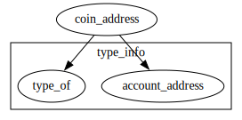

Show all the functions that call "coin_address"

## Function `balance`

Returns the balance of <code>owner</code> for provided <code>CoinType</code>.

<pre><code><b>public</b> <b>fun</b> <a href="coin.md#0x1_coin_balance">balance</a>&lt;CoinType&gt;(owner: <b>address</b>): u64
</code></pre>

Implementation

<pre><code><b>public</b> <b>fun</b> <a href="coin.md#0x1_coin_balance">balance</a>&lt;CoinType&gt;(owner: <b>address</b>): u64 <b>acquires</b> <a href="coin.md#0x1_coin_CoinStore">CoinStore</a> {
    <b>assert</b>!(
        <a href="coin.md#0x1_coin_is_account_registered">is_account_registered</a>&lt;CoinType&gt;(owner),
        <a href="../../aptos-stdlib/../move-stdlib/doc/error.md#0x1_error_not_found">error::not_found</a>(<a href="coin.md#0x1_coin_ECOIN_STORE_NOT_PUBLISHED">ECOIN_STORE_NOT_PUBLISHED</a>),
    );
    <b>borrow_global</b>&lt;<a href="coin.md#0x1_coin_CoinStore">CoinStore</a>&lt;CoinType&gt;&gt;(owner).<a href="coin.md#0x1_coin">coin</a>.value
}
</code></pre>

Show all the functions that "balance" calls

Show all the functions that call "balance"

## Function `is_coin_initialized`

Returns <code><b>true</b></code> if the type <code>CoinType</code> is an initialized coin.

<pre><code><b>public</b> <b>fun</b> <a href="coin.md#0x1_coin_is_coin_initialized">is_coin_initialized</a>&lt;CoinType&gt;(): bool
</code></pre>

Implementation

<pre><code><b>public</b> <b>fun</b> <a href="coin.md#0x1_coin_is_coin_initialized">is_coin_initialized</a>&lt;CoinType&gt;(): bool {
    <b>exists</b>&lt;<a href="coin.md#0x1_coin_CoinInfo">CoinInfo</a>&lt;CoinType&gt;&gt;(<a href="coin.md#0x1_coin_coin_address">coin_address</a>&lt;CoinType&gt;())
}
</code></pre>

Show all the functions that "is_coin_initialized" calls

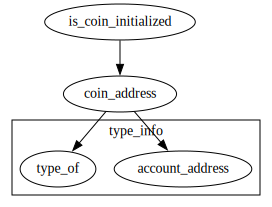

Show all the functions that call "is_coin_initialized"

## Function `is_account_registered`

Returns <code><b>true</b></code> if <code>account_addr</code> is registered to receive <code>CoinType</code>.

<pre><code><b>public</b> <b>fun</b> <a href="coin.md#0x1_coin_is_account_registered">is_account_registered</a>&lt;CoinType&gt;(account_addr: <b>address</b>): bool
</code></pre>

Implementation

<pre><code><b>public</b> <b>fun</b> <a href="coin.md#0x1_coin_is_account_registered">is_account_registered</a>&lt;CoinType&gt;(account_addr: <b>address</b>): bool {
    <b>exists</b>&lt;<a href="coin.md#0x1_coin_CoinStore">CoinStore</a>&lt;CoinType&gt;&gt;(account_addr)
}
</code></pre>

Show all the functions that "is_account_registered" calls

Show all the functions that call "is_account_registered"

## Function `name`

Returns the name of the coin.

<pre><code><b>public</b> <b>fun</b> <a href="coin.md#0x1_coin_name">name</a>&lt;CoinType&gt;(): <a href="../../aptos-stdlib/../move-stdlib/doc/string.md#0x1_string_String">string::String</a>
</code></pre>

Implementation

<pre><code><b>public</b> <b>fun</b> <a href="coin.md#0x1_coin_name">name</a>&lt;CoinType&gt;(): <a href="../../aptos-stdlib/../move-stdlib/doc/string.md#0x1_string_String">string::String</a> <b>acquires</b> <a href="coin.md#0x1_coin_CoinInfo">CoinInfo</a> {
    <b>borrow_global</b>&lt;<a href="coin.md#0x1_coin_CoinInfo">CoinInfo</a>&lt;CoinType&gt;&gt;(<a href="coin.md#0x1_coin_coin_address">coin_address</a>&lt;CoinType&gt;()).name
}
</code></pre>

Show all the functions that "name" calls

Show all the functions that call "name"

## Function `symbol`

Returns the symbol of the coin, usually a shorter version of the name.

<pre><code><b>public</b> <b>fun</b> <a href="coin.md#0x1_coin_symbol">symbol</a>&lt;CoinType&gt;(): <a href="../../aptos-stdlib/../move-stdlib/doc/string.md#0x1_string_String">string::String</a>
</code></pre>

Implementation

<pre><code><b>public</b> <b>fun</b> <a href="coin.md#0x1_coin_symbol">symbol</a>&lt;CoinType&gt;(): <a href="../../aptos-stdlib/../move-stdlib/doc/string.md#0x1_string_String">string::String</a> <b>acquires</b> <a href="coin.md#0x1_coin_CoinInfo">CoinInfo</a> {
    <b>borrow_global</b>&lt;<a href="coin.md#0x1_coin_CoinInfo">CoinInfo</a>&lt;CoinType&gt;&gt;(<a href="coin.md#0x1_coin_coin_address">coin_address</a>&lt;CoinType&gt;()).symbol
}
</code></pre>

Show all the functions that "symbol" calls

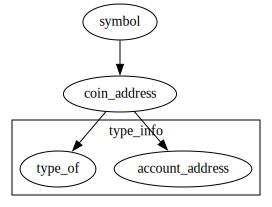

Show all the functions that call "symbol"

## Function `decimals`

Returns the number of decimals used to get its user representation.
For example, if <code>decimals</code> equals <code>2</code>, a balance of <code>505</code> coins should
be displayed to a user as <code>5.05</code> (<code>505 / 10 ** 2</code>).

<pre><code><b>public</b> <b>fun</b> <a href="coin.md#0x1_coin_decimals">decimals</a>&lt;CoinType&gt;(): u8
</code></pre>

Implementation

<pre><code><b>public</b> <b>fun</b> <a href="coin.md#0x1_coin_decimals">decimals</a>&lt;CoinType&gt;(): u8 <b>acquires</b> <a href="coin.md#0x1_coin_CoinInfo">CoinInfo</a> {
    <b>borrow_global</b>&lt;<a href="coin.md#0x1_coin_CoinInfo">CoinInfo</a>&lt;CoinType&gt;&gt;(<a href="coin.md#0x1_coin_coin_address">coin_address</a>&lt;CoinType&gt;()).decimals
}
</code></pre>

Show all the functions that "decimals" calls

Show all the functions that call "decimals"

## Function `supply`

Returns the amount of coin in existence.

<pre><code><b>public</b> <b>fun</b> <a href="coin.md#0x1_coin_supply">supply</a>&lt;CoinType&gt;(): <a href="../../aptos-stdlib/../move-stdlib/doc/option.md#0x1_option_Option">option::Option</a>&lt;u128&gt;
</code></pre>

Implementation

<pre><code><b>public</b> <b>fun</b> <a href="coin.md#0x1_coin_supply">supply</a>&lt;CoinType&gt;(): Option&lt;u128&gt; <b>acquires</b> <a href="coin.md#0x1_coin_CoinInfo">CoinInfo</a> {
    <b>let</b> maybe_supply = &<b>borrow_global</b>&lt;<a href="coin.md#0x1_coin_CoinInfo">CoinInfo</a>&lt;CoinType&gt;&gt;(<a href="coin.md#0x1_coin_coin_address">coin_address</a>&lt;CoinType&gt;()).supply;
    <b>if</b> (<a href="../../aptos-stdlib/../move-stdlib/doc/option.md#0x1_option_is_some">option::is_some</a>(maybe_supply)) {
        // We do track supply, in this case read from optional <a href="aggregator.md#0x1_aggregator">aggregator</a>.
        <b>let</b> supply = <a href="../../aptos-stdlib/../move-stdlib/doc/option.md#0x1_option_borrow">option::borrow</a>(maybe_supply);
        <b>let</b> value = <a href="optional_aggregator.md#0x1_optional_aggregator_read">optional_aggregator::read</a>(supply);
        <a href="../../aptos-stdlib/../move-stdlib/doc/option.md#0x1_option_some">option::some</a>(value)
    } <b>else</b> {
        <a href="../../aptos-stdlib/../move-stdlib/doc/option.md#0x1_option_none">option::none</a>()
    }
}
</code></pre>

Show all the functions that "supply" calls

Show all the functions that call "supply"

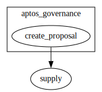

## Function `burn`

Burn <code><a href="coin.md#0x1_coin">coin</a></code> with capability.
The capability <code>_cap</code> should be passed as a reference to <code><a href="coin.md#0x1_coin_BurnCapability">BurnCapability</a>&lt;CoinType&gt;</code>.

<pre><code><b>public</b> <b>fun</b> <a href="coin.md#0x1_coin_burn">burn</a>&lt;CoinType&gt;(<a href="coin.md#0x1_coin">coin</a>: <a href="coin.md#0x1_coin_Coin">coin::Coin</a>&lt;CoinType&gt;, _cap: &<a href="coin.md#0x1_coin_BurnCapability">coin::BurnCapability</a>&lt;CoinType&gt;)
</code></pre>

Implementation

<pre><code><b>public</b> <b>fun</b> <a href="coin.md#0x1_coin_burn">burn</a>&lt;CoinType&gt;(
    <a href="coin.md#0x1_coin">coin</a>: <a href="coin.md#0x1_coin_Coin">Coin</a>&lt;CoinType&gt;,
    _cap: &<a href="coin.md#0x1_coin_BurnCapability">BurnCapability</a>&lt;CoinType&gt;,
) <b>acquires</b> <a href="coin.md#0x1_coin_CoinInfo">CoinInfo</a> {
    <b>let</b> <a href="coin.md#0x1_coin_Coin">Coin</a> { value: amount } = <a href="coin.md#0x1_coin">coin</a>;
    <b>assert</b>!(amount &gt; 0, <a href="../../aptos-stdlib/../move-stdlib/doc/error.md#0x1_error_invalid_argument">error::invalid_argument</a>(<a href="coin.md#0x1_coin_EZERO_COIN_AMOUNT">EZERO_COIN_AMOUNT</a>));

    <b>let</b> maybe_supply = &<b>mut</b> <b>borrow_global_mut</b>&lt;<a href="coin.md#0x1_coin_CoinInfo">CoinInfo</a>&lt;CoinType&gt;&gt;(<a href="coin.md#0x1_coin_coin_address">coin_address</a>&lt;CoinType&gt;()).supply;
    <b>if</b> (<a href="../../aptos-stdlib/../move-stdlib/doc/option.md#0x1_option_is_some">option::is_some</a>(maybe_supply)) {
        <b>let</b> supply = <a href="../../aptos-stdlib/../move-stdlib/doc/option.md#0x1_option_borrow_mut">option::borrow_mut</a>(maybe_supply);
        <a href="optional_aggregator.md#0x1_optional_aggregator_sub">optional_aggregator::sub</a>(supply, (amount <b>as</b> u128));
    }
}
</code></pre>

Show all the functions that "burn" calls

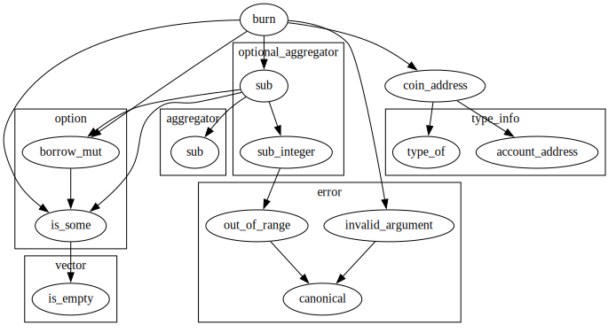

Show all the functions that call "burn"

## Function `burn_from`

Burn <code><a href="coin.md#0x1_coin">coin</a></code> from the specified <code><a href="account.md#0x1_account">account</a></code> with capability.
The capability <code>burn_cap</code> should be passed as a reference to <code><a href="coin.md#0x1_coin_BurnCapability">BurnCapability</a>&lt;CoinType&gt;</code>.
This function shouldn't fail as it's called as part of transaction fee burning.

Note: This bypasses CoinStore::frozen -- coins within a frozen CoinStore can be burned.

<pre><code><b>public</b> <b>fun</b> <a href="coin.md#0x1_coin_burn_from">burn_from</a>&lt;CoinType&gt;(account_addr: <b>address</b>, amount: u64, burn_cap: &<a href="coin.md#0x1_coin_BurnCapability">coin::BurnCapability</a>&lt;CoinType&gt;)
</code></pre>

Implementation

<pre><code><b>public</b> <b>fun</b> <a href="coin.md#0x1_coin_burn_from">burn_from</a>&lt;CoinType&gt;(
    account_addr: <b>address</b>,
    amount: u64,
    burn_cap: &<a href="coin.md#0x1_coin_BurnCapability">BurnCapability</a>&lt;CoinType&gt;,
) <b>acquires</b> <a href="coin.md#0x1_coin_CoinInfo">CoinInfo</a>, <a href="coin.md#0x1_coin_CoinStore">CoinStore</a> {
    // Skip burning <b>if</b> amount is zero. This shouldn't <a href="../../aptos-stdlib/../move-stdlib/doc/error.md#0x1_error">error</a> out <b>as</b> it's called <b>as</b> part of transaction fee burning.
    <b>if</b> (amount == 0) {
        <b>return</b>
    };

    <b>let</b> coin_store = <b>borrow_global_mut</b>&lt;<a href="coin.md#0x1_coin_CoinStore">CoinStore</a>&lt;CoinType&gt;&gt;(account_addr);
    <b>let</b> coin_to_burn = <a href="coin.md#0x1_coin_extract">extract</a>(&<b>mut</b> coin_store.<a href="coin.md#0x1_coin">coin</a>, amount);
    <a href="coin.md#0x1_coin_burn">burn</a>(coin_to_burn, burn_cap);
}
</code></pre>

Show all the functions that "burn_from" calls

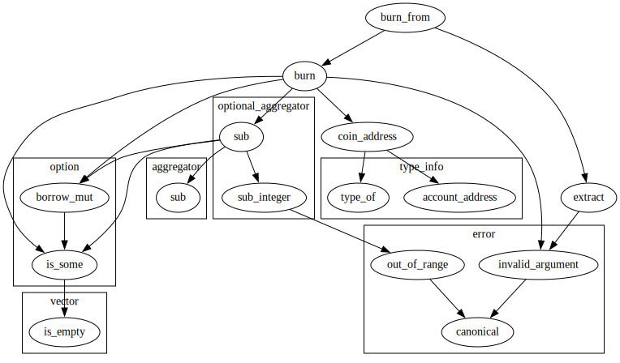

Show all the functions that call "burn_from"

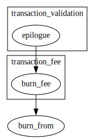

## Function `deposit`

Deposit the coin balance into the recipient's account and emit an event.

<pre><code><b>public</b> <b>fun</b> <a href="coin.md#0x1_coin_deposit">deposit</a>&lt;CoinType&gt;(account_addr: <b>address</b>, <a href="coin.md#0x1_coin">coin</a>: <a href="coin.md#0x1_coin_Coin">coin::Coin</a>&lt;CoinType&gt;)
</code></pre>

Implementation

<pre><code><b>public</b> <b>fun</b> <a href="coin.md#0x1_coin_deposit">deposit</a>&lt;CoinType&gt;(account_addr: <b>address</b>, <a href="coin.md#0x1_coin">coin</a>: <a href="coin.md#0x1_coin_Coin">Coin</a>&lt;CoinType&gt;) <b>acquires</b> <a href="coin.md#0x1_coin_CoinStore">CoinStore</a> {
    <b>assert</b>!(
        <a href="coin.md#0x1_coin_is_account_registered">is_account_registered</a>&lt;CoinType&gt;(account_addr),
        <a href="../../aptos-stdlib/../move-stdlib/doc/error.md#0x1_error_not_found">error::not_found</a>(<a href="coin.md#0x1_coin_ECOIN_STORE_NOT_PUBLISHED">ECOIN_STORE_NOT_PUBLISHED</a>),
    );

    <b>let</b> coin_store = <b>borrow_global_mut</b>&lt;<a href="coin.md#0x1_coin_CoinStore">CoinStore</a>&lt;CoinType&gt;&gt;(account_addr);
    <b>assert</b>!(
        !coin_store.frozen,
        <a href="../../aptos-stdlib/../move-stdlib/doc/error.md#0x1_error_permission_denied">error::permission_denied</a>(<a href="coin.md#0x1_coin_EFROZEN">EFROZEN</a>),
    );

    <a href="event.md#0x1_event_emit_event">event::emit_event</a>&lt;<a href="coin.md#0x1_coin_DepositEvent">DepositEvent</a>&gt;(
        &<b>mut</b> coin_store.deposit_events,
        <a href="coin.md#0x1_coin_DepositEvent">DepositEvent</a> { amount: <a href="coin.md#0x1_coin">coin</a>.value },
    );

    <a href="coin.md#0x1_coin_merge">merge</a>(&<b>mut</b> coin_store.<a href="coin.md#0x1_coin">coin</a>, <a href="coin.md#0x1_coin">coin</a>);
}
</code></pre>

Show all the functions that "deposit" calls

Show all the functions that call "deposit"

## Function `destroy_zero`

Destroys a zero-value coin. Calls will fail if the <code>value</code> in the passed-in <code>token</code> is non-zero
so it is impossible to "burn" any non-zero amount of <code><a href="coin.md#0x1_coin_Coin">Coin</a></code> without having
a <code><a href="coin.md#0x1_coin_BurnCapability">BurnCapability</a></code> for the specific <code>CoinType</code>.

<pre><code><b>public</b> <b>fun</b> <a href="coin.md#0x1_coin_destroy_zero">destroy_zero</a>&lt;CoinType&gt;(zero_coin: <a href="coin.md#0x1_coin_Coin">coin::Coin</a>&lt;CoinType&gt;)
</code></pre>

Implementation

<pre><code><b>public</b> <b>fun</b> <a href="coin.md#0x1_coin_destroy_zero">destroy_zero</a>&lt;CoinType&gt;(zero_coin: <a href="coin.md#0x1_coin_Coin">Coin</a>&lt;CoinType&gt;) {
    <b>let</b> <a href="coin.md#0x1_coin_Coin">Coin</a> { value } = zero_coin;
    <b>assert</b>!(value == 0, <a href="../../aptos-stdlib/../move-stdlib/doc/error.md#0x1_error_invalid_argument">error::invalid_argument</a>(<a href="coin.md#0x1_coin_EDESTRUCTION_OF_NONZERO_TOKEN">EDESTRUCTION_OF_NONZERO_TOKEN</a>))
}
</code></pre>

Show all the functions that "destroy_zero" calls

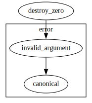

Show all the functions that call "destroy_zero"

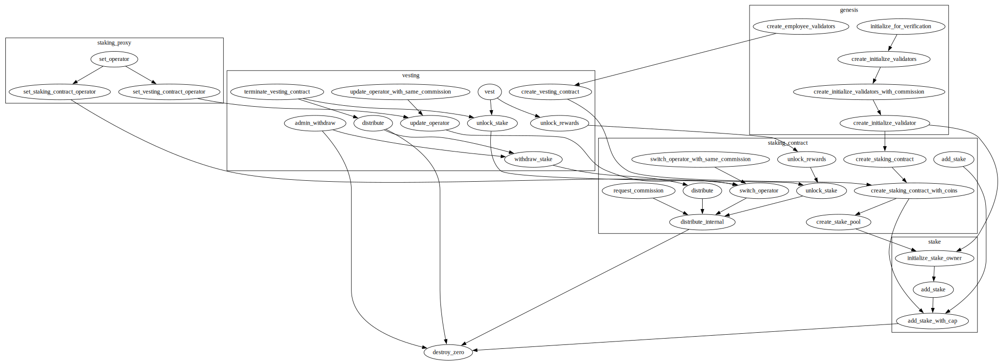

## Function `extract`

Extracts <code>amount</code> from the passed-in <code><a href="coin.md#0x1_coin">coin</a></code>, where the original token is modified in place.

<pre><code><b>public</b> <b>fun</b> <a href="coin.md#0x1_coin_extract">extract</a>&lt;CoinType&gt;(<a href="coin.md#0x1_coin">coin</a>: &<b>mut</b> <a href="coin.md#0x1_coin_Coin">coin::Coin</a>&lt;CoinType&gt;, amount: u64): <a href="coin.md#0x1_coin_Coin">coin::Coin</a>&lt;CoinType&gt;
</code></pre>

Implementation

<pre><code><b>public</b> <b>fun</b> <a href="coin.md#0x1_coin_extract">extract</a>&lt;CoinType&gt;(<a href="coin.md#0x1_coin">coin</a>: &<b>mut</b> <a href="coin.md#0x1_coin_Coin">Coin</a>&lt;CoinType&gt;, amount: u64): <a href="coin.md#0x1_coin_Coin">Coin</a>&lt;CoinType&gt; {
    <b>assert</b>!(<a href="coin.md#0x1_coin">coin</a>.value &gt;= amount, <a href="../../aptos-stdlib/../move-stdlib/doc/error.md#0x1_error_invalid_argument">error::invalid_argument</a>(<a href="coin.md#0x1_coin_EINSUFFICIENT_BALANCE">EINSUFFICIENT_BALANCE</a>));
    <a href="coin.md#0x1_coin">coin</a>.value = <a href="coin.md#0x1_coin">coin</a>.value - amount;
    <a href="coin.md#0x1_coin_Coin">Coin</a> { value: amount }
}
</code></pre>

Show all the functions that "extract" calls

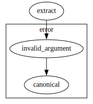

Show all the functions that call "extract"

## Function `extract_all`

Extracts the entire amount from the passed-in <code><a href="coin.md#0x1_coin">coin</a></code>, where the original token is modified in place.

<pre><code><b>public</b> <b>fun</b> <a href="coin.md#0x1_coin_extract_all">extract_all</a>&lt;CoinType&gt;(<a href="coin.md#0x1_coin">coin</a>: &<b>mut</b> <a href="coin.md#0x1_coin_Coin">coin::Coin</a>&lt;CoinType&gt;): <a href="coin.md#0x1_coin_Coin">coin::Coin</a>&lt;CoinType&gt;
</code></pre>

Implementation

<pre><code><b>public</b> <b>fun</b> <a href="coin.md#0x1_coin_extract_all">extract_all</a>&lt;CoinType&gt;(<a href="coin.md#0x1_coin">coin</a>: &<b>mut</b> <a href="coin.md#0x1_coin_Coin">Coin</a>&lt;CoinType&gt;): <a href="coin.md#0x1_coin_Coin">Coin</a>&lt;CoinType&gt; {
    <b>let</b> total_value = <a href="coin.md#0x1_coin">coin</a>.value;
    <a href="coin.md#0x1_coin">coin</a>.value = 0;
    <a href="coin.md#0x1_coin_Coin">Coin</a> { value: total_value }
}
</code></pre>

Show all the functions that "extract_all" calls

Show all the functions that call "extract_all"

## Function `freeze_coin_store`

Freeze a CoinStore to prevent transfers

<pre><code><b>public</b> entry <b>fun</b> <a href="coin.md#0x1_coin_freeze_coin_store">freeze_coin_store</a>&lt;CoinType&gt;(account_addr: <b>address</b>, _freeze_cap: &<a href="coin.md#0x1_coin_FreezeCapability">coin::FreezeCapability</a>&lt;CoinType&gt;)
</code></pre>

Implementation

<pre><code><b>public</b> entry <b>fun</b> <a href="coin.md#0x1_coin_freeze_coin_store">freeze_coin_store</a>&lt;CoinType&gt;(
    account_addr: <b>address</b>,
    _freeze_cap: &<a href="coin.md#0x1_coin_FreezeCapability">FreezeCapability</a>&lt;CoinType&gt;,
) <b>acquires</b> <a href="coin.md#0x1_coin_CoinStore">CoinStore</a> {
    <b>let</b> coin_store = <b>borrow_global_mut</b>&lt;<a href="coin.md#0x1_coin_CoinStore">CoinStore</a>&lt;CoinType&gt;&gt;(account_addr);
    coin_store.frozen = <b>true</b>;
}
</code></pre>

Show all the functions that "freeze_coin_store" calls

Show all the functions that call "freeze_coin_store"

## Function `unfreeze_coin_store`

Unfreeze a CoinStore to allow transfers

<pre><code><b>public</b> entry <b>fun</b> <a href="coin.md#0x1_coin_unfreeze_coin_store">unfreeze_coin_store</a>&lt;CoinType&gt;(account_addr: <b>address</b>, _freeze_cap: &<a href="coin.md#0x1_coin_FreezeCapability">coin::FreezeCapability</a>&lt;CoinType&gt;)
</code></pre>

Implementation

<pre><code><b>public</b> entry <b>fun</b> <a href="coin.md#0x1_coin_unfreeze_coin_store">unfreeze_coin_store</a>&lt;CoinType&gt;(
    account_addr: <b>address</b>,
    _freeze_cap: &<a href="coin.md#0x1_coin_FreezeCapability">FreezeCapability</a>&lt;CoinType&gt;,
) <b>acquires</b> <a href="coin.md#0x1_coin_CoinStore">CoinStore</a> {
    <b>let</b> coin_store = <b>borrow_global_mut</b>&lt;<a href="coin.md#0x1_coin_CoinStore">CoinStore</a>&lt;CoinType&gt;&gt;(account_addr);
    coin_store.frozen = <b>false</b>;
}
</code></pre>

Show all the functions that "unfreeze_coin_store" calls

Show all the functions that call "unfreeze_coin_store"

## Function `upgrade_supply`

Upgrade total supply to use a parallelizable implementation if it is
available.

<pre><code><b>public</b> entry <b>fun</b> <a href="coin.md#0x1_coin_upgrade_supply">upgrade_supply</a>&lt;CoinType&gt;(<a href="account.md#0x1_account">account</a>: &<a href="../../aptos-stdlib/../move-stdlib/doc/signer.md#0x1_signer">signer</a>)
</code></pre>

Implementation

<pre><code><b>public</b> entry <b>fun</b> <a href="coin.md#0x1_coin_upgrade_supply">upgrade_supply</a>&lt;CoinType&gt;(<a href="account.md#0x1_account">account</a>: &<a href="../../aptos-stdlib/../move-stdlib/doc/signer.md#0x1_signer">signer</a>) <b>acquires</b> <a href="coin.md#0x1_coin_CoinInfo">CoinInfo</a>, <a href="coin.md#0x1_coin_SupplyConfig">SupplyConfig</a> {
    <b>let</b> account_addr = <a href="../../aptos-stdlib/../move-stdlib/doc/signer.md#0x1_signer_address_of">signer::address_of</a>(<a href="account.md#0x1_account">account</a>);

    // Only <a href="coin.md#0x1_coin">coin</a> creators can upgrade total supply.
    <b>assert</b>!(
        <a href="coin.md#0x1_coin_coin_address">coin_address</a>&lt;CoinType&gt;() == account_addr,
        <a href="../../aptos-stdlib/../move-stdlib/doc/error.md#0x1_error_invalid_argument">error::invalid_argument</a>(<a href="coin.md#0x1_coin_ECOIN_INFO_ADDRESS_MISMATCH">ECOIN_INFO_ADDRESS_MISMATCH</a>),
    );

    // Can only succeed once on-chain governance agreed on the upgrade.
    <b>assert</b>!(
        <b>borrow_global_mut</b>&lt;<a href="coin.md#0x1_coin_SupplyConfig">SupplyConfig</a>&gt;(@aptos_framework).allow_upgrades,
        <a href="../../aptos-stdlib/../move-stdlib/doc/error.md#0x1_error_permission_denied">error::permission_denied</a>(<a href="coin.md#0x1_coin_ECOIN_SUPPLY_UPGRADE_NOT_SUPPORTED">ECOIN_SUPPLY_UPGRADE_NOT_SUPPORTED</a>)
    );

    <b>let</b> maybe_supply = &<b>mut</b> <b>borrow_global_mut</b>&lt;<a href="coin.md#0x1_coin_CoinInfo">CoinInfo</a>&lt;CoinType&gt;&gt;(account_addr).supply;
    <b>if</b> (<a href="../../aptos-stdlib/../move-stdlib/doc/option.md#0x1_option_is_some">option::is_some</a>(maybe_supply)) {
        <b>let</b> supply = <a href="../../aptos-stdlib/../move-stdlib/doc/option.md#0x1_option_borrow_mut">option::borrow_mut</a>(maybe_supply);

        // If supply is tracked and the current implementation uses an integer - upgrade.
        <b>if</b> (!<a href="optional_aggregator.md#0x1_optional_aggregator_is_parallelizable">optional_aggregator::is_parallelizable</a>(supply)) {
            <a href="optional_aggregator.md#0x1_optional_aggregator_switch">optional_aggregator::switch</a>(supply);
        }
    }
}
</code></pre>

Show all the functions that "upgrade_supply" calls

Show all the functions that call "upgrade_supply"

## Function `initialize`

Creates a new Coin with given <code>CoinType</code> and returns minting/freezing/burning capabilities.
The given signer also becomes the account hosting the information  about the coin
(name, supply, etc.). Supply is initialized as non-parallelizable integer.

<pre><code><b>public</b> <b>fun</b> <a href="coin.md#0x1_coin_initialize">initialize</a>&lt;CoinType&gt;(<a href="account.md#0x1_account">account</a>: &<a href="../../aptos-stdlib/../move-stdlib/doc/signer.md#0x1_signer">signer</a>, name: <a href="../../aptos-stdlib/../move-stdlib/doc/string.md#0x1_string_String">string::String</a>, symbol: <a href="../../aptos-stdlib/../move-stdlib/doc/string.md#0x1_string_String">string::String</a>, decimals: u8, monitor_supply: bool): (<a href="coin.md#0x1_coin_BurnCapability">coin::BurnCapability</a>&lt;CoinType&gt;, <a href="coin.md#0x1_coin_FreezeCapability">coin::FreezeCapability</a>&lt;CoinType&gt;, <a href="coin.md#0x1_coin_MintCapability">coin::MintCapability</a>&lt;CoinType&gt;)
</code></pre>

Implementation

<pre><code><b>public</b> <b>fun</b> <a href="coin.md#0x1_coin_initialize">initialize</a>&lt;CoinType&gt;(
    <a href="account.md#0x1_account">account</a>: &<a href="../../aptos-stdlib/../move-stdlib/doc/signer.md#0x1_signer">signer</a>,
    name: <a href="../../aptos-stdlib/../move-stdlib/doc/string.md#0x1_string_String">string::String</a>,
    symbol: <a href="../../aptos-stdlib/../move-stdlib/doc/string.md#0x1_string_String">string::String</a>,
    decimals: u8,
    monitor_supply: bool,
): (<a href="coin.md#0x1_coin_BurnCapability">BurnCapability</a>&lt;CoinType&gt;, <a href="coin.md#0x1_coin_FreezeCapability">FreezeCapability</a>&lt;CoinType&gt;, <a href="coin.md#0x1_coin_MintCapability">MintCapability</a>&lt;CoinType&gt;) {
    <a href="coin.md#0x1_coin_initialize_internal">initialize_internal</a>(<a href="account.md#0x1_account">account</a>, name, symbol, decimals, monitor_supply, <b>false</b>)
}
</code></pre>

Show all the functions that "initialize" calls

Show all the functions that call "initialize"

## Function `initialize_with_parallelizable_supply`

Same as <code>initialize</code> but supply can be initialized to parallelizable aggregator.

<pre><code><b>public</b>(<b>friend</b>) <b>fun</b> <a href="coin.md#0x1_coin_initialize_with_parallelizable_supply">initialize_with_parallelizable_supply</a>&lt;CoinType&gt;(<a href="account.md#0x1_account">account</a>: &<a href="../../aptos-stdlib/../move-stdlib/doc/signer.md#0x1_signer">signer</a>, name: <a href="../../aptos-stdlib/../move-stdlib/doc/string.md#0x1_string_String">string::String</a>, symbol: <a href="../../aptos-stdlib/../move-stdlib/doc/string.md#0x1_string_String">string::String</a>, decimals: u8, monitor_supply: bool): (<a href="coin.md#0x1_coin_BurnCapability">coin::BurnCapability</a>&lt;CoinType&gt;, <a href="coin.md#0x1_coin_FreezeCapability">coin::FreezeCapability</a>&lt;CoinType&gt;, <a href="coin.md#0x1_coin_MintCapability">coin::MintCapability</a>&lt;CoinType&gt;)
</code></pre>

Implementation

<pre><code><b>public</b>(<b>friend</b>) <b>fun</b> <a href="coin.md#0x1_coin_initialize_with_parallelizable_supply">initialize_with_parallelizable_supply</a>&lt;CoinType&gt;(
    <a href="account.md#0x1_account">account</a>: &<a href="../../aptos-stdlib/../move-stdlib/doc/signer.md#0x1_signer">signer</a>,
    name: <a href="../../aptos-stdlib/../move-stdlib/doc/string.md#0x1_string_String">string::String</a>,
    symbol: <a href="../../aptos-stdlib/../move-stdlib/doc/string.md#0x1_string_String">string::String</a>,
    decimals: u8,
    monitor_supply: bool,
): (<a href="coin.md#0x1_coin_BurnCapability">BurnCapability</a>&lt;CoinType&gt;, <a href="coin.md#0x1_coin_FreezeCapability">FreezeCapability</a>&lt;CoinType&gt;, <a href="coin.md#0x1_coin_MintCapability">MintCapability</a>&lt;CoinType&gt;) {
    <a href="system_addresses.md#0x1_system_addresses_assert_aptos_framework">system_addresses::assert_aptos_framework</a>(<a href="account.md#0x1_account">account</a>);
    <a href="coin.md#0x1_coin_initialize_internal">initialize_internal</a>(<a href="account.md#0x1_account">account</a>, name, symbol, decimals, monitor_supply, <b>true</b>)
}
</code></pre>

Show all the functions that "initialize_with_parallelizable_supply" calls

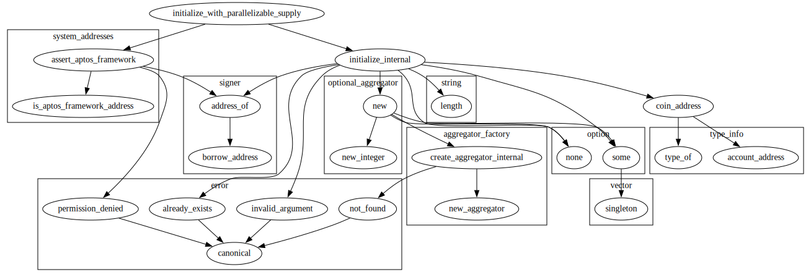

Show all the functions that call "initialize_with_parallelizable_supply"

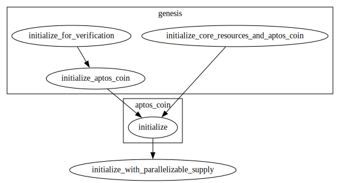

## Function `initialize_internal`

<pre><code><b>fun</b> <a href="coin.md#0x1_coin_initialize_internal">initialize_internal</a>&lt;CoinType&gt;(<a href="account.md#0x1_account">account</a>: &<a href="../../aptos-stdlib/../move-stdlib/doc/signer.md#0x1_signer">signer</a>, name: <a href="../../aptos-stdlib/../move-stdlib/doc/string.md#0x1_string_String">string::String</a>, symbol: <a href="../../aptos-stdlib/../move-stdlib/doc/string.md#0x1_string_String">string::String</a>, decimals: u8, monitor_supply: bool, parallelizable: bool): (<a href="coin.md#0x1_coin_BurnCapability">coin::BurnCapability</a>&lt;CoinType&gt;, <a href="coin.md#0x1_coin_FreezeCapability">coin::FreezeCapability</a>&lt;CoinType&gt;, <a href="coin.md#0x1_coin_MintCapability">coin::MintCapability</a>&lt;CoinType&gt;)
</code></pre>

Implementation

<pre><code><b>fun</b> <a href="coin.md#0x1_coin_initialize_internal">initialize_internal</a>&lt;CoinType&gt;(
    <a href="account.md#0x1_account">account</a>: &<a href="../../aptos-stdlib/../move-stdlib/doc/signer.md#0x1_signer">signer</a>,
    name: <a href="../../aptos-stdlib/../move-stdlib/doc/string.md#0x1_string_String">string::String</a>,
    symbol: <a href="../../aptos-stdlib/../move-stdlib/doc/string.md#0x1_string_String">string::String</a>,
    decimals: u8,
    monitor_supply: bool,
    parallelizable: bool,
): (<a href="coin.md#0x1_coin_BurnCapability">BurnCapability</a>&lt;CoinType&gt;, <a href="coin.md#0x1_coin_FreezeCapability">FreezeCapability</a>&lt;CoinType&gt;, <a href="coin.md#0x1_coin_MintCapability">MintCapability</a>&lt;CoinType&gt;) {
    <b>let</b> account_addr = <a href="../../aptos-stdlib/../move-stdlib/doc/signer.md#0x1_signer_address_of">signer::address_of</a>(<a href="account.md#0x1_account">account</a>);

    <b>assert</b>!(
        <a href="coin.md#0x1_coin_coin_address">coin_address</a>&lt;CoinType&gt;() == account_addr,
        <a href="../../aptos-stdlib/../move-stdlib/doc/error.md#0x1_error_invalid_argument">error::invalid_argument</a>(<a href="coin.md#0x1_coin_ECOIN_INFO_ADDRESS_MISMATCH">ECOIN_INFO_ADDRESS_MISMATCH</a>),
    );

    <b>assert</b>!(
        !<b>exists</b>&lt;<a href="coin.md#0x1_coin_CoinInfo">CoinInfo</a>&lt;CoinType&gt;&gt;(account_addr),
        <a href="../../aptos-stdlib/../move-stdlib/doc/error.md#0x1_error_already_exists">error::already_exists</a>(<a href="coin.md#0x1_coin_ECOIN_INFO_ALREADY_PUBLISHED">ECOIN_INFO_ALREADY_PUBLISHED</a>),
    );

    <b>assert</b>!(<a href="../../aptos-stdlib/../move-stdlib/doc/string.md#0x1_string_length">string::length</a>(&name) &lt;= <a href="coin.md#0x1_coin_MAX_COIN_NAME_LENGTH">MAX_COIN_NAME_LENGTH</a>, <a href="../../aptos-stdlib/../move-stdlib/doc/error.md#0x1_error_invalid_argument">error::invalid_argument</a>(<a href="coin.md#0x1_coin_ECOIN_NAME_TOO_LONG">ECOIN_NAME_TOO_LONG</a>));
    <b>assert</b>!(<a href="../../aptos-stdlib/../move-stdlib/doc/string.md#0x1_string_length">string::length</a>(&symbol) &lt;= <a href="coin.md#0x1_coin_MAX_COIN_SYMBOL_LENGTH">MAX_COIN_SYMBOL_LENGTH</a>, <a href="../../aptos-stdlib/../move-stdlib/doc/error.md#0x1_error_invalid_argument">error::invalid_argument</a>(<a href="coin.md#0x1_coin_ECOIN_SYMBOL_TOO_LONG">ECOIN_SYMBOL_TOO_LONG</a>));

    <b>let</b> coin_info = <a href="coin.md#0x1_coin_CoinInfo">CoinInfo</a>&lt;CoinType&gt; {
        name,
        symbol,
        decimals,
        supply: <b>if</b> (monitor_supply) { <a href="../../aptos-stdlib/../move-stdlib/doc/option.md#0x1_option_some">option::some</a>(<a href="optional_aggregator.md#0x1_optional_aggregator_new">optional_aggregator::new</a>(<a href="coin.md#0x1_coin_MAX_U128">MAX_U128</a>, parallelizable)) } <b>else</b> { <a href="../../aptos-stdlib/../move-stdlib/doc/option.md#0x1_option_none">option::none</a>() },
    };
    <b>move_to</b>(<a href="account.md#0x1_account">account</a>, coin_info);

    (<a href="coin.md#0x1_coin_BurnCapability">BurnCapability</a>&lt;CoinType&gt; {}, <a href="coin.md#0x1_coin_FreezeCapability">FreezeCapability</a>&lt;CoinType&gt; {}, <a href="coin.md#0x1_coin_MintCapability">MintCapability</a>&lt;CoinType&gt; {})
}
</code></pre>

Show all the functions that "initialize_internal" calls

Show all the functions that call "initialize_internal"

## Function `merge`

"Merges" the two given coins.  The coin passed in as <code>dst_coin</code> will have a value equal
to the sum of the two tokens (<code>dst_coin</code> and <code>source_coin</code>).

<pre><code><b>public</b> <b>fun</b> <a href="coin.md#0x1_coin_merge">merge</a>&lt;CoinType&gt;(dst_coin: &<b>mut</b> <a href="coin.md#0x1_coin_Coin">coin::Coin</a>&lt;CoinType&gt;, source_coin: <a href="coin.md#0x1_coin_Coin">coin::Coin</a>&lt;CoinType&gt;)
</code></pre>

Implementation

<pre><code><b>public</b> <b>fun</b> <a href="coin.md#0x1_coin_merge">merge</a>&lt;CoinType&gt;(dst_coin: &<b>mut</b> <a href="coin.md#0x1_coin_Coin">Coin</a>&lt;CoinType&gt;, source_coin: <a href="coin.md#0x1_coin_Coin">Coin</a>&lt;CoinType&gt;) {
    <b>spec</b> {
        <b>assume</b> dst_coin.value + source_coin.<a href="coin.md#0x1_coin_value">value</a> &lt;= MAX_U64;
    };
    dst_coin.value = dst_coin.value + source_coin.value;
    <b>let</b> <a href="coin.md#0x1_coin_Coin">Coin</a> { value: _ } = source_coin;
}
</code></pre>

Show all the functions that "merge" calls

Show all the functions that call "merge"

## Function `mint`

Mint new <code><a href="coin.md#0x1_coin_Coin">Coin</a></code> with capability.
The capability <code>_cap</code> should be passed as reference to <code><a href="coin.md#0x1_coin_MintCapability">MintCapability</a>&lt;CoinType&gt;</code>.
Returns minted <code><a href="coin.md#0x1_coin_Coin">Coin</a></code>.

<pre><code><b>public</b> <b>fun</b> <a href="coin.md#0x1_coin_mint">mint</a>&lt;CoinType&gt;(amount: u64, _cap: &<a href="coin.md#0x1_coin_MintCapability">coin::MintCapability</a>&lt;CoinType&gt;): <a href="coin.md#0x1_coin_Coin">coin::Coin</a>&lt;CoinType&gt;
</code></pre>

Implementation

<pre><code><b>public</b> <b>fun</b> <a href="coin.md#0x1_coin_mint">mint</a>&lt;CoinType&gt;(
    amount: u64,
    _cap: &<a href="coin.md#0x1_coin_MintCapability">MintCapability</a>&lt;CoinType&gt;,
): <a href="coin.md#0x1_coin_Coin">Coin</a>&lt;CoinType&gt; <b>acquires</b> <a href="coin.md#0x1_coin_CoinInfo">CoinInfo</a> {
    <b>if</b> (amount == 0) {
        <b>return</b> <a href="coin.md#0x1_coin_zero">zero</a>&lt;CoinType&gt;()
    };

    <b>let</b> maybe_supply = &<b>mut</b> <b>borrow_global_mut</b>&lt;<a href="coin.md#0x1_coin_CoinInfo">CoinInfo</a>&lt;CoinType&gt;&gt;(<a href="coin.md#0x1_coin_coin_address">coin_address</a>&lt;CoinType&gt;()).supply;
    <b>if</b> (<a href="../../aptos-stdlib/../move-stdlib/doc/option.md#0x1_option_is_some">option::is_some</a>(maybe_supply)) {
        <b>let</b> supply = <a href="../../aptos-stdlib/../move-stdlib/doc/option.md#0x1_option_borrow_mut">option::borrow_mut</a>(maybe_supply);
        <a href="optional_aggregator.md#0x1_optional_aggregator_add">optional_aggregator::add</a>(supply, (amount <b>as</b> u128));
    };

    <a href="coin.md#0x1_coin_Coin">Coin</a>&lt;CoinType&gt; { value: amount }
}
</code></pre>

Show all the functions that "mint" calls

Show all the functions that call "mint"

## Function `register`

<pre><code><b>public</b> <b>fun</b> <a href="coin.md#0x1_coin_register">register</a>&lt;CoinType&gt;(<a href="account.md#0x1_account">account</a>: &<a href="../../aptos-stdlib/../move-stdlib/doc/signer.md#0x1_signer">signer</a>)
</code></pre>

Implementation

<pre><code><b>public</b> <b>fun</b> <a href="coin.md#0x1_coin_register">register</a>&lt;CoinType&gt;(<a href="account.md#0x1_account">account</a>: &<a href="../../aptos-stdlib/../move-stdlib/doc/signer.md#0x1_signer">signer</a>) {
    <b>let</b> account_addr = <a href="../../aptos-stdlib/../move-stdlib/doc/signer.md#0x1_signer_address_of">signer::address_of</a>(<a href="account.md#0x1_account">account</a>);
    <b>assert</b>!(
        !<a href="coin.md#0x1_coin_is_account_registered">is_account_registered</a>&lt;CoinType&gt;(account_addr),
        <a href="../../aptos-stdlib/../move-stdlib/doc/error.md#0x1_error_already_exists">error::already_exists</a>(<a href="coin.md#0x1_coin_ECOIN_STORE_ALREADY_PUBLISHED">ECOIN_STORE_ALREADY_PUBLISHED</a>),
    );

    <a href="account.md#0x1_account_register_coin">account::register_coin</a>&lt;CoinType&gt;(account_addr);
    <b>let</b> coin_store = <a href="coin.md#0x1_coin_CoinStore">CoinStore</a>&lt;CoinType&gt; {
        <a href="coin.md#0x1_coin">coin</a>: <a href="coin.md#0x1_coin_Coin">Coin</a> { value: 0 },
        frozen: <b>false</b>,
        deposit_events: <a href="account.md#0x1_account_new_event_handle">account::new_event_handle</a>&lt;<a href="coin.md#0x1_coin_DepositEvent">DepositEvent</a>&gt;(<a href="account.md#0x1_account">account</a>),
        withdraw_events: <a href="account.md#0x1_account_new_event_handle">account::new_event_handle</a>&lt;<a href="coin.md#0x1_coin_WithdrawEvent">WithdrawEvent</a>&gt;(<a href="account.md#0x1_account">account</a>),
    };
    <b>move_to</b>(<a href="account.md#0x1_account">account</a>, coin_store);
}
</code></pre>

Show all the functions that "register" calls

Show all the functions that call "register"

## Function `transfer`

Transfers <code>amount</code> of coins <code>CoinType</code> from <code>from</code> to <code><b>to</b></code>.

<pre><code><b>public</b> entry <b>fun</b> <a href="coin.md#0x1_coin_transfer">transfer</a>&lt;CoinType&gt;(from: &<a href="../../aptos-stdlib/../move-stdlib/doc/signer.md#0x1_signer">signer</a>, <b>to</b>: <b>address</b>, amount: u64)
</code></pre>

Implementation

<pre><code><b>public</b> entry <b>fun</b> <a href="coin.md#0x1_coin_transfer">transfer</a>&lt;CoinType&gt;(
    from: &<a href="../../aptos-stdlib/../move-stdlib/doc/signer.md#0x1_signer">signer</a>,
    <b>to</b>: <b>address</b>,
    amount: u64,
) <b>acquires</b> <a href="coin.md#0x1_coin_CoinStore">CoinStore</a> {
    <b>let</b> <a href="coin.md#0x1_coin">coin</a> = <a href="coin.md#0x1_coin_withdraw">withdraw</a>&lt;CoinType&gt;(from, amount);
    <a href="coin.md#0x1_coin_deposit">deposit</a>(<b>to</b>, <a href="coin.md#0x1_coin">coin</a>);
}
</code></pre>

Show all the functions that "transfer" calls

Show all the functions that call "transfer"

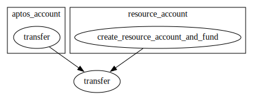

## Function `value`

Returns the <code>value</code> passed in <code><a href="coin.md#0x1_coin">coin</a></code>.

<pre><code><b>public</b> <b>fun</b> <a href="coin.md#0x1_coin_value">value</a>&lt;CoinType&gt;(<a href="coin.md#0x1_coin">coin</a>: &<a href="coin.md#0x1_coin_Coin">coin::Coin</a>&lt;CoinType&gt;): u64
</code></pre>

Implementation

<pre><code><b>public</b> <b>fun</b> <a href="coin.md#0x1_coin_value">value</a>&lt;CoinType&gt;(<a href="coin.md#0x1_coin">coin</a>: &<a href="coin.md#0x1_coin_Coin">Coin</a>&lt;CoinType&gt;): u64 {
    <a href="coin.md#0x1_coin">coin</a>.value
}
</code></pre>

Show all the functions that "value" calls

Show all the functions that call "value"

## Function `withdraw`

Withdraw specifed <code>amount</code> of coin <code>CoinType</code> from the signing account.

<pre><code><b>public</b> <b>fun</b> <a href="coin.md#0x1_coin_withdraw">withdraw</a>&lt;CoinType&gt;(<a href="account.md#0x1_account">account</a>: &<a href="../../aptos-stdlib/../move-stdlib/doc/signer.md#0x1_signer">signer</a>, amount: u64): <a href="coin.md#0x1_coin_Coin">coin::Coin</a>&lt;CoinType&gt;
</code></pre>

Implementation

<pre><code><b>public</b> <b>fun</b> <a href="coin.md#0x1_coin_withdraw">withdraw</a>&lt;CoinType&gt;(
    <a href="account.md#0x1_account">account</a>: &<a href="../../aptos-stdlib/../move-stdlib/doc/signer.md#0x1_signer">signer</a>,
    amount: u64,
): <a href="coin.md#0x1_coin_Coin">Coin</a>&lt;CoinType&gt; <b>acquires</b> <a href="coin.md#0x1_coin_CoinStore">CoinStore</a> {
    <b>let</b> account_addr = <a href="../../aptos-stdlib/../move-stdlib/doc/signer.md#0x1_signer_address_of">signer::address_of</a>(<a href="account.md#0x1_account">account</a>);
    <b>assert</b>!(
        <a href="coin.md#0x1_coin_is_account_registered">is_account_registered</a>&lt;CoinType&gt;(account_addr),
        <a href="../../aptos-stdlib/../move-stdlib/doc/error.md#0x1_error_not_found">error::not_found</a>(<a href="coin.md#0x1_coin_ECOIN_STORE_NOT_PUBLISHED">ECOIN_STORE_NOT_PUBLISHED</a>),
    );

    <b>let</b> coin_store = <b>borrow_global_mut</b>&lt;<a href="coin.md#0x1_coin_CoinStore">CoinStore</a>&lt;CoinType&gt;&gt;(account_addr);
    <b>assert</b>!(
        !coin_store.frozen,
        <a href="../../aptos-stdlib/../move-stdlib/doc/error.md#0x1_error_permission_denied">error::permission_denied</a>(<a href="coin.md#0x1_coin_EFROZEN">EFROZEN</a>),
    );

    <a href="event.md#0x1_event_emit_event">event::emit_event</a>&lt;<a href="coin.md#0x1_coin_WithdrawEvent">WithdrawEvent</a>&gt;(
        &<b>mut</b> coin_store.withdraw_events,
        <a href="coin.md#0x1_coin_WithdrawEvent">WithdrawEvent</a> { amount },
    );

    <a href="coin.md#0x1_coin_extract">extract</a>(&<b>mut</b> coin_store.<a href="coin.md#0x1_coin">coin</a>, amount)
}
</code></pre>

Show all the functions that "withdraw" calls

Show all the functions that call "withdraw"

## Function `zero`

Create a new <code><a href="coin.md#0x1_coin_Coin">Coin</a>&lt;CoinType&gt;</code> with a value of <code>0</code>.

<pre><code><b>public</b> <b>fun</b> <a href="coin.md#0x1_coin_zero">zero</a>&lt;CoinType&gt;(): <a href="coin.md#0x1_coin_Coin">coin::Coin</a>&lt;CoinType&gt;
</code></pre>

Implementation

<pre><code><b>public</b> <b>fun</b> <a href="coin.md#0x1_coin_zero">zero</a>&lt;CoinType&gt;(): <a href="coin.md#0x1_coin_Coin">Coin</a>&lt;CoinType&gt; {
    <a href="coin.md#0x1_coin_Coin">Coin</a>&lt;CoinType&gt; {
        value: 0
    }
}
</code></pre>

Show all the functions that "zero" calls

Show all the functions that call "zero"

## Function `destroy_freeze_cap`

Destroy a freeze capability. Freeze capability is dangerous and therefore should be destroyed if not used.

<pre><code><b>public</b> <b>fun</b> <a href="coin.md#0x1_coin_destroy_freeze_cap">destroy_freeze_cap</a>&lt;CoinType&gt;(freeze_cap: <a href="coin.md#0x1_coin_FreezeCapability">coin::FreezeCapability</a>&lt;CoinType&gt;)
</code></pre>

Implementation

<pre><code><b>public</b> <b>fun</b> <a href="coin.md#0x1_coin_destroy_freeze_cap">destroy_freeze_cap</a>&lt;CoinType&gt;(freeze_cap: <a href="coin.md#0x1_coin_FreezeCapability">FreezeCapability</a>&lt;CoinType&gt;) {
    <b>let</b> <a href="coin.md#0x1_coin_FreezeCapability">FreezeCapability</a>&lt;CoinType&gt; {} = freeze_cap;
}
</code></pre>

Show all the functions that "destroy_freeze_cap" calls

Show all the functions that call "destroy_freeze_cap"

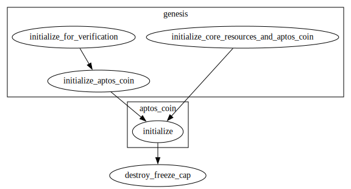

## Function `destroy_mint_cap`

Destroy a mint capability.

<pre><code><b>public</b> <b>fun</b> <a href="coin.md#0x1_coin_destroy_mint_cap">destroy_mint_cap</a>&lt;CoinType&gt;(mint_cap: <a href="coin.md#0x1_coin_MintCapability">coin::MintCapability</a>&lt;CoinType&gt;)
</code></pre>

Implementation

<pre><code><b>public</b> <b>fun</b> <a href="coin.md#0x1_coin_destroy_mint_cap">destroy_mint_cap</a>&lt;CoinType&gt;(mint_cap: <a href="coin.md#0x1_coin_MintCapability">MintCapability</a>&lt;CoinType&gt;) {
    <b>let</b> <a href="coin.md#0x1_coin_MintCapability">MintCapability</a>&lt;CoinType&gt; {} = mint_cap;
}
</code></pre>

Show all the functions that "destroy_mint_cap" calls

Show all the functions that call "destroy_mint_cap"

## Function `destroy_burn_cap`

Destroy a burn capability.

<pre><code><b>public</b> <b>fun</b> <a href="coin.md#0x1_coin_destroy_burn_cap">destroy_burn_cap</a>&lt;CoinType&gt;(burn_cap: <a href="coin.md#0x1_coin_BurnCapability">coin::BurnCapability</a>&lt;CoinType&gt;)
</code></pre>

Implementation

<pre><code><b>public</b> <b>fun</b> <a href="coin.md#0x1_coin_destroy_burn_cap">destroy_burn_cap</a>&lt;CoinType&gt;(burn_cap: <a href="coin.md#0x1_coin_BurnCapability">BurnCapability</a>&lt;CoinType&gt;) {
    <b>let</b> <a href="coin.md#0x1_coin_BurnCapability">BurnCapability</a>&lt;CoinType&gt; {} = burn_cap;
}
</code></pre>

Show all the functions that "destroy_burn_cap" calls

Show all the functions that call "destroy_burn_cap"

## Specification

<pre><code><b>pragma</b> verify = <b>true</b>;
</code></pre>

### Function `initialize_supply_config`

<pre><code><b>public</b>(<b>friend</b>) <b>fun</b> <a href="coin.md#0x1_coin_initialize_supply_config">initialize_supply_config</a>(aptos_framework: &<a href="../../aptos-stdlib/../move-stdlib/doc/signer.md#0x1_signer">signer</a>)
</code></pre>

Can only be initialized once.
Can only be published by reserved addresses.

<pre><code><b>let</b> aptos_addr = <a href="../../aptos-stdlib/../move-stdlib/doc/signer.md#0x1_signer_address_of">signer::address_of</a>(aptos_framework);
<b>aborts_if</b> !<a href="system_addresses.md#0x1_system_addresses_is_aptos_framework_address">system_addresses::is_aptos_framework_address</a>(aptos_addr);
<b>aborts_if</b> <b>exists</b>&lt;<a href="coin.md#0x1_coin_SupplyConfig">SupplyConfig</a>&gt;(aptos_addr);
<b>ensures</b> !<b>global</b>&lt;<a href="coin.md#0x1_coin_SupplyConfig">SupplyConfig</a>&gt;(aptos_addr).allow_upgrades;
<b>ensures</b> <b>exists</b>&lt;<a href="coin.md#0x1_coin_SupplyConfig">SupplyConfig</a>&gt;(aptos_addr);
</code></pre>

### Function `allow_supply_upgrades`

<pre><code><b>public</b> <b>fun</b> <a href="coin.md#0x1_coin_allow_supply_upgrades">allow_supply_upgrades</a>(aptos_framework: &<a href="../../aptos-stdlib/../move-stdlib/doc/signer.md#0x1_signer">signer</a>, allowed: bool)
</code></pre>

Can only be updated by <code>@aptos_framework</code>.

<pre><code><b>modifies</b> <b>global</b>&lt;<a href="coin.md#0x1_coin_SupplyConfig">SupplyConfig</a>&gt;(@aptos_framework);
<b>let</b> aptos_addr = <a href="../../aptos-stdlib/../move-stdlib/doc/signer.md#0x1_signer_address_of">signer::address_of</a>(aptos_framework);
<b>aborts_if</b> !<a href="system_addresses.md#0x1_system_addresses_is_aptos_framework_address">system_addresses::is_aptos_framework_address</a>(aptos_addr);
<b>aborts_if</b> !<b>exists</b>&lt;<a href="coin.md#0x1_coin_SupplyConfig">SupplyConfig</a>&gt;(aptos_addr);
<b>let</b> <b>post</b> allow_upgrades_post = <b>global</b>&lt;<a href="coin.md#0x1_coin_SupplyConfig">SupplyConfig</a>&gt;(@aptos_framework);
<b>ensures</b> allow_upgrades_post.allow_upgrades == allowed;
</code></pre>

### Function `coin_address`

<pre><code><b>fun</b> <a href="coin.md#0x1_coin_coin_address">coin_address</a>&lt;CoinType&gt;(): <b>address</b>
</code></pre>

Get address by reflection.

<pre><code><b>pragma</b> opaque;
<b>aborts_if</b> [abstract] <b>false</b>;
<b>ensures</b> [abstract] result == <a href="../../aptos-stdlib/doc/type_info.md#0x1_type_info_type_of">type_info::type_of</a>&lt;CoinType&gt;().account_address;
</code></pre>

### Function `balance`

<pre><code><b>public</b> <b>fun</b> <a href="coin.md#0x1_coin_balance">balance</a>&lt;CoinType&gt;(owner: <b>address</b>): u64
</code></pre>

<pre><code><b>aborts_if</b> !<b>exists</b>&lt;<a href="coin.md#0x1_coin_CoinStore">CoinStore</a>&lt;CoinType&gt;&gt;(owner);
<b>ensures</b> result == <b>global</b>&lt;<a href="coin.md#0x1_coin_CoinStore">CoinStore</a>&lt;CoinType&gt;&gt;(owner).<a href="coin.md#0x1_coin">coin</a>.value;
</code></pre>

### Function `is_coin_initialized`

<pre><code><b>public</b> <b>fun</b> <a href="coin.md#0x1_coin_is_coin_initialized">is_coin_initialized</a>&lt;CoinType&gt;(): bool
</code></pre>

<pre><code><b>pragma</b> verify = <b>false</b>;
</code></pre>

<pre><code><b>schema</b> <a href="coin.md#0x1_coin_ExistCoinInfo">ExistCoinInfo</a>&lt;CoinType&gt; {
    <b>let</b> addr = <a href="../../aptos-stdlib/doc/type_info.md#0x1_type_info_type_of">type_info::type_of</a>&lt;CoinType&gt;().account_address;
    <b>aborts_if</b> !<b>exists</b>&lt;<a href="coin.md#0x1_coin_CoinInfo">CoinInfo</a>&lt;CoinType&gt;&gt;(addr);
}
</code></pre>

### Function `name`

<pre><code><b>public</b> <b>fun</b> <a href="coin.md#0x1_coin_name">name</a>&lt;CoinType&gt;(): <a href="../../aptos-stdlib/../move-stdlib/doc/string.md#0x1_string_String">string::String</a>
</code></pre>

<pre><code><b>include</b> <a href="coin.md#0x1_coin_ExistCoinInfo">ExistCoinInfo</a>&lt;CoinType&gt;;
</code></pre>

### Function `symbol`

<pre><code><b>public</b> <b>fun</b> <a href="coin.md#0x1_coin_symbol">symbol</a>&lt;CoinType&gt;(): <a href="../../aptos-stdlib/../move-stdlib/doc/string.md#0x1_string_String">string::String</a>
</code></pre>

<pre><code><b>include</b> <a href="coin.md#0x1_coin_ExistCoinInfo">ExistCoinInfo</a>&lt;CoinType&gt;;
</code></pre>

### Function `decimals`

<pre><code><b>public</b> <b>fun</b> <a href="coin.md#0x1_coin_decimals">decimals</a>&lt;CoinType&gt;(): u8
</code></pre>

<pre><code><b>include</b> <a href="coin.md#0x1_coin_ExistCoinInfo">ExistCoinInfo</a>&lt;CoinType&gt;;
</code></pre>

### Function `supply`

<pre><code><b>public</b> <b>fun</b> <a href="coin.md#0x1_coin_supply">supply</a>&lt;CoinType&gt;(): <a href="../../aptos-stdlib/../move-stdlib/doc/option.md#0x1_option_Option">option::Option</a>&lt;u128&gt;
</code></pre>

<pre><code><b>pragma</b> aborts_if_is_partial;
<b>include</b> <a href="coin.md#0x1_coin_ExistCoinInfo">ExistCoinInfo</a>&lt;CoinType&gt;;
</code></pre>

### Function `burn`

<pre><code><b>public</b> <b>fun</b> <a href="coin.md#0x1_coin_burn">burn</a>&lt;CoinType&gt;(<a href="coin.md#0x1_coin">coin</a>: <a href="coin.md#0x1_coin_Coin">coin::Coin</a>&lt;CoinType&gt;, _cap: &<a href="coin.md#0x1_coin_BurnCapability">coin::BurnCapability</a>&lt;CoinType&gt;)
</code></pre>

<pre><code><b>pragma</b> aborts_if_is_partial;
<b>let</b> addr =  <a href="../../aptos-stdlib/doc/type_info.md#0x1_type_info_type_of">type_info::type_of</a>&lt;CoinType&gt;().account_address;
<b>modifies</b> <b>global</b>&lt;<a href="coin.md#0x1_coin_CoinInfo">CoinInfo</a>&lt;CoinType&gt;&gt;(addr);
<b>include</b> <a href="coin.md#0x1_coin_ExistCoinInfo">ExistCoinInfo</a>&lt;CoinType&gt;;
<b>aborts_if</b> <a href="coin.md#0x1_coin">coin</a>.value == 0;
</code></pre>

### Function `burn_from`

<pre><code><b>public</b> <b>fun</b> <a href="coin.md#0x1_coin_burn_from">burn_from</a>&lt;CoinType&gt;(account_addr: <b>address</b>, amount: u64, burn_cap: &<a href="coin.md#0x1_coin_BurnCapability">coin::BurnCapability</a>&lt;CoinType&gt;)
</code></pre>

<pre><code><b>pragma</b> aborts_if_is_partial;
<b>let</b> addr =  <a href="../../aptos-stdlib/doc/type_info.md#0x1_type_info_type_of">type_info::type_of</a>&lt;CoinType&gt;().account_address;
<b>modifies</b> <b>global</b>&lt;<a href="coin.md#0x1_coin_CoinInfo">CoinInfo</a>&lt;CoinType&gt;&gt;(addr);
<b>aborts_if</b> amount != 0 && !<b>exists</b>&lt;<a href="coin.md#0x1_coin_CoinStore">CoinStore</a>&lt;CoinType&gt;&gt;(account_addr);
</code></pre>

### Function `deposit`

<pre><code><b>public</b> <b>fun</b> <a href="coin.md#0x1_coin_deposit">deposit</a>&lt;CoinType&gt;(account_addr: <b>address</b>, <a href="coin.md#0x1_coin">coin</a>: <a href="coin.md#0x1_coin_Coin">coin::Coin</a>&lt;CoinType&gt;)
</code></pre>

<code>account_addr</code> is not frozen.

<pre><code><b>let</b> coin_store = <b>global</b>&lt;<a href="coin.md#0x1_coin_CoinStore">CoinStore</a>&lt;CoinType&gt;&gt;(account_addr);
<b>aborts_if</b> !<b>exists</b>&lt;<a href="coin.md#0x1_coin_CoinStore">CoinStore</a>&lt;CoinType&gt;&gt;(account_addr);
<b>aborts_if</b> coin_store.frozen;
<b>modifies</b> <b>global</b>&lt;<a href="coin.md#0x1_coin_CoinInfo">CoinInfo</a>&lt;CoinType&gt;&gt;(account_addr);
<b>ensures</b> <b>global</b>&lt;<a href="coin.md#0x1_coin_CoinStore">CoinStore</a>&lt;CoinType&gt;&gt;(account_addr).<a href="coin.md#0x1_coin">coin</a>.value == <b>old</b>(<b>global</b>&lt;<a href="coin.md#0x1_coin_CoinStore">CoinStore</a>&lt;CoinType&gt;&gt;(account_addr)).<a href="coin.md#0x1_coin">coin</a>.value + <a href="coin.md#0x1_coin">coin</a>.value;
</code></pre>

### Function `destroy_zero`

<pre><code><b>public</b> <b>fun</b> <a href="coin.md#0x1_coin_destroy_zero">destroy_zero</a>&lt;CoinType&gt;(zero_coin: <a href="coin.md#0x1_coin_Coin">coin::Coin</a>&lt;CoinType&gt;)
</code></pre>

The value of <code>zero_coin</code> must be 0.

<pre><code><b>aborts_if</b> zero_coin.value &gt; 0;
</code></pre>

### Function `extract`

<pre><code><b>public</b> <b>fun</b> <a href="coin.md#0x1_coin_extract">extract</a>&lt;CoinType&gt;(<a href="coin.md#0x1_coin">coin</a>: &<b>mut</b> <a href="coin.md#0x1_coin_Coin">coin::Coin</a>&lt;CoinType&gt;, amount: u64): <a href="coin.md#0x1_coin_Coin">coin::Coin</a>&lt;CoinType&gt;
</code></pre>

<pre><code><b>aborts_if</b> <a href="coin.md#0x1_coin">coin</a>.<a href="coin.md#0x1_coin_value">value</a> &lt; amount;
<b>ensures</b> result.value == amount;
<b>ensures</b> <a href="coin.md#0x1_coin">coin</a>.value == <b>old</b>(<a href="coin.md#0x1_coin">coin</a>.value) - amount;
</code></pre>

### Function `extract_all`

<pre><code><b>public</b> <b>fun</b> <a href="coin.md#0x1_coin_extract_all">extract_all</a>&lt;CoinType&gt;(<a href="coin.md#0x1_coin">coin</a>: &<b>mut</b> <a href="coin.md#0x1_coin_Coin">coin::Coin</a>&lt;CoinType&gt;): <a href="coin.md#0x1_coin_Coin">coin::Coin</a>&lt;CoinType&gt;
</code></pre>

<pre><code><b>ensures</b> result.value == <b>old</b>(<a href="coin.md#0x1_coin">coin</a>).value;
<b>ensures</b> <a href="coin.md#0x1_coin">coin</a>.value == 0;
</code></pre>

### Function `freeze_coin_store`

<pre><code><b>public</b> entry <b>fun</b> <a href="coin.md#0x1_coin_freeze_coin_store">freeze_coin_store</a>&lt;CoinType&gt;(account_addr: <b>address</b>, _freeze_cap: &<a href="coin.md#0x1_coin_FreezeCapability">coin::FreezeCapability</a>&lt;CoinType&gt;)
</code></pre>

<pre><code><b>pragma</b> opaque;
<b>modifies</b> <b>global</b>&lt;<a href="coin.md#0x1_coin_CoinStore">CoinStore</a>&lt;CoinType&gt;&gt;(account_addr);
<b>aborts_if</b> !<b>exists</b>&lt;<a href="coin.md#0x1_coin_CoinStore">CoinStore</a>&lt;CoinType&gt;&gt;(account_addr);
<b>let</b> <b>post</b> coin_store = <b>global</b>&lt;<a href="coin.md#0x1_coin_CoinStore">CoinStore</a>&lt;CoinType&gt;&gt;(account_addr);
<b>ensures</b> coin_store.frozen;
</code></pre>

### Function `unfreeze_coin_store`

<pre><code><b>public</b> entry <b>fun</b> <a href="coin.md#0x1_coin_unfreeze_coin_store">unfreeze_coin_store</a>&lt;CoinType&gt;(account_addr: <b>address</b>, _freeze_cap: &<a href="coin.md#0x1_coin_FreezeCapability">coin::FreezeCapability</a>&lt;CoinType&gt;)
</code></pre>

<pre><code><b>pragma</b> opaque;
<b>modifies</b> <b>global</b>&lt;<a href="coin.md#0x1_coin_CoinStore">CoinStore</a>&lt;CoinType&gt;&gt;(account_addr);
<b>aborts_if</b> !<b>exists</b>&lt;<a href="coin.md#0x1_coin_CoinStore">CoinStore</a>&lt;CoinType&gt;&gt;(account_addr);
<b>let</b> <b>post</b> coin_store = <b>global</b>&lt;<a href="coin.md#0x1_coin_CoinStore">CoinStore</a>&lt;CoinType&gt;&gt;(account_addr);
<b>ensures</b> !coin_store.frozen;
</code></pre>

### Function `upgrade_supply`

<pre><code><b>public</b> entry <b>fun</b> <a href="coin.md#0x1_coin_upgrade_supply">upgrade_supply</a>&lt;CoinType&gt;(<a href="account.md#0x1_account">account</a>: &<a href="../../aptos-stdlib/../move-stdlib/doc/signer.md#0x1_signer">signer</a>)
</code></pre>

The creator of <code>CoinType</code> must be <code>@aptos_framework</code>.
<code><a href="coin.md#0x1_coin_SupplyConfig">SupplyConfig</a></code> allow upgrade.

<pre><code><b>pragma</b> aborts_if_is_partial;
<b>let</b> account_addr = <a href="../../aptos-stdlib/../move-stdlib/doc/signer.md#0x1_signer_address_of">signer::address_of</a>(<a href="account.md#0x1_account">account</a>);
<b>let</b> coin_address = <a href="../../aptos-stdlib/doc/type_info.md#0x1_type_info_type_of">type_info::type_of</a>&lt;CoinType&gt;().account_address;
<b>aborts_if</b> coin_address != account_addr;
<b>aborts_if</b> !<b>exists</b>&lt;<a href="coin.md#0x1_coin_SupplyConfig">SupplyConfig</a>&gt;(@aptos_framework);
<b>aborts_if</b> !<b>exists</b>&lt;<a href="coin.md#0x1_coin_CoinInfo">CoinInfo</a>&lt;CoinType&gt;&gt;(account_addr);
<b>let</b> supply_config = <b>global</b>&lt;<a href="coin.md#0x1_coin_SupplyConfig">SupplyConfig</a>&gt;(@aptos_framework);
<b>aborts_if</b> !supply_config.allow_upgrades;
<b>modifies</b> <b>global</b>&lt;<a href="coin.md#0x1_coin_CoinInfo">CoinInfo</a>&lt;CoinType&gt;&gt;(account_addr);
</code></pre>

### Function `initialize`

<pre><code><b>public</b> <b>fun</b> <a href="coin.md#0x1_coin_initialize">initialize</a>&lt;CoinType&gt;(<a href="account.md#0x1_account">account</a>: &<a href="../../aptos-stdlib/../move-stdlib/doc/signer.md#0x1_signer">signer</a>, name: <a href="../../aptos-stdlib/../move-stdlib/doc/string.md#0x1_string_String">string::String</a>, symbol: <a href="../../aptos-stdlib/../move-stdlib/doc/string.md#0x1_string_String">string::String</a>, decimals: u8, monitor_supply: bool): (<a href="coin.md#0x1_coin_BurnCapability">coin::BurnCapability</a>&lt;CoinType&gt;, <a href="coin.md#0x1_coin_FreezeCapability">coin::FreezeCapability</a>&lt;CoinType&gt;, <a href="coin.md#0x1_coin_MintCapability">coin::MintCapability</a>&lt;CoinType&gt;)
</code></pre>

<pre><code><b>pragma</b> verify = <b>false</b>;
</code></pre>

### Function `initialize_with_parallelizable_supply`

<pre><code><b>public</b>(<b>friend</b>) <b>fun</b> <a href="coin.md#0x1_coin_initialize_with_parallelizable_supply">initialize_with_parallelizable_supply</a>&lt;CoinType&gt;(<a href="account.md#0x1_account">account</a>: &<a href="../../aptos-stdlib/../move-stdlib/doc/signer.md#0x1_signer">signer</a>, name: <a href="../../aptos-stdlib/../move-stdlib/doc/string.md#0x1_string_String">string::String</a>, symbol: <a href="../../aptos-stdlib/../move-stdlib/doc/string.md#0x1_string_String">string::String</a>, decimals: u8, monitor_supply: bool): (<a href="coin.md#0x1_coin_BurnCapability">coin::BurnCapability</a>&lt;CoinType&gt;, <a href="coin.md#0x1_coin_FreezeCapability">coin::FreezeCapability</a>&lt;CoinType&gt;, <a href="coin.md#0x1_coin_MintCapability">coin::MintCapability</a>&lt;CoinType&gt;)
</code></pre>

<pre><code><b>pragma</b> aborts_if_is_partial;
<b>let</b> addr = <a href="../../aptos-stdlib/../move-stdlib/doc/signer.md#0x1_signer_address_of">signer::address_of</a>(<a href="account.md#0x1_account">account</a>);
<b>aborts_if</b> addr != @aptos_framework;
<b>include</b> <a href="coin.md#0x1_coin_InitializeInternalSchema">InitializeInternalSchema</a>&lt;CoinType&gt;{
    name: name.bytes,
    symbol: symbol.bytes
};
</code></pre>

Make sure <code>name</code> and <code>symbol</code> are legal length.
Only the creator of <code>CoinType</code> can initialize.

<pre><code><b>schema</b> <a href="coin.md#0x1_coin_InitializeInternalSchema">InitializeInternalSchema</a>&lt;CoinType&gt; {
    <a href="account.md#0x1_account">account</a>: <a href="../../aptos-stdlib/../move-stdlib/doc/signer.md#0x1_signer">signer</a>;
    name: <a href="../../aptos-stdlib/../move-stdlib/doc/vector.md#0x1_vector">vector</a>&lt;u8&gt;;
    symbol: <a href="../../aptos-stdlib/../move-stdlib/doc/vector.md#0x1_vector">vector</a>&lt;u8&gt;;
    <b>let</b> account_addr = <a href="../../aptos-stdlib/../move-stdlib/doc/signer.md#0x1_signer_address_of">signer::address_of</a>(<a href="account.md#0x1_account">account</a>);
    <b>let</b> coin_address = <a href="../../aptos-stdlib/doc/type_info.md#0x1_type_info_type_of">type_info::type_of</a>&lt;CoinType&gt;().account_address;
    <b>aborts_if</b> coin_address != account_addr;
    <b>aborts_if</b> <b>exists</b>&lt;<a href="coin.md#0x1_coin_CoinInfo">CoinInfo</a>&lt;CoinType&gt;&gt;(account_addr);
    <b>aborts_if</b> len(name) &gt; <a href="coin.md#0x1_coin_MAX_COIN_NAME_LENGTH">MAX_COIN_NAME_LENGTH</a>;
    <b>aborts_if</b> len(symbol) &gt; <a href="coin.md#0x1_coin_MAX_COIN_SYMBOL_LENGTH">MAX_COIN_SYMBOL_LENGTH</a>;
}
</code></pre>

### Function `initialize_internal`

<pre><code><b>fun</b> <a href="coin.md#0x1_coin_initialize_internal">initialize_internal</a>&lt;CoinType&gt;(<a href="account.md#0x1_account">account</a>: &<a href="../../aptos-stdlib/../move-stdlib/doc/signer.md#0x1_signer">signer</a>, name: <a href="../../aptos-stdlib/../move-stdlib/doc/string.md#0x1_string_String">string::String</a>, symbol: <a href="../../aptos-stdlib/../move-stdlib/doc/string.md#0x1_string_String">string::String</a>, decimals: u8, monitor_supply: bool, parallelizable: bool): (<a href="coin.md#0x1_coin_BurnCapability">coin::BurnCapability</a>&lt;CoinType&gt;, <a href="coin.md#0x1_coin_FreezeCapability">coin::FreezeCapability</a>&lt;CoinType&gt;, <a href="coin.md#0x1_coin_MintCapability">coin::MintCapability</a>&lt;CoinType&gt;)
</code></pre>

<pre><code><b>pragma</b> aborts_if_is_partial;
<b>include</b> <a href="coin.md#0x1_coin_InitializeInternalSchema">InitializeInternalSchema</a>&lt;CoinType&gt;{
    name: name.bytes,
    symbol: symbol.bytes
};
</code></pre>

### Function `merge`

<pre><code><b>public</b> <b>fun</b> <a href="coin.md#0x1_coin_merge">merge</a>&lt;CoinType&gt;(dst_coin: &<b>mut</b> <a href="coin.md#0x1_coin_Coin">coin::Coin</a>&lt;CoinType&gt;, source_coin: <a href="coin.md#0x1_coin_Coin">coin::Coin</a>&lt;CoinType&gt;)
</code></pre>

<pre><code><b>ensures</b> dst_coin.value == <b>old</b>(dst_coin.value) + source_coin.value;
</code></pre>

### Function `mint`

<pre><code><b>public</b> <b>fun</b> <a href="coin.md#0x1_coin_mint">mint</a>&lt;CoinType&gt;(amount: u64, _cap: &<a href="coin.md#0x1_coin_MintCapability">coin::MintCapability</a>&lt;CoinType&gt;): <a href="coin.md#0x1_coin_Coin">coin::Coin</a>&lt;CoinType&gt;
</code></pre>

<pre><code><b>pragma</b> opaque;
<b>let</b> addr = <a href="../../aptos-stdlib/doc/type_info.md#0x1_type_info_type_of">type_info::type_of</a>&lt;CoinType&gt;().account_address;
<b>modifies</b> <b>global</b>&lt;<a href="coin.md#0x1_coin_CoinInfo">CoinInfo</a>&lt;CoinType&gt;&gt;(addr);
<b>aborts_if</b> [abstract] <b>false</b>;
<b>ensures</b> [abstract] result.value == amount;
</code></pre>

### Function `register`

<pre><code><b>public</b> <b>fun</b> <a href="coin.md#0x1_coin_register">register</a>&lt;CoinType&gt;(<a href="account.md#0x1_account">account</a>: &<a href="../../aptos-stdlib/../move-stdlib/doc/signer.md#0x1_signer">signer</a>)
</code></pre>

An account can only be registered once.
Updating <code>Account.guid_creation_num</code> will not overflow.

<pre><code><b>pragma</b> aborts_if_is_partial;
<b>let</b> account_addr = <a href="../../aptos-stdlib/../move-stdlib/doc/signer.md#0x1_signer_address_of">signer::address_of</a>(<a href="account.md#0x1_account">account</a>);
<b>let</b> acc = <b>global</b>&lt;<a href="account.md#0x1_account_Account">account::Account</a>&gt;(account_addr);
<b>aborts_if</b> acc.guid_creation_num + 2 &gt; MAX_U64;
<b>aborts_if</b> <b>exists</b>&lt;<a href="coin.md#0x1_coin_CoinStore">CoinStore</a>&lt;CoinType&gt;&gt;(account_addr);
<b>aborts_if</b> !<b>exists</b>&lt;<a href="account.md#0x1_account_Account">account::Account</a>&gt;(account_addr);
<b>ensures</b> <b>exists</b>&lt;<a href="coin.md#0x1_coin_CoinStore">CoinStore</a>&lt;CoinType&gt;&gt;(account_addr);
</code></pre>

### Function `transfer`

<pre><code><b>public</b> entry <b>fun</b> <a href="coin.md#0x1_coin_transfer">transfer</a>&lt;CoinType&gt;(from: &<a href="../../aptos-stdlib/../move-stdlib/doc/signer.md#0x1_signer">signer</a>, <b>to</b>: <b>address</b>, amount: u64)
</code></pre>

<code>from</code> and <code><b>to</b></code> account not frozen.
<code>from</code> and <code><b>to</b></code> not the same address.
<code>from</code> account sufficient balance.

<pre><code><b>let</b> account_addr_from = <a href="../../aptos-stdlib/../move-stdlib/doc/signer.md#0x1_signer_address_of">signer::address_of</a>(from);
<b>let</b> coin_store_from = <b>global</b>&lt;<a href="coin.md#0x1_coin_CoinStore">CoinStore</a>&lt;CoinType&gt;&gt;(account_addr_from);
<b>let</b> <b>post</b> coin_store_post_from = <b>global</b>&lt;<a href="coin.md#0x1_coin_CoinStore">CoinStore</a>&lt;CoinType&gt;&gt;(account_addr_from);
<b>let</b> coin_store_to = <b>global</b>&lt;<a href="coin.md#0x1_coin_CoinStore">CoinStore</a>&lt;CoinType&gt;&gt;(<b>to</b>);
<b>let</b> <b>post</b> coin_store_post_to = <b>global</b>&lt;<a href="coin.md#0x1_coin_CoinStore">CoinStore</a>&lt;CoinType&gt;&gt;(<b>to</b>);
<b>aborts_if</b> !<b>exists</b>&lt;<a href="coin.md#0x1_coin_CoinStore">CoinStore</a>&lt;CoinType&gt;&gt;(account_addr_from);
<b>aborts_if</b> !<b>exists</b>&lt;<a href="coin.md#0x1_coin_CoinStore">CoinStore</a>&lt;CoinType&gt;&gt;(<b>to</b>);
<b>aborts_if</b> coin_store_from.frozen;
<b>aborts_if</b> coin_store_to.frozen;
<b>aborts_if</b> coin_store_from.<a href="coin.md#0x1_coin">coin</a>.<a href="coin.md#0x1_coin_value">value</a> &lt; amount;
<b>ensures</b> account_addr_from != <b>to</b> ==&gt; coin_store_post_from.<a href="coin.md#0x1_coin">coin</a>.value ==
         coin_store_from.<a href="coin.md#0x1_coin">coin</a>.value - amount;
<b>ensures</b> account_addr_from != <b>to</b> ==&gt; coin_store_post_to.<a href="coin.md#0x1_coin">coin</a>.value == coin_store_to.<a href="coin.md#0x1_coin">coin</a>.value + amount;
<b>ensures</b> account_addr_from == <b>to</b> ==&gt; coin_store_post_from.<a href="coin.md#0x1_coin">coin</a>.value == coin_store_from.<a href="coin.md#0x1_coin">coin</a>.value;
</code></pre>

### Function `withdraw`

<pre><code><b>public</b> <b>fun</b> <a href="coin.md#0x1_coin_withdraw">withdraw</a>&lt;CoinType&gt;(<a href="account.md#0x1_account">account</a>: &<a href="../../aptos-stdlib/../move-stdlib/doc/signer.md#0x1_signer">signer</a>, amount: u64): <a href="coin.md#0x1_coin_Coin">coin::Coin</a>&lt;CoinType&gt;
</code></pre>

Account is not frozen and sufficient balance.

<pre><code><b>let</b> account_addr = <a href="../../aptos-stdlib/../move-stdlib/doc/signer.md#0x1_signer_address_of">signer::address_of</a>(<a href="account.md#0x1_account">account</a>);
<b>let</b> coin_store = <b>global</b>&lt;<a href="coin.md#0x1_coin_CoinStore">CoinStore</a>&lt;CoinType&gt;&gt;(account_addr);
<b>let</b> balance = coin_store.<a href="coin.md#0x1_coin">coin</a>.value;
<b>aborts_if</b> !<b>exists</b>&lt;<a href="coin.md#0x1_coin_CoinStore">CoinStore</a>&lt;CoinType&gt;&gt;(account_addr);
<b>aborts_if</b> coin_store.frozen;
<b>aborts_if</b> <a href="coin.md#0x1_coin_balance">balance</a> &lt; amount;
<b>modifies</b> <b>global</b>&lt;<a href="coin.md#0x1_coin_CoinStore">CoinStore</a>&lt;CoinType&gt;&gt;(account_addr);
<b>let</b> <b>post</b> coin_post = <b>global</b>&lt;<a href="coin.md#0x1_coin_CoinStore">CoinStore</a>&lt;CoinType&gt;&gt;(account_addr).<a href="coin.md#0x1_coin">coin</a>.value;
<b>ensures</b> coin_post == balance - amount;
<b>ensures</b> result == <a href="coin.md#0x1_coin_Coin">Coin</a>&lt;CoinType&gt;{value: amount};
</code></pre>

[move-book]: https://move-language.github.io/move/introduction.html
