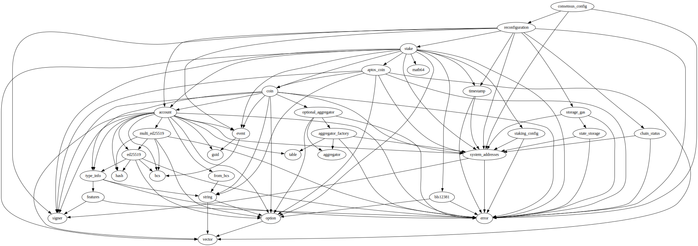
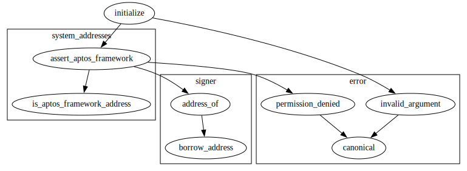

# Module `0x1::consensus_config`

Maintains the consensus config for the blockchain. The config is stored in a
Reconfiguration, and may be updated by root.

-  [Resource `ConsensusConfig`](#0x1_consensus_config_ConsensusConfig)
-  [Constants](#@Constants_0)
-  [Function `initialize`](#0x1_consensus_config_initialize)
-  [Function `set`](#0x1_consensus_config_set)
-  [Specification](#@Specification_1)
    -  [Function `set`](#@Specification_1_set)

<pre><code><b>use</b> <a href="../../aptos-stdlib/../move-stdlib/doc/error.md#0x1_error">0x1::error</a>;
<b>use</b> <a href="reconfiguration.md#0x1_reconfiguration">0x1::reconfiguration</a>;
<b>use</b> <a href="system_addresses.md#0x1_system_addresses">0x1::system_addresses</a>;
</code></pre>

Show all the modules that "consensus_config" depends on directly or indirectly

Show all the modules that depend on "consensus_config" directly or indirectly

## Resource `ConsensusConfig`

<pre><code><b>struct</b> <a href="consensus_config.md#0x1_consensus_config_ConsensusConfig">ConsensusConfig</a> <b>has</b> key
</code></pre>

Fields

<dl>
<dt>
<code>config: <a href="../../aptos-stdlib/../move-stdlib/doc/vector.md#0x1_vector">vector</a>&lt;u8&gt;</code>
</dt>
<dd>

</dd>
</dl>

## Constants

The provided on chain config bytes are empty or invalid

<pre><code><b>const</b> <a href="consensus_config.md#0x1_consensus_config_EINVALID_CONFIG">EINVALID_CONFIG</a>: u64 = 1;
</code></pre>

## Function `initialize`

Publishes the ConsensusConfig config.

<pre><code><b>public</b>(<b>friend</b>) <b>fun</b> <a href="consensus_config.md#0x1_consensus_config_initialize">initialize</a>(aptos_framework: &<a href="../../aptos-stdlib/../move-stdlib/doc/signer.md#0x1_signer">signer</a>, config: <a href="../../aptos-stdlib/../move-stdlib/doc/vector.md#0x1_vector">vector</a>&lt;u8&gt;)
</code></pre>

Implementation

<pre><code><b>public</b>(<b>friend</b>) <b>fun</b> <a href="consensus_config.md#0x1_consensus_config_initialize">initialize</a>(aptos_framework: &<a href="../../aptos-stdlib/../move-stdlib/doc/signer.md#0x1_signer">signer</a>, config: <a href="../../aptos-stdlib/../move-stdlib/doc/vector.md#0x1_vector">vector</a>&lt;u8&gt;) {
    <a href="system_addresses.md#0x1_system_addresses_assert_aptos_framework">system_addresses::assert_aptos_framework</a>(aptos_framework);
    <b>assert</b>!(<a href="../../aptos-stdlib/../move-stdlib/doc/vector.md#0x1_vector_length">vector::length</a>(&config) &gt; 0, <a href="../../aptos-stdlib/../move-stdlib/doc/error.md#0x1_error_invalid_argument">error::invalid_argument</a>(<a href="consensus_config.md#0x1_consensus_config_EINVALID_CONFIG">EINVALID_CONFIG</a>));
    <b>move_to</b>(aptos_framework, <a href="consensus_config.md#0x1_consensus_config_ConsensusConfig">ConsensusConfig</a> { config });
}
</code></pre>

Show all the functions that "initialize" calls

Show all the functions that call "initialize"

## Function `set`

This can be called by on-chain governance to update on-chain consensus configs.

<pre><code><b>public</b> <b>fun</b> <a href="consensus_config.md#0x1_consensus_config_set">set</a>(<a href="account.md#0x1_account">account</a>: &<a href="../../aptos-stdlib/../move-stdlib/doc/signer.md#0x1_signer">signer</a>, config: <a href="../../aptos-stdlib/../move-stdlib/doc/vector.md#0x1_vector">vector</a>&lt;u8&gt;)
</code></pre>

Implementation

<pre><code><b>public</b> <b>fun</b> <a href="consensus_config.md#0x1_consensus_config_set">set</a>(<a href="account.md#0x1_account">account</a>: &<a href="../../aptos-stdlib/../move-stdlib/doc/signer.md#0x1_signer">signer</a>, config: <a href="../../aptos-stdlib/../move-stdlib/doc/vector.md#0x1_vector">vector</a>&lt;u8&gt;) <b>acquires</b> <a href="consensus_config.md#0x1_consensus_config_ConsensusConfig">ConsensusConfig</a> {
    <a href="system_addresses.md#0x1_system_addresses_assert_aptos_framework">system_addresses::assert_aptos_framework</a>(<a href="account.md#0x1_account">account</a>);
    <b>assert</b>!(<a href="../../aptos-stdlib/../move-stdlib/doc/vector.md#0x1_vector_length">vector::length</a>(&config) &gt; 0, <a href="../../aptos-stdlib/../move-stdlib/doc/error.md#0x1_error_invalid_argument">error::invalid_argument</a>(<a href="consensus_config.md#0x1_consensus_config_EINVALID_CONFIG">EINVALID_CONFIG</a>));

    <b>let</b> config_ref = &<b>mut</b> <b>borrow_global_mut</b>&lt;<a href="consensus_config.md#0x1_consensus_config_ConsensusConfig">ConsensusConfig</a>&gt;(@aptos_framework).config;
    *config_ref = config;

    // Need <b>to</b> trigger <a href="reconfiguration.md#0x1_reconfiguration">reconfiguration</a> so validator nodes can sync on the updated configs.
    <a href="reconfiguration.md#0x1_reconfiguration_reconfigure">reconfiguration::reconfigure</a>();
}
</code></pre>

Show all the functions that "set" calls

Show all the functions that call "set"

## Specification

### Function `set`

<pre><code><b>public</b> <b>fun</b> <a href="consensus_config.md#0x1_consensus_config_set">set</a>(<a href="account.md#0x1_account">account</a>: &<a href="../../aptos-stdlib/../move-stdlib/doc/signer.md#0x1_signer">signer</a>, config: <a href="../../aptos-stdlib/../move-stdlib/doc/vector.md#0x1_vector">vector</a>&lt;u8&gt;)
</code></pre>

<pre><code><b>requires</b> <a href="chain_status.md#0x1_chain_status_is_operating">chain_status::is_operating</a>();
<b>requires</b> <a href="timestamp.md#0x1_timestamp_spec_now_microseconds">timestamp::spec_now_microseconds</a>() &gt;= <a href="reconfiguration.md#0x1_reconfiguration_last_reconfiguration_time">reconfiguration::last_reconfiguration_time</a>();
</code></pre>

[move-book]: https://move-language.github.io/move/introduction.html
