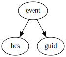

# Module `0x1::event`

The Event module defines an <code>EventHandleGenerator</code> that is used to create
<code><a href="event.md#0x1_event_EventHandle">EventHandle</a></code>s with unique GUIDs. It contains a counter for the number
of <code><a href="event.md#0x1_event_EventHandle">EventHandle</a></code>s it generates. An <code><a href="event.md#0x1_event_EventHandle">EventHandle</a></code> is used to count the number of
events emitted to a handle and emit events to the event store.

-  [Struct `EventHandle`](#0x1_event_EventHandle)
-  [Function `new_event_handle`](#0x1_event_new_event_handle)
-  [Function `emit_event`](#0x1_event_emit_event)
-  [Function `guid`](#0x1_event_guid)
-  [Function `counter`](#0x1_event_counter)
-  [Function `write_to_event_store`](#0x1_event_write_to_event_store)
-  [Function `destroy_handle`](#0x1_event_destroy_handle)
-  [Specification](#@Specification_0)
    -  [Function `emit_event`](#@Specification_0_emit_event)

<pre><code><b>use</b> <a href="../../aptos-stdlib/../move-stdlib/doc/bcs.md#0x1_bcs">0x1::bcs</a>;
<b>use</b> <a href="guid.md#0x1_guid">0x1::guid</a>;
</code></pre>

Show all the modules that "event" depends on directly or indirectly

Show all the modules that depend on "event" directly or indirectly

## Struct `EventHandle`

A handle for an event such that:
1. Other modules can emit events to this handle.
2. Storage can use this handle to prove the total number of events that happened in the past.

<pre><code><b>struct</b> <a href="event.md#0x1_event_EventHandle">EventHandle</a>&lt;T: drop, store&gt; <b>has</b> store
</code></pre>

Fields

<dl>
<dt>
<code>counter: u64</code>
</dt>
<dd>
 Total number of events emitted to this event stream.
</dd>
<dt>
<code><a href="guid.md#0x1_guid">guid</a>: <a href="guid.md#0x1_guid_GUID">guid::GUID</a></code>
</dt>
<dd>
 A globally unique ID for this event stream.
</dd>
</dl>

## Function `new_event_handle`

Use EventHandleGenerator to generate a unique event handle for <code>sig</code>

<pre><code><b>public</b>(<b>friend</b>) <b>fun</b> <a href="event.md#0x1_event_new_event_handle">new_event_handle</a>&lt;T: drop, store&gt;(<a href="guid.md#0x1_guid">guid</a>: <a href="guid.md#0x1_guid_GUID">guid::GUID</a>): <a href="event.md#0x1_event_EventHandle">event::EventHandle</a>&lt;T&gt;
</code></pre>

Implementation

<pre><code><b>public</b>(<b>friend</b>) <b>fun</b> <a href="event.md#0x1_event_new_event_handle">new_event_handle</a>&lt;T: drop + store&gt;(<a href="guid.md#0x1_guid">guid</a>: GUID): <a href="event.md#0x1_event_EventHandle">EventHandle</a>&lt;T&gt; {
    <a href="event.md#0x1_event_EventHandle">EventHandle</a>&lt;T&gt; {
        counter: 0,
        <a href="guid.md#0x1_guid">guid</a>,
    }
}
</code></pre>

Show all the functions that "new_event_handle" calls

Show all the functions that call "new_event_handle"

## Function `emit_event`

Emit an event with payload <code>msg</code> by using <code>handle_ref</code>'s key and counter.

<pre><code><b>public</b> <b>fun</b> <a href="event.md#0x1_event_emit_event">emit_event</a>&lt;T: drop, store&gt;(handle_ref: &<b>mut</b> <a href="event.md#0x1_event_EventHandle">event::EventHandle</a>&lt;T&gt;, msg: T)
</code></pre>

Implementation

<pre><code><b>public</b> <b>fun</b> <a href="event.md#0x1_event_emit_event">emit_event</a>&lt;T: drop + store&gt;(handle_ref: &<b>mut</b> <a href="event.md#0x1_event_EventHandle">EventHandle</a>&lt;T&gt;, msg: T) {
    <a href="event.md#0x1_event_write_to_event_store">write_to_event_store</a>&lt;T&gt;(<a href="../../aptos-stdlib/../move-stdlib/doc/bcs.md#0x1_bcs_to_bytes">bcs::to_bytes</a>(&handle_ref.<a href="guid.md#0x1_guid">guid</a>), handle_ref.counter, msg);
    <b>spec</b> {
        <b>assume</b> handle_ref.counter + 1 &lt;= MAX_U64;
    };
    handle_ref.counter = handle_ref.counter + 1;
}
</code></pre>

Show all the functions that "emit_event" calls

Show all the functions that call "emit_event"

## Function `guid`

Return the GUID associated with this EventHandle

<pre><code><b>public</b> <b>fun</b> <a href="guid.md#0x1_guid">guid</a>&lt;T: drop, store&gt;(handle_ref: &<a href="event.md#0x1_event_EventHandle">event::EventHandle</a>&lt;T&gt;): &<a href="guid.md#0x1_guid_GUID">guid::GUID</a>
</code></pre>

Implementation

<pre><code><b>public</b> <b>fun</b> <a href="guid.md#0x1_guid">guid</a>&lt;T: drop + store&gt;(handle_ref: &<a href="event.md#0x1_event_EventHandle">EventHandle</a>&lt;T&gt;): &GUID {
    &handle_ref.<a href="guid.md#0x1_guid">guid</a>
}
</code></pre>

Show all the functions that "guid" calls

Show all the functions that call "guid"

## Function `counter`

Return the current counter associated with this EventHandle

<pre><code><b>public</b> <b>fun</b> <a href="event.md#0x1_event_counter">counter</a>&lt;T: drop, store&gt;(handle_ref: &<a href="event.md#0x1_event_EventHandle">event::EventHandle</a>&lt;T&gt;): u64
</code></pre>

Implementation

<pre><code><b>public</b> <b>fun</b> <a href="event.md#0x1_event_counter">counter</a>&lt;T: drop + store&gt;(handle_ref: &<a href="event.md#0x1_event_EventHandle">EventHandle</a>&lt;T&gt;): u64 {
    handle_ref.counter
}
</code></pre>

Show all the functions that "counter" calls

Show all the functions that call "counter"

## Function `write_to_event_store`

Log <code>msg</code> as the <code>count</code>th event associated with the event stream identified by <code><a href="guid.md#0x1_guid">guid</a></code>

<pre><code><b>fun</b> <a href="event.md#0x1_event_write_to_event_store">write_to_event_store</a>&lt;T: drop, store&gt;(<a href="guid.md#0x1_guid">guid</a>: <a href="../../aptos-stdlib/../move-stdlib/doc/vector.md#0x1_vector">vector</a>&lt;u8&gt;, count: u64, msg: T)
</code></pre>

Implementation

<pre><code><b>native</b> <b>fun</b> <a href="event.md#0x1_event_write_to_event_store">write_to_event_store</a>&lt;T: drop + store&gt;(<a href="guid.md#0x1_guid">guid</a>: <a href="../../aptos-stdlib/../move-stdlib/doc/vector.md#0x1_vector">vector</a>&lt;u8&gt;, count: u64, msg: T);
</code></pre>

Show all the functions that "write_to_event_store" calls

Show all the functions that call "write_to_event_store"

## Function `destroy_handle`

Destroy a unique handle.

<pre><code><b>public</b> <b>fun</b> <a href="event.md#0x1_event_destroy_handle">destroy_handle</a>&lt;T: drop, store&gt;(handle: <a href="event.md#0x1_event_EventHandle">event::EventHandle</a>&lt;T&gt;)
</code></pre>

Implementation

<pre><code><b>public</b> <b>fun</b> <a href="event.md#0x1_event_destroy_handle">destroy_handle</a>&lt;T: drop + store&gt;(handle: <a href="event.md#0x1_event_EventHandle">EventHandle</a>&lt;T&gt;) {
    <a href="event.md#0x1_event_EventHandle">EventHandle</a>&lt;T&gt; { counter: _, <a href="guid.md#0x1_guid">guid</a>: _ } = handle;
}
</code></pre>

Show all the functions that "destroy_handle" calls

Show all the functions that call "destroy_handle"

## Specification

### Function `emit_event`

<pre><code><b>public</b> <b>fun</b> <a href="event.md#0x1_event_emit_event">emit_event</a>&lt;T: drop, store&gt;(handle_ref: &<b>mut</b> <a href="event.md#0x1_event_EventHandle">event::EventHandle</a>&lt;T&gt;, msg: T)
</code></pre>

<pre><code><b>pragma</b> opaque;
<b>aborts_if</b> [abstract] <b>false</b>;
</code></pre>

<pre><code><b>pragma</b> verify = <b>false</b>;
</code></pre>

[move-book]: https://move-language.github.io/move/introduction.html
