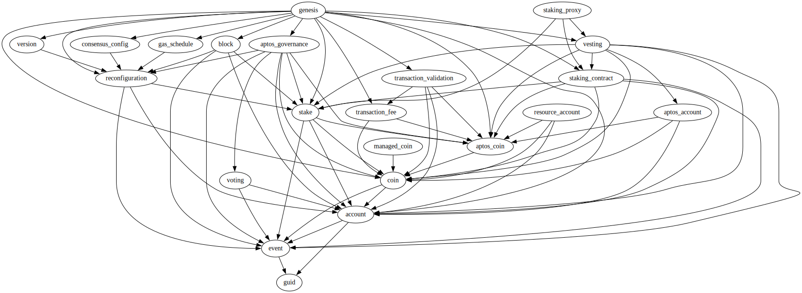

# Module `0x1::guid`

A module for generating globally unique identifiers

-  [Struct `GUID`](#0x1_guid_GUID)
-  [Struct `ID`](#0x1_guid_ID)
-  [Constants](#@Constants_0)
-  [Function `create`](#0x1_guid_create)
-  [Function `create_id`](#0x1_guid_create_id)
-  [Function `id`](#0x1_guid_id)
-  [Function `creator_address`](#0x1_guid_creator_address)
-  [Function `id_creator_address`](#0x1_guid_id_creator_address)
-  [Function `creation_num`](#0x1_guid_creation_num)
-  [Function `id_creation_num`](#0x1_guid_id_creation_num)
-  [Function `eq_id`](#0x1_guid_eq_id)

<pre><code></code></pre>

Show all the modules that "guid" depends on directly or indirectly

Show all the modules that depend on "guid" directly or indirectly

## Struct `GUID`

A globally unique identifier derived from the sender's address and a counter

<pre><code><b>struct</b> <a href="guid.md#0x1_guid_GUID">GUID</a> <b>has</b> drop, store
</code></pre>

Fields

<dl>
<dt>
<code>id: <a href="guid.md#0x1_guid_ID">guid::ID</a></code>
</dt>
<dd>

</dd>
</dl>

## Struct `ID`

A non-privileged identifier that can be freely created by anyone. Useful for looking up GUID's.

<pre><code><b>struct</b> <a href="guid.md#0x1_guid_ID">ID</a> <b>has</b> <b>copy</b>, drop, store
</code></pre>

Fields

<dl>
<dt>
<code>creation_num: u64</code>
</dt>
<dd>
 If creation_num is <code>i</code>, this is the <code>i+1</code>th GUID created by <code>addr</code>
</dd>
<dt>
<code>addr: <b>address</b></code>
</dt>
<dd>
 Address that created the GUID
</dd>
</dl>

## Constants

GUID generator must be published ahead of first usage of <code>create_with_capability</code> function.

<pre><code><b>const</b> <a href="guid.md#0x1_guid_EGUID_GENERATOR_NOT_PUBLISHED">EGUID_GENERATOR_NOT_PUBLISHED</a>: u64 = 0;
</code></pre>

## Function `create`

Create and return a new GUID from a trusted module.

<pre><code><b>public</b>(<b>friend</b>) <b>fun</b> <a href="guid.md#0x1_guid_create">create</a>(addr: <b>address</b>, creation_num_ref: &<b>mut</b> u64): <a href="guid.md#0x1_guid_GUID">guid::GUID</a>
</code></pre>

Implementation

<pre><code><b>public</b>(<b>friend</b>) <b>fun</b> <a href="guid.md#0x1_guid_create">create</a>(addr: <b>address</b>, creation_num_ref: &<b>mut</b> u64): <a href="guid.md#0x1_guid_GUID">GUID</a> {
    <b>let</b> creation_num = *creation_num_ref;
    *creation_num_ref = creation_num + 1;
    <a href="guid.md#0x1_guid_GUID">GUID</a> {
        id: <a href="guid.md#0x1_guid_ID">ID</a> {
            creation_num,
            addr,
        }
    }
}
</code></pre>

Show all the functions that "create" calls

Show all the functions that call "create"

## Function `create_id`

Create a non-privileged id from <code>addr</code> and <code>creation_num</code>

<pre><code><b>public</b> <b>fun</b> <a href="guid.md#0x1_guid_create_id">create_id</a>(addr: <b>address</b>, creation_num: u64): <a href="guid.md#0x1_guid_ID">guid::ID</a>
</code></pre>

Implementation

<pre><code><b>public</b> <b>fun</b> <a href="guid.md#0x1_guid_create_id">create_id</a>(addr: <b>address</b>, creation_num: u64): <a href="guid.md#0x1_guid_ID">ID</a> {
    <a href="guid.md#0x1_guid_ID">ID</a> { creation_num, addr }
}
</code></pre>

Show all the functions that "create_id" calls

Show all the functions that call "create_id"

## Function `id`

Get the non-privileged ID associated with a GUID

<pre><code><b>public</b> <b>fun</b> <a href="guid.md#0x1_guid_id">id</a>(<a href="guid.md#0x1_guid">guid</a>: &<a href="guid.md#0x1_guid_GUID">guid::GUID</a>): <a href="guid.md#0x1_guid_ID">guid::ID</a>
</code></pre>

Implementation

<pre><code><b>public</b> <b>fun</b> <a href="guid.md#0x1_guid_id">id</a>(<a href="guid.md#0x1_guid">guid</a>: &<a href="guid.md#0x1_guid_GUID">GUID</a>): <a href="guid.md#0x1_guid_ID">ID</a> {
    *&<a href="guid.md#0x1_guid">guid</a>.id
}
</code></pre>

Show all the functions that "id" calls

Show all the functions that call "id"

## Function `creator_address`

Return the account address that created the GUID

<pre><code><b>public</b> <b>fun</b> <a href="guid.md#0x1_guid_creator_address">creator_address</a>(<a href="guid.md#0x1_guid">guid</a>: &<a href="guid.md#0x1_guid_GUID">guid::GUID</a>): <b>address</b>
</code></pre>

Implementation

<pre><code><b>public</b> <b>fun</b> <a href="guid.md#0x1_guid_creator_address">creator_address</a>(<a href="guid.md#0x1_guid">guid</a>: &<a href="guid.md#0x1_guid_GUID">GUID</a>): <b>address</b> {
    <a href="guid.md#0x1_guid">guid</a>.id.addr
}
</code></pre>

Show all the functions that "creator_address" calls

Show all the functions that call "creator_address"

## Function `id_creator_address`

Return the account address that created the guid::ID

<pre><code><b>public</b> <b>fun</b> <a href="guid.md#0x1_guid_id_creator_address">id_creator_address</a>(id: &<a href="guid.md#0x1_guid_ID">guid::ID</a>): <b>address</b>
</code></pre>

Implementation

<pre><code><b>public</b> <b>fun</b> <a href="guid.md#0x1_guid_id_creator_address">id_creator_address</a>(id: &<a href="guid.md#0x1_guid_ID">ID</a>): <b>address</b> {
    id.addr
}
</code></pre>

Show all the functions that "id_creator_address" calls

Show all the functions that call "id_creator_address"

## Function `creation_num`

Return the creation number associated with the GUID

<pre><code><b>public</b> <b>fun</b> <a href="guid.md#0x1_guid_creation_num">creation_num</a>(<a href="guid.md#0x1_guid">guid</a>: &<a href="guid.md#0x1_guid_GUID">guid::GUID</a>): u64
</code></pre>

Implementation

<pre><code><b>public</b> <b>fun</b> <a href="guid.md#0x1_guid_creation_num">creation_num</a>(<a href="guid.md#0x1_guid">guid</a>: &<a href="guid.md#0x1_guid_GUID">GUID</a>): u64 {
    <a href="guid.md#0x1_guid">guid</a>.id.creation_num
}
</code></pre>

Show all the functions that "creation_num" calls

Show all the functions that call "creation_num"

## Function `id_creation_num`

Return the creation number associated with the guid::ID

<pre><code><b>public</b> <b>fun</b> <a href="guid.md#0x1_guid_id_creation_num">id_creation_num</a>(id: &<a href="guid.md#0x1_guid_ID">guid::ID</a>): u64
</code></pre>

Implementation

<pre><code><b>public</b> <b>fun</b> <a href="guid.md#0x1_guid_id_creation_num">id_creation_num</a>(id: &<a href="guid.md#0x1_guid_ID">ID</a>): u64 {
    id.creation_num
}
</code></pre>

Show all the functions that "id_creation_num" calls

Show all the functions that call "id_creation_num"

## Function `eq_id`

Return true if the GUID's ID is <code>id</code>

<pre><code><b>public</b> <b>fun</b> <a href="guid.md#0x1_guid_eq_id">eq_id</a>(<a href="guid.md#0x1_guid">guid</a>: &<a href="guid.md#0x1_guid_GUID">guid::GUID</a>, id: &<a href="guid.md#0x1_guid_ID">guid::ID</a>): bool
</code></pre>

Implementation

<pre><code><b>public</b> <b>fun</b> <a href="guid.md#0x1_guid_eq_id">eq_id</a>(<a href="guid.md#0x1_guid">guid</a>: &<a href="guid.md#0x1_guid_GUID">GUID</a>, id: &<a href="guid.md#0x1_guid_ID">ID</a>): bool {
    &<a href="guid.md#0x1_guid">guid</a>.id == id
}
</code></pre>

Show all the functions that "eq_id" calls

Show all the functions that call "eq_id"

[move-book]: https://move-language.github.io/move/introduction.html
