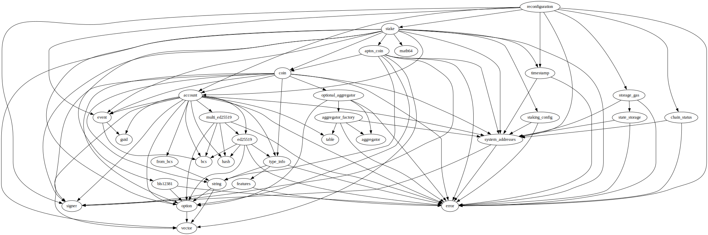
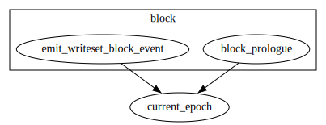
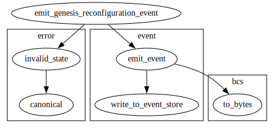

# Module `0x1::reconfiguration`

Publishes configuration information for validators, and issues reconfiguration events
to synchronize configuration changes for the validators.

-  [Struct `NewEpochEvent`](#0x1_reconfiguration_NewEpochEvent)
-  [Resource `Configuration`](#0x1_reconfiguration_Configuration)
-  [Resource `DisableReconfiguration`](#0x1_reconfiguration_DisableReconfiguration)
-  [Constants](#@Constants_0)
-  [Function `initialize`](#0x1_reconfiguration_initialize)
-  [Function `disable_reconfiguration`](#0x1_reconfiguration_disable_reconfiguration)
-  [Function `enable_reconfiguration`](#0x1_reconfiguration_enable_reconfiguration)
-  [Function `reconfiguration_enabled`](#0x1_reconfiguration_reconfiguration_enabled)
-  [Function `reconfigure`](#0x1_reconfiguration_reconfigure)
-  [Function `last_reconfiguration_time`](#0x1_reconfiguration_last_reconfiguration_time)
-  [Function `current_epoch`](#0x1_reconfiguration_current_epoch)
-  [Function `emit_genesis_reconfiguration_event`](#0x1_reconfiguration_emit_genesis_reconfiguration_event)
-  [Specification](#@Specification_1)
    -  [Function `reconfigure`](#@Specification_1_reconfigure)

<pre><code><b>use</b> <a href="account.md#0x1_account">0x1::account</a>;
<b>use</b> <a href="chain_status.md#0x1_chain_status">0x1::chain_status</a>;
<b>use</b> <a href="../../aptos-stdlib/../move-stdlib/doc/error.md#0x1_error">0x1::error</a>;
<b>use</b> <a href="event.md#0x1_event">0x1::event</a>;
<b>use</b> <a href="../../aptos-stdlib/../move-stdlib/doc/signer.md#0x1_signer">0x1::signer</a>;
<b>use</b> <a href="stake.md#0x1_stake">0x1::stake</a>;
<b>use</b> <a href="storage_gas.md#0x1_storage_gas">0x1::storage_gas</a>;
<b>use</b> <a href="system_addresses.md#0x1_system_addresses">0x1::system_addresses</a>;
<b>use</b> <a href="timestamp.md#0x1_timestamp">0x1::timestamp</a>;
</code></pre>

Show all the modules that "reconfiguration" depends on directly or indirectly

Show all the modules that depend on "reconfiguration" directly or indirectly

## Struct `NewEpochEvent`

Event that signals consensus to start a new epoch,
with new configuration information. This is also called a
"reconfiguration event"

<pre><code><b>struct</b> <a href="reconfiguration.md#0x1_reconfiguration_NewEpochEvent">NewEpochEvent</a> <b>has</b> drop, store
</code></pre>

Fields

<dl>
<dt>
<code>epoch: u64</code>
</dt>
<dd>

</dd>
</dl>

## Resource `Configuration`

Holds information about state of reconfiguration

<pre><code><b>struct</b> <a href="reconfiguration.md#0x1_reconfiguration_Configuration">Configuration</a> <b>has</b> key
</code></pre>

Fields

<dl>
<dt>
<code>epoch: u64</code>
</dt>
<dd>
 Epoch number
</dd>
<dt>
<code>last_reconfiguration_time: u64</code>
</dt>
<dd>
 Time of last reconfiguration. Only changes on reconfiguration events.
</dd>
<dt>
<code>events: <a href="event.md#0x1_event_EventHandle">event::EventHandle</a>&lt;<a href="reconfiguration.md#0x1_reconfiguration_NewEpochEvent">reconfiguration::NewEpochEvent</a>&gt;</code>
</dt>
<dd>
 Event handle for reconfiguration events
</dd>
</dl>

## Resource `DisableReconfiguration`

Reconfiguration will be disabled if this resource is published under the
aptos_framework system address

<pre><code><b>struct</b> <a href="reconfiguration.md#0x1_reconfiguration_DisableReconfiguration">DisableReconfiguration</a> <b>has</b> key
</code></pre>

Fields

<dl>
<dt>
<code>dummy_field: bool</code>
</dt>
<dd>

</dd>
</dl>

## Constants

A <code>Reconfiguration</code> resource is in an invalid state

<pre><code><b>const</b> <a href="reconfiguration.md#0x1_reconfiguration_ECONFIG">ECONFIG</a>: u64 = 2;
</code></pre>

The <code><a href="reconfiguration.md#0x1_reconfiguration_Configuration">Configuration</a></code> resource is in an invalid state

<pre><code><b>const</b> <a href="reconfiguration.md#0x1_reconfiguration_ECONFIGURATION">ECONFIGURATION</a>: u64 = 1;
</code></pre>

An invalid block time was encountered.

<pre><code><b>const</b> <a href="reconfiguration.md#0x1_reconfiguration_EINVALID_BLOCK_TIME">EINVALID_BLOCK_TIME</a>: u64 = 4;
</code></pre>

An invalid block time was encountered.

<pre><code><b>const</b> <a href="reconfiguration.md#0x1_reconfiguration_EINVALID_GUID_FOR_EVENT">EINVALID_GUID_FOR_EVENT</a>: u64 = 5;
</code></pre>

A <code>ModifyConfigCapability</code> is in a different state than was expected

<pre><code><b>const</b> <a href="reconfiguration.md#0x1_reconfiguration_EMODIFY_CAPABILITY">EMODIFY_CAPABILITY</a>: u64 = 3;
</code></pre>

## Function `initialize`

Only called during genesis.
Publishes <code><a href="reconfiguration.md#0x1_reconfiguration_Configuration">Configuration</a></code> resource. Can only be invoked by aptos framework account, and only a single time in Genesis.

<pre><code><b>public</b>(<b>friend</b>) <b>fun</b> <a href="reconfiguration.md#0x1_reconfiguration_initialize">initialize</a>(aptos_framework: &<a href="../../aptos-stdlib/../move-stdlib/doc/signer.md#0x1_signer">signer</a>)
</code></pre>

Implementation

<pre><code><b>public</b>(<b>friend</b>) <b>fun</b> <a href="reconfiguration.md#0x1_reconfiguration_initialize">initialize</a>(aptos_framework: &<a href="../../aptos-stdlib/../move-stdlib/doc/signer.md#0x1_signer">signer</a>) {
    <a href="system_addresses.md#0x1_system_addresses_assert_aptos_framework">system_addresses::assert_aptos_framework</a>(aptos_framework);

    // <b>assert</b> it matches `new_epoch_event_key()`, otherwise the <a href="event.md#0x1_event">event</a> can't be recognized
    <b>assert</b>!(<a href="account.md#0x1_account_get_guid_next_creation_num">account::get_guid_next_creation_num</a>(<a href="../../aptos-stdlib/../move-stdlib/doc/signer.md#0x1_signer_address_of">signer::address_of</a>(aptos_framework)) == 2, <a href="../../aptos-stdlib/../move-stdlib/doc/error.md#0x1_error_invalid_state">error::invalid_state</a>(<a href="reconfiguration.md#0x1_reconfiguration_EINVALID_GUID_FOR_EVENT">EINVALID_GUID_FOR_EVENT</a>));
    <b>move_to</b>&lt;<a href="reconfiguration.md#0x1_reconfiguration_Configuration">Configuration</a>&gt;(
        aptos_framework,
        <a href="reconfiguration.md#0x1_reconfiguration_Configuration">Configuration</a> {
            epoch: 0,
            last_reconfiguration_time: 0,
            events: <a href="account.md#0x1_account_new_event_handle">account::new_event_handle</a>&lt;<a href="reconfiguration.md#0x1_reconfiguration_NewEpochEvent">NewEpochEvent</a>&gt;(aptos_framework),
        }
    );
}
</code></pre>

Show all the functions that "initialize" calls

Show all the functions that call "initialize"

## Function `disable_reconfiguration`

Private function to temporarily halt reconfiguration.
This function should only be used for offline WriteSet generation purpose and should never be invoked on chain.

<pre><code><b>fun</b> <a href="reconfiguration.md#0x1_reconfiguration_disable_reconfiguration">disable_reconfiguration</a>(aptos_framework: &<a href="../../aptos-stdlib/../move-stdlib/doc/signer.md#0x1_signer">signer</a>)
</code></pre>

Implementation

<pre><code><b>fun</b> <a href="reconfiguration.md#0x1_reconfiguration_disable_reconfiguration">disable_reconfiguration</a>(aptos_framework: &<a href="../../aptos-stdlib/../move-stdlib/doc/signer.md#0x1_signer">signer</a>) {
    <a href="system_addresses.md#0x1_system_addresses_assert_aptos_framework">system_addresses::assert_aptos_framework</a>(aptos_framework);
    <b>assert</b>!(<a href="reconfiguration.md#0x1_reconfiguration_reconfiguration_enabled">reconfiguration_enabled</a>(), <a href="../../aptos-stdlib/../move-stdlib/doc/error.md#0x1_error_invalid_state">error::invalid_state</a>(<a href="reconfiguration.md#0x1_reconfiguration_ECONFIGURATION">ECONFIGURATION</a>));
    <b>move_to</b>(aptos_framework, <a href="reconfiguration.md#0x1_reconfiguration_DisableReconfiguration">DisableReconfiguration</a> {})
}
</code></pre>

Show all the functions that "disable_reconfiguration" calls

Show all the functions that call "disable_reconfiguration"

## Function `enable_reconfiguration`

Private function to resume reconfiguration.
This function should only be used for offline WriteSet generation purpose and should never be invoked on chain.

<pre><code><b>fun</b> <a href="reconfiguration.md#0x1_reconfiguration_enable_reconfiguration">enable_reconfiguration</a>(aptos_framework: &<a href="../../aptos-stdlib/../move-stdlib/doc/signer.md#0x1_signer">signer</a>)
</code></pre>

Implementation

<pre><code><b>fun</b> <a href="reconfiguration.md#0x1_reconfiguration_enable_reconfiguration">enable_reconfiguration</a>(aptos_framework: &<a href="../../aptos-stdlib/../move-stdlib/doc/signer.md#0x1_signer">signer</a>) <b>acquires</b> <a href="reconfiguration.md#0x1_reconfiguration_DisableReconfiguration">DisableReconfiguration</a> {
    <a href="system_addresses.md#0x1_system_addresses_assert_aptos_framework">system_addresses::assert_aptos_framework</a>(aptos_framework);

    <b>assert</b>!(!<a href="reconfiguration.md#0x1_reconfiguration_reconfiguration_enabled">reconfiguration_enabled</a>(), <a href="../../aptos-stdlib/../move-stdlib/doc/error.md#0x1_error_invalid_state">error::invalid_state</a>(<a href="reconfiguration.md#0x1_reconfiguration_ECONFIGURATION">ECONFIGURATION</a>));
    <a href="reconfiguration.md#0x1_reconfiguration_DisableReconfiguration">DisableReconfiguration</a> {} = <b>move_from</b>&lt;<a href="reconfiguration.md#0x1_reconfiguration_DisableReconfiguration">DisableReconfiguration</a>&gt;(<a href="../../aptos-stdlib/../move-stdlib/doc/signer.md#0x1_signer_address_of">signer::address_of</a>(aptos_framework));
}
</code></pre>

Show all the functions that "enable_reconfiguration" calls

Show all the functions that call "enable_reconfiguration"

## Function `reconfiguration_enabled`

<pre><code><b>fun</b> <a href="reconfiguration.md#0x1_reconfiguration_reconfiguration_enabled">reconfiguration_enabled</a>(): bool
</code></pre>

Implementation

<pre><code><b>fun</b> <a href="reconfiguration.md#0x1_reconfiguration_reconfiguration_enabled">reconfiguration_enabled</a>(): bool {
    !<b>exists</b>&lt;<a href="reconfiguration.md#0x1_reconfiguration_DisableReconfiguration">DisableReconfiguration</a>&gt;(@aptos_framework)
}
</code></pre>

Show all the functions that "reconfiguration_enabled" calls

Show all the functions that call "reconfiguration_enabled"

## Function `reconfigure`

Signal validators to start using new configuration. Must be called from friend config modules.

<pre><code><b>public</b>(<b>friend</b>) <b>fun</b> <a href="reconfiguration.md#0x1_reconfiguration_reconfigure">reconfigure</a>()
</code></pre>

Implementation

<pre><code><b>public</b>(<b>friend</b>) <b>fun</b> <a href="reconfiguration.md#0x1_reconfiguration_reconfigure">reconfigure</a>() <b>acquires</b> <a href="reconfiguration.md#0x1_reconfiguration_Configuration">Configuration</a> {
    // Do not do anything <b>if</b> <a href="genesis.md#0x1_genesis">genesis</a> <b>has</b> not finished.
    <b>if</b> (<a href="chain_status.md#0x1_chain_status_is_genesis">chain_status::is_genesis</a>() || <a href="timestamp.md#0x1_timestamp_now_microseconds">timestamp::now_microseconds</a>() == 0 || !<a href="reconfiguration.md#0x1_reconfiguration_reconfiguration_enabled">reconfiguration_enabled</a>()) {
        <b>return</b>
    };

    <b>let</b> config_ref = <b>borrow_global_mut</b>&lt;<a href="reconfiguration.md#0x1_reconfiguration_Configuration">Configuration</a>&gt;(@aptos_framework);
    <b>let</b> current_time = <a href="timestamp.md#0x1_timestamp_now_microseconds">timestamp::now_microseconds</a>();

    // Do not do anything <b>if</b> a <a href="reconfiguration.md#0x1_reconfiguration">reconfiguration</a> <a href="event.md#0x1_event">event</a> is already emitted within this transaction.
    //
    // This is OK because:
    // - The time changes in every non-empty <a href="block.md#0x1_block">block</a>
    // - A <a href="block.md#0x1_block">block</a> automatically ends after a transaction that <b>emits</b> a <a href="reconfiguration.md#0x1_reconfiguration">reconfiguration</a> <a href="event.md#0x1_event">event</a>, which is guaranteed by
    //   VM <b>spec</b> that all transactions comming after a <a href="reconfiguration.md#0x1_reconfiguration">reconfiguration</a> transaction will be returned <b>as</b> Retry
    //   status.
    // - Each transaction must emit at most one <a href="reconfiguration.md#0x1_reconfiguration">reconfiguration</a> <a href="event.md#0x1_event">event</a>
    //
    // Thus, this check <b>ensures</b> that a transaction that does multiple "<a href="reconfiguration.md#0x1_reconfiguration">reconfiguration</a> required" actions <b>emits</b> only
    // one <a href="reconfiguration.md#0x1_reconfiguration">reconfiguration</a> <a href="event.md#0x1_event">event</a>.
    //
    <b>if</b> (current_time == config_ref.last_reconfiguration_time) {
        <b>return</b>
    };

    // Call <a href="stake.md#0x1_stake">stake</a> <b>to</b> compute the new validator set and distribute rewards.
    <a href="stake.md#0x1_stake_on_new_epoch">stake::on_new_epoch</a>();
    <a href="storage_gas.md#0x1_storage_gas_on_reconfig">storage_gas::on_reconfig</a>();

    <b>assert</b>!(current_time &gt; config_ref.last_reconfiguration_time, <a href="../../aptos-stdlib/../move-stdlib/doc/error.md#0x1_error_invalid_state">error::invalid_state</a>(<a href="reconfiguration.md#0x1_reconfiguration_EINVALID_BLOCK_TIME">EINVALID_BLOCK_TIME</a>));
    config_ref.last_reconfiguration_time = current_time;
    <b>spec</b> {
        <b>assume</b> config_ref.epoch + 1 &lt;= MAX_U64;
    };
    config_ref.epoch = config_ref.epoch + 1;

    <a href="event.md#0x1_event_emit_event">event::emit_event</a>&lt;<a href="reconfiguration.md#0x1_reconfiguration_NewEpochEvent">NewEpochEvent</a>&gt;(
        &<b>mut</b> config_ref.events,
        <a href="reconfiguration.md#0x1_reconfiguration_NewEpochEvent">NewEpochEvent</a> {
            epoch: config_ref.epoch,
        },
    );
}
</code></pre>

Show all the functions that "reconfigure" calls

Show all the functions that call "reconfigure"

## Function `last_reconfiguration_time`

<pre><code><b>public</b> <b>fun</b> <a href="reconfiguration.md#0x1_reconfiguration_last_reconfiguration_time">last_reconfiguration_time</a>(): u64
</code></pre>

Implementation

<pre><code><b>public</b> <b>fun</b> <a href="reconfiguration.md#0x1_reconfiguration_last_reconfiguration_time">last_reconfiguration_time</a>(): u64 <b>acquires</b> <a href="reconfiguration.md#0x1_reconfiguration_Configuration">Configuration</a> {
    <b>borrow_global</b>&lt;<a href="reconfiguration.md#0x1_reconfiguration_Configuration">Configuration</a>&gt;(@aptos_framework).last_reconfiguration_time
}
</code></pre>

Show all the functions that "last_reconfiguration_time" calls

Show all the functions that call "last_reconfiguration_time"

## Function `current_epoch`

<pre><code><b>public</b> <b>fun</b> <a href="reconfiguration.md#0x1_reconfiguration_current_epoch">current_epoch</a>(): u64
</code></pre>

Implementation

<pre><code><b>public</b> <b>fun</b> <a href="reconfiguration.md#0x1_reconfiguration_current_epoch">current_epoch</a>(): u64 <b>acquires</b> <a href="reconfiguration.md#0x1_reconfiguration_Configuration">Configuration</a> {
    <b>borrow_global</b>&lt;<a href="reconfiguration.md#0x1_reconfiguration_Configuration">Configuration</a>&gt;(@aptos_framework).epoch
}
</code></pre>

Show all the functions that "current_epoch" calls

Show all the functions that call "current_epoch"

## Function `emit_genesis_reconfiguration_event`

Emit a <code><a href="reconfiguration.md#0x1_reconfiguration_NewEpochEvent">NewEpochEvent</a></code> event. This function will be invoked by genesis directly to generate the very first
reconfiguration event.

<pre><code><b>fun</b> <a href="reconfiguration.md#0x1_reconfiguration_emit_genesis_reconfiguration_event">emit_genesis_reconfiguration_event</a>()
</code></pre>

Implementation

<pre><code><b>fun</b> <a href="reconfiguration.md#0x1_reconfiguration_emit_genesis_reconfiguration_event">emit_genesis_reconfiguration_event</a>() <b>acquires</b> <a href="reconfiguration.md#0x1_reconfiguration_Configuration">Configuration</a> {
    <b>let</b> config_ref = <b>borrow_global_mut</b>&lt;<a href="reconfiguration.md#0x1_reconfiguration_Configuration">Configuration</a>&gt;(@aptos_framework);
    <b>assert</b>!(config_ref.epoch == 0 && config_ref.last_reconfiguration_time == 0, <a href="../../aptos-stdlib/../move-stdlib/doc/error.md#0x1_error_invalid_state">error::invalid_state</a>(<a href="reconfiguration.md#0x1_reconfiguration_ECONFIGURATION">ECONFIGURATION</a>));
    config_ref.epoch = 1;

    <a href="event.md#0x1_event_emit_event">event::emit_event</a>&lt;<a href="reconfiguration.md#0x1_reconfiguration_NewEpochEvent">NewEpochEvent</a>&gt;(
        &<b>mut</b> config_ref.events,
        <a href="reconfiguration.md#0x1_reconfiguration_NewEpochEvent">NewEpochEvent</a> {
            epoch: config_ref.epoch,
        },
    );
}
</code></pre>

Show all the functions that "emit_genesis_reconfiguration_event" calls

Show all the functions that call "emit_genesis_reconfiguration_event"

## Specification

<pre><code><b>invariant</b> [suspendable] <a href="chain_status.md#0x1_chain_status_is_operating">chain_status::is_operating</a>() ==&gt; <b>exists</b>&lt;<a href="reconfiguration.md#0x1_reconfiguration_Configuration">Configuration</a>&gt;(@aptos_framework);
<b>invariant</b> [suspendable] <a href="chain_status.md#0x1_chain_status_is_operating">chain_status::is_operating</a>() ==&gt;
    (<a href="timestamp.md#0x1_timestamp_spec_now_microseconds">timestamp::spec_now_microseconds</a>() &gt;= <a href="reconfiguration.md#0x1_reconfiguration_last_reconfiguration_time">last_reconfiguration_time</a>());
</code></pre>

### Function `reconfigure`

<pre><code><b>public</b>(<b>friend</b>) <b>fun</b> <a href="reconfiguration.md#0x1_reconfiguration_reconfigure">reconfigure</a>()
</code></pre>

<pre><code><b>aborts_if</b> <b>false</b>;
</code></pre>

[move-book]: https://move-language.github.io/move/introduction.html
