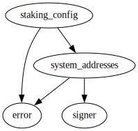
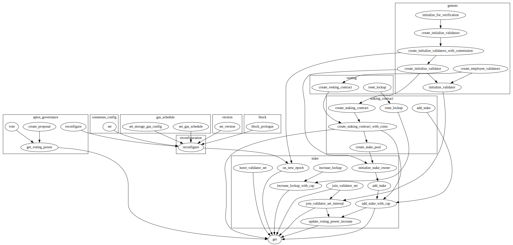
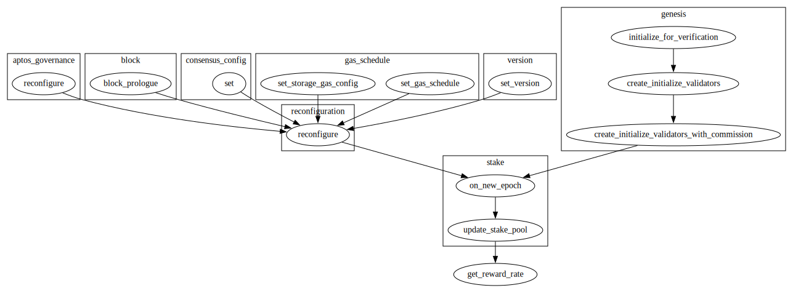
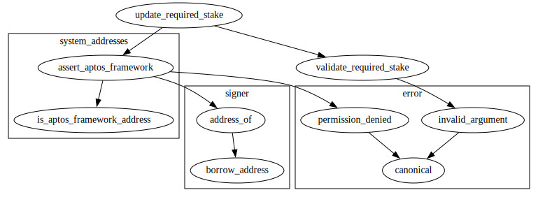
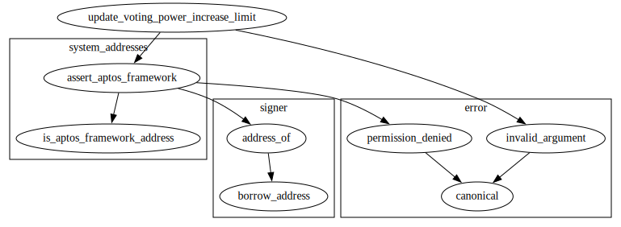
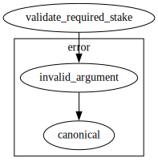

# Module `0x1::staking_config`

Provides the configuration for staking and rewards

-  [Resource `StakingConfig`](#0x1_staking_config_StakingConfig)
-  [Constants](#@Constants_0)
-  [Function `initialize`](#0x1_staking_config_initialize)
-  [Function `get`](#0x1_staking_config_get)
-  [Function `get_allow_validator_set_change`](#0x1_staking_config_get_allow_validator_set_change)
-  [Function `get_required_stake`](#0x1_staking_config_get_required_stake)
-  [Function `get_recurring_lockup_duration`](#0x1_staking_config_get_recurring_lockup_duration)
-  [Function `get_reward_rate`](#0x1_staking_config_get_reward_rate)
-  [Function `get_voting_power_increase_limit`](#0x1_staking_config_get_voting_power_increase_limit)
-  [Function `update_required_stake`](#0x1_staking_config_update_required_stake)
-  [Function `update_recurring_lockup_duration_secs`](#0x1_staking_config_update_recurring_lockup_duration_secs)
-  [Function `update_rewards_rate`](#0x1_staking_config_update_rewards_rate)
-  [Function `update_voting_power_increase_limit`](#0x1_staking_config_update_voting_power_increase_limit)
-  [Function `validate_required_stake`](#0x1_staking_config_validate_required_stake)
-  [Specification](#@Specification_1)
    -  [Resource `StakingConfig`](#@Specification_1_StakingConfig)

<pre><code><b>use</b> <a href="../../aptos-stdlib/../move-stdlib/doc/error.md#0x1_error">0x1::error</a>;
<b>use</b> <a href="system_addresses.md#0x1_system_addresses">0x1::system_addresses</a>;
</code></pre>

Show all the modules that "staking_config" depends on directly or indirectly

Show all the modules that depend on "staking_config" directly or indirectly

## Resource `StakingConfig`

Validator set configurations that will be stored with the @aptos_framework account.

<pre><code><b>struct</b> <a href="staking_config.md#0x1_staking_config_StakingConfig">StakingConfig</a> <b>has</b> <b>copy</b>, drop, key
</code></pre>

Fields

<dl>
<dt>
<code>minimum_stake: u64</code>
</dt>
<dd>

</dd>
<dt>
<code>maximum_stake: u64</code>
</dt>
<dd>

</dd>
<dt>
<code>recurring_lockup_duration_secs: u64</code>
</dt>
<dd>

</dd>
<dt>
<code>allow_validator_set_change: bool</code>
</dt>
<dd>

</dd>
<dt>
<code>rewards_rate: u64</code>
</dt>
<dd>

</dd>
<dt>
<code>rewards_rate_denominator: u64</code>
</dt>
<dd>

</dd>
<dt>
<code>voting_power_increase_limit: u64</code>
</dt>
<dd>

</dd>
</dl>

## Constants

Specified rewards rate is invalid, which must be within [0, MAX_REWARDS_RATE].

<pre><code><b>const</b> <a href="staking_config.md#0x1_staking_config_EINVALID_REWARDS_RATE">EINVALID_REWARDS_RATE</a>: u64 = 5;
</code></pre>

Specified stake range is invalid. Max must be greater than min.

<pre><code><b>const</b> <a href="staking_config.md#0x1_staking_config_EINVALID_STAKE_RANGE">EINVALID_STAKE_RANGE</a>: u64 = 3;
</code></pre>

The voting power increase limit percentage must be within (0, 50].

<pre><code><b>const</b> <a href="staking_config.md#0x1_staking_config_EINVALID_VOTING_POWER_INCREASE_LIMIT">EINVALID_VOTING_POWER_INCREASE_LIMIT</a>: u64 = 4;
</code></pre>

Stake lockup duration cannot be zero.

<pre><code><b>const</b> <a href="staking_config.md#0x1_staking_config_EZERO_LOCKUP_DURATION">EZERO_LOCKUP_DURATION</a>: u64 = 1;
</code></pre>

Reward rate denominator cannot be zero.

<pre><code><b>const</b> <a href="staking_config.md#0x1_staking_config_EZERO_REWARDS_RATE_DENOMINATOR">EZERO_REWARDS_RATE_DENOMINATOR</a>: u64 = 2;
</code></pre>

Limit the maximum value of <code>rewards_rate</code> in order to avoid any arithmetic overflow.

<pre><code><b>const</b> <a href="staking_config.md#0x1_staking_config_MAX_REWARDS_RATE">MAX_REWARDS_RATE</a>: u64 = 1000000;
</code></pre>

## Function `initialize`

Only called during genesis.

<pre><code><b>public</b>(<b>friend</b>) <b>fun</b> <a href="staking_config.md#0x1_staking_config_initialize">initialize</a>(aptos_framework: &<a href="../../aptos-stdlib/../move-stdlib/doc/signer.md#0x1_signer">signer</a>, minimum_stake: u64, maximum_stake: u64, recurring_lockup_duration_secs: u64, allow_validator_set_change: bool, rewards_rate: u64, rewards_rate_denominator: u64, voting_power_increase_limit: u64)
</code></pre>

Implementation

<pre><code><b>public</b>(<b>friend</b>) <b>fun</b> <a href="staking_config.md#0x1_staking_config_initialize">initialize</a>(
    aptos_framework: &<a href="../../aptos-stdlib/../move-stdlib/doc/signer.md#0x1_signer">signer</a>,
    minimum_stake: u64,
    maximum_stake: u64,
    recurring_lockup_duration_secs: u64,
    allow_validator_set_change: bool,
    rewards_rate: u64,
    rewards_rate_denominator: u64,
    voting_power_increase_limit: u64,
) {
    <a href="system_addresses.md#0x1_system_addresses_assert_aptos_framework">system_addresses::assert_aptos_framework</a>(aptos_framework);

    // This can fail <a href="genesis.md#0x1_genesis">genesis</a> but is necessary so that <a href="../../aptos-stdlib/doc/any.md#0x1_any">any</a> misconfigurations can be corrected before <a href="genesis.md#0x1_genesis">genesis</a> succeeds
    <a href="staking_config.md#0x1_staking_config_validate_required_stake">validate_required_stake</a>(minimum_stake, maximum_stake);

    <b>assert</b>!(recurring_lockup_duration_secs &gt; 0, <a href="../../aptos-stdlib/../move-stdlib/doc/error.md#0x1_error_invalid_argument">error::invalid_argument</a>(<a href="staking_config.md#0x1_staking_config_EZERO_LOCKUP_DURATION">EZERO_LOCKUP_DURATION</a>));
    <b>assert</b>!(
        rewards_rate_denominator &gt; 0,
        <a href="../../aptos-stdlib/../move-stdlib/doc/error.md#0x1_error_invalid_argument">error::invalid_argument</a>(<a href="staking_config.md#0x1_staking_config_EZERO_REWARDS_RATE_DENOMINATOR">EZERO_REWARDS_RATE_DENOMINATOR</a>),
    );
    <b>assert</b>!(
        voting_power_increase_limit &gt; 0 && voting_power_increase_limit &lt;= 50,
        <a href="../../aptos-stdlib/../move-stdlib/doc/error.md#0x1_error_invalid_argument">error::invalid_argument</a>(<a href="staking_config.md#0x1_staking_config_EINVALID_VOTING_POWER_INCREASE_LIMIT">EINVALID_VOTING_POWER_INCREASE_LIMIT</a>),
    );

    // `rewards_rate` which is the numerator is limited <b>to</b> be `&lt;= <a href="staking_config.md#0x1_staking_config_MAX_REWARDS_RATE">MAX_REWARDS_RATE</a>` in order <b>to</b> avoid the arithmetic
    // overflow in the rewards calculation. `rewards_rate_denominator` can be adjusted <b>to</b> get the desired rewards
    // rate (i.e., rewards_rate / rewards_rate_denominator).
    <b>assert</b>!(rewards_rate &lt;= <a href="staking_config.md#0x1_staking_config_MAX_REWARDS_RATE">MAX_REWARDS_RATE</a>, <a href="../../aptos-stdlib/../move-stdlib/doc/error.md#0x1_error_invalid_argument">error::invalid_argument</a>(<a href="staking_config.md#0x1_staking_config_EINVALID_REWARDS_RATE">EINVALID_REWARDS_RATE</a>));

    // We <b>assert</b> that (rewards_rate / rewards_rate_denominator &lt;= 1).
    <b>assert</b>!(rewards_rate &lt;= rewards_rate_denominator, <a href="../../aptos-stdlib/../move-stdlib/doc/error.md#0x1_error_invalid_argument">error::invalid_argument</a>(<a href="staking_config.md#0x1_staking_config_EINVALID_REWARDS_RATE">EINVALID_REWARDS_RATE</a>));

    <b>move_to</b>(aptos_framework, <a href="staking_config.md#0x1_staking_config_StakingConfig">StakingConfig</a> {
        minimum_stake,
        maximum_stake,
        recurring_lockup_duration_secs,
        allow_validator_set_change,
        rewards_rate,
        rewards_rate_denominator,
        voting_power_increase_limit,
    });
}
</code></pre>

Show all the functions that "initialize" calls

Show all the functions that call "initialize"

## Function `get`

<pre><code><b>public</b> <b>fun</b> <a href="staking_config.md#0x1_staking_config_get">get</a>(): <a href="staking_config.md#0x1_staking_config_StakingConfig">staking_config::StakingConfig</a>
</code></pre>

Implementation

<pre><code><b>public</b> <b>fun</b> <a href="staking_config.md#0x1_staking_config_get">get</a>(): <a href="staking_config.md#0x1_staking_config_StakingConfig">StakingConfig</a> <b>acquires</b> <a href="staking_config.md#0x1_staking_config_StakingConfig">StakingConfig</a> {
    *<b>borrow_global</b>&lt;<a href="staking_config.md#0x1_staking_config_StakingConfig">StakingConfig</a>&gt;(@aptos_framework)
}
</code></pre>

Show all the functions that "get" calls

Show all the functions that call "get"

## Function `get_allow_validator_set_change`

Return whether validator set changes are allowed

<pre><code><b>public</b> <b>fun</b> <a href="staking_config.md#0x1_staking_config_get_allow_validator_set_change">get_allow_validator_set_change</a>(config: &<a href="staking_config.md#0x1_staking_config_StakingConfig">staking_config::StakingConfig</a>): bool
</code></pre>

Implementation

<pre><code><b>public</b> <b>fun</b> <a href="staking_config.md#0x1_staking_config_get_allow_validator_set_change">get_allow_validator_set_change</a>(config: &<a href="staking_config.md#0x1_staking_config_StakingConfig">StakingConfig</a>): bool {
    config.allow_validator_set_change
}
</code></pre>

Show all the functions that "get_allow_validator_set_change" calls

Show all the functions that call "get_allow_validator_set_change"

## Function `get_required_stake`

Return the required min/max stake.

<pre><code><b>public</b> <b>fun</b> <a href="staking_config.md#0x1_staking_config_get_required_stake">get_required_stake</a>(config: &<a href="staking_config.md#0x1_staking_config_StakingConfig">staking_config::StakingConfig</a>): (u64, u64)
</code></pre>

Implementation

<pre><code><b>public</b> <b>fun</b> <a href="staking_config.md#0x1_staking_config_get_required_stake">get_required_stake</a>(config: &<a href="staking_config.md#0x1_staking_config_StakingConfig">StakingConfig</a>): (u64, u64) {
    (config.minimum_stake, config.maximum_stake)
}
</code></pre>

Show all the functions that "get_required_stake" calls

Show all the functions that call "get_required_stake"

## Function `get_recurring_lockup_duration`

Return the recurring lockup duration that every validator is automatically renewed for (unless they unlock and
withdraw all funds).

<pre><code><b>public</b> <b>fun</b> <a href="staking_config.md#0x1_staking_config_get_recurring_lockup_duration">get_recurring_lockup_duration</a>(config: &<a href="staking_config.md#0x1_staking_config_StakingConfig">staking_config::StakingConfig</a>): u64
</code></pre>

Implementation

<pre><code><b>public</b> <b>fun</b> <a href="staking_config.md#0x1_staking_config_get_recurring_lockup_duration">get_recurring_lockup_duration</a>(config: &<a href="staking_config.md#0x1_staking_config_StakingConfig">StakingConfig</a>): u64 {
    config.recurring_lockup_duration_secs
}
</code></pre>

Show all the functions that "get_recurring_lockup_duration" calls

Show all the functions that call "get_recurring_lockup_duration"

## Function `get_reward_rate`

Return the reward rate.

<pre><code><b>public</b> <b>fun</b> <a href="staking_config.md#0x1_staking_config_get_reward_rate">get_reward_rate</a>(config: &<a href="staking_config.md#0x1_staking_config_StakingConfig">staking_config::StakingConfig</a>): (u64, u64)
</code></pre>

Implementation

<pre><code><b>public</b> <b>fun</b> <a href="staking_config.md#0x1_staking_config_get_reward_rate">get_reward_rate</a>(config: &<a href="staking_config.md#0x1_staking_config_StakingConfig">StakingConfig</a>): (u64, u64) {
    (config.rewards_rate, config.rewards_rate_denominator)
}
</code></pre>

Show all the functions that "get_reward_rate" calls

Show all the functions that call "get_reward_rate"

## Function `get_voting_power_increase_limit`

Return the joining limit %.

<pre><code><b>public</b> <b>fun</b> <a href="staking_config.md#0x1_staking_config_get_voting_power_increase_limit">get_voting_power_increase_limit</a>(config: &<a href="staking_config.md#0x1_staking_config_StakingConfig">staking_config::StakingConfig</a>): u64
</code></pre>

Implementation

<pre><code><b>public</b> <b>fun</b> <a href="staking_config.md#0x1_staking_config_get_voting_power_increase_limit">get_voting_power_increase_limit</a>(config: &<a href="staking_config.md#0x1_staking_config_StakingConfig">StakingConfig</a>): u64 {
    config.voting_power_increase_limit
}
</code></pre>

Show all the functions that "get_voting_power_increase_limit" calls

Show all the functions that call "get_voting_power_increase_limit"

## Function `update_required_stake`

Update the min and max stake amounts.
Can only be called as part of the Aptos governance proposal process established by the AptosGovernance module.

<pre><code><b>public</b> <b>fun</b> <a href="staking_config.md#0x1_staking_config_update_required_stake">update_required_stake</a>(aptos_framework: &<a href="../../aptos-stdlib/../move-stdlib/doc/signer.md#0x1_signer">signer</a>, minimum_stake: u64, maximum_stake: u64)
</code></pre>

Implementation

<pre><code><b>public</b> <b>fun</b> <a href="staking_config.md#0x1_staking_config_update_required_stake">update_required_stake</a>(
    aptos_framework: &<a href="../../aptos-stdlib/../move-stdlib/doc/signer.md#0x1_signer">signer</a>,
    minimum_stake: u64,
    maximum_stake: u64,
) <b>acquires</b> <a href="staking_config.md#0x1_staking_config_StakingConfig">StakingConfig</a> {
    <a href="system_addresses.md#0x1_system_addresses_assert_aptos_framework">system_addresses::assert_aptos_framework</a>(aptos_framework);
    <a href="staking_config.md#0x1_staking_config_validate_required_stake">validate_required_stake</a>(minimum_stake, maximum_stake);

    <b>let</b> <a href="staking_config.md#0x1_staking_config">staking_config</a> = <b>borrow_global_mut</b>&lt;<a href="staking_config.md#0x1_staking_config_StakingConfig">StakingConfig</a>&gt;(@aptos_framework);
    <a href="staking_config.md#0x1_staking_config">staking_config</a>.minimum_stake = minimum_stake;
    <a href="staking_config.md#0x1_staking_config">staking_config</a>.maximum_stake = maximum_stake;
}
</code></pre>

Show all the functions that "update_required_stake" calls

Show all the functions that call "update_required_stake"

## Function `update_recurring_lockup_duration_secs`

Update the recurring lockup duration.
Can only be called as part of the Aptos governance proposal process established by the AptosGovernance module.

<pre><code><b>public</b> <b>fun</b> <a href="staking_config.md#0x1_staking_config_update_recurring_lockup_duration_secs">update_recurring_lockup_duration_secs</a>(aptos_framework: &<a href="../../aptos-stdlib/../move-stdlib/doc/signer.md#0x1_signer">signer</a>, new_recurring_lockup_duration_secs: u64)
</code></pre>

Implementation

<pre><code><b>public</b> <b>fun</b> <a href="staking_config.md#0x1_staking_config_update_recurring_lockup_duration_secs">update_recurring_lockup_duration_secs</a>(
    aptos_framework: &<a href="../../aptos-stdlib/../move-stdlib/doc/signer.md#0x1_signer">signer</a>,
    new_recurring_lockup_duration_secs: u64,
) <b>acquires</b> <a href="staking_config.md#0x1_staking_config_StakingConfig">StakingConfig</a> {
    <b>assert</b>!(new_recurring_lockup_duration_secs &gt; 0, <a href="../../aptos-stdlib/../move-stdlib/doc/error.md#0x1_error_invalid_argument">error::invalid_argument</a>(<a href="staking_config.md#0x1_staking_config_EZERO_LOCKUP_DURATION">EZERO_LOCKUP_DURATION</a>));
    <a href="system_addresses.md#0x1_system_addresses_assert_aptos_framework">system_addresses::assert_aptos_framework</a>(aptos_framework);

    <b>let</b> <a href="staking_config.md#0x1_staking_config">staking_config</a> = <b>borrow_global_mut</b>&lt;<a href="staking_config.md#0x1_staking_config_StakingConfig">StakingConfig</a>&gt;(@aptos_framework);
    <a href="staking_config.md#0x1_staking_config">staking_config</a>.recurring_lockup_duration_secs = new_recurring_lockup_duration_secs;
}
</code></pre>

Show all the functions that "update_recurring_lockup_duration_secs" calls

Show all the functions that call "update_recurring_lockup_duration_secs"

## Function `update_rewards_rate`

Update the rewards rate.
Can only be called as part of the Aptos governance proposal process established by the AptosGovernance module.

<pre><code><b>public</b> <b>fun</b> <a href="staking_config.md#0x1_staking_config_update_rewards_rate">update_rewards_rate</a>(aptos_framework: &<a href="../../aptos-stdlib/../move-stdlib/doc/signer.md#0x1_signer">signer</a>, new_rewards_rate: u64, new_rewards_rate_denominator: u64)
</code></pre>

Implementation

<pre><code><b>public</b> <b>fun</b> <a href="staking_config.md#0x1_staking_config_update_rewards_rate">update_rewards_rate</a>(
    aptos_framework: &<a href="../../aptos-stdlib/../move-stdlib/doc/signer.md#0x1_signer">signer</a>,
    new_rewards_rate: u64,
    new_rewards_rate_denominator: u64,
) <b>acquires</b> <a href="staking_config.md#0x1_staking_config_StakingConfig">StakingConfig</a> {
    <a href="system_addresses.md#0x1_system_addresses_assert_aptos_framework">system_addresses::assert_aptos_framework</a>(aptos_framework);
    <b>assert</b>!(
        new_rewards_rate_denominator &gt; 0,
        <a href="../../aptos-stdlib/../move-stdlib/doc/error.md#0x1_error_invalid_argument">error::invalid_argument</a>(<a href="staking_config.md#0x1_staking_config_EZERO_REWARDS_RATE_DENOMINATOR">EZERO_REWARDS_RATE_DENOMINATOR</a>),
    );
    // `rewards_rate` which is the numerator is limited <b>to</b> be `&lt;= <a href="staking_config.md#0x1_staking_config_MAX_REWARDS_RATE">MAX_REWARDS_RATE</a>` in order <b>to</b> avoid the arithmetic
    // overflow in the rewards calculation. `rewards_rate_denominator` can be adjusted <b>to</b> get the desired rewards
    // rate (i.e., rewards_rate / rewards_rate_denominator).
    <b>assert</b>!(new_rewards_rate &lt;= <a href="staking_config.md#0x1_staking_config_MAX_REWARDS_RATE">MAX_REWARDS_RATE</a>, <a href="../../aptos-stdlib/../move-stdlib/doc/error.md#0x1_error_invalid_argument">error::invalid_argument</a>(<a href="staking_config.md#0x1_staking_config_EINVALID_REWARDS_RATE">EINVALID_REWARDS_RATE</a>));

    // We <b>assert</b> that (rewards_rate / rewards_rate_denominator &lt;= 1).
    <b>assert</b>!(new_rewards_rate &lt;= new_rewards_rate_denominator, <a href="../../aptos-stdlib/../move-stdlib/doc/error.md#0x1_error_invalid_argument">error::invalid_argument</a>(<a href="staking_config.md#0x1_staking_config_EINVALID_REWARDS_RATE">EINVALID_REWARDS_RATE</a>));

    <b>let</b> <a href="staking_config.md#0x1_staking_config">staking_config</a> = <b>borrow_global_mut</b>&lt;<a href="staking_config.md#0x1_staking_config_StakingConfig">StakingConfig</a>&gt;(@aptos_framework);
    <a href="staking_config.md#0x1_staking_config">staking_config</a>.rewards_rate = new_rewards_rate;
    <a href="staking_config.md#0x1_staking_config">staking_config</a>.rewards_rate_denominator = new_rewards_rate_denominator;
}
</code></pre>

Show all the functions that "update_rewards_rate" calls

Show all the functions that call "update_rewards_rate"

## Function `update_voting_power_increase_limit`

Update the joining limit %.
Can only be called as part of the Aptos governance proposal process established by the AptosGovernance module.

<pre><code><b>public</b> <b>fun</b> <a href="staking_config.md#0x1_staking_config_update_voting_power_increase_limit">update_voting_power_increase_limit</a>(aptos_framework: &<a href="../../aptos-stdlib/../move-stdlib/doc/signer.md#0x1_signer">signer</a>, new_voting_power_increase_limit: u64)
</code></pre>

Implementation

<pre><code><b>public</b> <b>fun</b> <a href="staking_config.md#0x1_staking_config_update_voting_power_increase_limit">update_voting_power_increase_limit</a>(
    aptos_framework: &<a href="../../aptos-stdlib/../move-stdlib/doc/signer.md#0x1_signer">signer</a>,
    new_voting_power_increase_limit: u64,
) <b>acquires</b> <a href="staking_config.md#0x1_staking_config_StakingConfig">StakingConfig</a> {
    <a href="system_addresses.md#0x1_system_addresses_assert_aptos_framework">system_addresses::assert_aptos_framework</a>(aptos_framework);
    <b>assert</b>!(
        new_voting_power_increase_limit &gt; 0 && new_voting_power_increase_limit &lt;= 50,
        <a href="../../aptos-stdlib/../move-stdlib/doc/error.md#0x1_error_invalid_argument">error::invalid_argument</a>(<a href="staking_config.md#0x1_staking_config_EINVALID_VOTING_POWER_INCREASE_LIMIT">EINVALID_VOTING_POWER_INCREASE_LIMIT</a>),
    );

    <b>let</b> <a href="staking_config.md#0x1_staking_config">staking_config</a> = <b>borrow_global_mut</b>&lt;<a href="staking_config.md#0x1_staking_config_StakingConfig">StakingConfig</a>&gt;(@aptos_framework);
    <a href="staking_config.md#0x1_staking_config">staking_config</a>.voting_power_increase_limit = new_voting_power_increase_limit;
}
</code></pre>

Show all the functions that "update_voting_power_increase_limit" calls

Show all the functions that call "update_voting_power_increase_limit"

## Function `validate_required_stake`

<pre><code><b>fun</b> <a href="staking_config.md#0x1_staking_config_validate_required_stake">validate_required_stake</a>(minimum_stake: u64, maximum_stake: u64)
</code></pre>

Implementation

<pre><code><b>fun</b> <a href="staking_config.md#0x1_staking_config_validate_required_stake">validate_required_stake</a>(minimum_stake: u64, maximum_stake: u64) {
    <b>assert</b>!(minimum_stake &lt;= maximum_stake && maximum_stake &gt; 0, <a href="../../aptos-stdlib/../move-stdlib/doc/error.md#0x1_error_invalid_argument">error::invalid_argument</a>(<a href="staking_config.md#0x1_staking_config_EINVALID_STAKE_RANGE">EINVALID_STAKE_RANGE</a>));
}
</code></pre>

Show all the functions that "validate_required_stake" calls

Show all the functions that call "validate_required_stake"

## Specification

<pre><code><b>invariant</b> <a href="chain_status.md#0x1_chain_status_is_operating">chain_status::is_operating</a>() ==&gt; <b>exists</b>&lt;<a href="staking_config.md#0x1_staking_config_StakingConfig">StakingConfig</a>&gt;(@aptos_framework);
</code></pre>

### Resource `StakingConfig`

<pre><code><b>struct</b> <a href="staking_config.md#0x1_staking_config_StakingConfig">StakingConfig</a> <b>has</b> <b>copy</b>, drop, key
</code></pre>

<dl>
<dt>
<code>minimum_stake: u64</code>
</dt>
<dd>

</dd>
<dt>
<code>maximum_stake: u64</code>
</dt>
<dd>

</dd>
<dt>
<code>recurring_lockup_duration_secs: u64</code>
</dt>
<dd>

</dd>
<dt>
<code>allow_validator_set_change: bool</code>
</dt>
<dd>

</dd>
<dt>
<code>rewards_rate: u64</code>
</dt>
<dd>

</dd>
<dt>
<code>rewards_rate_denominator: u64</code>
</dt>
<dd>

</dd>
<dt>
<code>voting_power_increase_limit: u64</code>
</dt>
<dd>

</dd>
</dl>

<pre><code><b>invariant</b> rewards_rate &lt;= <a href="staking_config.md#0x1_staking_config_MAX_REWARDS_RATE">MAX_REWARDS_RATE</a>;
<b>invariant</b> rewards_rate_denominator &gt; 0;
<b>invariant</b> rewards_rate &lt;= rewards_rate_denominator;
</code></pre>

[move-book]: https://move-language.github.io/move/introduction.html
