

# Module `0x1::staking_contract`

Allow stakers and operators to enter a staking contract with reward sharing.
The main accounting logic in a staking contract consists of 2 parts:
1. Tracks how much commission needs to be paid out to the operator. This is tracked with an increasing principal
amount that's updated every time the operator requests commission, the staker withdraws funds, or the staker
switches operators.
2. Distributions of funds to operators (commissions) and stakers (stake withdrawals) use the shares model provided
by the pool_u64 to track shares that increase in price as the stake pool accumulates rewards.

Example flow:
1. A staker creates a staking contract with an operator by calling create_staking_contract() with 100 coins of
initial stake and commission = 10%. This means the operator will receive 10% of any accumulated rewards. A new stake
pool will be created and hosted in a separate account that's controlled by the staking contract.
2. The operator sets up a validator node and, once ready, joins the validator set by calling stake::join_validator_set
3. After some time, the stake pool gains rewards and now has 150 coins.
4. Operator can now call request_commission. 10% of (150 - 100) = 5 coins will be unlocked from the stake pool. The
staker's principal is now updated from 100 to 145 (150 coins - 5 coins of commission). The pending distribution pool
has 5 coins total and the operator owns all 5 shares of it.
5. Some more time has passed. The pool now has 50 more coins in rewards and a total balance of 195. The operator
calls request_commission again. Since the previous 5 coins have now become withdrawable, it'll be deposited into the
operator's account first. Their new commission will be 10% of (195 coins - 145 principal) = 5 coins. Principal is
updated to be 190 (195 - 5). Pending distribution pool has 5 coins and operator owns all 5 shares.
6. Staker calls unlock_stake to unlock 50 coins of stake, which gets added to the pending distribution pool. Based
on shares math, staker will be owning 50 shares and operator still owns 5 shares of the 55-coin pending distribution
pool.
7. Some time passes and the 55 coins become fully withdrawable from the stake pool. Due to accumulated rewards, the
55 coins become 70 coins. Calling distribute() distributes 6 coins to the operator and 64 coins to the validator.

-  [Struct `StakingContract`](#0x1_staking_contract_StakingContract)
-  [Resource `Store`](#0x1_staking_contract_Store)
-  [Struct `CreateStakingContractEvent`](#0x1_staking_contract_CreateStakingContractEvent)
-  [Struct `UpdateVoterEvent`](#0x1_staking_contract_UpdateVoterEvent)
-  [Struct `ResetLockupEvent`](#0x1_staking_contract_ResetLockupEvent)
-  [Struct `AddStakeEvent`](#0x1_staking_contract_AddStakeEvent)
-  [Struct `RequestCommissionEvent`](#0x1_staking_contract_RequestCommissionEvent)
-  [Struct `UnlockStakeEvent`](#0x1_staking_contract_UnlockStakeEvent)
-  [Struct `SwitchOperatorEvent`](#0x1_staking_contract_SwitchOperatorEvent)
-  [Struct `AddDistributionEvent`](#0x1_staking_contract_AddDistributionEvent)
-  [Struct `DistributeEvent`](#0x1_staking_contract_DistributeEvent)
-  [Constants](#@Constants_0)
-  [Function `stake_pool_address`](#0x1_staking_contract_stake_pool_address)
-  [Function `last_recorded_principal`](#0x1_staking_contract_last_recorded_principal)
-  [Function `commission_percentage`](#0x1_staking_contract_commission_percentage)
-  [Function `staking_contract_amounts`](#0x1_staking_contract_staking_contract_amounts)
-  [Function `pending_distribution_counts`](#0x1_staking_contract_pending_distribution_counts)
-  [Function `staking_contract_exists`](#0x1_staking_contract_staking_contract_exists)
-  [Function `create_staking_contract`](#0x1_staking_contract_create_staking_contract)
-  [Function `create_staking_contract_with_coins`](#0x1_staking_contract_create_staking_contract_with_coins)
-  [Function `add_stake`](#0x1_staking_contract_add_stake)
-  [Function `update_voter`](#0x1_staking_contract_update_voter)
-  [Function `reset_lockup`](#0x1_staking_contract_reset_lockup)
-  [Function `request_commission`](#0x1_staking_contract_request_commission)
-  [Function `request_commission_internal`](#0x1_staking_contract_request_commission_internal)
-  [Function `unlock_stake`](#0x1_staking_contract_unlock_stake)
-  [Function `unlock_rewards`](#0x1_staking_contract_unlock_rewards)
-  [Function `switch_operator_with_same_commission`](#0x1_staking_contract_switch_operator_with_same_commission)
-  [Function `switch_operator`](#0x1_staking_contract_switch_operator)
-  [Function `distribute`](#0x1_staking_contract_distribute)
-  [Function `distribute_internal`](#0x1_staking_contract_distribute_internal)
-  [Function `assert_staking_contract_exists`](#0x1_staking_contract_assert_staking_contract_exists)
-  [Function `add_distribution`](#0x1_staking_contract_add_distribution)
-  [Function `get_staking_contract_amounts_internal`](#0x1_staking_contract_get_staking_contract_amounts_internal)
-  [Function `create_stake_pool`](#0x1_staking_contract_create_stake_pool)
-  [Function `update_distribution_pool`](#0x1_staking_contract_update_distribution_pool)
-  [Function `new_staking_contracts_holder`](#0x1_staking_contract_new_staking_contracts_holder)
-  [Specification](#@Specification_1)

<pre><code><b>use</b> <a href="account.md#0x1_account">0x1::account</a>;
<b>use</b> <a href="aptos_coin.md#0x1_aptos_coin">0x1::aptos_coin</a>;
<b>use</b> <a href="../../aptos-stdlib/../move-stdlib/doc/bcs.md#0x1_bcs">0x1::bcs</a>;
<b>use</b> <a href="coin.md#0x1_coin">0x1::coin</a>;
<b>use</b> <a href="../../aptos-stdlib/../move-stdlib/doc/error.md#0x1_error">0x1::error</a>;
<b>use</b> <a href="event.md#0x1_event">0x1::event</a>;
<b>use</b> <a href="../../aptos-stdlib/doc/pool_u64.md#0x1_pool_u64">0x1::pool_u64</a>;
<b>use</b> <a href="../../aptos-stdlib/../move-stdlib/doc/signer.md#0x1_signer">0x1::signer</a>;
<b>use</b> <a href="../../aptos-stdlib/doc/simple_map.md#0x1_simple_map">0x1::simple_map</a>;
<b>use</b> <a href="stake.md#0x1_stake">0x1::stake</a>;
<b>use</b> <a href="staking_config.md#0x1_staking_config">0x1::staking_config</a>;
<b>use</b> <a href="../../aptos-stdlib/../move-stdlib/doc/vector.md#0x1_vector">0x1::vector</a>;
</code></pre>

Show all the modules that "staking_contract" depends on directly or indirectly

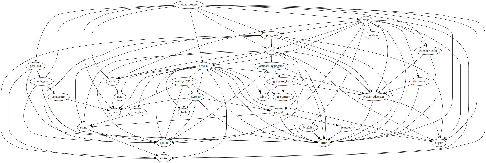

Show all the modules that depend on "staking_contract" directly or indirectly

## Struct `StakingContract`

<pre><code><b>struct</b> <a href="staking_contract.md#0x1_staking_contract_StakingContract">StakingContract</a> <b>has</b> store
</code></pre>

Fields

<dl>
<dt>
<code>principal: u64</code>
</dt>
<dd>

</dd>
<dt>
<code>pool_address: <b>address</b></code>
</dt>
<dd>

</dd>
<dt>
<code>owner_cap: <a href="stake.md#0x1_stake_OwnerCapability">stake::OwnerCapability</a></code>
</dt>
<dd>

</dd>
<dt>
<code>commission_percentage: u64</code>
</dt>
<dd>

</dd>
<dt>
<code>distribution_pool: <a href="../../aptos-stdlib/doc/pool_u64.md#0x1_pool_u64_Pool">pool_u64::Pool</a></code>
</dt>
<dd>

</dd>
<dt>
<code>signer_cap: <a href="account.md#0x1_account_SignerCapability">account::SignerCapability</a></code>
</dt>
<dd>

</dd>
</dl>

## Resource `Store`

<pre><code><b>struct</b> <a href="staking_contract.md#0x1_staking_contract_Store">Store</a> <b>has</b> key
</code></pre>

Fields

<dl>
<dt>
<code>staking_contracts: <a href="../../aptos-stdlib/doc/simple_map.md#0x1_simple_map_SimpleMap">simple_map::SimpleMap</a>&lt;<b>address</b>, <a href="staking_contract.md#0x1_staking_contract_StakingContract">staking_contract::StakingContract</a>&gt;</code>
</dt>
<dd>

</dd>
<dt>
<code>create_staking_contract_events: <a href="event.md#0x1_event_EventHandle">event::EventHandle</a>&lt;<a href="staking_contract.md#0x1_staking_contract_CreateStakingContractEvent">staking_contract::CreateStakingContractEvent</a>&gt;</code>
</dt>
<dd>

</dd>
<dt>
<code>update_voter_events: <a href="event.md#0x1_event_EventHandle">event::EventHandle</a>&lt;<a href="staking_contract.md#0x1_staking_contract_UpdateVoterEvent">staking_contract::UpdateVoterEvent</a>&gt;</code>
</dt>
<dd>

</dd>
<dt>
<code>reset_lockup_events: <a href="event.md#0x1_event_EventHandle">event::EventHandle</a>&lt;<a href="staking_contract.md#0x1_staking_contract_ResetLockupEvent">staking_contract::ResetLockupEvent</a>&gt;</code>
</dt>
<dd>

</dd>
<dt>
<code>add_stake_events: <a href="event.md#0x1_event_EventHandle">event::EventHandle</a>&lt;<a href="staking_contract.md#0x1_staking_contract_AddStakeEvent">staking_contract::AddStakeEvent</a>&gt;</code>
</dt>
<dd>

</dd>
<dt>
<code>request_commission_events: <a href="event.md#0x1_event_EventHandle">event::EventHandle</a>&lt;<a href="staking_contract.md#0x1_staking_contract_RequestCommissionEvent">staking_contract::RequestCommissionEvent</a>&gt;</code>
</dt>
<dd>

</dd>
<dt>
<code>unlock_stake_events: <a href="event.md#0x1_event_EventHandle">event::EventHandle</a>&lt;<a href="staking_contract.md#0x1_staking_contract_UnlockStakeEvent">staking_contract::UnlockStakeEvent</a>&gt;</code>
</dt>
<dd>

</dd>
<dt>
<code>switch_operator_events: <a href="event.md#0x1_event_EventHandle">event::EventHandle</a>&lt;<a href="staking_contract.md#0x1_staking_contract_SwitchOperatorEvent">staking_contract::SwitchOperatorEvent</a>&gt;</code>
</dt>
<dd>

</dd>
<dt>
<code>add_distribution_events: <a href="event.md#0x1_event_EventHandle">event::EventHandle</a>&lt;<a href="staking_contract.md#0x1_staking_contract_AddDistributionEvent">staking_contract::AddDistributionEvent</a>&gt;</code>
</dt>
<dd>

</dd>
<dt>
<code>distribute_events: <a href="event.md#0x1_event_EventHandle">event::EventHandle</a>&lt;<a href="staking_contract.md#0x1_staking_contract_DistributeEvent">staking_contract::DistributeEvent</a>&gt;</code>
</dt>
<dd>

</dd>
</dl>

## Struct `CreateStakingContractEvent`

<pre><code><b>struct</b> <a href="staking_contract.md#0x1_staking_contract_CreateStakingContractEvent">CreateStakingContractEvent</a> <b>has</b> drop, store
</code></pre>

Fields

<dl>
<dt>
<code>operator: <b>address</b></code>
</dt>
<dd>

</dd>
<dt>
<code>voter: <b>address</b></code>
</dt>
<dd>

</dd>
<dt>
<code>pool_address: <b>address</b></code>
</dt>
<dd>

</dd>
<dt>
<code>principal: u64</code>
</dt>
<dd>

</dd>
<dt>
<code>commission_percentage: u64</code>
</dt>
<dd>

</dd>
</dl>

## Struct `UpdateVoterEvent`

<pre><code><b>struct</b> <a href="staking_contract.md#0x1_staking_contract_UpdateVoterEvent">UpdateVoterEvent</a> <b>has</b> drop, store
</code></pre>

Fields

<dl>
<dt>
<code>operator: <b>address</b></code>
</dt>
<dd>

</dd>
<dt>
<code>pool_address: <b>address</b></code>
</dt>
<dd>

</dd>
<dt>
<code>old_voter: <b>address</b></code>
</dt>
<dd>

</dd>
<dt>
<code>new_voter: <b>address</b></code>
</dt>
<dd>

</dd>
</dl>

## Struct `ResetLockupEvent`

<pre><code><b>struct</b> <a href="staking_contract.md#0x1_staking_contract_ResetLockupEvent">ResetLockupEvent</a> <b>has</b> drop, store
</code></pre>

Fields

<dl>
<dt>
<code>operator: <b>address</b></code>
</dt>
<dd>

</dd>
<dt>
<code>pool_address: <b>address</b></code>
</dt>
<dd>

</dd>
</dl>

## Struct `AddStakeEvent`

<pre><code><b>struct</b> <a href="staking_contract.md#0x1_staking_contract_AddStakeEvent">AddStakeEvent</a> <b>has</b> drop, store
</code></pre>

Fields

<dl>
<dt>
<code>operator: <b>address</b></code>
</dt>
<dd>

</dd>
<dt>
<code>pool_address: <b>address</b></code>
</dt>
<dd>

</dd>
<dt>
<code>amount: u64</code>
</dt>
<dd>

</dd>
</dl>

## Struct `RequestCommissionEvent`

<pre><code><b>struct</b> <a href="staking_contract.md#0x1_staking_contract_RequestCommissionEvent">RequestCommissionEvent</a> <b>has</b> drop, store
</code></pre>

Fields

<dl>
<dt>
<code>operator: <b>address</b></code>
</dt>
<dd>

</dd>
<dt>
<code>pool_address: <b>address</b></code>
</dt>
<dd>

</dd>
<dt>
<code>accumulated_rewards: u64</code>
</dt>
<dd>

</dd>
<dt>
<code>commission_amount: u64</code>
</dt>
<dd>

</dd>
</dl>

## Struct `UnlockStakeEvent`

<pre><code><b>struct</b> <a href="staking_contract.md#0x1_staking_contract_UnlockStakeEvent">UnlockStakeEvent</a> <b>has</b> drop, store
</code></pre>

Fields

<dl>
<dt>
<code>operator: <b>address</b></code>
</dt>
<dd>

</dd>
<dt>
<code>pool_address: <b>address</b></code>
</dt>
<dd>

</dd>
<dt>
<code>amount: u64</code>
</dt>
<dd>

</dd>
<dt>
<code>commission_paid: u64</code>
</dt>
<dd>

</dd>
</dl>

## Struct `SwitchOperatorEvent`

<pre><code><b>struct</b> <a href="staking_contract.md#0x1_staking_contract_SwitchOperatorEvent">SwitchOperatorEvent</a> <b>has</b> drop, store
</code></pre>

Fields

<dl>
<dt>
<code>old_operator: <b>address</b></code>
</dt>
<dd>

</dd>
<dt>
<code>new_operator: <b>address</b></code>
</dt>
<dd>

</dd>
<dt>
<code>pool_address: <b>address</b></code>
</dt>
<dd>

</dd>
</dl>

## Struct `AddDistributionEvent`

<pre><code><b>struct</b> <a href="staking_contract.md#0x1_staking_contract_AddDistributionEvent">AddDistributionEvent</a> <b>has</b> drop, store
</code></pre>

Fields

<dl>
<dt>
<code>operator: <b>address</b></code>
</dt>
<dd>

</dd>
<dt>
<code>pool_address: <b>address</b></code>
</dt>
<dd>

</dd>
<dt>
<code>amount: u64</code>
</dt>
<dd>

</dd>
</dl>

## Struct `DistributeEvent`

<pre><code><b>struct</b> <a href="staking_contract.md#0x1_staking_contract_DistributeEvent">DistributeEvent</a> <b>has</b> drop, store
</code></pre>

Fields

<dl>
<dt>
<code>operator: <b>address</b></code>
</dt>
<dd>

</dd>
<dt>
<code>pool_address: <b>address</b></code>
</dt>
<dd>

</dd>
<dt>
<code>recipient: <b>address</b></code>
</dt>
<dd>

</dd>
<dt>
<code>amount: u64</code>
</dt>
<dd>

</dd>
</dl>

## Constants

Staking contracts can't be merged.

<pre><code><b>const</b> <a href="staking_contract.md#0x1_staking_contract_ECANT_MERGE_STAKING_CONTRACTS">ECANT_MERGE_STAKING_CONTRACTS</a>: u64 = 5;
</code></pre>

Not enough active stake to withdraw. Some stake might still pending and will be active in the next epoch.

<pre><code><b>const</b> <a href="staking_contract.md#0x1_staking_contract_EINSUFFICIENT_ACTIVE_STAKE_TO_WITHDRAW">EINSUFFICIENT_ACTIVE_STAKE_TO_WITHDRAW</a>: u64 = 7;
</code></pre>

Store amount must be at least the min stake required for a stake pool to join the validator set.

<pre><code><b>const</b> <a href="staking_contract.md#0x1_staking_contract_EINSUFFICIENT_STAKE_AMOUNT">EINSUFFICIENT_STAKE_AMOUNT</a>: u64 = 1;
</code></pre>

Commission percentage has to be between 0 and 100.

<pre><code><b>const</b> <a href="staking_contract.md#0x1_staking_contract_EINVALID_COMMISSION_PERCENTAGE">EINVALID_COMMISSION_PERCENTAGE</a>: u64 = 2;
</code></pre>

Caller must be either the staker or operator.

<pre><code><b>const</b> <a href="staking_contract.md#0x1_staking_contract_ENOT_STAKER_OR_OPERATOR">ENOT_STAKER_OR_OPERATOR</a>: u64 = 8;
</code></pre>

No staking contract between the staker and operator found.

<pre><code><b>const</b> <a href="staking_contract.md#0x1_staking_contract_ENO_STAKING_CONTRACT_FOUND_FOR_OPERATOR">ENO_STAKING_CONTRACT_FOUND_FOR_OPERATOR</a>: u64 = 4;
</code></pre>

Staker has no staking contracts.

<pre><code><b>const</b> <a href="staking_contract.md#0x1_staking_contract_ENO_STAKING_CONTRACT_FOUND_FOR_STAKER">ENO_STAKING_CONTRACT_FOUND_FOR_STAKER</a>: u64 = 3;
</code></pre>

The staking contract already exists and cannot be re-created.

<pre><code><b>const</b> <a href="staking_contract.md#0x1_staking_contract_ESTAKING_CONTRACT_ALREADY_EXISTS">ESTAKING_CONTRACT_ALREADY_EXISTS</a>: u64 = 6;
</code></pre>

Maximum number of distributions a stake pool can support.

<pre><code><b>const</b> <a href="staking_contract.md#0x1_staking_contract_MAXIMUM_PENDING_DISTRIBUTIONS">MAXIMUM_PENDING_DISTRIBUTIONS</a>: u64 = 20;
</code></pre>

<pre><code><b>const</b> <a href="staking_contract.md#0x1_staking_contract_SALT">SALT</a>: <a href="../../aptos-stdlib/../move-stdlib/doc/vector.md#0x1_vector">vector</a>&lt;u8&gt; = [97, 112, 116, 111, 115, 95, 102, 114, 97, 109, 101, 119, 111, 114, 107, 58, 58, 115, 116, 97, 107, 105, 110, 103, 95, 99, 111, 110, 116, 114, 97, 99, 116];
</code></pre>

## Function `stake_pool_address`

<pre><code><b>public</b> <b>fun</b> <a href="staking_contract.md#0x1_staking_contract_stake_pool_address">stake_pool_address</a>(staker: <b>address</b>, operator: <b>address</b>): <b>address</b>
</code></pre>

Implementation

<pre><code><b>public</b> <b>fun</b> <a href="staking_contract.md#0x1_staking_contract_stake_pool_address">stake_pool_address</a>(staker: <b>address</b>, operator: <b>address</b>): <b>address</b> <b>acquires</b> <a href="staking_contract.md#0x1_staking_contract_Store">Store</a> {
    <a href="staking_contract.md#0x1_staking_contract_assert_staking_contract_exists">assert_staking_contract_exists</a>(staker, operator);
    <b>let</b> staking_contracts = &<b>borrow_global</b>&lt;<a href="staking_contract.md#0x1_staking_contract_Store">Store</a>&gt;(staker).staking_contracts;
    <a href="../../aptos-stdlib/doc/simple_map.md#0x1_simple_map_borrow">simple_map::borrow</a>(staking_contracts, &operator).pool_address
}
</code></pre>

Show all the functions that "stake_pool_address" calls

Show all the functions that call "stake_pool_address"

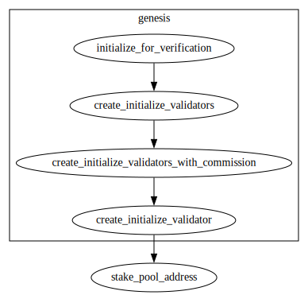

## Function `last_recorded_principal`

<pre><code><b>public</b> <b>fun</b> <a href="staking_contract.md#0x1_staking_contract_last_recorded_principal">last_recorded_principal</a>(staker: <b>address</b>, operator: <b>address</b>): u64
</code></pre>

Implementation

<pre><code><b>public</b> <b>fun</b> <a href="staking_contract.md#0x1_staking_contract_last_recorded_principal">last_recorded_principal</a>(staker: <b>address</b>, operator: <b>address</b>): u64 <b>acquires</b> <a href="staking_contract.md#0x1_staking_contract_Store">Store</a> {
    <a href="staking_contract.md#0x1_staking_contract_assert_staking_contract_exists">assert_staking_contract_exists</a>(staker, operator);
    <b>let</b> staking_contracts = &<b>borrow_global</b>&lt;<a href="staking_contract.md#0x1_staking_contract_Store">Store</a>&gt;(staker).staking_contracts;
    <a href="../../aptos-stdlib/doc/simple_map.md#0x1_simple_map_borrow">simple_map::borrow</a>(staking_contracts, &operator).principal
}
</code></pre>

Show all the functions that "last_recorded_principal" calls

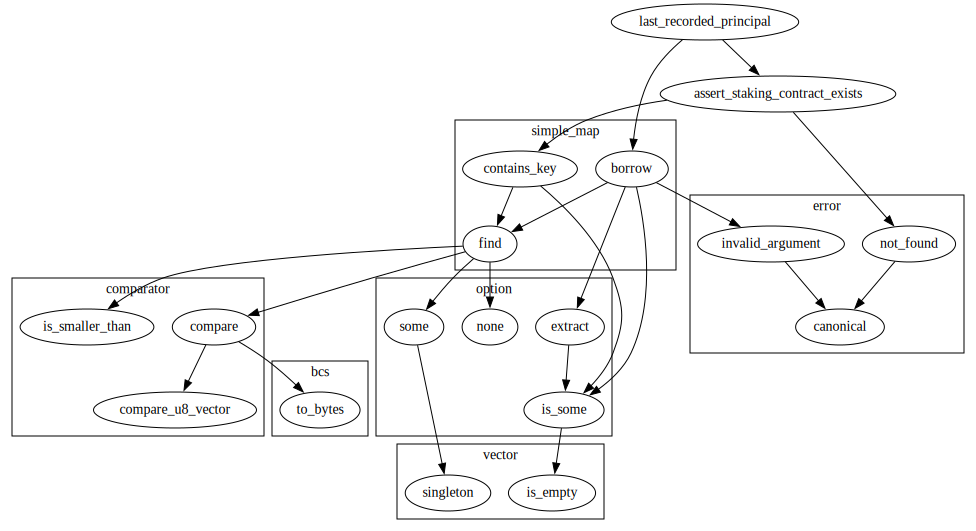

Show all the functions that call "last_recorded_principal"

## Function `commission_percentage`

<pre><code><b>public</b> <b>fun</b> <a href="staking_contract.md#0x1_staking_contract_commission_percentage">commission_percentage</a>(staker: <b>address</b>, operator: <b>address</b>): u64
</code></pre>

Implementation

<pre><code><b>public</b> <b>fun</b> <a href="staking_contract.md#0x1_staking_contract_commission_percentage">commission_percentage</a>(staker: <b>address</b>, operator: <b>address</b>): u64 <b>acquires</b> <a href="staking_contract.md#0x1_staking_contract_Store">Store</a> {
    <a href="staking_contract.md#0x1_staking_contract_assert_staking_contract_exists">assert_staking_contract_exists</a>(staker, operator);
    <b>let</b> staking_contracts = &<b>borrow_global</b>&lt;<a href="staking_contract.md#0x1_staking_contract_Store">Store</a>&gt;(staker).staking_contracts;
    <a href="../../aptos-stdlib/doc/simple_map.md#0x1_simple_map_borrow">simple_map::borrow</a>(staking_contracts, &operator).commission_percentage
}
</code></pre>

Show all the functions that "commission_percentage" calls

Show all the functions that call "commission_percentage"

## Function `staking_contract_amounts`

<pre><code><b>public</b> <b>fun</b> <a href="staking_contract.md#0x1_staking_contract_staking_contract_amounts">staking_contract_amounts</a>(staker: <b>address</b>, operator: <b>address</b>): (u64, u64, u64)
</code></pre>

Implementation

<pre><code><b>public</b> <b>fun</b> <a href="staking_contract.md#0x1_staking_contract_staking_contract_amounts">staking_contract_amounts</a>(staker: <b>address</b>, operator: <b>address</b>): (u64, u64, u64) <b>acquires</b> <a href="staking_contract.md#0x1_staking_contract_Store">Store</a> {
    <a href="staking_contract.md#0x1_staking_contract_assert_staking_contract_exists">assert_staking_contract_exists</a>(staker, operator);
    <b>let</b> staking_contracts = &<b>borrow_global</b>&lt;<a href="staking_contract.md#0x1_staking_contract_Store">Store</a>&gt;(staker).staking_contracts;
    <b>let</b> <a href="staking_contract.md#0x1_staking_contract">staking_contract</a> = <a href="../../aptos-stdlib/doc/simple_map.md#0x1_simple_map_borrow">simple_map::borrow</a>(staking_contracts, &operator);
    <a href="staking_contract.md#0x1_staking_contract_get_staking_contract_amounts_internal">get_staking_contract_amounts_internal</a>(<a href="staking_contract.md#0x1_staking_contract">staking_contract</a>)
}
</code></pre>

Show all the functions that "staking_contract_amounts" calls

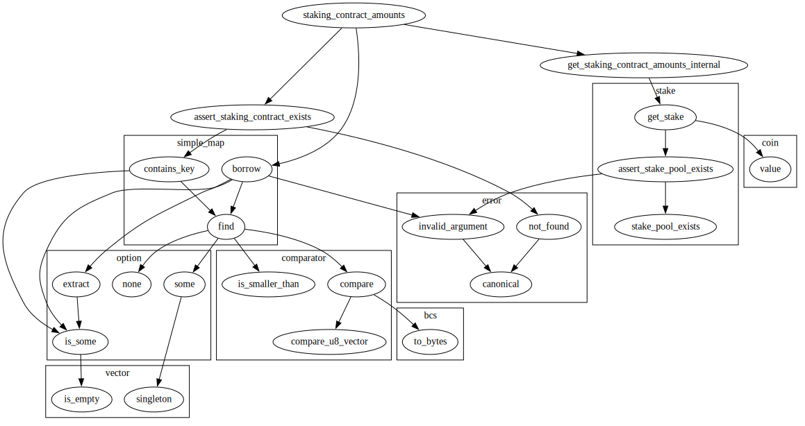

Show all the functions that call "staking_contract_amounts"

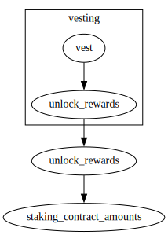

## Function `pending_distribution_counts`

<pre><code><b>public</b> <b>fun</b> <a href="staking_contract.md#0x1_staking_contract_pending_distribution_counts">pending_distribution_counts</a>(staker: <b>address</b>, operator: <b>address</b>): u64
</code></pre>

Implementation

<pre><code><b>public</b> <b>fun</b> <a href="staking_contract.md#0x1_staking_contract_pending_distribution_counts">pending_distribution_counts</a>(staker: <b>address</b>, operator: <b>address</b>): u64 <b>acquires</b> <a href="staking_contract.md#0x1_staking_contract_Store">Store</a> {
    <a href="staking_contract.md#0x1_staking_contract_assert_staking_contract_exists">assert_staking_contract_exists</a>(staker, operator);
    <b>let</b> staking_contracts = &<b>borrow_global</b>&lt;<a href="staking_contract.md#0x1_staking_contract_Store">Store</a>&gt;(staker).staking_contracts;
    <a href="../../aptos-stdlib/doc/pool_u64.md#0x1_pool_u64_shareholders_count">pool_u64::shareholders_count</a>(&<a href="../../aptos-stdlib/doc/simple_map.md#0x1_simple_map_borrow">simple_map::borrow</a>(staking_contracts, &operator).distribution_pool)
}
</code></pre>

Show all the functions that "pending_distribution_counts" calls

Show all the functions that call "pending_distribution_counts"

## Function `staking_contract_exists`

<pre><code><b>public</b> <b>fun</b> <a href="staking_contract.md#0x1_staking_contract_staking_contract_exists">staking_contract_exists</a>(staker: <b>address</b>, operator: <b>address</b>): bool
</code></pre>

Implementation

<pre><code><b>public</b> <b>fun</b> <a href="staking_contract.md#0x1_staking_contract_staking_contract_exists">staking_contract_exists</a>(staker: <b>address</b>, operator: <b>address</b>): bool <b>acquires</b> <a href="staking_contract.md#0x1_staking_contract_Store">Store</a> {
    <b>if</b> (!<b>exists</b>&lt;<a href="staking_contract.md#0x1_staking_contract_Store">Store</a>&gt;(staker)) {
        <b>return</b> <b>false</b>
    };

    <b>let</b> store = <b>borrow_global</b>&lt;<a href="staking_contract.md#0x1_staking_contract_Store">Store</a>&gt;(staker);
    <a href="../../aptos-stdlib/doc/simple_map.md#0x1_simple_map_contains_key">simple_map::contains_key</a>(&store.staking_contracts, &operator)
}
</code></pre>

Show all the functions that "staking_contract_exists" calls

Show all the functions that call "staking_contract_exists"

## Function `create_staking_contract`

Staker can call this function to create a simple staking contract with a specified operator.

<pre><code><b>public</b> entry <b>fun</b> <a href="staking_contract.md#0x1_staking_contract_create_staking_contract">create_staking_contract</a>(staker: &<a href="../../aptos-stdlib/../move-stdlib/doc/signer.md#0x1_signer">signer</a>, operator: <b>address</b>, voter: <b>address</b>, amount: u64, commission_percentage: u64, contract_creation_seed: <a href="../../aptos-stdlib/../move-stdlib/doc/vector.md#0x1_vector">vector</a>&lt;u8&gt;)
</code></pre>

Implementation

<pre><code><b>public</b> entry <b>fun</b> <a href="staking_contract.md#0x1_staking_contract_create_staking_contract">create_staking_contract</a>(
    staker: &<a href="../../aptos-stdlib/../move-stdlib/doc/signer.md#0x1_signer">signer</a>,
    operator: <b>address</b>,
    voter: <b>address</b>,
    amount: u64,
    commission_percentage: u64,
    // Optional seed used when creating the staking contract <a href="account.md#0x1_account">account</a>.
    contract_creation_seed: <a href="../../aptos-stdlib/../move-stdlib/doc/vector.md#0x1_vector">vector</a>&lt;u8&gt;,
) <b>acquires</b> <a href="staking_contract.md#0x1_staking_contract_Store">Store</a> {
    <b>let</b> staked_coins = <a href="coin.md#0x1_coin_withdraw">coin::withdraw</a>&lt;AptosCoin&gt;(staker, amount);
    <a href="staking_contract.md#0x1_staking_contract_create_staking_contract_with_coins">create_staking_contract_with_coins</a>(
        staker, operator, voter, staked_coins, commission_percentage, contract_creation_seed);
}
</code></pre>

Show all the functions that "create_staking_contract" calls

Show all the functions that call "create_staking_contract"

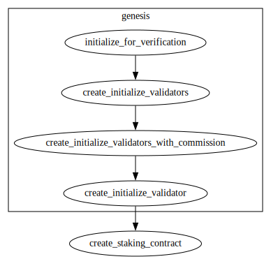

## Function `create_staking_contract_with_coins`

Staker can call this function to create a simple staking contract with a specified operator.

<pre><code><b>public</b> <b>fun</b> <a href="staking_contract.md#0x1_staking_contract_create_staking_contract_with_coins">create_staking_contract_with_coins</a>(staker: &<a href="../../aptos-stdlib/../move-stdlib/doc/signer.md#0x1_signer">signer</a>, operator: <b>address</b>, voter: <b>address</b>, coins: <a href="coin.md#0x1_coin_Coin">coin::Coin</a>&lt;<a href="aptos_coin.md#0x1_aptos_coin_AptosCoin">aptos_coin::AptosCoin</a>&gt;, commission_percentage: u64, contract_creation_seed: <a href="../../aptos-stdlib/../move-stdlib/doc/vector.md#0x1_vector">vector</a>&lt;u8&gt;): <b>address</b>
</code></pre>

Implementation

<pre><code><b>public</b> <b>fun</b> <a href="staking_contract.md#0x1_staking_contract_create_staking_contract_with_coins">create_staking_contract_with_coins</a>(
    staker: &<a href="../../aptos-stdlib/../move-stdlib/doc/signer.md#0x1_signer">signer</a>,
    operator: <b>address</b>,
    voter: <b>address</b>,
    coins: Coin&lt;AptosCoin&gt;,
    commission_percentage: u64,
    // Optional seed used when creating the staking contract <a href="account.md#0x1_account">account</a>.
    contract_creation_seed: <a href="../../aptos-stdlib/../move-stdlib/doc/vector.md#0x1_vector">vector</a>&lt;u8&gt;,
): <b>address</b> <b>acquires</b> <a href="staking_contract.md#0x1_staking_contract_Store">Store</a> {
    <b>assert</b>!(
        commission_percentage &gt;= 0 && <a href="staking_contract.md#0x1_staking_contract_commission_percentage">commission_percentage</a> &lt;= 100,
        <a href="../../aptos-stdlib/../move-stdlib/doc/error.md#0x1_error_invalid_argument">error::invalid_argument</a>(<a href="staking_contract.md#0x1_staking_contract_EINVALID_COMMISSION_PERCENTAGE">EINVALID_COMMISSION_PERCENTAGE</a>),
    );
    // The amount should be at least the min_stake_required, so the <a href="stake.md#0x1_stake">stake</a> pool will be eligible <b>to</b> join the
    // validator set.
    <b>let</b> (min_stake_required, _) = <a href="staking_config.md#0x1_staking_config_get_required_stake">staking_config::get_required_stake</a>(&<a href="staking_config.md#0x1_staking_config_get">staking_config::get</a>());
    <b>let</b> principal = <a href="coin.md#0x1_coin_value">coin::value</a>(&coins);
    <b>assert</b>!(principal &gt;= min_stake_required, <a href="../../aptos-stdlib/../move-stdlib/doc/error.md#0x1_error_invalid_argument">error::invalid_argument</a>(<a href="staking_contract.md#0x1_staking_contract_EINSUFFICIENT_STAKE_AMOUNT">EINSUFFICIENT_STAKE_AMOUNT</a>));

    // Initialize <a href="staking_contract.md#0x1_staking_contract_Store">Store</a> resource <b>if</b> this is the first time the staker <b>has</b> delegated <b>to</b> anyone.
    <b>let</b> staker_address = <a href="../../aptos-stdlib/../move-stdlib/doc/signer.md#0x1_signer_address_of">signer::address_of</a>(staker);
    <b>if</b> (!<b>exists</b>&lt;<a href="staking_contract.md#0x1_staking_contract_Store">Store</a>&gt;(staker_address)) {
        <b>move_to</b>(staker, <a href="staking_contract.md#0x1_staking_contract_new_staking_contracts_holder">new_staking_contracts_holder</a>(staker));
    };

    // Cannot create the staking contract <b>if</b> it already <b>exists</b>.
    <b>let</b> store = <b>borrow_global_mut</b>&lt;<a href="staking_contract.md#0x1_staking_contract_Store">Store</a>&gt;(staker_address);
    <b>let</b> staking_contracts = &<b>mut</b> store.staking_contracts;
    <b>assert</b>!(
        !<a href="../../aptos-stdlib/doc/simple_map.md#0x1_simple_map_contains_key">simple_map::contains_key</a>(staking_contracts, &operator),
        <a href="../../aptos-stdlib/../move-stdlib/doc/error.md#0x1_error_already_exists">error::already_exists</a>(<a href="staking_contract.md#0x1_staking_contract_ESTAKING_CONTRACT_ALREADY_EXISTS">ESTAKING_CONTRACT_ALREADY_EXISTS</a>)
    );

    // Initialize the <a href="stake.md#0x1_stake">stake</a> pool in a new resource <a href="account.md#0x1_account">account</a>. This allows the same staker <b>to</b> contract <b>with</b> multiple
    // different operators.
    <b>let</b> (stake_pool_signer, stake_pool_signer_cap, owner_cap) =
        <a href="staking_contract.md#0x1_staking_contract_create_stake_pool">create_stake_pool</a>(staker, operator, voter, contract_creation_seed);

    // Add the <a href="stake.md#0x1_stake">stake</a> <b>to</b> the <a href="stake.md#0x1_stake">stake</a> pool.
    <a href="stake.md#0x1_stake_add_stake_with_cap">stake::add_stake_with_cap</a>(&owner_cap, coins);

    // Create the contract record.
    <b>let</b> pool_address = <a href="../../aptos-stdlib/../move-stdlib/doc/signer.md#0x1_signer_address_of">signer::address_of</a>(&stake_pool_signer);
    <a href="../../aptos-stdlib/doc/simple_map.md#0x1_simple_map_add">simple_map::add</a>(staking_contracts, operator, <a href="staking_contract.md#0x1_staking_contract_StakingContract">StakingContract</a> {
        principal,
        pool_address,
        owner_cap,
        commission_percentage,
        // Make sure we don't have too many pending recipients in the distribution pool.
        // Otherwise, a griefing attack is possible <b>where</b> the staker can keep switching operators and create too
        // many pending distributions. This can lead <b>to</b> out-of-gas failure whenever <a href="staking_contract.md#0x1_staking_contract_distribute">distribute</a>() is called.
        distribution_pool: <a href="../../aptos-stdlib/doc/pool_u64.md#0x1_pool_u64_create">pool_u64::create</a>(<a href="staking_contract.md#0x1_staking_contract_MAXIMUM_PENDING_DISTRIBUTIONS">MAXIMUM_PENDING_DISTRIBUTIONS</a>),
        signer_cap: stake_pool_signer_cap,
    });

    emit_event(
        &<b>mut</b> store.create_staking_contract_events,
        <a href="staking_contract.md#0x1_staking_contract_CreateStakingContractEvent">CreateStakingContractEvent</a> { operator, voter, pool_address, principal, commission_percentage },
    );
    pool_address
}
</code></pre>

Show all the functions that "create_staking_contract_with_coins" calls

Show all the functions that call "create_staking_contract_with_coins"

## Function `add_stake`

Add more stake to an existing staking contract.

<pre><code><b>public</b> entry <b>fun</b> <a href="staking_contract.md#0x1_staking_contract_add_stake">add_stake</a>(staker: &<a href="../../aptos-stdlib/../move-stdlib/doc/signer.md#0x1_signer">signer</a>, operator: <b>address</b>, amount: u64)
</code></pre>

Implementation

<pre><code><b>public</b> entry <b>fun</b> <a href="staking_contract.md#0x1_staking_contract_add_stake">add_stake</a>(staker: &<a href="../../aptos-stdlib/../move-stdlib/doc/signer.md#0x1_signer">signer</a>, operator: <b>address</b>, amount: u64) <b>acquires</b> <a href="staking_contract.md#0x1_staking_contract_Store">Store</a> {
    <b>let</b> staker_address = <a href="../../aptos-stdlib/../move-stdlib/doc/signer.md#0x1_signer_address_of">signer::address_of</a>(staker);
    <a href="staking_contract.md#0x1_staking_contract_assert_staking_contract_exists">assert_staking_contract_exists</a>(staker_address, operator);

    <b>let</b> store = <b>borrow_global_mut</b>&lt;<a href="staking_contract.md#0x1_staking_contract_Store">Store</a>&gt;(staker_address);
    <b>let</b> <a href="staking_contract.md#0x1_staking_contract">staking_contract</a> = <a href="../../aptos-stdlib/doc/simple_map.md#0x1_simple_map_borrow_mut">simple_map::borrow_mut</a>(&<b>mut</b> store.staking_contracts, &operator);

    // Add the <a href="stake.md#0x1_stake">stake</a> <b>to</b> the <a href="stake.md#0x1_stake">stake</a> pool.
    <b>let</b> staked_coins = <a href="coin.md#0x1_coin_withdraw">coin::withdraw</a>&lt;AptosCoin&gt;(staker, amount);
    <a href="stake.md#0x1_stake_add_stake_with_cap">stake::add_stake_with_cap</a>(&<a href="staking_contract.md#0x1_staking_contract">staking_contract</a>.owner_cap, staked_coins);

    <a href="staking_contract.md#0x1_staking_contract">staking_contract</a>.principal = <a href="staking_contract.md#0x1_staking_contract">staking_contract</a>.principal + amount;
    <b>let</b> pool_address = <a href="staking_contract.md#0x1_staking_contract">staking_contract</a>.pool_address;
    emit_event(
        &<b>mut</b> store.add_stake_events,
        <a href="staking_contract.md#0x1_staking_contract_AddStakeEvent">AddStakeEvent</a> { operator, pool_address, amount },
    );
}
</code></pre>

Show all the functions that "add_stake" calls

Show all the functions that call "add_stake"

## Function `update_voter`

Convenient function to allow the staker to update the voter address in a staking contract they made.

<pre><code><b>public</b> entry <b>fun</b> <a href="staking_contract.md#0x1_staking_contract_update_voter">update_voter</a>(staker: &<a href="../../aptos-stdlib/../move-stdlib/doc/signer.md#0x1_signer">signer</a>, operator: <b>address</b>, new_voter: <b>address</b>)
</code></pre>

Implementation

<pre><code><b>public</b> entry <b>fun</b> <a href="staking_contract.md#0x1_staking_contract_update_voter">update_voter</a>(staker: &<a href="../../aptos-stdlib/../move-stdlib/doc/signer.md#0x1_signer">signer</a>, operator: <b>address</b>, new_voter: <b>address</b>) <b>acquires</b> <a href="staking_contract.md#0x1_staking_contract_Store">Store</a> {
    <b>let</b> staker_address = <a href="../../aptos-stdlib/../move-stdlib/doc/signer.md#0x1_signer_address_of">signer::address_of</a>(staker);
    <a href="staking_contract.md#0x1_staking_contract_assert_staking_contract_exists">assert_staking_contract_exists</a>(staker_address, operator);

    <b>let</b> store = <b>borrow_global_mut</b>&lt;<a href="staking_contract.md#0x1_staking_contract_Store">Store</a>&gt;(staker_address);
    <b>let</b> <a href="staking_contract.md#0x1_staking_contract">staking_contract</a> = <a href="../../aptos-stdlib/doc/simple_map.md#0x1_simple_map_borrow_mut">simple_map::borrow_mut</a>(&<b>mut</b> store.staking_contracts, &operator);
    <b>let</b> pool_address = <a href="staking_contract.md#0x1_staking_contract">staking_contract</a>.pool_address;
    <b>let</b> old_voter = <a href="stake.md#0x1_stake_get_delegated_voter">stake::get_delegated_voter</a>(pool_address);
    <a href="stake.md#0x1_stake_set_delegated_voter_with_cap">stake::set_delegated_voter_with_cap</a>(&<a href="staking_contract.md#0x1_staking_contract">staking_contract</a>.owner_cap, new_voter);

    emit_event(
        &<b>mut</b> store.update_voter_events,
        <a href="staking_contract.md#0x1_staking_contract_UpdateVoterEvent">UpdateVoterEvent</a> { operator, pool_address, old_voter, new_voter },
    );
}
</code></pre>

Show all the functions that "update_voter" calls

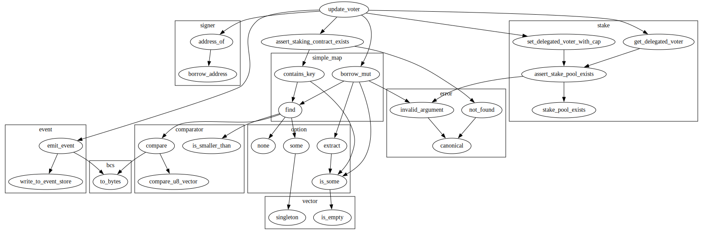

Show all the functions that call "update_voter"

## Function `reset_lockup`

Convenient function to allow the staker to reset their stake pool's lockup period to start now.

<pre><code><b>public</b> entry <b>fun</b> <a href="staking_contract.md#0x1_staking_contract_reset_lockup">reset_lockup</a>(staker: &<a href="../../aptos-stdlib/../move-stdlib/doc/signer.md#0x1_signer">signer</a>, operator: <b>address</b>)
</code></pre>

Implementation

<pre><code><b>public</b> entry <b>fun</b> <a href="staking_contract.md#0x1_staking_contract_reset_lockup">reset_lockup</a>(staker: &<a href="../../aptos-stdlib/../move-stdlib/doc/signer.md#0x1_signer">signer</a>, operator: <b>address</b>) <b>acquires</b> <a href="staking_contract.md#0x1_staking_contract_Store">Store</a> {
    <b>let</b> staker_address = <a href="../../aptos-stdlib/../move-stdlib/doc/signer.md#0x1_signer_address_of">signer::address_of</a>(staker);
    <a href="staking_contract.md#0x1_staking_contract_assert_staking_contract_exists">assert_staking_contract_exists</a>(staker_address, operator);

    <b>let</b> store = <b>borrow_global_mut</b>&lt;<a href="staking_contract.md#0x1_staking_contract_Store">Store</a>&gt;(staker_address);
    <b>let</b> <a href="staking_contract.md#0x1_staking_contract">staking_contract</a> = <a href="../../aptos-stdlib/doc/simple_map.md#0x1_simple_map_borrow_mut">simple_map::borrow_mut</a>(&<b>mut</b> store.staking_contracts, &operator);
    <b>let</b> pool_address = <a href="staking_contract.md#0x1_staking_contract">staking_contract</a>.pool_address;
    <a href="stake.md#0x1_stake_increase_lockup_with_cap">stake::increase_lockup_with_cap</a>(&<a href="staking_contract.md#0x1_staking_contract">staking_contract</a>.owner_cap);

    emit_event(&<b>mut</b> store.reset_lockup_events, <a href="staking_contract.md#0x1_staking_contract_ResetLockupEvent">ResetLockupEvent</a> { operator, pool_address });
}
</code></pre>

Show all the functions that "reset_lockup" calls

Show all the functions that call "reset_lockup"

## Function `request_commission`

Unlock commission amount from the stake pool. Operator needs to wait for the amount to become withdrawable
at the end of the stake pool's lockup period before they can actually can withdraw_commission.

Only staker or operator can call this.

<pre><code><b>public</b> entry <b>fun</b> <a href="staking_contract.md#0x1_staking_contract_request_commission">request_commission</a>(<a href="account.md#0x1_account">account</a>: &<a href="../../aptos-stdlib/../move-stdlib/doc/signer.md#0x1_signer">signer</a>, staker: <b>address</b>, operator: <b>address</b>)
</code></pre>

Implementation

<pre><code><b>public</b> entry <b>fun</b> <a href="staking_contract.md#0x1_staking_contract_request_commission">request_commission</a>(<a href="account.md#0x1_account">account</a>: &<a href="../../aptos-stdlib/../move-stdlib/doc/signer.md#0x1_signer">signer</a>, staker: <b>address</b>, operator: <b>address</b>) <b>acquires</b> <a href="staking_contract.md#0x1_staking_contract_Store">Store</a> {
    <b>let</b> account_addr = <a href="../../aptos-stdlib/../move-stdlib/doc/signer.md#0x1_signer_address_of">signer::address_of</a>(<a href="account.md#0x1_account">account</a>);
    <b>assert</b>!(account_addr == staker || account_addr == operator, <a href="../../aptos-stdlib/../move-stdlib/doc/error.md#0x1_error_unauthenticated">error::unauthenticated</a>(<a href="staking_contract.md#0x1_staking_contract_ENOT_STAKER_OR_OPERATOR">ENOT_STAKER_OR_OPERATOR</a>));
    <a href="staking_contract.md#0x1_staking_contract_assert_staking_contract_exists">assert_staking_contract_exists</a>(staker, operator);

    <b>let</b> store = <b>borrow_global_mut</b>&lt;<a href="staking_contract.md#0x1_staking_contract_Store">Store</a>&gt;(staker);
    <b>let</b> <a href="staking_contract.md#0x1_staking_contract">staking_contract</a> = <a href="../../aptos-stdlib/doc/simple_map.md#0x1_simple_map_borrow_mut">simple_map::borrow_mut</a>(&<b>mut</b> store.staking_contracts, &operator);
    // Short-circuit <b>if</b> zero commission.
    <b>if</b> (<a href="staking_contract.md#0x1_staking_contract">staking_contract</a>.commission_percentage == 0) {
        <b>return</b>
    };

    // Force distribution of <a href="../../aptos-stdlib/doc/any.md#0x1_any">any</a> already inactive <a href="stake.md#0x1_stake">stake</a>.
    <a href="staking_contract.md#0x1_staking_contract_distribute_internal">distribute_internal</a>(staker, operator, <a href="staking_contract.md#0x1_staking_contract">staking_contract</a>, &<b>mut</b> store.distribute_events);

    <a href="staking_contract.md#0x1_staking_contract_request_commission_internal">request_commission_internal</a>(
        operator,
        <a href="staking_contract.md#0x1_staking_contract">staking_contract</a>,
        &<b>mut</b> store.add_distribution_events,
        &<b>mut</b> store.request_commission_events,
    );
}
</code></pre>

Show all the functions that "request_commission" calls

Show all the functions that call "request_commission"

## Function `request_commission_internal`

<pre><code><b>fun</b> <a href="staking_contract.md#0x1_staking_contract_request_commission_internal">request_commission_internal</a>(operator: <b>address</b>, <a href="staking_contract.md#0x1_staking_contract">staking_contract</a>: &<b>mut</b> <a href="staking_contract.md#0x1_staking_contract_StakingContract">staking_contract::StakingContract</a>, add_distribution_events: &<b>mut</b> <a href="event.md#0x1_event_EventHandle">event::EventHandle</a>&lt;<a href="staking_contract.md#0x1_staking_contract_AddDistributionEvent">staking_contract::AddDistributionEvent</a>&gt;, request_commission_events: &<b>mut</b> <a href="event.md#0x1_event_EventHandle">event::EventHandle</a>&lt;<a href="staking_contract.md#0x1_staking_contract_RequestCommissionEvent">staking_contract::RequestCommissionEvent</a>&gt;): u64
</code></pre>

Implementation

<pre><code><b>fun</b> <a href="staking_contract.md#0x1_staking_contract_request_commission_internal">request_commission_internal</a>(
    operator: <b>address</b>,
    <a href="staking_contract.md#0x1_staking_contract">staking_contract</a>: &<b>mut</b> <a href="staking_contract.md#0x1_staking_contract_StakingContract">StakingContract</a>,
    add_distribution_events: &<b>mut</b> EventHandle&lt;<a href="staking_contract.md#0x1_staking_contract_AddDistributionEvent">AddDistributionEvent</a>&gt;,
    request_commission_events: &<b>mut</b> EventHandle&lt;<a href="staking_contract.md#0x1_staking_contract_RequestCommissionEvent">RequestCommissionEvent</a>&gt;,
): u64 {
    // Unlock just the commission portion from the <a href="stake.md#0x1_stake">stake</a> pool.
    <b>let</b> (total_active_stake, accumulated_rewards, commission_amount) =
        <a href="staking_contract.md#0x1_staking_contract_get_staking_contract_amounts_internal">get_staking_contract_amounts_internal</a>(<a href="staking_contract.md#0x1_staking_contract">staking_contract</a>);
    <a href="staking_contract.md#0x1_staking_contract">staking_contract</a>.principal = total_active_stake - commission_amount;

    // Short-circuit <b>if</b> there's no commission <b>to</b> pay.
    <b>if</b> (commission_amount == 0) {
        <b>return</b> 0
    };

    // Add a distribution for the operator.
    <a href="staking_contract.md#0x1_staking_contract_add_distribution">add_distribution</a>(operator, <a href="staking_contract.md#0x1_staking_contract">staking_contract</a>, operator, commission_amount, add_distribution_events);

    // Request <b>to</b> unlock the commission from the <a href="stake.md#0x1_stake">stake</a> pool.
    // This won't become fully unlocked until the <a href="stake.md#0x1_stake">stake</a> pool's lockup expires.
    <a href="stake.md#0x1_stake_unlock_with_cap">stake::unlock_with_cap</a>(commission_amount, &<a href="staking_contract.md#0x1_staking_contract">staking_contract</a>.owner_cap);

    <b>let</b> pool_address = <a href="staking_contract.md#0x1_staking_contract">staking_contract</a>.pool_address;
    emit_event(
        request_commission_events,
        <a href="staking_contract.md#0x1_staking_contract_RequestCommissionEvent">RequestCommissionEvent</a> { operator, pool_address, accumulated_rewards, commission_amount },
    );

    commission_amount
}
</code></pre>

Show all the functions that "request_commission_internal" calls

Show all the functions that call "request_commission_internal"

## Function `unlock_stake`

Staker can call this to request withdrawal of part or all of their staking_contract.
This also triggers paying commission to the operator for accounting simplicity.

<pre><code><b>public</b> entry <b>fun</b> <a href="staking_contract.md#0x1_staking_contract_unlock_stake">unlock_stake</a>(staker: &<a href="../../aptos-stdlib/../move-stdlib/doc/signer.md#0x1_signer">signer</a>, operator: <b>address</b>, amount: u64)
</code></pre>

Implementation

<pre><code><b>public</b> entry <b>fun</b> <a href="staking_contract.md#0x1_staking_contract_unlock_stake">unlock_stake</a>(staker: &<a href="../../aptos-stdlib/../move-stdlib/doc/signer.md#0x1_signer">signer</a>, operator: <b>address</b>, amount: u64) <b>acquires</b> <a href="staking_contract.md#0x1_staking_contract_Store">Store</a> {
    // Short-circuit <b>if</b> amount is 0.
    <b>if</b> (amount == 0) <b>return</b>;

    <b>let</b> staker_address = <a href="../../aptos-stdlib/../move-stdlib/doc/signer.md#0x1_signer_address_of">signer::address_of</a>(staker);
    <a href="staking_contract.md#0x1_staking_contract_assert_staking_contract_exists">assert_staking_contract_exists</a>(staker_address, operator);

    <b>let</b> store = <b>borrow_global_mut</b>&lt;<a href="staking_contract.md#0x1_staking_contract_Store">Store</a>&gt;(staker_address);
    <b>let</b> <a href="staking_contract.md#0x1_staking_contract">staking_contract</a> = <a href="../../aptos-stdlib/doc/simple_map.md#0x1_simple_map_borrow_mut">simple_map::borrow_mut</a>(&<b>mut</b> store.staking_contracts, &operator);

    // Force distribution of <a href="../../aptos-stdlib/doc/any.md#0x1_any">any</a> already inactive <a href="stake.md#0x1_stake">stake</a>.
    <a href="staking_contract.md#0x1_staking_contract_distribute_internal">distribute_internal</a>(staker_address, operator, <a href="staking_contract.md#0x1_staking_contract">staking_contract</a>, &<b>mut</b> store.distribute_events);

    // For simplicity, we request commission <b>to</b> be paid out first. This avoids having <b>to</b> ensure <b>to</b> staker doesn't
    // withdraw into the commission portion.
    <b>let</b> commission_paid = <a href="staking_contract.md#0x1_staking_contract_request_commission_internal">request_commission_internal</a>(
        operator,
        <a href="staking_contract.md#0x1_staking_contract">staking_contract</a>,
        &<b>mut</b> store.add_distribution_events,
        &<b>mut</b> store.request_commission_events,
    );

    // If there's less active <a href="stake.md#0x1_stake">stake</a> remaining than the amount requested (potentially due <b>to</b> commission),
    // only withdraw up <b>to</b> the active amount.
    <b>let</b> (active, _, _, _) = <a href="stake.md#0x1_stake_get_stake">stake::get_stake</a>(<a href="staking_contract.md#0x1_staking_contract">staking_contract</a>.pool_address);
    <b>if</b> (active &lt; amount) {
        amount = active;
    };
    <a href="staking_contract.md#0x1_staking_contract">staking_contract</a>.principal = <a href="staking_contract.md#0x1_staking_contract">staking_contract</a>.principal - amount;

    // Record a distribution for the staker.
    <a href="staking_contract.md#0x1_staking_contract_add_distribution">add_distribution</a>(
        operator, <a href="staking_contract.md#0x1_staking_contract">staking_contract</a>, staker_address, amount, &<b>mut</b> store.add_distribution_events);

    // Request <b>to</b> unlock the distribution amount from the <a href="stake.md#0x1_stake">stake</a> pool.
    // This won't become fully unlocked until the <a href="stake.md#0x1_stake">stake</a> pool's lockup expires.
    <a href="stake.md#0x1_stake_unlock_with_cap">stake::unlock_with_cap</a>(amount, &<a href="staking_contract.md#0x1_staking_contract">staking_contract</a>.owner_cap);

    <b>let</b> pool_address = <a href="staking_contract.md#0x1_staking_contract">staking_contract</a>.pool_address;
    emit_event(
        &<b>mut</b> store.unlock_stake_events,
        <a href="staking_contract.md#0x1_staking_contract_UnlockStakeEvent">UnlockStakeEvent</a> { pool_address, operator, amount, commission_paid },
    );
}
</code></pre>

Show all the functions that "unlock_stake" calls

Show all the functions that call "unlock_stake"

## Function `unlock_rewards`

Unlock all accumulated rewards since the last recorded principals.

<pre><code><b>public</b> entry <b>fun</b> <a href="staking_contract.md#0x1_staking_contract_unlock_rewards">unlock_rewards</a>(staker: &<a href="../../aptos-stdlib/../move-stdlib/doc/signer.md#0x1_signer">signer</a>, operator: <b>address</b>)
</code></pre>

Implementation

<pre><code><b>public</b> entry <b>fun</b> <a href="staking_contract.md#0x1_staking_contract_unlock_rewards">unlock_rewards</a>(staker: &<a href="../../aptos-stdlib/../move-stdlib/doc/signer.md#0x1_signer">signer</a>, operator: <b>address</b>) <b>acquires</b> <a href="staking_contract.md#0x1_staking_contract_Store">Store</a> {
    <b>let</b> staker_address = <a href="../../aptos-stdlib/../move-stdlib/doc/signer.md#0x1_signer_address_of">signer::address_of</a>(staker);
    <a href="staking_contract.md#0x1_staking_contract_assert_staking_contract_exists">assert_staking_contract_exists</a>(staker_address, operator);

    // Calculate how much rewards belongs <b>to</b> the staker after commission is paid.
    <b>let</b> (_, accumulated_rewards, unpaid_commission) = <a href="staking_contract.md#0x1_staking_contract_staking_contract_amounts">staking_contract_amounts</a>(staker_address, operator);
    <b>let</b> staker_rewards = accumulated_rewards - unpaid_commission;
    <a href="staking_contract.md#0x1_staking_contract_unlock_stake">unlock_stake</a>(staker, operator, staker_rewards);
}
</code></pre>

Show all the functions that "unlock_rewards" calls

Show all the functions that call "unlock_rewards"

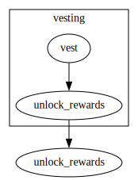

## Function `switch_operator_with_same_commission`

Allows staker to switch operator without going through the lenghthy process to unstake, without resetting commission.

<pre><code><b>public</b> entry <b>fun</b> <a href="staking_contract.md#0x1_staking_contract_switch_operator_with_same_commission">switch_operator_with_same_commission</a>(staker: &<a href="../../aptos-stdlib/../move-stdlib/doc/signer.md#0x1_signer">signer</a>, old_operator: <b>address</b>, new_operator: <b>address</b>)
</code></pre>

Implementation

<pre><code><b>public</b> entry <b>fun</b> <a href="staking_contract.md#0x1_staking_contract_switch_operator_with_same_commission">switch_operator_with_same_commission</a>(
    staker: &<a href="../../aptos-stdlib/../move-stdlib/doc/signer.md#0x1_signer">signer</a>,
    old_operator: <b>address</b>,
    new_operator: <b>address</b>,
) <b>acquires</b> <a href="staking_contract.md#0x1_staking_contract_Store">Store</a> {
    <b>let</b> staker_address = <a href="../../aptos-stdlib/../move-stdlib/doc/signer.md#0x1_signer_address_of">signer::address_of</a>(staker);
    <a href="staking_contract.md#0x1_staking_contract_assert_staking_contract_exists">assert_staking_contract_exists</a>(staker_address, old_operator);

    <b>let</b> commission_percentage = <a href="staking_contract.md#0x1_staking_contract_commission_percentage">commission_percentage</a>(staker_address, old_operator);
    <a href="staking_contract.md#0x1_staking_contract_switch_operator">switch_operator</a>(staker, old_operator, new_operator, commission_percentage);
}
</code></pre>

Show all the functions that "switch_operator_with_same_commission" calls

Show all the functions that call "switch_operator_with_same_commission"

## Function `switch_operator`

Allows staker to switch operator without going through the lenghthy process to unstake.

<pre><code><b>public</b> entry <b>fun</b> <a href="staking_contract.md#0x1_staking_contract_switch_operator">switch_operator</a>(staker: &<a href="../../aptos-stdlib/../move-stdlib/doc/signer.md#0x1_signer">signer</a>, old_operator: <b>address</b>, new_operator: <b>address</b>, new_commission_percentage: u64)
</code></pre>

Implementation

<pre><code><b>public</b> entry <b>fun</b> <a href="staking_contract.md#0x1_staking_contract_switch_operator">switch_operator</a>(
    staker: &<a href="../../aptos-stdlib/../move-stdlib/doc/signer.md#0x1_signer">signer</a>,
    old_operator: <b>address</b>,
    new_operator: <b>address</b>,
    new_commission_percentage: u64,
) <b>acquires</b> <a href="staking_contract.md#0x1_staking_contract_Store">Store</a> {
    <b>let</b> staker_address = <a href="../../aptos-stdlib/../move-stdlib/doc/signer.md#0x1_signer_address_of">signer::address_of</a>(staker);
    <a href="staking_contract.md#0x1_staking_contract_assert_staking_contract_exists">assert_staking_contract_exists</a>(staker_address, old_operator);

    // Merging two existing staking contracts is too complex <b>as</b> we'd need <b>to</b> merge two separate <a href="stake.md#0x1_stake">stake</a> pools.
    <b>let</b> store = <b>borrow_global_mut</b>&lt;<a href="staking_contract.md#0x1_staking_contract_Store">Store</a>&gt;(staker_address);
    <b>let</b> staking_contracts = &<b>mut</b> store.staking_contracts;
    <b>assert</b>!(
        !<a href="../../aptos-stdlib/doc/simple_map.md#0x1_simple_map_contains_key">simple_map::contains_key</a>(staking_contracts, &new_operator),
        <a href="../../aptos-stdlib/../move-stdlib/doc/error.md#0x1_error_invalid_state">error::invalid_state</a>(<a href="staking_contract.md#0x1_staking_contract_ECANT_MERGE_STAKING_CONTRACTS">ECANT_MERGE_STAKING_CONTRACTS</a>),
    );

    <b>let</b> (_, <a href="staking_contract.md#0x1_staking_contract">staking_contract</a>) = <a href="../../aptos-stdlib/doc/simple_map.md#0x1_simple_map_remove">simple_map::remove</a>(staking_contracts, &old_operator);
    // Force distribution of <a href="../../aptos-stdlib/doc/any.md#0x1_any">any</a> already inactive <a href="stake.md#0x1_stake">stake</a>.
    <a href="staking_contract.md#0x1_staking_contract_distribute_internal">distribute_internal</a>(staker_address, old_operator, &<b>mut</b> <a href="staking_contract.md#0x1_staking_contract">staking_contract</a>, &<b>mut</b> store.distribute_events);

    // For simplicity, we request commission <b>to</b> be paid out first. This avoids having <b>to</b> ensure <b>to</b> staker doesn't
    // withdraw into the commission portion.
    <a href="staking_contract.md#0x1_staking_contract_request_commission_internal">request_commission_internal</a>(
        old_operator,
        &<b>mut</b> <a href="staking_contract.md#0x1_staking_contract">staking_contract</a>,
        &<b>mut</b> store.add_distribution_events,
        &<b>mut</b> store.request_commission_events,
    );

    // Update the staking contract's commission rate and <a href="stake.md#0x1_stake">stake</a> pool's operator.
    <a href="stake.md#0x1_stake_set_operator_with_cap">stake::set_operator_with_cap</a>(&<a href="staking_contract.md#0x1_staking_contract">staking_contract</a>.owner_cap, new_operator);
    <a href="staking_contract.md#0x1_staking_contract">staking_contract</a>.commission_percentage = new_commission_percentage;

    <b>let</b> pool_address = <a href="staking_contract.md#0x1_staking_contract">staking_contract</a>.pool_address;
    <a href="../../aptos-stdlib/doc/simple_map.md#0x1_simple_map_add">simple_map::add</a>(staking_contracts, new_operator, <a href="staking_contract.md#0x1_staking_contract">staking_contract</a>);
    emit_event(
        &<b>mut</b> store.switch_operator_events,
        <a href="staking_contract.md#0x1_staking_contract_SwitchOperatorEvent">SwitchOperatorEvent</a> { pool_address, old_operator, new_operator }
    );
}
</code></pre>

Show all the functions that "switch_operator" calls

Show all the functions that call "switch_operator"

## Function `distribute`

Allow anyone to distribute already unlocked funds. This does not affect reward compounding and therefore does
not need to be restricted to just the staker or operator.

<pre><code><b>public</b> entry <b>fun</b> <a href="staking_contract.md#0x1_staking_contract_distribute">distribute</a>(staker: <b>address</b>, operator: <b>address</b>)
</code></pre>

Implementation

<pre><code><b>public</b> entry <b>fun</b> <a href="staking_contract.md#0x1_staking_contract_distribute">distribute</a>(staker: <b>address</b>, operator: <b>address</b>) <b>acquires</b> <a href="staking_contract.md#0x1_staking_contract_Store">Store</a> {
    <a href="staking_contract.md#0x1_staking_contract_assert_staking_contract_exists">assert_staking_contract_exists</a>(staker, operator);
    <b>let</b> store = <b>borrow_global_mut</b>&lt;<a href="staking_contract.md#0x1_staking_contract_Store">Store</a>&gt;(staker);
    <b>let</b> <a href="staking_contract.md#0x1_staking_contract">staking_contract</a> = <a href="../../aptos-stdlib/doc/simple_map.md#0x1_simple_map_borrow_mut">simple_map::borrow_mut</a>(&<b>mut</b> store.staking_contracts, &operator);
    <a href="staking_contract.md#0x1_staking_contract_distribute_internal">distribute_internal</a>(staker, operator, <a href="staking_contract.md#0x1_staking_contract">staking_contract</a>, &<b>mut</b> store.distribute_events);
}
</code></pre>

Show all the functions that "distribute" calls

Show all the functions that call "distribute"

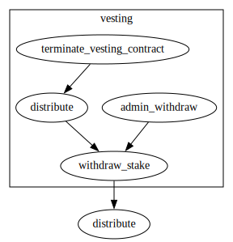

## Function `distribute_internal`

Distribute all unlocked (inactive) funds according to distribution shares.

<pre><code><b>fun</b> <a href="staking_contract.md#0x1_staking_contract_distribute_internal">distribute_internal</a>(staker: <b>address</b>, operator: <b>address</b>, <a href="staking_contract.md#0x1_staking_contract">staking_contract</a>: &<b>mut</b> <a href="staking_contract.md#0x1_staking_contract_StakingContract">staking_contract::StakingContract</a>, distribute_events: &<b>mut</b> <a href="event.md#0x1_event_EventHandle">event::EventHandle</a>&lt;<a href="staking_contract.md#0x1_staking_contract_DistributeEvent">staking_contract::DistributeEvent</a>&gt;)
</code></pre>

Implementation

<pre><code><b>fun</b> <a href="staking_contract.md#0x1_staking_contract_distribute_internal">distribute_internal</a>(
    staker: <b>address</b>,
    operator: <b>address</b>,
    <a href="staking_contract.md#0x1_staking_contract">staking_contract</a>: &<b>mut</b> <a href="staking_contract.md#0x1_staking_contract_StakingContract">StakingContract</a>,
    distribute_events: &<b>mut</b> EventHandle&lt;<a href="staking_contract.md#0x1_staking_contract_DistributeEvent">DistributeEvent</a>&gt;,
) {
    <b>let</b> pool_address = <a href="staking_contract.md#0x1_staking_contract">staking_contract</a>.pool_address;
    <b>let</b> (_, inactive, _, pending_inactive) = <a href="stake.md#0x1_stake_get_stake">stake::get_stake</a>(pool_address);
    <b>let</b> total_potential_withdrawable = inactive + pending_inactive;
    <b>let</b> coins = <a href="stake.md#0x1_stake_withdraw_with_cap">stake::withdraw_with_cap</a>(&<a href="staking_contract.md#0x1_staking_contract">staking_contract</a>.owner_cap, total_potential_withdrawable);
    <b>let</b> distribution_amount = <a href="coin.md#0x1_coin_value">coin::value</a>(&coins);
    <b>if</b> (distribution_amount == 0) {
        <a href="coin.md#0x1_coin_destroy_zero">coin::destroy_zero</a>(coins);
        <b>return</b>
    };

    <b>let</b> distribution_pool = &<b>mut</b> <a href="staking_contract.md#0x1_staking_contract">staking_contract</a>.distribution_pool;
    <a href="staking_contract.md#0x1_staking_contract_update_distribution_pool">update_distribution_pool</a>(
        distribution_pool, distribution_amount, operator, <a href="staking_contract.md#0x1_staking_contract">staking_contract</a>.commission_percentage);

    // Buy all recipients out of the distribution pool.
    <b>while</b> (<a href="../../aptos-stdlib/doc/pool_u64.md#0x1_pool_u64_shareholders_count">pool_u64::shareholders_count</a>(distribution_pool) &gt; 0) {
        <b>let</b> recipients = <a href="../../aptos-stdlib/doc/pool_u64.md#0x1_pool_u64_shareholders">pool_u64::shareholders</a>(distribution_pool);
        <b>let</b> recipient = *<a href="../../aptos-stdlib/../move-stdlib/doc/vector.md#0x1_vector_borrow">vector::borrow</a>(&<b>mut</b> recipients, 0);
        <b>let</b> current_shares = <a href="../../aptos-stdlib/doc/pool_u64.md#0x1_pool_u64_shares">pool_u64::shares</a>(distribution_pool, recipient);
        <b>let</b> amount_to_distribute = <a href="../../aptos-stdlib/doc/pool_u64.md#0x1_pool_u64_redeem_shares">pool_u64::redeem_shares</a>(distribution_pool, recipient, current_shares);
        <a href="coin.md#0x1_coin_deposit">coin::deposit</a>(recipient, <a href="coin.md#0x1_coin_extract">coin::extract</a>(&<b>mut</b> coins, amount_to_distribute));

        emit_event(
            distribute_events,
            <a href="staking_contract.md#0x1_staking_contract_DistributeEvent">DistributeEvent</a> { operator, pool_address, recipient, amount: amount_to_distribute }
        );
    };

    // In case there's <a href="../../aptos-stdlib/doc/any.md#0x1_any">any</a> dust left, send them all <b>to</b> the staker.
    <b>if</b> (<a href="coin.md#0x1_coin_value">coin::value</a>(&coins) &gt; 0) {
        <a href="coin.md#0x1_coin_deposit">coin::deposit</a>(staker, coins);
        <a href="../../aptos-stdlib/doc/pool_u64.md#0x1_pool_u64_update_total_coins">pool_u64::update_total_coins</a>(distribution_pool, 0);
    } <b>else</b> {
        <a href="coin.md#0x1_coin_destroy_zero">coin::destroy_zero</a>(coins);
    }
}
</code></pre>

Show all the functions that "distribute_internal" calls

Show all the functions that call "distribute_internal"

## Function `assert_staking_contract_exists`

<pre><code><b>fun</b> <a href="staking_contract.md#0x1_staking_contract_assert_staking_contract_exists">assert_staking_contract_exists</a>(staker: <b>address</b>, operator: <b>address</b>)
</code></pre>

Implementation

<pre><code><b>fun</b> <a href="staking_contract.md#0x1_staking_contract_assert_staking_contract_exists">assert_staking_contract_exists</a>(staker: <b>address</b>, operator: <b>address</b>) <b>acquires</b> <a href="staking_contract.md#0x1_staking_contract_Store">Store</a> {
    <b>assert</b>!(<b>exists</b>&lt;<a href="staking_contract.md#0x1_staking_contract_Store">Store</a>&gt;(staker), <a href="../../aptos-stdlib/../move-stdlib/doc/error.md#0x1_error_not_found">error::not_found</a>(<a href="staking_contract.md#0x1_staking_contract_ENO_STAKING_CONTRACT_FOUND_FOR_STAKER">ENO_STAKING_CONTRACT_FOUND_FOR_STAKER</a>));
    <b>let</b> staking_contracts = &<b>mut</b> <b>borrow_global_mut</b>&lt;<a href="staking_contract.md#0x1_staking_contract_Store">Store</a>&gt;(staker).staking_contracts;
    <b>assert</b>!(
        <a href="../../aptos-stdlib/doc/simple_map.md#0x1_simple_map_contains_key">simple_map::contains_key</a>(staking_contracts, &operator),
        <a href="../../aptos-stdlib/../move-stdlib/doc/error.md#0x1_error_not_found">error::not_found</a>(<a href="staking_contract.md#0x1_staking_contract_ENO_STAKING_CONTRACT_FOUND_FOR_OPERATOR">ENO_STAKING_CONTRACT_FOUND_FOR_OPERATOR</a>),
    );
}
</code></pre>

Show all the functions that "assert_staking_contract_exists" calls

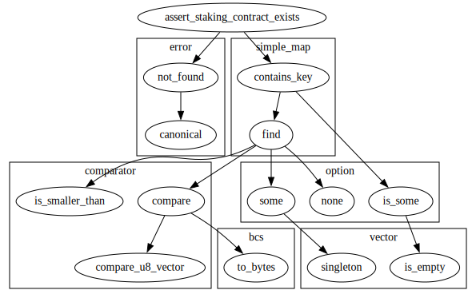

Show all the functions that call "assert_staking_contract_exists"

## Function `add_distribution`

<pre><code><b>fun</b> <a href="staking_contract.md#0x1_staking_contract_add_distribution">add_distribution</a>(operator: <b>address</b>, <a href="staking_contract.md#0x1_staking_contract">staking_contract</a>: &<b>mut</b> <a href="staking_contract.md#0x1_staking_contract_StakingContract">staking_contract::StakingContract</a>, recipient: <b>address</b>, coins_amount: u64, add_distribution_events: &<b>mut</b> <a href="event.md#0x1_event_EventHandle">event::EventHandle</a>&lt;<a href="staking_contract.md#0x1_staking_contract_AddDistributionEvent">staking_contract::AddDistributionEvent</a>&gt;)
</code></pre>

Implementation

<pre><code><b>fun</b> <a href="staking_contract.md#0x1_staking_contract_add_distribution">add_distribution</a>(
    operator: <b>address</b>,
    <a href="staking_contract.md#0x1_staking_contract">staking_contract</a>: &<b>mut</b> <a href="staking_contract.md#0x1_staking_contract_StakingContract">StakingContract</a>,
    recipient: <b>address</b>,
    coins_amount: u64,
    add_distribution_events: &<b>mut</b> EventHandle&lt;<a href="staking_contract.md#0x1_staking_contract_AddDistributionEvent">AddDistributionEvent</a>&gt;,
) {
    <b>let</b> distribution_pool = &<b>mut</b> <a href="staking_contract.md#0x1_staking_contract">staking_contract</a>.distribution_pool;
    <b>let</b> (_, _, _, total_distribution_amount) = <a href="stake.md#0x1_stake_get_stake">stake::get_stake</a>(<a href="staking_contract.md#0x1_staking_contract">staking_contract</a>.pool_address);
    <a href="staking_contract.md#0x1_staking_contract_update_distribution_pool">update_distribution_pool</a>(
        distribution_pool, total_distribution_amount, operator, <a href="staking_contract.md#0x1_staking_contract">staking_contract</a>.commission_percentage);

    <a href="../../aptos-stdlib/doc/pool_u64.md#0x1_pool_u64_buy_in">pool_u64::buy_in</a>(distribution_pool, recipient, coins_amount);
    <b>let</b> pool_address = <a href="staking_contract.md#0x1_staking_contract">staking_contract</a>.pool_address;
    emit_event(
        add_distribution_events,
        <a href="staking_contract.md#0x1_staking_contract_AddDistributionEvent">AddDistributionEvent</a> { operator, pool_address, amount: coins_amount }
    );
}
</code></pre>

Show all the functions that "add_distribution" calls

Show all the functions that call "add_distribution"

## Function `get_staking_contract_amounts_internal`

<pre><code><b>fun</b> <a href="staking_contract.md#0x1_staking_contract_get_staking_contract_amounts_internal">get_staking_contract_amounts_internal</a>(<a href="staking_contract.md#0x1_staking_contract">staking_contract</a>: &<a href="staking_contract.md#0x1_staking_contract_StakingContract">staking_contract::StakingContract</a>): (u64, u64, u64)
</code></pre>

Implementation

<pre><code><b>fun</b> <a href="staking_contract.md#0x1_staking_contract_get_staking_contract_amounts_internal">get_staking_contract_amounts_internal</a>(<a href="staking_contract.md#0x1_staking_contract">staking_contract</a>: &<a href="staking_contract.md#0x1_staking_contract_StakingContract">StakingContract</a>): (u64, u64, u64) {
    // Pending_inactive is not included in the calculation because pending_inactive can only come from:
    // 1. Outgoing commissions. This means commission <b>has</b> already been extracted.
    // 2. Stake withdrawals from stakers. This also means commission <b>has</b> already been extracted <b>as</b>
    // request_commission_internal is called in unlock_stake
    <b>let</b> (active, _, pending_active, _) = <a href="stake.md#0x1_stake_get_stake">stake::get_stake</a>(<a href="staking_contract.md#0x1_staking_contract">staking_contract</a>.pool_address);
    <b>let</b> total_active_stake = active + pending_active;
    <b>let</b> accumulated_rewards = total_active_stake - <a href="staking_contract.md#0x1_staking_contract">staking_contract</a>.principal;
    <b>let</b> commission_amount = accumulated_rewards * <a href="staking_contract.md#0x1_staking_contract">staking_contract</a>.commission_percentage / 100;

    (total_active_stake, accumulated_rewards, commission_amount)
}
</code></pre>

Show all the functions that "get_staking_contract_amounts_internal" calls

Show all the functions that call "get_staking_contract_amounts_internal"

## Function `create_stake_pool`

<pre><code><b>fun</b> <a href="staking_contract.md#0x1_staking_contract_create_stake_pool">create_stake_pool</a>(staker: &<a href="../../aptos-stdlib/../move-stdlib/doc/signer.md#0x1_signer">signer</a>, operator: <b>address</b>, voter: <b>address</b>, contract_creation_seed: <a href="../../aptos-stdlib/../move-stdlib/doc/vector.md#0x1_vector">vector</a>&lt;u8&gt;): (<a href="../../aptos-stdlib/../move-stdlib/doc/signer.md#0x1_signer">signer</a>, <a href="account.md#0x1_account_SignerCapability">account::SignerCapability</a>, <a href="stake.md#0x1_stake_OwnerCapability">stake::OwnerCapability</a>)
</code></pre>

Implementation

<pre><code><b>fun</b> <a href="staking_contract.md#0x1_staking_contract_create_stake_pool">create_stake_pool</a>(
    staker: &<a href="../../aptos-stdlib/../move-stdlib/doc/signer.md#0x1_signer">signer</a>,
    operator: <b>address</b>,
    voter: <b>address</b>,
    contract_creation_seed: <a href="../../aptos-stdlib/../move-stdlib/doc/vector.md#0x1_vector">vector</a>&lt;u8&gt;,
): (<a href="../../aptos-stdlib/../move-stdlib/doc/signer.md#0x1_signer">signer</a>, SignerCapability, OwnerCapability) {
    // Generate a seed that will be used <b>to</b> create the resource <a href="account.md#0x1_account">account</a> that hosts the staking contract.
    <b>let</b> seed = <a href="../../aptos-stdlib/../move-stdlib/doc/bcs.md#0x1_bcs_to_bytes">bcs::to_bytes</a>(&<a href="../../aptos-stdlib/../move-stdlib/doc/signer.md#0x1_signer_address_of">signer::address_of</a>(staker));
    <a href="../../aptos-stdlib/../move-stdlib/doc/vector.md#0x1_vector_append">vector::append</a>(&<b>mut</b> seed, <a href="../../aptos-stdlib/../move-stdlib/doc/bcs.md#0x1_bcs_to_bytes">bcs::to_bytes</a>(&operator));
    // Include a salt <b>to</b> avoid conflicts <b>with</b> <a href="../../aptos-stdlib/doc/any.md#0x1_any">any</a> other modules out there that might also generate
    // deterministic resource accounts for the same staker + operator addresses.
    <a href="../../aptos-stdlib/../move-stdlib/doc/vector.md#0x1_vector_append">vector::append</a>(&<b>mut</b> seed, <a href="staking_contract.md#0x1_staking_contract_SALT">SALT</a>);
    // Add an extra salt given by the staker in case an <a href="account.md#0x1_account">account</a> <b>with</b> the same <b>address</b> <b>has</b> already been created.
    <a href="../../aptos-stdlib/../move-stdlib/doc/vector.md#0x1_vector_append">vector::append</a>(&<b>mut</b> seed, contract_creation_seed);

    <b>let</b> (stake_pool_signer, stake_pool_signer_cap) = <a href="account.md#0x1_account_create_resource_account">account::create_resource_account</a>(staker, seed);
    <a href="stake.md#0x1_stake_initialize_stake_owner">stake::initialize_stake_owner</a>(&stake_pool_signer, 0, operator, voter);

    // Extract owner_cap from the StakePool, so we have control over it in the staking_contracts flow.
    // This is stored <b>as</b> part of the <a href="staking_contract.md#0x1_staking_contract">staking_contract</a>. Thus, the staker would not have direct control over it without
    // going through well-defined functions in this <b>module</b>.
    <b>let</b> owner_cap = <a href="stake.md#0x1_stake_extract_owner_cap">stake::extract_owner_cap</a>(&stake_pool_signer);

    (stake_pool_signer, stake_pool_signer_cap, owner_cap)
}
</code></pre>

Show all the functions that "create_stake_pool" calls

Show all the functions that call "create_stake_pool"

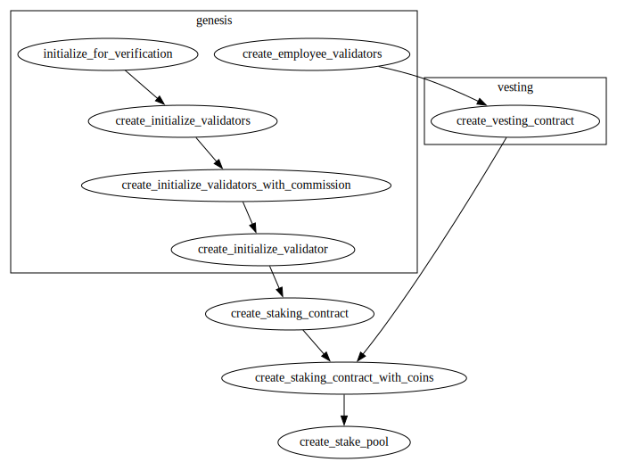

## Function `update_distribution_pool`

<pre><code><b>fun</b> <a href="staking_contract.md#0x1_staking_contract_update_distribution_pool">update_distribution_pool</a>(distribution_pool: &<b>mut</b> <a href="../../aptos-stdlib/doc/pool_u64.md#0x1_pool_u64_Pool">pool_u64::Pool</a>, updated_total_coins: u64, operator: <b>address</b>, commission_percentage: u64)
</code></pre>

Implementation

<pre><code><b>fun</b> <a href="staking_contract.md#0x1_staking_contract_update_distribution_pool">update_distribution_pool</a>(
    distribution_pool: &<b>mut</b> Pool,
    updated_total_coins: u64,
    operator: <b>address</b>,
    commission_percentage: u64,
) {
    // Short-circuit and do nothing <b>if</b> the pool's total value <b>has</b> not changed.
    <b>if</b> (<a href="../../aptos-stdlib/doc/pool_u64.md#0x1_pool_u64_total_coins">pool_u64::total_coins</a>(distribution_pool) == updated_total_coins) {
        <b>return</b>
    };

    // Charge all stakeholders (<b>except</b> for the operator themselves) commission on <a href="../../aptos-stdlib/doc/any.md#0x1_any">any</a> rewards earnt relatively <b>to</b> the
    // previous value of the distribution pool.
    <b>let</b> shareholders = &<a href="../../aptos-stdlib/doc/pool_u64.md#0x1_pool_u64_shareholders">pool_u64::shareholders</a>(distribution_pool);
    <b>let</b> len = <a href="../../aptos-stdlib/../move-stdlib/doc/vector.md#0x1_vector_length">vector::length</a>(shareholders);
    <b>let</b> i = 0;
    <b>while</b> (i &lt; len) {
        <b>let</b> shareholder = *<a href="../../aptos-stdlib/../move-stdlib/doc/vector.md#0x1_vector_borrow">vector::borrow</a>(shareholders, i);
        <b>if</b> (shareholder != operator) {
            <b>let</b> shares = <a href="../../aptos-stdlib/doc/pool_u64.md#0x1_pool_u64_shares">pool_u64::shares</a>(distribution_pool, shareholder);
            <b>let</b> previous_worth = <a href="../../aptos-stdlib/doc/pool_u64.md#0x1_pool_u64_balance">pool_u64::balance</a>(distribution_pool, shareholder);
            <b>let</b> current_worth = <a href="../../aptos-stdlib/doc/pool_u64.md#0x1_pool_u64_shares_to_amount_with_total_coins">pool_u64::shares_to_amount_with_total_coins</a>(
                distribution_pool, shares, updated_total_coins);
            <b>let</b> unpaid_commission = (current_worth - previous_worth) * commission_percentage / 100;
            // Transfer shares from current shareholder <b>to</b> the operator <b>as</b> payment.
            // The value of the shares should <b>use</b> the updated pool's total value.
            <b>let</b> shares_to_transfer = <a href="../../aptos-stdlib/doc/pool_u64.md#0x1_pool_u64_amount_to_shares_with_total_coins">pool_u64::amount_to_shares_with_total_coins</a>(
                distribution_pool, unpaid_commission, updated_total_coins);
            <a href="../../aptos-stdlib/doc/pool_u64.md#0x1_pool_u64_transfer_shares">pool_u64::transfer_shares</a>(distribution_pool, shareholder, operator, shares_to_transfer);
        };

        i = i + 1;
    };

    <a href="../../aptos-stdlib/doc/pool_u64.md#0x1_pool_u64_update_total_coins">pool_u64::update_total_coins</a>(distribution_pool, updated_total_coins);
}
</code></pre>

Show all the functions that "update_distribution_pool" calls

Show all the functions that call "update_distribution_pool"

## Function `new_staking_contracts_holder`

<pre><code><b>fun</b> <a href="staking_contract.md#0x1_staking_contract_new_staking_contracts_holder">new_staking_contracts_holder</a>(staker: &<a href="../../aptos-stdlib/../move-stdlib/doc/signer.md#0x1_signer">signer</a>): <a href="staking_contract.md#0x1_staking_contract_Store">staking_contract::Store</a>
</code></pre>

Implementation

<pre><code><b>fun</b> <a href="staking_contract.md#0x1_staking_contract_new_staking_contracts_holder">new_staking_contracts_holder</a>(staker: &<a href="../../aptos-stdlib/../move-stdlib/doc/signer.md#0x1_signer">signer</a>): <a href="staking_contract.md#0x1_staking_contract_Store">Store</a> {
    <a href="staking_contract.md#0x1_staking_contract_Store">Store</a> {
        staking_contracts: <a href="../../aptos-stdlib/doc/simple_map.md#0x1_simple_map_create">simple_map::create</a>&lt;<b>address</b>, <a href="staking_contract.md#0x1_staking_contract_StakingContract">StakingContract</a>&gt;(),
        // Events.
        create_staking_contract_events: <a href="account.md#0x1_account_new_event_handle">account::new_event_handle</a>&lt;<a href="staking_contract.md#0x1_staking_contract_CreateStakingContractEvent">CreateStakingContractEvent</a>&gt;(staker),
        update_voter_events: <a href="account.md#0x1_account_new_event_handle">account::new_event_handle</a>&lt;<a href="staking_contract.md#0x1_staking_contract_UpdateVoterEvent">UpdateVoterEvent</a>&gt;(staker),
        reset_lockup_events: <a href="account.md#0x1_account_new_event_handle">account::new_event_handle</a>&lt;<a href="staking_contract.md#0x1_staking_contract_ResetLockupEvent">ResetLockupEvent</a>&gt;(staker),
        add_stake_events: <a href="account.md#0x1_account_new_event_handle">account::new_event_handle</a>&lt;<a href="staking_contract.md#0x1_staking_contract_AddStakeEvent">AddStakeEvent</a>&gt;(staker),
        request_commission_events: <a href="account.md#0x1_account_new_event_handle">account::new_event_handle</a>&lt;<a href="staking_contract.md#0x1_staking_contract_RequestCommissionEvent">RequestCommissionEvent</a>&gt;(staker),
        unlock_stake_events: <a href="account.md#0x1_account_new_event_handle">account::new_event_handle</a>&lt;<a href="staking_contract.md#0x1_staking_contract_UnlockStakeEvent">UnlockStakeEvent</a>&gt;(staker),
        switch_operator_events: <a href="account.md#0x1_account_new_event_handle">account::new_event_handle</a>&lt;<a href="staking_contract.md#0x1_staking_contract_SwitchOperatorEvent">SwitchOperatorEvent</a>&gt;(staker),
        add_distribution_events: <a href="account.md#0x1_account_new_event_handle">account::new_event_handle</a>&lt;<a href="staking_contract.md#0x1_staking_contract_AddDistributionEvent">AddDistributionEvent</a>&gt;(staker),
        distribute_events: <a href="account.md#0x1_account_new_event_handle">account::new_event_handle</a>&lt;<a href="staking_contract.md#0x1_staking_contract_DistributeEvent">DistributeEvent</a>&gt;(staker),
    }
}
</code></pre>

Show all the functions that "new_staking_contracts_holder" calls

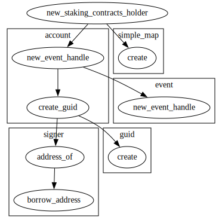

Show all the functions that call "new_staking_contracts_holder"

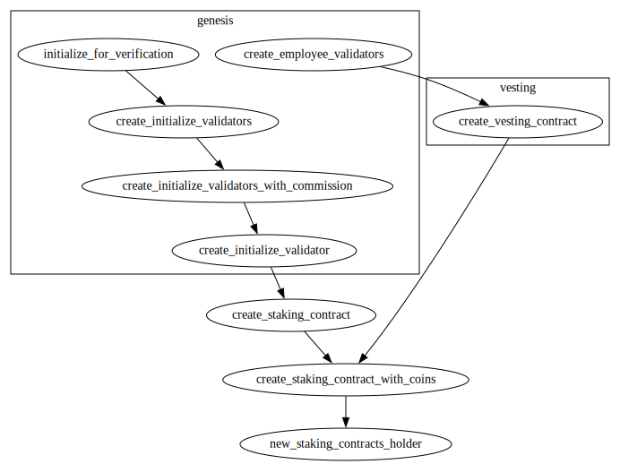

## Specification

<pre><code><b>pragma</b> verify = <b>false</b>;
</code></pre>

[move-book]: https://move-language.github.io/move/introduction.html
