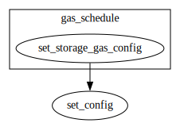
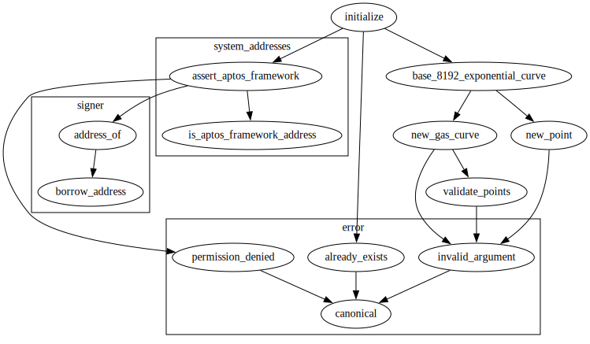
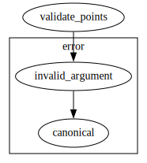
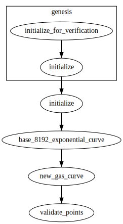
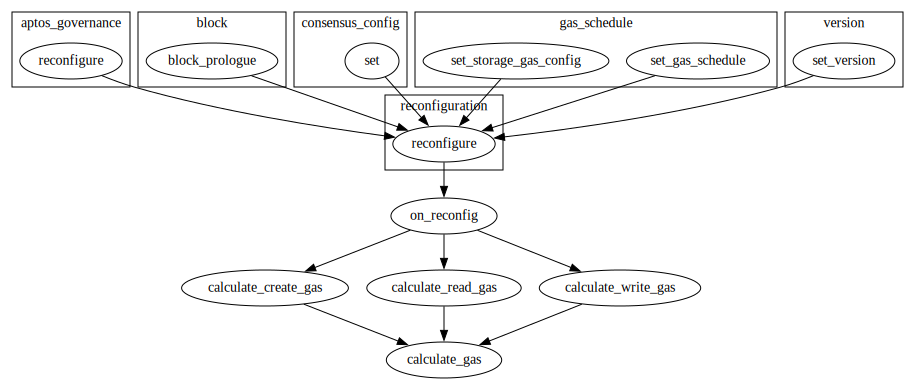
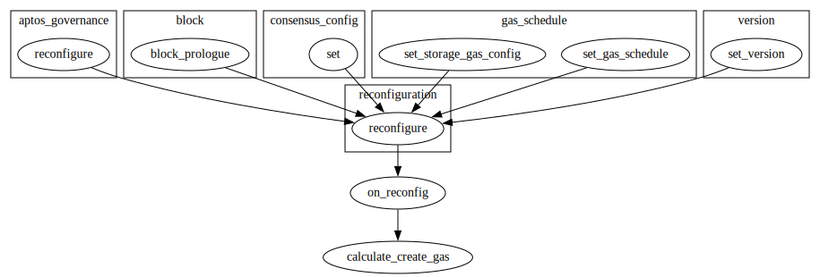
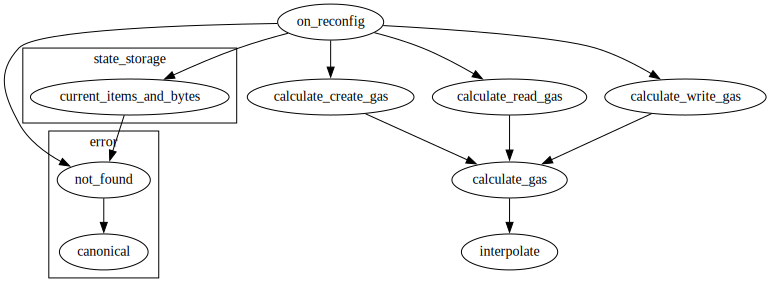

# Module `0x1::storage_gas`

Gas parameters for global storage.

## General overview sections

[Definitions](#definitions)

* [Utilization dimensions](#utilization-dimensions)
* [Utilization ratios](#utilization-ratios)
* [Gas curve lookup](#gas-curve-lookup)
* [Item-wise operations](#item-wise-operations)
* [Byte-wise operations](#byte-wise-operations)

[Function dependencies](#function-dependencies)

* [Initialization](#initialization)
* [Reconfiguration](#reconfiguration)
* [Setting configurations](#setting-configurations)

## Definitions

### Utilization dimensions

Global storage gas fluctuates each epoch based on total utilization,
which is defined across two dimensions:

1. The number of "items" in global storage.
2. The number of bytes in global storage.

"Items" include:

1. Resources having the <code>key</code> attribute, which have been moved into
global storage via a <code><b>move_to</b>()</code> operation.
2.  Table entries.

### Utilization ratios

<code><a href="storage_gas.md#0x1_storage_gas_initialize">initialize</a>()</code> sets an arbitrary "target" utilization for both
item-wise and byte-wise storage, then each epoch, gas parameters are
reconfigured based on the "utilization ratio" for each of the two
utilization dimensions. The utilization ratio for a given dimension,
either item-wise or byte-wise, is taken as the quotient of actual
utilization and target utilization. For example, given a 500 GB
target and 250 GB actual utilization, the byte-wise utilization
ratio is 50%.

See <code><a href="storage_gas.md#0x1_storage_gas_base_8192_exponential_curve">base_8192_exponential_curve</a>()</code> for mathematical definitions.

### Gas curve lookup

The utilization ratio in a given epoch is used as a lookup value in
a Eulerian approximation to an exponential curve, known as a
<code><a href="storage_gas.md#0x1_storage_gas_GasCurve">GasCurve</a></code>, which is defined in <code><a href="storage_gas.md#0x1_storage_gas_base_8192_exponential_curve">base_8192_exponential_curve</a>()</code>,
based on a minimum gas charge and a maximum gas charge.

The minimum gas charge and maximum gas charge at the endpoints of
the curve are set in <code><a href="storage_gas.md#0x1_storage_gas_initialize">initialize</a>()</code>, and correspond to the following
operations defined in <code><a href="storage_gas.md#0x1_storage_gas_StorageGas">StorageGas</a></code>:

1. Per-item read
2. Per-item create
3. Per-item write
4. Per-byte read
5. Per-byte create
6. Per-byte write

For example, if the byte-wise utilization ratio is 50%, then
per-byte reads will charge the minimum per-byte gas cost, plus
1.09% of the difference between the maximum and the minimum cost.
See <code><a href="storage_gas.md#0x1_storage_gas_base_8192_exponential_curve">base_8192_exponential_curve</a>()</code> for a supporting calculation.

### Item-wise operations

1. Per-item read gas is assessed whenever an item is read from
global storage via <code><b>borrow_global</b>&lt;T&gt;()</code> or via a table entry read
operation.
2. Per-item create gas is assessed whenever an item is created in
global storage via <code><b>move_to</b>&lt;T&gt;()</code> or via a table entry creation
operation.
3. Per-item write gas is assessed whenever an item is overwritten in
global storage via <code><b>borrow_global_mut</b>&lt;T&gt;</code> or via a table entry
mutation operation.

### Byte-wise operations

Byte-wise operations are assessed in a manner similar to per-item
operations, but account for the number of bytes affected by the
given operation. Notably, this number denotes the total number of
bytes in an *entire item*.

For example, if an operation mutates a <code>u8</code> field in a resource that
has 5 other <code>u128</code> fields, the per-byte gas write cost will account
for $(5 * 128) / 8 + 1 = 81$ bytes. Vectors are similarly treated
as fields.

## Function dependencies

The below dependency chart uses <code>mermaid.js</code> syntax, which can be
automatically rendered into a diagram (depending on the browser)
when viewing the documentation file generated from source code. If
a browser renders the diagrams with coloring that makes it difficult
to read, try a different browser.

### Initialization

```mermaid

flowchart LR

initialize --> base_8192_exponential_curve
base_8192_exponential_curve --> new_gas_curve
base_8192_exponential_curve --> new_point
new_gas_curve --> validate_points

```

### Reconfiguration

```mermaid

flowchart LR

calculate_gas --> Interpolate %% capitalized
calculate_read_gas --> calculate_gas
calculate_create_gas --> calculate_gas
calculate_write_gas --> calculate_gas
on_reconfig --> calculate_read_gas
on_reconfig --> calculate_create_gas
on_reconfig --> calculate_write_gas
reconfiguration::reconfigure --> on_reconfig

```

Here, the function <code><a href="storage_gas.md#0x1_storage_gas_interpolate">interpolate</a>()</code> is spelled <code>Interpolate</code> because
<code>interpolate</code> is a reserved word in <code>mermaid.js</code>.

### Setting configurations

```mermaid

flowchart LR

gas_schedule::set_storage_gas_config --> set_config

```

## Complete docgen index

The below index is automatically generated from source code:

-  [General overview sections](#@General_overview_sections_0)
-  [Definitions](#@Definitions_1)
    -  [Utilization dimensions](#@Utilization_dimensions_2)
    -  [Utilization ratios](#@Utilization_ratios_3)
    -  [Gas curve lookup](#@Gas_curve_lookup_4)
    -  [Item-wise operations](#@Item-wise_operations_5)
    -  [Byte-wise operations](#@Byte-wise_operations_6)
-  [Function dependencies](#@Function_dependencies_7)
    -  [Initialization](#@Initialization_8)
    -  [Reconfiguration](#@Reconfiguration_9)
    -  [Setting configurations](#@Setting_configurations_10)
-  [Complete docgen index](#@Complete_docgen_index_11)
-  [Resource `StorageGas`](#0x1_storage_gas_StorageGas)
-  [Struct `Point`](#0x1_storage_gas_Point)
-  [Struct `UsageGasConfig`](#0x1_storage_gas_UsageGasConfig)
-  [Struct `GasCurve`](#0x1_storage_gas_GasCurve)
-  [Resource `StorageGasConfig`](#0x1_storage_gas_StorageGasConfig)
-  [Constants](#@Constants_12)
-  [Function `base_8192_exponential_curve`](#0x1_storage_gas_base_8192_exponential_curve)
    -  [Function definition](#@Function_definition_13)
    -  [Example](#@Example_14)
    -  [Utilization multipliers](#@Utilization_multipliers_15)
-  [Function `new_point`](#0x1_storage_gas_new_point)
-  [Function `new_gas_curve`](#0x1_storage_gas_new_gas_curve)
-  [Function `new_usage_gas_config`](#0x1_storage_gas_new_usage_gas_config)
-  [Function `new_storage_gas_config`](#0x1_storage_gas_new_storage_gas_config)
-  [Function `set_config`](#0x1_storage_gas_set_config)
-  [Function `initialize`](#0x1_storage_gas_initialize)
-  [Function `validate_points`](#0x1_storage_gas_validate_points)
-  [Function `calculate_gas`](#0x1_storage_gas_calculate_gas)
-  [Function `interpolate`](#0x1_storage_gas_interpolate)
-  [Function `calculate_read_gas`](#0x1_storage_gas_calculate_read_gas)
-  [Function `calculate_create_gas`](#0x1_storage_gas_calculate_create_gas)
-  [Function `calculate_write_gas`](#0x1_storage_gas_calculate_write_gas)
-  [Function `on_reconfig`](#0x1_storage_gas_on_reconfig)
-  [Specification](#@Specification_16)
    -  [Struct `Point`](#@Specification_16_Point)
    -  [Struct `UsageGasConfig`](#@Specification_16_UsageGasConfig)
    -  [Struct `GasCurve`](#@Specification_16_GasCurve)
    -  [Function `validate_points`](#@Specification_16_validate_points)
    -  [Function `calculate_gas`](#@Specification_16_calculate_gas)
    -  [Function `interpolate`](#@Specification_16_interpolate)
    -  [Function `on_reconfig`](#@Specification_16_on_reconfig)

<pre><code><b>use</b> <a href="../../aptos-stdlib/../move-stdlib/doc/error.md#0x1_error">0x1::error</a>;
<b>use</b> <a href="state_storage.md#0x1_state_storage">0x1::state_storage</a>;
<b>use</b> <a href="system_addresses.md#0x1_system_addresses">0x1::system_addresses</a>;
</code></pre>

Show all the modules that "storage_gas" depends on directly or indirectly

Show all the modules that depend on "storage_gas" directly or indirectly

## Resource `StorageGas`

Storage parameters, reconfigured each epoch.

Parameters are updated during reconfiguration via
<code><a href="storage_gas.md#0x1_storage_gas_on_reconfig">on_reconfig</a>()</code>, based on storage utilization at the beginning
of the epoch in which the reconfiguration transaction is
executed. The gas schedule derived from these parameters will
then be used to calculate gas for the entirety of the
following epoch, such that the data is one epoch older than
ideal. Notably, however, per this approach, the virtual machine
does not need to reload gas parameters after the
first transaction of an epoch.

<pre><code><b>struct</b> <a href="storage_gas.md#0x1_storage_gas_StorageGas">StorageGas</a> <b>has</b> key
</code></pre>

Fields

<dl>
<dt>
<code>per_item_read: u64</code>
</dt>
<dd>
 Cost to read an item from global storage.
</dd>
<dt>
<code>per_item_create: u64</code>
</dt>
<dd>
 Cost to create an item in global storage.
</dd>
<dt>
<code>per_item_write: u64</code>
</dt>
<dd>
 Cost to overwrite an item in global storage.
</dd>
<dt>
<code>per_byte_read: u64</code>
</dt>
<dd>
 Cost to read a byte from global storage.
</dd>
<dt>
<code>per_byte_create: u64</code>
</dt>
<dd>
 Cost to create a byte in global storage.
</dd>
<dt>
<code>per_byte_write: u64</code>
</dt>
<dd>
 Cost to overwrite a byte in global storage.
</dd>
</dl>

## Struct `Point`

A point in a Eulerian curve approximation, with each coordinate
given in basis points:

| Field value | Percentage |
|-------------|------------|
| <code>1</code>         | 00.01 %    |
| <code>10</code>        | 00.10 %    |
| <code>100</code>       | 01.00 %    |
| <code>1000</code>      | 10.00 %    |

<pre><code><b>struct</b> <a href="storage_gas.md#0x1_storage_gas_Point">Point</a> <b>has</b> <b>copy</b>, drop, store
</code></pre>

Fields

<dl>
<dt>
<code>x: u64</code>
</dt>
<dd>
 x-coordinate basis points, corresponding to utilization
 ratio in <code><a href="storage_gas.md#0x1_storage_gas_base_8192_exponential_curve">base_8192_exponential_curve</a>()</code>.
</dd>
<dt>
<code>y: u64</code>
</dt>
<dd>
 y-coordinate basis points, corresponding to utilization
 multiplier in <code><a href="storage_gas.md#0x1_storage_gas_base_8192_exponential_curve">base_8192_exponential_curve</a>()</code>.
</dd>
</dl>

## Struct `UsageGasConfig`

A gas configuration for either per-item or per-byte costs.

Contains a target usage amount, as well as a Eulerian
approximation of an exponential curve for reads, creations, and
overwrites. See <code><a href="storage_gas.md#0x1_storage_gas_StorageGasConfig">StorageGasConfig</a></code>.

<pre><code><b>struct</b> <a href="storage_gas.md#0x1_storage_gas_UsageGasConfig">UsageGasConfig</a> <b>has</b> <b>copy</b>, drop, store
</code></pre>

Fields

<dl>
<dt>
<code>target_usage: u64</code>
</dt>
<dd>

</dd>
<dt>
<code>read_curve: <a href="storage_gas.md#0x1_storage_gas_GasCurve">storage_gas::GasCurve</a></code>
</dt>
<dd>

</dd>
<dt>
<code>create_curve: <a href="storage_gas.md#0x1_storage_gas_GasCurve">storage_gas::GasCurve</a></code>
</dt>
<dd>

</dd>
<dt>
<code>write_curve: <a href="storage_gas.md#0x1_storage_gas_GasCurve">storage_gas::GasCurve</a></code>
</dt>
<dd>

</dd>
</dl>

## Struct `GasCurve`

Eulerian approximation of an exponential curve.

Assumes the following endpoints:

* $(x_0, y_0) = (0, 0)$
* $(x_f, y_f) = (10000, 10000)$

Intermediate points must satisfy:

1. $x_i > x_{i - 1}$ ( $x$ is strictly increasing).
2. $0 \leq x_i \leq 10000$ ( $x$ is between 0 and 10000).
3. $y_i \geq y_{i - 1}$ ( $y$ is non-decreasing).
4. $0 \leq y_i \leq 10000$ ( $y$ is between 0 and 10000).

Lookup between two successive points is calculated via linear
interpolation, e.g., as if there were a straight line between
them.

See <code><a href="storage_gas.md#0x1_storage_gas_base_8192_exponential_curve">base_8192_exponential_curve</a>()</code>.

<pre><code><b>struct</b> <a href="storage_gas.md#0x1_storage_gas_GasCurve">GasCurve</a> <b>has</b> <b>copy</b>, drop, store
</code></pre>

Fields

<dl>
<dt>
<code>min_gas: u64</code>
</dt>
<dd>

</dd>
<dt>
<code>max_gas: u64</code>
</dt>
<dd>

</dd>
<dt>
<code>points: <a href="../../aptos-stdlib/../move-stdlib/doc/vector.md#0x1_vector">vector</a>&lt;<a href="storage_gas.md#0x1_storage_gas_Point">storage_gas::Point</a>&gt;</code>
</dt>
<dd>

</dd>
</dl>

## Resource `StorageGasConfig`

Gas configurations for per-item and per-byte prices.

<pre><code><b>struct</b> <a href="storage_gas.md#0x1_storage_gas_StorageGasConfig">StorageGasConfig</a> <b>has</b> <b>copy</b>, drop, key
</code></pre>

Fields

<dl>
<dt>
<code>item_config: <a href="storage_gas.md#0x1_storage_gas_UsageGasConfig">storage_gas::UsageGasConfig</a></code>
</dt>
<dd>
 Per-item gas configuration.
</dd>
<dt>
<code>byte_config: <a href="storage_gas.md#0x1_storage_gas_UsageGasConfig">storage_gas::UsageGasConfig</a></code>
</dt>
<dd>
 Per-byte gas configuration.
</dd>
</dl>

## Constants

<pre><code><b>const</b> <a href="storage_gas.md#0x1_storage_gas_MAX_U64">MAX_U64</a>: u64 = 18446744073709551615;
</code></pre>

<pre><code><b>const</b> <a href="storage_gas.md#0x1_storage_gas_BASIS_POINT_DENOMINATION">BASIS_POINT_DENOMINATION</a>: u64 = 10000;
</code></pre>

<pre><code><b>const</b> <a href="storage_gas.md#0x1_storage_gas_EINVALID_GAS_RANGE">EINVALID_GAS_RANGE</a>: u64 = 2;
</code></pre>

<pre><code><b>const</b> <a href="storage_gas.md#0x1_storage_gas_EINVALID_MONOTONICALLY_NON_DECREASING_CURVE">EINVALID_MONOTONICALLY_NON_DECREASING_CURVE</a>: u64 = 5;
</code></pre>

<pre><code><b>const</b> <a href="storage_gas.md#0x1_storage_gas_EINVALID_POINT_RANGE">EINVALID_POINT_RANGE</a>: u64 = 6;
</code></pre>

<pre><code><b>const</b> <a href="storage_gas.md#0x1_storage_gas_ESTORAGE_GAS">ESTORAGE_GAS</a>: u64 = 1;
</code></pre>

<pre><code><b>const</b> <a href="storage_gas.md#0x1_storage_gas_ESTORAGE_GAS_CONFIG">ESTORAGE_GAS_CONFIG</a>: u64 = 0;
</code></pre>

<pre><code><b>const</b> <a href="storage_gas.md#0x1_storage_gas_ETARGET_USAGE_TOO_BIG">ETARGET_USAGE_TOO_BIG</a>: u64 = 4;
</code></pre>

<pre><code><b>const</b> <a href="storage_gas.md#0x1_storage_gas_EZERO_TARGET_USAGE">EZERO_TARGET_USAGE</a>: u64 = 3;
</code></pre>

## Function `base_8192_exponential_curve`

Default exponential curve having base 8192.

### Function definition

Gas price as a function of utilization ratio is defined as:

$$g(u_r) = g_{min} + \frac{(b^{u_r} - 1)}{b - 1} \Delta_g$$

$$g(u_r) = g_{min} + u_m \Delta_g$$

| Variable                            | Description            |
|-------------------------------------|------------------------|
| $g_{min}$                           | <code>min_gas</code>              |
| $g_{max}$                           | <code>max_gas</code>              |
| $\Delta_{g} = g_{max} - g_{min}$    | Gas delta              |
| $u$                                 | Utilization            |
| $u_t$                               | Target utilization     |
| $u_r = u / u_t$                     | Utilization ratio      |
| $u_m = \frac{(b^{u_r} - 1)}{b - 1}$ | Utilization multiplier |
| $b = 8192$                          | Exponent base          |

### Example

Hence for a utilization ratio of 50% ( $u_r = 0.5$ ):

$$g(0.5) = g_{min} + \frac{8192^{0.5} - 1}{8192 - 1} \Delta_g$$

$$g(0.5) \approx g_{min} + 0.0109 \Delta_g$$

Which means that the price above <code>min_gas</code> is approximately
1.09% of the difference between <code>max_gas</code> and <code>min_gas</code>.

### Utilization multipliers

| $u_r$ | $u_m$ (approximate) |
|-------|---------------------|
| 10%   | 0.02%               |
| 20%   | 0.06%               |
| 30%   | 0.17%               |
| 40%   | 0.44%               |
| 50%   | 1.09%               |
| 60%   | 2.71%               |
| 70%   | 6.69%               |
| 80%   | 16.48%              |
| 90%   | 40.61%              |
| 95%   | 63.72%              |
| 99%   | 91.38%              |

<pre><code><b>public</b> <b>fun</b> <a href="storage_gas.md#0x1_storage_gas_base_8192_exponential_curve">base_8192_exponential_curve</a>(min_gas: u64, max_gas: u64): <a href="storage_gas.md#0x1_storage_gas_GasCurve">storage_gas::GasCurve</a>
</code></pre>

Implementation

<pre><code><b>public</b> <b>fun</b> <a href="storage_gas.md#0x1_storage_gas_base_8192_exponential_curve">base_8192_exponential_curve</a>(min_gas: u64, max_gas: u64): <a href="storage_gas.md#0x1_storage_gas_GasCurve">GasCurve</a> {
    <a href="storage_gas.md#0x1_storage_gas_new_gas_curve">new_gas_curve</a>(min_gas, max_gas,
        <a href="../../aptos-stdlib/../move-stdlib/doc/vector.md#0x1_vector">vector</a>[
            <a href="storage_gas.md#0x1_storage_gas_new_point">new_point</a>(1000, 2),
            <a href="storage_gas.md#0x1_storage_gas_new_point">new_point</a>(2000, 6),
            <a href="storage_gas.md#0x1_storage_gas_new_point">new_point</a>(3000, 17),
            <a href="storage_gas.md#0x1_storage_gas_new_point">new_point</a>(4000, 44),
            <a href="storage_gas.md#0x1_storage_gas_new_point">new_point</a>(5000, 109),
            <a href="storage_gas.md#0x1_storage_gas_new_point">new_point</a>(6000, 271),
            <a href="storage_gas.md#0x1_storage_gas_new_point">new_point</a>(7000, 669),
            <a href="storage_gas.md#0x1_storage_gas_new_point">new_point</a>(8000, 1648),
            <a href="storage_gas.md#0x1_storage_gas_new_point">new_point</a>(9000, 4061),
            <a href="storage_gas.md#0x1_storage_gas_new_point">new_point</a>(9500, 6372),
            <a href="storage_gas.md#0x1_storage_gas_new_point">new_point</a>(9900, 9138),
        ]
    )
}
</code></pre>

Show all the functions that "base_8192_exponential_curve" calls

Show all the functions that call "base_8192_exponential_curve"

## Function `new_point`

<pre><code><b>public</b> <b>fun</b> <a href="storage_gas.md#0x1_storage_gas_new_point">new_point</a>(x: u64, y: u64): <a href="storage_gas.md#0x1_storage_gas_Point">storage_gas::Point</a>
</code></pre>

Implementation

<pre><code><b>public</b> <b>fun</b> <a href="storage_gas.md#0x1_storage_gas_new_point">new_point</a>(x: u64, y: u64): <a href="storage_gas.md#0x1_storage_gas_Point">Point</a> {
    <b>assert</b>!(
        x &lt;= <a href="storage_gas.md#0x1_storage_gas_BASIS_POINT_DENOMINATION">BASIS_POINT_DENOMINATION</a> && y &lt;= <a href="storage_gas.md#0x1_storage_gas_BASIS_POINT_DENOMINATION">BASIS_POINT_DENOMINATION</a>,
        <a href="../../aptos-stdlib/../move-stdlib/doc/error.md#0x1_error_invalid_argument">error::invalid_argument</a>(<a href="storage_gas.md#0x1_storage_gas_EINVALID_POINT_RANGE">EINVALID_POINT_RANGE</a>)
    );
    <a href="storage_gas.md#0x1_storage_gas_Point">Point</a> { x, y }
}
</code></pre>

Show all the functions that "new_point" calls

Show all the functions that call "new_point"

## Function `new_gas_curve`

<pre><code><b>public</b> <b>fun</b> <a href="storage_gas.md#0x1_storage_gas_new_gas_curve">new_gas_curve</a>(min_gas: u64, max_gas: u64, points: <a href="../../aptos-stdlib/../move-stdlib/doc/vector.md#0x1_vector">vector</a>&lt;<a href="storage_gas.md#0x1_storage_gas_Point">storage_gas::Point</a>&gt;): <a href="storage_gas.md#0x1_storage_gas_GasCurve">storage_gas::GasCurve</a>
</code></pre>

Implementation

<pre><code><b>public</b> <b>fun</b> <a href="storage_gas.md#0x1_storage_gas_new_gas_curve">new_gas_curve</a>(min_gas: u64, max_gas: u64, points: <a href="../../aptos-stdlib/../move-stdlib/doc/vector.md#0x1_vector">vector</a>&lt;<a href="storage_gas.md#0x1_storage_gas_Point">Point</a>&gt;): <a href="storage_gas.md#0x1_storage_gas_GasCurve">GasCurve</a> {
    <b>assert</b>!(max_gas &gt;= min_gas, <a href="../../aptos-stdlib/../move-stdlib/doc/error.md#0x1_error_invalid_argument">error::invalid_argument</a>(<a href="storage_gas.md#0x1_storage_gas_EINVALID_GAS_RANGE">EINVALID_GAS_RANGE</a>));
    <b>assert</b>!(max_gas &lt;= <a href="storage_gas.md#0x1_storage_gas_MAX_U64">MAX_U64</a> / <a href="storage_gas.md#0x1_storage_gas_BASIS_POINT_DENOMINATION">BASIS_POINT_DENOMINATION</a>, <a href="../../aptos-stdlib/../move-stdlib/doc/error.md#0x1_error_invalid_argument">error::invalid_argument</a>(<a href="storage_gas.md#0x1_storage_gas_EINVALID_GAS_RANGE">EINVALID_GAS_RANGE</a>));
    <a href="storage_gas.md#0x1_storage_gas_validate_points">validate_points</a>(&points);
    <a href="storage_gas.md#0x1_storage_gas_GasCurve">GasCurve</a> {
        min_gas,
        max_gas,
        points
    }
}
</code></pre>

Show all the functions that "new_gas_curve" calls

Show all the functions that call "new_gas_curve"

## Function `new_usage_gas_config`

<pre><code><b>public</b> <b>fun</b> <a href="storage_gas.md#0x1_storage_gas_new_usage_gas_config">new_usage_gas_config</a>(target_usage: u64, read_curve: <a href="storage_gas.md#0x1_storage_gas_GasCurve">storage_gas::GasCurve</a>, create_curve: <a href="storage_gas.md#0x1_storage_gas_GasCurve">storage_gas::GasCurve</a>, write_curve: <a href="storage_gas.md#0x1_storage_gas_GasCurve">storage_gas::GasCurve</a>): <a href="storage_gas.md#0x1_storage_gas_UsageGasConfig">storage_gas::UsageGasConfig</a>
</code></pre>

Implementation

<pre><code><b>public</b> <b>fun</b> <a href="storage_gas.md#0x1_storage_gas_new_usage_gas_config">new_usage_gas_config</a>(target_usage: u64, read_curve: <a href="storage_gas.md#0x1_storage_gas_GasCurve">GasCurve</a>, create_curve: <a href="storage_gas.md#0x1_storage_gas_GasCurve">GasCurve</a>, write_curve: <a href="storage_gas.md#0x1_storage_gas_GasCurve">GasCurve</a>): <a href="storage_gas.md#0x1_storage_gas_UsageGasConfig">UsageGasConfig</a> {
    <b>assert</b>!(target_usage &gt; 0, <a href="../../aptos-stdlib/../move-stdlib/doc/error.md#0x1_error_invalid_argument">error::invalid_argument</a>(<a href="storage_gas.md#0x1_storage_gas_EZERO_TARGET_USAGE">EZERO_TARGET_USAGE</a>));
    <b>assert</b>!(target_usage &lt;= <a href="storage_gas.md#0x1_storage_gas_MAX_U64">MAX_U64</a> / <a href="storage_gas.md#0x1_storage_gas_BASIS_POINT_DENOMINATION">BASIS_POINT_DENOMINATION</a>, <a href="../../aptos-stdlib/../move-stdlib/doc/error.md#0x1_error_invalid_argument">error::invalid_argument</a>(<a href="storage_gas.md#0x1_storage_gas_ETARGET_USAGE_TOO_BIG">ETARGET_USAGE_TOO_BIG</a>));
    <a href="storage_gas.md#0x1_storage_gas_UsageGasConfig">UsageGasConfig</a> {
        target_usage,
        read_curve,
        create_curve,
        write_curve,
    }
}
</code></pre>

Show all the functions that "new_usage_gas_config" calls

Show all the functions that call "new_usage_gas_config"

## Function `new_storage_gas_config`

<pre><code><b>public</b> <b>fun</b> <a href="storage_gas.md#0x1_storage_gas_new_storage_gas_config">new_storage_gas_config</a>(item_config: <a href="storage_gas.md#0x1_storage_gas_UsageGasConfig">storage_gas::UsageGasConfig</a>, byte_config: <a href="storage_gas.md#0x1_storage_gas_UsageGasConfig">storage_gas::UsageGasConfig</a>): <a href="storage_gas.md#0x1_storage_gas_StorageGasConfig">storage_gas::StorageGasConfig</a>
</code></pre>

Implementation

<pre><code><b>public</b> <b>fun</b> <a href="storage_gas.md#0x1_storage_gas_new_storage_gas_config">new_storage_gas_config</a>(item_config: <a href="storage_gas.md#0x1_storage_gas_UsageGasConfig">UsageGasConfig</a>, byte_config: <a href="storage_gas.md#0x1_storage_gas_UsageGasConfig">UsageGasConfig</a>): <a href="storage_gas.md#0x1_storage_gas_StorageGasConfig">StorageGasConfig</a> {
    <a href="storage_gas.md#0x1_storage_gas_StorageGasConfig">StorageGasConfig</a> {
        item_config,
        byte_config
    }
}
</code></pre>

Show all the functions that "new_storage_gas_config" calls

Show all the functions that call "new_storage_gas_config"

## Function `set_config`

<pre><code><b>public</b>(<b>friend</b>) <b>fun</b> <a href="storage_gas.md#0x1_storage_gas_set_config">set_config</a>(aptos_framework: &<a href="../../aptos-stdlib/../move-stdlib/doc/signer.md#0x1_signer">signer</a>, config: <a href="storage_gas.md#0x1_storage_gas_StorageGasConfig">storage_gas::StorageGasConfig</a>)
</code></pre>

Implementation

<pre><code><b>public</b>(<b>friend</b>) <b>fun</b> <a href="storage_gas.md#0x1_storage_gas_set_config">set_config</a>(aptos_framework: &<a href="../../aptos-stdlib/../move-stdlib/doc/signer.md#0x1_signer">signer</a>, config: <a href="storage_gas.md#0x1_storage_gas_StorageGasConfig">StorageGasConfig</a>) <b>acquires</b> <a href="storage_gas.md#0x1_storage_gas_StorageGasConfig">StorageGasConfig</a> {
    <a href="system_addresses.md#0x1_system_addresses_assert_aptos_framework">system_addresses::assert_aptos_framework</a>(aptos_framework);
    *<b>borrow_global_mut</b>&lt;<a href="storage_gas.md#0x1_storage_gas_StorageGasConfig">StorageGasConfig</a>&gt;(@aptos_framework) = config;
}
</code></pre>

Show all the functions that "set_config" calls

Show all the functions that call "set_config"

## Function `initialize`

Initialize per-item and per-byte gas prices.

Target utilization is set to 2 billion items and 1 TB.

<code><a href="storage_gas.md#0x1_storage_gas_GasCurve">GasCurve</a></code> endpoints are initialized as follows:

| Data style | Operation | Minimum gas | Maximum gas |
|------------|-----------|-------------|-------------|
| Per item   | Read      | 300K        | 300K * 100  |
| Per item   | Create    | 5M          | 5M * 100    |
| Per item   | Write     | 300K        | 300K * 100  |
| Per byte   | Read      | 300         | 300 * 100   |
| Per byte   | Create    | 5K          | 5K * 100    |
| Per byte   | Write     | 5K          | 5K * 100    |

<code><a href="storage_gas.md#0x1_storage_gas_StorageGas">StorageGas</a></code> values are additionally initialized, but per
<code><a href="storage_gas.md#0x1_storage_gas_on_reconfig">on_reconfig</a>()</code>, they will be reconfigured for each subsequent
epoch after initialization.

See <code><a href="storage_gas.md#0x1_storage_gas_base_8192_exponential_curve">base_8192_exponential_curve</a>()</code> fore more information on
target utilization.

<pre><code><b>public</b> <b>fun</b> <a href="storage_gas.md#0x1_storage_gas_initialize">initialize</a>(aptos_framework: &<a href="../../aptos-stdlib/../move-stdlib/doc/signer.md#0x1_signer">signer</a>)
</code></pre>

Implementation

<pre><code><b>public</b> <b>fun</b> <a href="storage_gas.md#0x1_storage_gas_initialize">initialize</a>(aptos_framework: &<a href="../../aptos-stdlib/../move-stdlib/doc/signer.md#0x1_signer">signer</a>) {
    <a href="system_addresses.md#0x1_system_addresses_assert_aptos_framework">system_addresses::assert_aptos_framework</a>(aptos_framework);
    <b>assert</b>!(
        !<b>exists</b>&lt;<a href="storage_gas.md#0x1_storage_gas_StorageGasConfig">StorageGasConfig</a>&gt;(@aptos_framework),
        <a href="../../aptos-stdlib/../move-stdlib/doc/error.md#0x1_error_already_exists">error::already_exists</a>(<a href="storage_gas.md#0x1_storage_gas_ESTORAGE_GAS_CONFIG">ESTORAGE_GAS_CONFIG</a>)
    );

    <b>let</b> k: u64 = 1000;
    <b>let</b> m: u64 = 1000 * 1000;

    <b>let</b> item_config = <a href="storage_gas.md#0x1_storage_gas_UsageGasConfig">UsageGasConfig</a> {
        target_usage: 2 * k * m, // 2 billion
        read_curve: <a href="storage_gas.md#0x1_storage_gas_base_8192_exponential_curve">base_8192_exponential_curve</a>(300 * k, 300 * k * 100),
        create_curve: <a href="storage_gas.md#0x1_storage_gas_base_8192_exponential_curve">base_8192_exponential_curve</a>(5 * m, 5 * m * 100),
        write_curve: <a href="storage_gas.md#0x1_storage_gas_base_8192_exponential_curve">base_8192_exponential_curve</a>(300 * k, 300 * k * 100),
    };
    <b>let</b> byte_config = <a href="storage_gas.md#0x1_storage_gas_UsageGasConfig">UsageGasConfig</a> {
        target_usage: 1 * m * m, // 1TB
        read_curve: <a href="storage_gas.md#0x1_storage_gas_base_8192_exponential_curve">base_8192_exponential_curve</a>(300, 300 * 100),
        create_curve: <a href="storage_gas.md#0x1_storage_gas_base_8192_exponential_curve">base_8192_exponential_curve</a>(5 * k,  5 * k * 100),
        write_curve: <a href="storage_gas.md#0x1_storage_gas_base_8192_exponential_curve">base_8192_exponential_curve</a>(5 * k,  5 * k * 100),
    };
    <b>move_to</b>(aptos_framework, <a href="storage_gas.md#0x1_storage_gas_StorageGasConfig">StorageGasConfig</a> {
        item_config,
        byte_config,
    });

    <b>assert</b>!(
        !<b>exists</b>&lt;<a href="storage_gas.md#0x1_storage_gas_StorageGas">StorageGas</a>&gt;(@aptos_framework),
        <a href="../../aptos-stdlib/../move-stdlib/doc/error.md#0x1_error_already_exists">error::already_exists</a>(<a href="storage_gas.md#0x1_storage_gas_ESTORAGE_GAS">ESTORAGE_GAS</a>)
    );
    <b>move_to</b>(aptos_framework, <a href="storage_gas.md#0x1_storage_gas_StorageGas">StorageGas</a> {
        per_item_read: 300 * k,
        per_item_create: 5 * m,
        per_item_write: 300 * k,
        per_byte_read: 300,
        per_byte_create: 5 * k,
        per_byte_write: 5 * k,
    });
}
</code></pre>

Show all the functions that "initialize" calls

Show all the functions that call "initialize"

## Function `validate_points`

<pre><code><b>fun</b> <a href="storage_gas.md#0x1_storage_gas_validate_points">validate_points</a>(points: &<a href="../../aptos-stdlib/../move-stdlib/doc/vector.md#0x1_vector">vector</a>&lt;<a href="storage_gas.md#0x1_storage_gas_Point">storage_gas::Point</a>&gt;)
</code></pre>

Implementation

<pre><code><b>fun</b> <a href="storage_gas.md#0x1_storage_gas_validate_points">validate_points</a>(points: &<a href="../../aptos-stdlib/../move-stdlib/doc/vector.md#0x1_vector">vector</a>&lt;<a href="storage_gas.md#0x1_storage_gas_Point">Point</a>&gt;) {
    <b>let</b> len = <a href="../../aptos-stdlib/../move-stdlib/doc/vector.md#0x1_vector_length">vector::length</a>(points);
    <b>spec</b> {
        <b>assume</b> len &lt; <a href="storage_gas.md#0x1_storage_gas_MAX_U64">MAX_U64</a>;
    };
    <b>let</b> i = 0;
    <b>while</b> ({
        <b>spec</b> {
            <b>invariant</b> <b>forall</b> j in 0..i: {
                <b>let</b> cur = <b>if</b> (j == 0) { <a href="storage_gas.md#0x1_storage_gas_Point">Point</a> { x: 0, y: 0 } } <b>else</b> { points[j - 1] };
                <b>let</b> next = <b>if</b> (j == len) { <a href="storage_gas.md#0x1_storage_gas_Point">Point</a> { x: <a href="storage_gas.md#0x1_storage_gas_BASIS_POINT_DENOMINATION">BASIS_POINT_DENOMINATION</a>, y: <a href="storage_gas.md#0x1_storage_gas_BASIS_POINT_DENOMINATION">BASIS_POINT_DENOMINATION</a> } } <b>else</b> { points[j] };
                cur.x &lt; next.x && cur.y &lt;= next.y
            };
        };
        i &lt;= len
    }) {
        <b>let</b> cur = <b>if</b> (i == 0) { &<a href="storage_gas.md#0x1_storage_gas_Point">Point</a> { x: 0, y: 0 } } <b>else</b> { <a href="../../aptos-stdlib/../move-stdlib/doc/vector.md#0x1_vector_borrow">vector::borrow</a>(points, i - 1) };
        <b>let</b> next = <b>if</b> (i == len) { &<a href="storage_gas.md#0x1_storage_gas_Point">Point</a> { x: <a href="storage_gas.md#0x1_storage_gas_BASIS_POINT_DENOMINATION">BASIS_POINT_DENOMINATION</a>, y: <a href="storage_gas.md#0x1_storage_gas_BASIS_POINT_DENOMINATION">BASIS_POINT_DENOMINATION</a> } } <b>else</b> { <a href="../../aptos-stdlib/../move-stdlib/doc/vector.md#0x1_vector_borrow">vector::borrow</a>(points, i) };
        <b>assert</b>!(cur.x &lt; next.x && cur.y &lt;= next.y, <a href="../../aptos-stdlib/../move-stdlib/doc/error.md#0x1_error_invalid_argument">error::invalid_argument</a>(<a href="storage_gas.md#0x1_storage_gas_EINVALID_MONOTONICALLY_NON_DECREASING_CURVE">EINVALID_MONOTONICALLY_NON_DECREASING_CURVE</a>));
        i = i + 1;
    }
}
</code></pre>

Show all the functions that "validate_points" calls

Show all the functions that call "validate_points"

## Function `calculate_gas`

<pre><code><b>fun</b> <a href="storage_gas.md#0x1_storage_gas_calculate_gas">calculate_gas</a>(max_usage: u64, current_usage: u64, curve: &<a href="storage_gas.md#0x1_storage_gas_GasCurve">storage_gas::GasCurve</a>): u64
</code></pre>

Implementation

<pre><code><b>fun</b> <a href="storage_gas.md#0x1_storage_gas_calculate_gas">calculate_gas</a>(max_usage: u64, current_usage: u64, curve: &<a href="storage_gas.md#0x1_storage_gas_GasCurve">GasCurve</a>): u64 {
    <b>let</b> capped_current_usage = <b>if</b> (current_usage &gt; max_usage) max_usage <b>else</b> current_usage;
    <b>let</b> points = &curve.points;
    <b>let</b> num_points = <a href="../../aptos-stdlib/../move-stdlib/doc/vector.md#0x1_vector_length">vector::length</a>(points);
    <b>let</b> current_usage_bps = capped_current_usage * <a href="storage_gas.md#0x1_storage_gas_BASIS_POINT_DENOMINATION">BASIS_POINT_DENOMINATION</a> / max_usage;

    // Check the corner case that current_usage_bps drops before the first point.
    <b>let</b> (left, right) = <b>if</b> (num_points == 0) {
        (&<a href="storage_gas.md#0x1_storage_gas_Point">Point</a> { x: 0, y: 0 }, &<a href="storage_gas.md#0x1_storage_gas_Point">Point</a> { x: <a href="storage_gas.md#0x1_storage_gas_BASIS_POINT_DENOMINATION">BASIS_POINT_DENOMINATION</a>, y: <a href="storage_gas.md#0x1_storage_gas_BASIS_POINT_DENOMINATION">BASIS_POINT_DENOMINATION</a> })
    } <b>else</b> <b>if</b> (current_usage_bps &lt; <a href="../../aptos-stdlib/../move-stdlib/doc/vector.md#0x1_vector_borrow">vector::borrow</a>(points, 0).x) {
        (&<a href="storage_gas.md#0x1_storage_gas_Point">Point</a> { x: 0, y: 0 }, <a href="../../aptos-stdlib/../move-stdlib/doc/vector.md#0x1_vector_borrow">vector::borrow</a>(points, 0))
    } <b>else</b> <b>if</b> (<a href="../../aptos-stdlib/../move-stdlib/doc/vector.md#0x1_vector_borrow">vector::borrow</a>(points, num_points - 1).x &lt;= current_usage_bps) {
        (<a href="../../aptos-stdlib/../move-stdlib/doc/vector.md#0x1_vector_borrow">vector::borrow</a>(points, num_points - 1), &<a href="storage_gas.md#0x1_storage_gas_Point">Point</a> { x: <a href="storage_gas.md#0x1_storage_gas_BASIS_POINT_DENOMINATION">BASIS_POINT_DENOMINATION</a>, y: <a href="storage_gas.md#0x1_storage_gas_BASIS_POINT_DENOMINATION">BASIS_POINT_DENOMINATION</a> })
    } <b>else</b> {
        <b>let</b> (i, j) = (0, num_points - 2);
        <b>while</b> ({
            <b>spec</b> {
                <b>invariant</b> i &lt;= j;
                <b>invariant</b> j &lt; num_points - 1;
                <b>invariant</b> points[i].x &lt;= current_usage_bps;
                <b>invariant</b> current_usage_bps &lt; points[j + 1].x;
            };
            i &lt; j
        }) {
            <b>let</b> mid = j - (j - i) / 2;
            <b>if</b> (current_usage_bps &lt; <a href="../../aptos-stdlib/../move-stdlib/doc/vector.md#0x1_vector_borrow">vector::borrow</a>(points, mid).x) {
                <b>spec</b> {
                    // j is strictly decreasing.
                    <b>assert</b> mid - 1 &lt; j;
                };
                j = mid - 1;
            } <b>else</b> {
                <b>spec</b> {
                    // i is strictly increasing.
                    <b>assert</b> i &lt; mid;
                };
                i = mid;
            };
        };
        (<a href="../../aptos-stdlib/../move-stdlib/doc/vector.md#0x1_vector_borrow">vector::borrow</a>(points, i), <a href="../../aptos-stdlib/../move-stdlib/doc/vector.md#0x1_vector_borrow">vector::borrow</a>(points, i + 1))
    };
    <b>let</b> y_interpolated = <a href="storage_gas.md#0x1_storage_gas_interpolate">interpolate</a>(left.x, right.x, left.y, right.y, current_usage_bps);
    <a href="storage_gas.md#0x1_storage_gas_interpolate">interpolate</a>(0, <a href="storage_gas.md#0x1_storage_gas_BASIS_POINT_DENOMINATION">BASIS_POINT_DENOMINATION</a>, curve.min_gas, curve.max_gas, y_interpolated)
}
</code></pre>

Show all the functions that "calculate_gas" calls

Show all the functions that call "calculate_gas"

## Function `interpolate`

<pre><code><b>fun</b> <a href="storage_gas.md#0x1_storage_gas_interpolate">interpolate</a>(x0: u64, x1: u64, y0: u64, y1: u64, x: u64): u64
</code></pre>

Implementation

<pre><code><b>fun</b> <a href="storage_gas.md#0x1_storage_gas_interpolate">interpolate</a>(x0: u64, x1: u64, y0: u64, y1: u64, x: u64): u64 {
    y0 + (x - x0) * (y1 - y0) / (x1 - x0)
}
</code></pre>

Show all the functions that "interpolate" calls

Show all the functions that call "interpolate"

## Function `calculate_read_gas`

<pre><code><b>fun</b> <a href="storage_gas.md#0x1_storage_gas_calculate_read_gas">calculate_read_gas</a>(config: &<a href="storage_gas.md#0x1_storage_gas_UsageGasConfig">storage_gas::UsageGasConfig</a>, usage: u64): u64
</code></pre>

Implementation

<pre><code><b>fun</b> <a href="storage_gas.md#0x1_storage_gas_calculate_read_gas">calculate_read_gas</a>(config: &<a href="storage_gas.md#0x1_storage_gas_UsageGasConfig">UsageGasConfig</a>, usage: u64): u64 {
    <a href="storage_gas.md#0x1_storage_gas_calculate_gas">calculate_gas</a>(config.target_usage, usage, &config.read_curve)
}
</code></pre>

Show all the functions that "calculate_read_gas" calls

Show all the functions that call "calculate_read_gas"

## Function `calculate_create_gas`

<pre><code><b>fun</b> <a href="storage_gas.md#0x1_storage_gas_calculate_create_gas">calculate_create_gas</a>(config: &<a href="storage_gas.md#0x1_storage_gas_UsageGasConfig">storage_gas::UsageGasConfig</a>, usage: u64): u64
</code></pre>

Implementation

<pre><code><b>fun</b> <a href="storage_gas.md#0x1_storage_gas_calculate_create_gas">calculate_create_gas</a>(config: &<a href="storage_gas.md#0x1_storage_gas_UsageGasConfig">UsageGasConfig</a>, usage: u64): u64 {
    <a href="storage_gas.md#0x1_storage_gas_calculate_gas">calculate_gas</a>(config.target_usage, usage, &config.create_curve)
}
</code></pre>

Show all the functions that "calculate_create_gas" calls

Show all the functions that call "calculate_create_gas"

## Function `calculate_write_gas`

<pre><code><b>fun</b> <a href="storage_gas.md#0x1_storage_gas_calculate_write_gas">calculate_write_gas</a>(config: &<a href="storage_gas.md#0x1_storage_gas_UsageGasConfig">storage_gas::UsageGasConfig</a>, usage: u64): u64
</code></pre>

Implementation

<pre><code><b>fun</b> <a href="storage_gas.md#0x1_storage_gas_calculate_write_gas">calculate_write_gas</a>(config: &<a href="storage_gas.md#0x1_storage_gas_UsageGasConfig">UsageGasConfig</a>, usage: u64): u64 {
    <a href="storage_gas.md#0x1_storage_gas_calculate_gas">calculate_gas</a>(config.target_usage, usage, &config.write_curve)
}
</code></pre>

Show all the functions that "calculate_write_gas" calls

Show all the functions that call "calculate_write_gas"

## Function `on_reconfig`

<pre><code><b>public</b>(<b>friend</b>) <b>fun</b> <a href="storage_gas.md#0x1_storage_gas_on_reconfig">on_reconfig</a>()
</code></pre>

Implementation

<pre><code><b>public</b>(<b>friend</b>) <b>fun</b> <a href="storage_gas.md#0x1_storage_gas_on_reconfig">on_reconfig</a>() <b>acquires</b> <a href="storage_gas.md#0x1_storage_gas_StorageGas">StorageGas</a>, <a href="storage_gas.md#0x1_storage_gas_StorageGasConfig">StorageGasConfig</a> {
    <b>assert</b>!(
        <b>exists</b>&lt;<a href="storage_gas.md#0x1_storage_gas_StorageGasConfig">StorageGasConfig</a>&gt;(@aptos_framework),
        <a href="../../aptos-stdlib/../move-stdlib/doc/error.md#0x1_error_not_found">error::not_found</a>(<a href="storage_gas.md#0x1_storage_gas_ESTORAGE_GAS_CONFIG">ESTORAGE_GAS_CONFIG</a>)
    );
    <b>assert</b>!(
        <b>exists</b>&lt;<a href="storage_gas.md#0x1_storage_gas_StorageGas">StorageGas</a>&gt;(@aptos_framework),
        <a href="../../aptos-stdlib/../move-stdlib/doc/error.md#0x1_error_not_found">error::not_found</a>(<a href="storage_gas.md#0x1_storage_gas_ESTORAGE_GAS">ESTORAGE_GAS</a>)
    );
    <b>let</b> (items, bytes) = <a href="state_storage.md#0x1_state_storage_current_items_and_bytes">state_storage::current_items_and_bytes</a>();
    <b>let</b> gas_config = <b>borrow_global</b>&lt;<a href="storage_gas.md#0x1_storage_gas_StorageGasConfig">StorageGasConfig</a>&gt;(@aptos_framework);
    <b>let</b> gas = <b>borrow_global_mut</b>&lt;<a href="storage_gas.md#0x1_storage_gas_StorageGas">StorageGas</a>&gt;(@aptos_framework);
    gas.per_item_read = <a href="storage_gas.md#0x1_storage_gas_calculate_read_gas">calculate_read_gas</a>(&gas_config.item_config, items);
    gas.per_item_create = <a href="storage_gas.md#0x1_storage_gas_calculate_create_gas">calculate_create_gas</a>(&gas_config.item_config, items);
    gas.per_item_write = <a href="storage_gas.md#0x1_storage_gas_calculate_write_gas">calculate_write_gas</a>(&gas_config.item_config, items);
    gas.per_byte_read = <a href="storage_gas.md#0x1_storage_gas_calculate_read_gas">calculate_read_gas</a>(&gas_config.byte_config, bytes);
    gas.per_byte_create = <a href="storage_gas.md#0x1_storage_gas_calculate_create_gas">calculate_create_gas</a>(&gas_config.byte_config, bytes);
    gas.per_byte_write = <a href="storage_gas.md#0x1_storage_gas_calculate_write_gas">calculate_write_gas</a>(&gas_config.byte_config, bytes);
}
</code></pre>

Show all the functions that "on_reconfig" calls

Show all the functions that call "on_reconfig"

## Specification

### Struct `Point`

<pre><code><b>struct</b> <a href="storage_gas.md#0x1_storage_gas_Point">Point</a> <b>has</b> <b>copy</b>, drop, store
</code></pre>

<dl>
<dt>
<code>x: u64</code>
</dt>
<dd>
 x-coordinate basis points, corresponding to utilization
 ratio in <code><a href="storage_gas.md#0x1_storage_gas_base_8192_exponential_curve">base_8192_exponential_curve</a>()</code>.
</dd>
<dt>
<code>y: u64</code>
</dt>
<dd>
 y-coordinate basis points, corresponding to utilization
 multiplier in <code><a href="storage_gas.md#0x1_storage_gas_base_8192_exponential_curve">base_8192_exponential_curve</a>()</code>.
</dd>
</dl>

<pre><code><b>invariant</b> x &lt;= <a href="storage_gas.md#0x1_storage_gas_BASIS_POINT_DENOMINATION">BASIS_POINT_DENOMINATION</a>;
<b>invariant</b> y &lt;= <a href="storage_gas.md#0x1_storage_gas_BASIS_POINT_DENOMINATION">BASIS_POINT_DENOMINATION</a>;
</code></pre>

### Struct `UsageGasConfig`

<pre><code><b>struct</b> <a href="storage_gas.md#0x1_storage_gas_UsageGasConfig">UsageGasConfig</a> <b>has</b> <b>copy</b>, drop, store
</code></pre>

<dl>
<dt>
<code>target_usage: u64</code>
</dt>
<dd>

</dd>
<dt>
<code>read_curve: <a href="storage_gas.md#0x1_storage_gas_GasCurve">storage_gas::GasCurve</a></code>
</dt>
<dd>

</dd>
<dt>
<code>create_curve: <a href="storage_gas.md#0x1_storage_gas_GasCurve">storage_gas::GasCurve</a></code>
</dt>
<dd>

</dd>
<dt>
<code>write_curve: <a href="storage_gas.md#0x1_storage_gas_GasCurve">storage_gas::GasCurve</a></code>
</dt>
<dd>

</dd>
</dl>

<pre><code><b>invariant</b> target_usage &gt; 0;
<b>invariant</b> target_usage &lt;= <a href="storage_gas.md#0x1_storage_gas_MAX_U64">MAX_U64</a> / <a href="storage_gas.md#0x1_storage_gas_BASIS_POINT_DENOMINATION">BASIS_POINT_DENOMINATION</a>;
</code></pre>

<pre><code><b>invariant</b> [suspendable] <a href="chain_status.md#0x1_chain_status_is_operating">chain_status::is_operating</a>() ==&gt; <b>exists</b>&lt;<a href="storage_gas.md#0x1_storage_gas_StorageGasConfig">StorageGasConfig</a>&gt;(@aptos_framework);
<b>invariant</b> [suspendable] <a href="chain_status.md#0x1_chain_status_is_operating">chain_status::is_operating</a>() ==&gt; <b>exists</b>&lt;<a href="storage_gas.md#0x1_storage_gas_StorageGas">StorageGas</a>&gt;(@aptos_framework);
</code></pre>

### Struct `GasCurve`

<pre><code><b>struct</b> <a href="storage_gas.md#0x1_storage_gas_GasCurve">GasCurve</a> <b>has</b> <b>copy</b>, drop, store
</code></pre>

<dl>
<dt>
<code>min_gas: u64</code>
</dt>
<dd>

</dd>
<dt>
<code>max_gas: u64</code>
</dt>
<dd>

</dd>
<dt>
<code>points: <a href="../../aptos-stdlib/../move-stdlib/doc/vector.md#0x1_vector">vector</a>&lt;<a href="storage_gas.md#0x1_storage_gas_Point">storage_gas::Point</a>&gt;</code>
</dt>
<dd>

</dd>
</dl>

<pre><code><b>invariant</b> min_gas &lt;= max_gas;
<b>invariant</b> max_gas &lt;= <a href="storage_gas.md#0x1_storage_gas_MAX_U64">MAX_U64</a> / <a href="storage_gas.md#0x1_storage_gas_BASIS_POINT_DENOMINATION">BASIS_POINT_DENOMINATION</a>;
<b>invariant</b> (len(points) &gt; 0 ==&gt; points[0].x &gt; 0)
    && (len(points) &gt; 0 ==&gt; points[len(points) - 1].x &lt; <a href="storage_gas.md#0x1_storage_gas_BASIS_POINT_DENOMINATION">BASIS_POINT_DENOMINATION</a>)
    && (<b>forall</b> i in 0..len(points) - 1: (points[i].x &lt; points[i + 1].x && points[i].y &lt;= points[i + 1].y));
</code></pre>

### Function `validate_points`

<pre><code><b>fun</b> <a href="storage_gas.md#0x1_storage_gas_validate_points">validate_points</a>(points: &<a href="../../aptos-stdlib/../move-stdlib/doc/vector.md#0x1_vector">vector</a>&lt;<a href="storage_gas.md#0x1_storage_gas_Point">storage_gas::Point</a>&gt;)
</code></pre>

<pre><code><b>pragma</b> opaque;
<b>aborts_if</b> [abstract] <b>exists</b> i in 0..len(points) - 1: (
    points[i].x &gt;= points[i + 1].x || points[i].y &gt; points[i + 1].y
);
<b>aborts_if</b> [abstract] len(points) &gt; 0 && points[0].x == 0;
<b>aborts_if</b> [abstract]  len(points) &gt; 0 && points[len(points) - 1].x == <a href="storage_gas.md#0x1_storage_gas_BASIS_POINT_DENOMINATION">BASIS_POINT_DENOMINATION</a>;
</code></pre>

### Function `calculate_gas`

<pre><code><b>fun</b> <a href="storage_gas.md#0x1_storage_gas_calculate_gas">calculate_gas</a>(max_usage: u64, current_usage: u64, curve: &<a href="storage_gas.md#0x1_storage_gas_GasCurve">storage_gas::GasCurve</a>): u64
</code></pre>

<pre><code><b>pragma</b> opaque;
<b>requires</b> max_usage &gt; 0;
<b>requires</b> max_usage &lt;= <a href="storage_gas.md#0x1_storage_gas_MAX_U64">MAX_U64</a> / <a href="storage_gas.md#0x1_storage_gas_BASIS_POINT_DENOMINATION">BASIS_POINT_DENOMINATION</a>;
<b>aborts_if</b> <b>false</b>;
<b>ensures</b> [abstract] result == <a href="storage_gas.md#0x1_storage_gas_spec_calculate_gas">spec_calculate_gas</a>(max_usage, current_usage, curve);
</code></pre>

### Function `interpolate`

<pre><code><b>fun</b> <a href="storage_gas.md#0x1_storage_gas_interpolate">interpolate</a>(x0: u64, x1: u64, y0: u64, y1: u64, x: u64): u64
</code></pre>

<pre><code><b>pragma</b> opaque;
<b>requires</b> x0 &lt; x1;
<b>requires</b> y0 &lt;= y1;
<b>requires</b> x0 &lt;= x && x &lt;= x1;
<b>requires</b> x1 * y1 &lt;= <a href="storage_gas.md#0x1_storage_gas_MAX_U64">MAX_U64</a>;
<b>aborts_if</b> <b>false</b>;
<b>ensures</b> y0 &lt;= result && result &lt;= y1;
</code></pre>

### Function `on_reconfig`

<pre><code><b>public</b>(<b>friend</b>) <b>fun</b> <a href="storage_gas.md#0x1_storage_gas_on_reconfig">on_reconfig</a>()
</code></pre>

<pre><code><b>requires</b> <a href="chain_status.md#0x1_chain_status_is_operating">chain_status::is_operating</a>();
<b>aborts_if</b> <b>false</b>;
</code></pre>

<pre><code><b>fun</b> <a href="storage_gas.md#0x1_storage_gas_spec_calculate_gas">spec_calculate_gas</a>(max_usage: u64, current_usage: u64, curve: <a href="storage_gas.md#0x1_storage_gas_GasCurve">GasCurve</a>): u64;
</code></pre>

[move-book]: https://move-language.github.io/move/introduction.html
