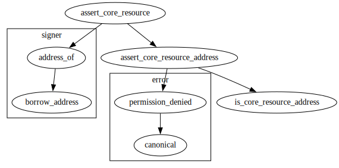
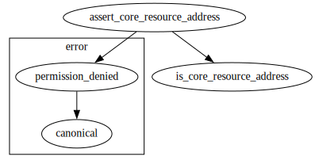
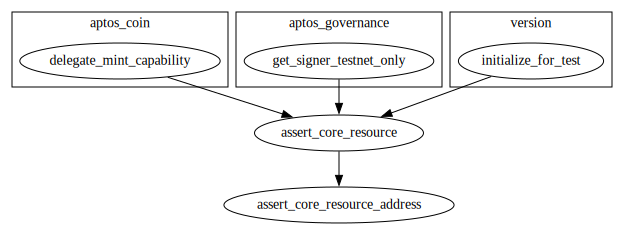
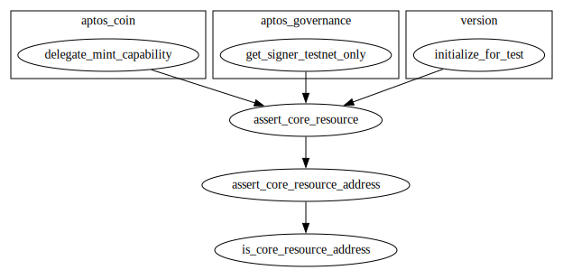
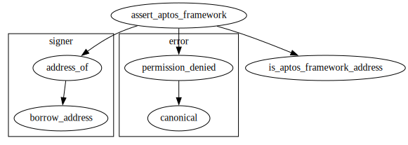
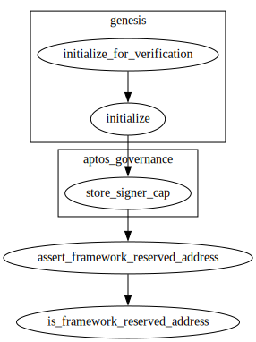
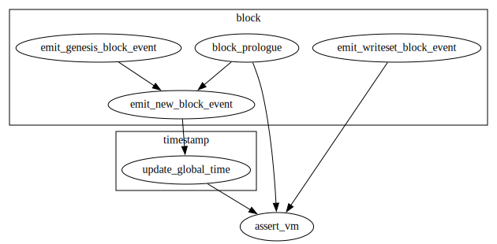
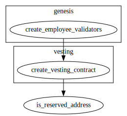

# Module `0x1::system_addresses`

-  [Constants](#@Constants_0)
-  [Function `assert_core_resource`](#0x1_system_addresses_assert_core_resource)
-  [Function `assert_core_resource_address`](#0x1_system_addresses_assert_core_resource_address)
-  [Function `is_core_resource_address`](#0x1_system_addresses_is_core_resource_address)
-  [Function `assert_aptos_framework`](#0x1_system_addresses_assert_aptos_framework)
-  [Function `assert_framework_reserved_address`](#0x1_system_addresses_assert_framework_reserved_address)
-  [Function `is_framework_reserved_address`](#0x1_system_addresses_is_framework_reserved_address)
-  [Function `is_aptos_framework_address`](#0x1_system_addresses_is_aptos_framework_address)
-  [Function `assert_vm`](#0x1_system_addresses_assert_vm)
-  [Function `is_vm`](#0x1_system_addresses_is_vm)
-  [Function `is_vm_address`](#0x1_system_addresses_is_vm_address)
-  [Function `is_reserved_address`](#0x1_system_addresses_is_reserved_address)
-  [Specification](#@Specification_1)
    -  [Function `assert_core_resource`](#@Specification_1_assert_core_resource)
    -  [Function `assert_core_resource_address`](#@Specification_1_assert_core_resource_address)
    -  [Function `assert_aptos_framework`](#@Specification_1_assert_aptos_framework)
    -  [Function `assert_vm`](#@Specification_1_assert_vm)

<pre><code><b>use</b> <a href="../../aptos-stdlib/../move-stdlib/doc/error.md#0x1_error">0x1::error</a>;
<b>use</b> <a href="../../aptos-stdlib/../move-stdlib/doc/signer.md#0x1_signer">0x1::signer</a>;
</code></pre>

Show all the modules that "system_addresses" depends on directly or indirectly

Show all the modules that depend on "system_addresses" directly or indirectly

## Constants

The address/account did not correspond to the core framework address

<pre><code><b>const</b> <a href="system_addresses.md#0x1_system_addresses_ENOT_APTOS_FRAMEWORK_ADDRESS">ENOT_APTOS_FRAMEWORK_ADDRESS</a>: u64 = 3;
</code></pre>

The address/account did not correspond to the core resource address

<pre><code><b>const</b> <a href="system_addresses.md#0x1_system_addresses_ENOT_CORE_RESOURCE_ADDRESS">ENOT_CORE_RESOURCE_ADDRESS</a>: u64 = 1;
</code></pre>

The address is not framework reserved address

<pre><code><b>const</b> <a href="system_addresses.md#0x1_system_addresses_ENOT_FRAMEWORK_RESERVED_ADDRESS">ENOT_FRAMEWORK_RESERVED_ADDRESS</a>: u64 = 4;
</code></pre>

The operation can only be performed by the VM

<pre><code><b>const</b> <a href="system_addresses.md#0x1_system_addresses_EVM">EVM</a>: u64 = 2;
</code></pre>

## Function `assert_core_resource`

<pre><code><b>public</b> <b>fun</b> <a href="system_addresses.md#0x1_system_addresses_assert_core_resource">assert_core_resource</a>(<a href="account.md#0x1_account">account</a>: &<a href="../../aptos-stdlib/../move-stdlib/doc/signer.md#0x1_signer">signer</a>)
</code></pre>

Implementation

<pre><code><b>public</b> <b>fun</b> <a href="system_addresses.md#0x1_system_addresses_assert_core_resource">assert_core_resource</a>(<a href="account.md#0x1_account">account</a>: &<a href="../../aptos-stdlib/../move-stdlib/doc/signer.md#0x1_signer">signer</a>) {
    <a href="system_addresses.md#0x1_system_addresses_assert_core_resource_address">assert_core_resource_address</a>(<a href="../../aptos-stdlib/../move-stdlib/doc/signer.md#0x1_signer_address_of">signer::address_of</a>(<a href="account.md#0x1_account">account</a>))
}
</code></pre>

Show all the functions that "assert_core_resource" calls

Show all the functions that call "assert_core_resource"

## Function `assert_core_resource_address`

<pre><code><b>public</b> <b>fun</b> <a href="system_addresses.md#0x1_system_addresses_assert_core_resource_address">assert_core_resource_address</a>(addr: <b>address</b>)
</code></pre>

Implementation

<pre><code><b>public</b> <b>fun</b> <a href="system_addresses.md#0x1_system_addresses_assert_core_resource_address">assert_core_resource_address</a>(addr: <b>address</b>) {
    <b>assert</b>!(<a href="system_addresses.md#0x1_system_addresses_is_core_resource_address">is_core_resource_address</a>(addr), <a href="../../aptos-stdlib/../move-stdlib/doc/error.md#0x1_error_permission_denied">error::permission_denied</a>(<a href="system_addresses.md#0x1_system_addresses_ENOT_CORE_RESOURCE_ADDRESS">ENOT_CORE_RESOURCE_ADDRESS</a>))
}
</code></pre>

Show all the functions that "assert_core_resource_address" calls

Show all the functions that call "assert_core_resource_address"

## Function `is_core_resource_address`

<pre><code><b>public</b> <b>fun</b> <a href="system_addresses.md#0x1_system_addresses_is_core_resource_address">is_core_resource_address</a>(addr: <b>address</b>): bool
</code></pre>

Implementation

<pre><code><b>public</b> <b>fun</b> <a href="system_addresses.md#0x1_system_addresses_is_core_resource_address">is_core_resource_address</a>(addr: <b>address</b>): bool {
    addr == @core_resources
}
</code></pre>

Show all the functions that "is_core_resource_address" calls

Show all the functions that call "is_core_resource_address"

## Function `assert_aptos_framework`

<pre><code><b>public</b> <b>fun</b> <a href="system_addresses.md#0x1_system_addresses_assert_aptos_framework">assert_aptos_framework</a>(<a href="account.md#0x1_account">account</a>: &<a href="../../aptos-stdlib/../move-stdlib/doc/signer.md#0x1_signer">signer</a>)
</code></pre>

Implementation

<pre><code><b>public</b> <b>fun</b> <a href="system_addresses.md#0x1_system_addresses_assert_aptos_framework">assert_aptos_framework</a>(<a href="account.md#0x1_account">account</a>: &<a href="../../aptos-stdlib/../move-stdlib/doc/signer.md#0x1_signer">signer</a>) {
    <b>assert</b>!(
        <a href="system_addresses.md#0x1_system_addresses_is_aptos_framework_address">is_aptos_framework_address</a>(<a href="../../aptos-stdlib/../move-stdlib/doc/signer.md#0x1_signer_address_of">signer::address_of</a>(<a href="account.md#0x1_account">account</a>)),
        <a href="../../aptos-stdlib/../move-stdlib/doc/error.md#0x1_error_permission_denied">error::permission_denied</a>(<a href="system_addresses.md#0x1_system_addresses_ENOT_APTOS_FRAMEWORK_ADDRESS">ENOT_APTOS_FRAMEWORK_ADDRESS</a>),
    )
}
</code></pre>

Show all the functions that "assert_aptos_framework" calls

Show all the functions that call "assert_aptos_framework"

## Function `assert_framework_reserved_address`

<pre><code><b>public</b> <b>fun</b> <a href="system_addresses.md#0x1_system_addresses_assert_framework_reserved_address">assert_framework_reserved_address</a>(<a href="account.md#0x1_account">account</a>: &<a href="../../aptos-stdlib/../move-stdlib/doc/signer.md#0x1_signer">signer</a>)
</code></pre>

Implementation

<pre><code><b>public</b> <b>fun</b> <a href="system_addresses.md#0x1_system_addresses_assert_framework_reserved_address">assert_framework_reserved_address</a>(<a href="account.md#0x1_account">account</a>: &<a href="../../aptos-stdlib/../move-stdlib/doc/signer.md#0x1_signer">signer</a>) {
    <b>assert</b>!(
        <a href="system_addresses.md#0x1_system_addresses_is_framework_reserved_address">is_framework_reserved_address</a>(<a href="../../aptos-stdlib/../move-stdlib/doc/signer.md#0x1_signer_address_of">signer::address_of</a>(<a href="account.md#0x1_account">account</a>)),
        <a href="../../aptos-stdlib/../move-stdlib/doc/error.md#0x1_error_permission_denied">error::permission_denied</a>(<a href="system_addresses.md#0x1_system_addresses_ENOT_FRAMEWORK_RESERVED_ADDRESS">ENOT_FRAMEWORK_RESERVED_ADDRESS</a>),
    )
}
</code></pre>

Show all the functions that "assert_framework_reserved_address" calls

Show all the functions that call "assert_framework_reserved_address"

## Function `is_framework_reserved_address`

Return true if <code>addr</code> is 0x0 or under the on chain governance's control.

<pre><code><b>public</b> <b>fun</b> <a href="system_addresses.md#0x1_system_addresses_is_framework_reserved_address">is_framework_reserved_address</a>(addr: <b>address</b>): bool
</code></pre>

Implementation

<pre><code><b>public</b> <b>fun</b> <a href="system_addresses.md#0x1_system_addresses_is_framework_reserved_address">is_framework_reserved_address</a>(addr: <b>address</b>): bool {
    <a href="system_addresses.md#0x1_system_addresses_is_aptos_framework_address">is_aptos_framework_address</a>(addr) ||
        addr == @0x2 ||
        addr == @0x3 ||
        addr == @0x4 ||
        addr == @0x5 ||
        addr == @0x6 ||
        addr == @0x7 ||
        addr == @0x8 ||
        addr == @0x9 ||
        addr == @0xa
}
</code></pre>

Show all the functions that "is_framework_reserved_address" calls

Show all the functions that call "is_framework_reserved_address"

## Function `is_aptos_framework_address`

Return true if <code>addr</code> is 0x1.

<pre><code><b>public</b> <b>fun</b> <a href="system_addresses.md#0x1_system_addresses_is_aptos_framework_address">is_aptos_framework_address</a>(addr: <b>address</b>): bool
</code></pre>

Implementation

<pre><code><b>public</b> <b>fun</b> <a href="system_addresses.md#0x1_system_addresses_is_aptos_framework_address">is_aptos_framework_address</a>(addr: <b>address</b>): bool {
    addr == @aptos_framework
}
</code></pre>

Show all the functions that "is_aptos_framework_address" calls

Show all the functions that call "is_aptos_framework_address"

## Function `assert_vm`

Assert that the signer has the VM reserved address.

<pre><code><b>public</b> <b>fun</b> <a href="system_addresses.md#0x1_system_addresses_assert_vm">assert_vm</a>(<a href="account.md#0x1_account">account</a>: &<a href="../../aptos-stdlib/../move-stdlib/doc/signer.md#0x1_signer">signer</a>)
</code></pre>

Implementation

<pre><code><b>public</b> <b>fun</b> <a href="system_addresses.md#0x1_system_addresses_assert_vm">assert_vm</a>(<a href="account.md#0x1_account">account</a>: &<a href="../../aptos-stdlib/../move-stdlib/doc/signer.md#0x1_signer">signer</a>) {
    <b>assert</b>!(<a href="system_addresses.md#0x1_system_addresses_is_vm">is_vm</a>(<a href="account.md#0x1_account">account</a>), <a href="../../aptos-stdlib/../move-stdlib/doc/error.md#0x1_error_permission_denied">error::permission_denied</a>(<a href="system_addresses.md#0x1_system_addresses_EVM">EVM</a>))
}
</code></pre>

Show all the functions that "assert_vm" calls

Show all the functions that call "assert_vm"

## Function `is_vm`

Return true if <code>addr</code> is a reserved address for the VM to call system modules.

<pre><code><b>public</b> <b>fun</b> <a href="system_addresses.md#0x1_system_addresses_is_vm">is_vm</a>(<a href="account.md#0x1_account">account</a>: &<a href="../../aptos-stdlib/../move-stdlib/doc/signer.md#0x1_signer">signer</a>): bool
</code></pre>

Implementation

<pre><code><b>public</b> <b>fun</b> <a href="system_addresses.md#0x1_system_addresses_is_vm">is_vm</a>(<a href="account.md#0x1_account">account</a>: &<a href="../../aptos-stdlib/../move-stdlib/doc/signer.md#0x1_signer">signer</a>): bool {
    <a href="system_addresses.md#0x1_system_addresses_is_vm_address">is_vm_address</a>(<a href="../../aptos-stdlib/../move-stdlib/doc/signer.md#0x1_signer_address_of">signer::address_of</a>(<a href="account.md#0x1_account">account</a>))
}
</code></pre>

Show all the functions that "is_vm" calls

Show all the functions that call "is_vm"

## Function `is_vm_address`

Return true if <code>addr</code> is a reserved address for the VM to call system modules.

<pre><code><b>public</b> <b>fun</b> <a href="system_addresses.md#0x1_system_addresses_is_vm_address">is_vm_address</a>(addr: <b>address</b>): bool
</code></pre>

Implementation

<pre><code><b>public</b> <b>fun</b> <a href="system_addresses.md#0x1_system_addresses_is_vm_address">is_vm_address</a>(addr: <b>address</b>): bool {
    addr == @vm_reserved
}
</code></pre>

Show all the functions that "is_vm_address" calls

Show all the functions that call "is_vm_address"

## Function `is_reserved_address`

Return true if <code>addr</code> is either the VM address or an Aptos Framework address.

<pre><code><b>public</b> <b>fun</b> <a href="system_addresses.md#0x1_system_addresses_is_reserved_address">is_reserved_address</a>(addr: <b>address</b>): bool
</code></pre>

Implementation

<pre><code><b>public</b> <b>fun</b> <a href="system_addresses.md#0x1_system_addresses_is_reserved_address">is_reserved_address</a>(addr: <b>address</b>): bool {
    <a href="system_addresses.md#0x1_system_addresses_is_aptos_framework_address">is_aptos_framework_address</a>(addr) || <a href="system_addresses.md#0x1_system_addresses_is_vm_address">is_vm_address</a>(addr)
}
</code></pre>

Show all the functions that "is_reserved_address" calls

Show all the functions that call "is_reserved_address"

## Specification

### Function `assert_core_resource`

<pre><code><b>public</b> <b>fun</b> <a href="system_addresses.md#0x1_system_addresses_assert_core_resource">assert_core_resource</a>(<a href="account.md#0x1_account">account</a>: &<a href="../../aptos-stdlib/../move-stdlib/doc/signer.md#0x1_signer">signer</a>)
</code></pre>

<pre><code><b>pragma</b> opaque;
<b>include</b> <a href="system_addresses.md#0x1_system_addresses_AbortsIfNotCoreResource">AbortsIfNotCoreResource</a> { addr: <a href="../../aptos-stdlib/../move-stdlib/doc/signer.md#0x1_signer_address_of">signer::address_of</a>(<a href="account.md#0x1_account">account</a>) };
</code></pre>

### Function `assert_core_resource_address`

<pre><code><b>public</b> <b>fun</b> <a href="system_addresses.md#0x1_system_addresses_assert_core_resource_address">assert_core_resource_address</a>(addr: <b>address</b>)
</code></pre>

<pre><code><b>pragma</b> opaque;
<b>include</b> <a href="system_addresses.md#0x1_system_addresses_AbortsIfNotCoreResource">AbortsIfNotCoreResource</a>;
</code></pre>

Specifies that a function aborts if the account does not have the root address.

<pre><code><b>schema</b> <a href="system_addresses.md#0x1_system_addresses_AbortsIfNotCoreResource">AbortsIfNotCoreResource</a> {
    addr: <b>address</b>;
    <b>aborts_if</b> addr != @core_resources <b>with</b> <a href="../../aptos-stdlib/../move-stdlib/doc/error.md#0x1_error_PERMISSION_DENIED">error::PERMISSION_DENIED</a>;
}
</code></pre>

### Function `assert_aptos_framework`

<pre><code><b>public</b> <b>fun</b> <a href="system_addresses.md#0x1_system_addresses_assert_aptos_framework">assert_aptos_framework</a>(<a href="account.md#0x1_account">account</a>: &<a href="../../aptos-stdlib/../move-stdlib/doc/signer.md#0x1_signer">signer</a>)
</code></pre>

<pre><code><b>pragma</b> opaque;
<b>include</b> <a href="system_addresses.md#0x1_system_addresses_AbortsIfNotAptosFramework">AbortsIfNotAptosFramework</a>;
</code></pre>

### Function `assert_vm`

<pre><code><b>public</b> <b>fun</b> <a href="system_addresses.md#0x1_system_addresses_assert_vm">assert_vm</a>(<a href="account.md#0x1_account">account</a>: &<a href="../../aptos-stdlib/../move-stdlib/doc/signer.md#0x1_signer">signer</a>)
</code></pre>

<pre><code><b>pragma</b> opaque;
<b>include</b> <a href="system_addresses.md#0x1_system_addresses_AbortsIfNotVM">AbortsIfNotVM</a>;
</code></pre>

Specifies that a function aborts if the account does not have the VM reserved address.

<pre><code><b>schema</b> <a href="system_addresses.md#0x1_system_addresses_AbortsIfNotVM">AbortsIfNotVM</a> {
    <a href="account.md#0x1_account">account</a>: <a href="../../aptos-stdlib/../move-stdlib/doc/signer.md#0x1_signer">signer</a>;
    <b>aborts_if</b> <a href="../../aptos-stdlib/../move-stdlib/doc/signer.md#0x1_signer_address_of">signer::address_of</a>(<a href="account.md#0x1_account">account</a>) != @vm_reserved <b>with</b> <a href="../../aptos-stdlib/../move-stdlib/doc/error.md#0x1_error_PERMISSION_DENIED">error::PERMISSION_DENIED</a>;
}
</code></pre>

[move-book]: https://move-language.github.io/move/introduction.html
