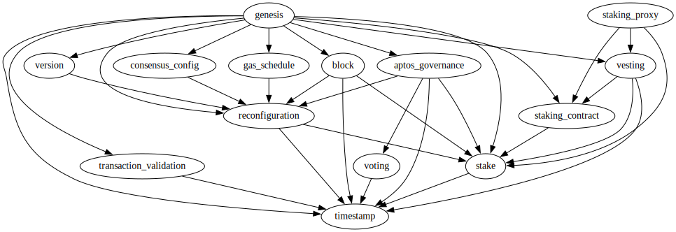
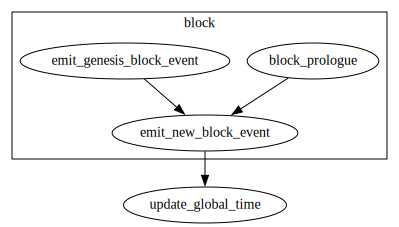

# Module `0x1::timestamp`

This module keeps a global wall clock that stores the current Unix time in microseconds.
It interacts with the other modules in the following ways:
* genesis: to initialize the timestamp
* block: to reach consensus on the global wall clock time

-  [Resource `CurrentTimeMicroseconds`](#0x1_timestamp_CurrentTimeMicroseconds)
-  [Constants](#@Constants_0)
-  [Function `set_time_has_started`](#0x1_timestamp_set_time_has_started)
-  [Function `update_global_time`](#0x1_timestamp_update_global_time)
-  [Function `now_microseconds`](#0x1_timestamp_now_microseconds)
-  [Function `now_seconds`](#0x1_timestamp_now_seconds)
-  [Specification](#@Specification_1)
    -  [Function `update_global_time`](#@Specification_1_update_global_time)

<pre><code><b>use</b> <a href="../../aptos-stdlib/../move-stdlib/doc/error.md#0x1_error">0x1::error</a>;
<b>use</b> <a href="system_addresses.md#0x1_system_addresses">0x1::system_addresses</a>;
</code></pre>

Show all the modules that "timestamp" depends on directly or indirectly

Show all the modules that depend on "timestamp" directly or indirectly

## Resource `CurrentTimeMicroseconds`

A singleton resource holding the current Unix time in microseconds

<pre><code><b>struct</b> <a href="timestamp.md#0x1_timestamp_CurrentTimeMicroseconds">CurrentTimeMicroseconds</a> <b>has</b> key
</code></pre>

Fields

<dl>
<dt>
<code>microseconds: u64</code>
</dt>
<dd>

</dd>
</dl>

## Constants

The blockchain is not in an operating state yet

<pre><code><b>const</b> <a href="timestamp.md#0x1_timestamp_ENOT_OPERATING">ENOT_OPERATING</a>: u64 = 1;
</code></pre>

An invalid timestamp was provided

<pre><code><b>const</b> <a href="timestamp.md#0x1_timestamp_EINVALID_TIMESTAMP">EINVALID_TIMESTAMP</a>: u64 = 2;
</code></pre>

Conversion factor between seconds and microseconds

<pre><code><b>const</b> <a href="timestamp.md#0x1_timestamp_MICRO_CONVERSION_FACTOR">MICRO_CONVERSION_FACTOR</a>: u64 = 1000000;
</code></pre>

## Function `set_time_has_started`

Marks that time has started. This can only be called from genesis and with the aptos framework account.

<pre><code><b>public</b>(<b>friend</b>) <b>fun</b> <a href="timestamp.md#0x1_timestamp_set_time_has_started">set_time_has_started</a>(aptos_framework: &<a href="../../aptos-stdlib/../move-stdlib/doc/signer.md#0x1_signer">signer</a>)
</code></pre>

Implementation

<pre><code><b>public</b>(<b>friend</b>) <b>fun</b> <a href="timestamp.md#0x1_timestamp_set_time_has_started">set_time_has_started</a>(aptos_framework: &<a href="../../aptos-stdlib/../move-stdlib/doc/signer.md#0x1_signer">signer</a>) {
    <a href="system_addresses.md#0x1_system_addresses_assert_aptos_framework">system_addresses::assert_aptos_framework</a>(aptos_framework);
    <b>let</b> timer = <a href="timestamp.md#0x1_timestamp_CurrentTimeMicroseconds">CurrentTimeMicroseconds</a> { microseconds: 0 };
    <b>move_to</b>(aptos_framework, timer);
}
</code></pre>

Show all the functions that "set_time_has_started" calls

Show all the functions that call "set_time_has_started"

## Function `update_global_time`

Updates the wall clock time by consensus. Requires VM privilege and will be invoked during block prologue.

<pre><code><b>public</b> <b>fun</b> <a href="timestamp.md#0x1_timestamp_update_global_time">update_global_time</a>(<a href="account.md#0x1_account">account</a>: &<a href="../../aptos-stdlib/../move-stdlib/doc/signer.md#0x1_signer">signer</a>, proposer: <b>address</b>, <a href="timestamp.md#0x1_timestamp">timestamp</a>: u64)
</code></pre>

Implementation

<pre><code><b>public</b> <b>fun</b> <a href="timestamp.md#0x1_timestamp_update_global_time">update_global_time</a>(
    <a href="account.md#0x1_account">account</a>: &<a href="../../aptos-stdlib/../move-stdlib/doc/signer.md#0x1_signer">signer</a>,
    proposer: <b>address</b>,
    <a href="timestamp.md#0x1_timestamp">timestamp</a>: u64
) <b>acquires</b> <a href="timestamp.md#0x1_timestamp_CurrentTimeMicroseconds">CurrentTimeMicroseconds</a> {
    // Can only be invoked by AptosVM <a href="../../aptos-stdlib/../move-stdlib/doc/signer.md#0x1_signer">signer</a>.
    <a href="system_addresses.md#0x1_system_addresses_assert_vm">system_addresses::assert_vm</a>(<a href="account.md#0x1_account">account</a>);

    <b>let</b> global_timer = <b>borrow_global_mut</b>&lt;<a href="timestamp.md#0x1_timestamp_CurrentTimeMicroseconds">CurrentTimeMicroseconds</a>&gt;(@aptos_framework);
    <b>let</b> now = global_timer.microseconds;
    <b>if</b> (proposer == @vm_reserved) {
        // NIL <a href="block.md#0x1_block">block</a> <b>with</b> null <b>address</b> <b>as</b> proposer. Timestamp must be equal.
        <b>assert</b>!(now == <a href="timestamp.md#0x1_timestamp">timestamp</a>, <a href="../../aptos-stdlib/../move-stdlib/doc/error.md#0x1_error_invalid_argument">error::invalid_argument</a>(<a href="timestamp.md#0x1_timestamp_EINVALID_TIMESTAMP">EINVALID_TIMESTAMP</a>));
    } <b>else</b> {
        // Normal <a href="block.md#0x1_block">block</a>. Time must advance
        <b>assert</b>!(now &lt; <a href="timestamp.md#0x1_timestamp">timestamp</a>, <a href="../../aptos-stdlib/../move-stdlib/doc/error.md#0x1_error_invalid_argument">error::invalid_argument</a>(<a href="timestamp.md#0x1_timestamp_EINVALID_TIMESTAMP">EINVALID_TIMESTAMP</a>));
        global_timer.microseconds = <a href="timestamp.md#0x1_timestamp">timestamp</a>;
    };
}
</code></pre>

Show all the functions that "update_global_time" calls

Show all the functions that call "update_global_time"

## Function `now_microseconds`

Gets the current time in microseconds.

<pre><code><b>public</b> <b>fun</b> <a href="timestamp.md#0x1_timestamp_now_microseconds">now_microseconds</a>(): u64
</code></pre>

Implementation

<pre><code><b>public</b> <b>fun</b> <a href="timestamp.md#0x1_timestamp_now_microseconds">now_microseconds</a>(): u64 <b>acquires</b> <a href="timestamp.md#0x1_timestamp_CurrentTimeMicroseconds">CurrentTimeMicroseconds</a> {
    <b>borrow_global</b>&lt;<a href="timestamp.md#0x1_timestamp_CurrentTimeMicroseconds">CurrentTimeMicroseconds</a>&gt;(@aptos_framework).microseconds
}
</code></pre>

Show all the functions that "now_microseconds" calls

Show all the functions that call "now_microseconds"

## Function `now_seconds`

Gets the current time in seconds.

<pre><code><b>public</b> <b>fun</b> <a href="timestamp.md#0x1_timestamp_now_seconds">now_seconds</a>(): u64
</code></pre>

Implementation

<pre><code><b>public</b> <b>fun</b> <a href="timestamp.md#0x1_timestamp_now_seconds">now_seconds</a>(): u64 <b>acquires</b> <a href="timestamp.md#0x1_timestamp_CurrentTimeMicroseconds">CurrentTimeMicroseconds</a> {
    <a href="timestamp.md#0x1_timestamp_now_microseconds">now_microseconds</a>() / <a href="timestamp.md#0x1_timestamp_MICRO_CONVERSION_FACTOR">MICRO_CONVERSION_FACTOR</a>
}
</code></pre>

Show all the functions that "now_seconds" calls

Show all the functions that call "now_seconds"

## Specification

<pre><code><b>invariant</b> <a href="chain_status.md#0x1_chain_status_is_operating">chain_status::is_operating</a>() ==&gt; <b>exists</b>&lt;<a href="timestamp.md#0x1_timestamp_CurrentTimeMicroseconds">CurrentTimeMicroseconds</a>&gt;(@aptos_framework);
</code></pre>

### Function `update_global_time`

<pre><code><b>public</b> <b>fun</b> <a href="timestamp.md#0x1_timestamp_update_global_time">update_global_time</a>(<a href="account.md#0x1_account">account</a>: &<a href="../../aptos-stdlib/../move-stdlib/doc/signer.md#0x1_signer">signer</a>, proposer: <b>address</b>, <a href="timestamp.md#0x1_timestamp">timestamp</a>: u64)
</code></pre>

<pre><code><b>requires</b> <a href="chain_status.md#0x1_chain_status_is_operating">chain_status::is_operating</a>();
<b>include</b> <a href="timestamp.md#0x1_timestamp_UpdateGlobalTimeAbortsIf">UpdateGlobalTimeAbortsIf</a>;
</code></pre>

<pre><code><b>schema</b> <a href="timestamp.md#0x1_timestamp_UpdateGlobalTimeAbortsIf">UpdateGlobalTimeAbortsIf</a> {
    <a href="account.md#0x1_account">account</a>: <a href="../../aptos-stdlib/../move-stdlib/doc/signer.md#0x1_signer">signer</a>;
    proposer: <b>address</b>;
    <a href="timestamp.md#0x1_timestamp">timestamp</a>: u64;
    <b>aborts_if</b> !<a href="system_addresses.md#0x1_system_addresses_is_vm">system_addresses::is_vm</a>(<a href="account.md#0x1_account">account</a>);
    <b>aborts_if</b> (proposer == @vm_reserved) && (<a href="timestamp.md#0x1_timestamp_spec_now_microseconds">spec_now_microseconds</a>() != <a href="timestamp.md#0x1_timestamp">timestamp</a>);
    <b>aborts_if</b> (proposer != @vm_reserved) && (<a href="timestamp.md#0x1_timestamp_spec_now_microseconds">spec_now_microseconds</a>() &gt;= <a href="timestamp.md#0x1_timestamp">timestamp</a>);
}
</code></pre>

<pre><code><b>fun</b> <a href="timestamp.md#0x1_timestamp_spec_now_microseconds">spec_now_microseconds</a>(): u64 {
   <b>global</b>&lt;<a href="timestamp.md#0x1_timestamp_CurrentTimeMicroseconds">CurrentTimeMicroseconds</a>&gt;(@aptos_framework).microseconds
}
</code></pre>

<pre><code><b>fun</b> <a href="timestamp.md#0x1_timestamp_spec_now_seconds">spec_now_seconds</a>(): u64 {
   <a href="timestamp.md#0x1_timestamp_spec_now_microseconds">spec_now_microseconds</a>() / <a href="timestamp.md#0x1_timestamp_MICRO_CONVERSION_FACTOR">MICRO_CONVERSION_FACTOR</a>
}
</code></pre>

[move-book]: https://move-language.github.io/move/introduction.html
