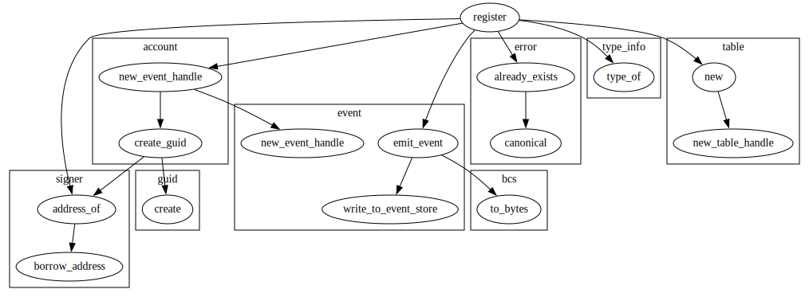
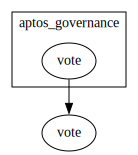
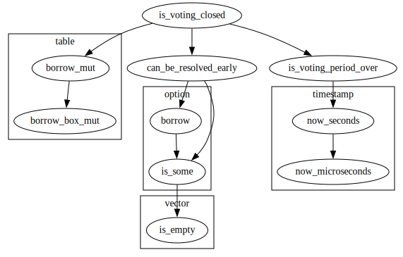
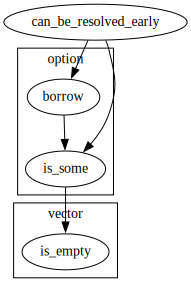
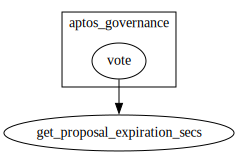
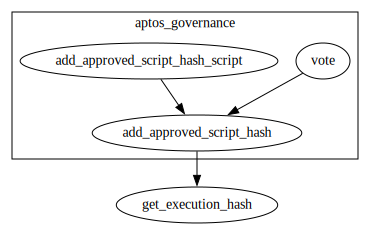
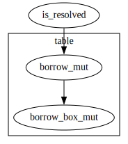
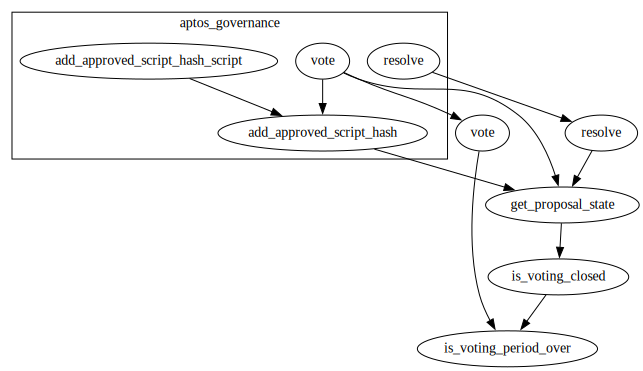

# Module `0x1::voting`

* This is the general Voting module that can be used as part of a DAO Governance. Voting is designed to be used by
* standalone governance modules, who has full control over the voting flow and is responsible for voting power
* calculation and including proper capabilities when creating the proposal so resolution can go through.
* On-chain governance of the Aptos network also uses Voting.
*
* The voting flow:
* 1. The Voting module can be deployed at a known address (e.g. 0x1 for Aptos on-chain governance)
* 2. The governance module, e.g. AptosGovernance, can be deployed later and define a GovernanceProposal resource type
* that can also contain other information such as Capability resource for authorization.
* 3. The governance module's owner can then register the ProposalType with Voting. This also hosts the proposal list
* (forum) on the calling account.
* 4. A proposer, through the governance module, can call Voting::create_proposal to create a proposal. create_proposal
* cannot be called directly not through the governance module. A script hash of the resolution script that can later
* be called to execute the proposal is required.
* 5. A voter, through the governance module, can call Voting::vote on a proposal. vote requires passing a &ProposalType
* and thus only the governance module that registers ProposalType can call vote.
* 6. Once the proposal's expiration time has passed and more than the defined threshold has voted yes on the proposal,
* anyone can call resolve which returns the content of the proposal (of type ProposalType) that can be used to execute.
* 7. Only the resolution script with the same script hash specified in the proposal can call Voting::resolve as part of
* the resolution process.

-  [Struct `Proposal`](#0x1_voting_Proposal)
-  [Resource `VotingForum`](#0x1_voting_VotingForum)
-  [Struct `VotingEvents`](#0x1_voting_VotingEvents)
-  [Struct `CreateProposalEvent`](#0x1_voting_CreateProposalEvent)
-  [Struct `RegisterForumEvent`](#0x1_voting_RegisterForumEvent)
-  [Struct `VoteEvent`](#0x1_voting_VoteEvent)
-  [Struct `ResolveProposal`](#0x1_voting_ResolveProposal)
-  [Constants](#@Constants_0)
-  [Function `register`](#0x1_voting_register)
-  [Function `create_proposal`](#0x1_voting_create_proposal)
-  [Function `vote`](#0x1_voting_vote)
-  [Function `resolve`](#0x1_voting_resolve)
-  [Function `is_voting_closed`](#0x1_voting_is_voting_closed)
-  [Function `can_be_resolved_early`](#0x1_voting_can_be_resolved_early)
-  [Function `get_proposal_state`](#0x1_voting_get_proposal_state)
-  [Function `get_proposal_expiration_secs`](#0x1_voting_get_proposal_expiration_secs)
-  [Function `get_execution_hash`](#0x1_voting_get_execution_hash)
-  [Function `is_resolved`](#0x1_voting_is_resolved)
-  [Function `is_voting_period_over`](#0x1_voting_is_voting_period_over)

<pre><code><b>use</b> <a href="account.md#0x1_account">0x1::account</a>;
<b>use</b> <a href="../../aptos-stdlib/../move-stdlib/doc/bcs.md#0x1_bcs">0x1::bcs</a>;
<b>use</b> <a href="../../aptos-stdlib/../move-stdlib/doc/error.md#0x1_error">0x1::error</a>;
<b>use</b> <a href="event.md#0x1_event">0x1::event</a>;
<b>use</b> <a href="../../aptos-stdlib/doc/from_bcs.md#0x1_from_bcs">0x1::from_bcs</a>;
<b>use</b> <a href="../../aptos-stdlib/../move-stdlib/doc/option.md#0x1_option">0x1::option</a>;
<b>use</b> <a href="../../aptos-stdlib/../move-stdlib/doc/signer.md#0x1_signer">0x1::signer</a>;
<b>use</b> <a href="../../aptos-stdlib/doc/simple_map.md#0x1_simple_map">0x1::simple_map</a>;
<b>use</b> <a href="../../aptos-stdlib/../move-stdlib/doc/string.md#0x1_string">0x1::string</a>;
<b>use</b> <a href="../../aptos-stdlib/doc/table.md#0x1_table">0x1::table</a>;
<b>use</b> <a href="timestamp.md#0x1_timestamp">0x1::timestamp</a>;
<b>use</b> <a href="transaction_context.md#0x1_transaction_context">0x1::transaction_context</a>;
<b>use</b> <a href="../../aptos-stdlib/doc/type_info.md#0x1_type_info">0x1::type_info</a>;
</code></pre>

Show all the modules that "voting" depends on directly or indirectly

Show all the modules that depend on "voting" directly or indirectly

## Struct `Proposal`

Extra metadata (e.g. description, code url) can be part of the ProposalType struct.

<pre><code><b>struct</b> <a href="voting.md#0x1_voting_Proposal">Proposal</a>&lt;ProposalType: store&gt; <b>has</b> store
</code></pre>

Fields

<dl>
<dt>
<code>proposer: <b>address</b></code>
</dt>
<dd>
 Required. The address of the proposer.
</dd>
<dt>
<code>execution_content: <a href="../../aptos-stdlib/../move-stdlib/doc/option.md#0x1_option_Option">option::Option</a>&lt;ProposalType&gt;</code>
</dt>
<dd>
 Required. Should contain enough information to execute later, for example the required capability.
 This is stored as an option so we can return it to governance when the proposal is resolved.
</dd>
<dt>
<code>metadata: <a href="../../aptos-stdlib/doc/simple_map.md#0x1_simple_map_SimpleMap">simple_map::SimpleMap</a>&lt;<a href="../../aptos-stdlib/../move-stdlib/doc/string.md#0x1_string_String">string::String</a>, <a href="../../aptos-stdlib/../move-stdlib/doc/vector.md#0x1_vector">vector</a>&lt;u8&gt;&gt;</code>
</dt>
<dd>
 Optional. Extra metadata about the proposal and can be empty.
 Value is serialized value of an attribute.
</dd>
<dt>
<code>creation_time_secs: u64</code>
</dt>
<dd>
 Timestamp when the proposal was created.
</dd>
<dt>
<code>execution_hash: <a href="../../aptos-stdlib/../move-stdlib/doc/vector.md#0x1_vector">vector</a>&lt;u8&gt;</code>
</dt>
<dd>
 Required. The hash for the execution script module. Only the same exact script module can resolve this
 proposal.
</dd>
<dt>
<code>min_vote_threshold: u128</code>
</dt>
<dd>
 A proposal is only resolved if expiration has passed and the number of votes is above threshold.
</dd>
<dt>
<code>expiration_secs: u64</code>
</dt>
<dd>

</dd>
<dt>
<code>early_resolution_vote_threshold: <a href="../../aptos-stdlib/../move-stdlib/doc/option.md#0x1_option_Option">option::Option</a>&lt;u128&gt;</code>
</dt>
<dd>
 Optional. Early resolution threshold. If specified, the proposal can be resolved early if the total
 number of yes or no votes passes this threshold.
 For example, this can be set to 50% of the total supply of the voting token, so if > 50% vote yes or no,
 the proposal can be resolved before expiration.
</dd>
<dt>
<code>yes_votes: u128</code>
</dt>
<dd>
 Number of votes for each outcome.
 u128 since the voting power is already u64 and can add up to more than u64 can hold.
</dd>
<dt>
<code>no_votes: u128</code>
</dt>
<dd>

</dd>
<dt>
<code>is_resolved: bool</code>
</dt>
<dd>
 Whether the proposal has been resolved.
</dd>
<dt>
<code>resolution_time_secs: u64</code>
</dt>
<dd>
 Resolution timestamp if the proposal has been resolved. 0 otherwise.
</dd>
</dl>

## Resource `VotingForum`

<pre><code><b>struct</b> <a href="voting.md#0x1_voting_VotingForum">VotingForum</a>&lt;ProposalType: store&gt; <b>has</b> key
</code></pre>

Fields

<dl>
<dt>
<code>proposals: <a href="../../aptos-stdlib/doc/table.md#0x1_table_Table">table::Table</a>&lt;u64, <a href="voting.md#0x1_voting_Proposal">voting::Proposal</a>&lt;ProposalType&gt;&gt;</code>
</dt>
<dd>
 Use Table for execution optimization instead of Vector for gas cost since Vector is read entirely into memory
 during execution while only relevant Table entries are.
</dd>
<dt>
<code>events: <a href="voting.md#0x1_voting_VotingEvents">voting::VotingEvents</a></code>
</dt>
<dd>

</dd>
<dt>
<code>next_proposal_id: u64</code>
</dt>
<dd>
 Unique identifier for a proposal. This allows for 2 * 10**19 proposals.
</dd>
</dl>

## Struct `VotingEvents`

<pre><code><b>struct</b> <a href="voting.md#0x1_voting_VotingEvents">VotingEvents</a> <b>has</b> store
</code></pre>

Fields

<dl>
<dt>
<code>create_proposal_events: <a href="event.md#0x1_event_EventHandle">event::EventHandle</a>&lt;<a href="voting.md#0x1_voting_CreateProposalEvent">voting::CreateProposalEvent</a>&gt;</code>
</dt>
<dd>

</dd>
<dt>
<code>register_forum_events: <a href="event.md#0x1_event_EventHandle">event::EventHandle</a>&lt;<a href="voting.md#0x1_voting_RegisterForumEvent">voting::RegisterForumEvent</a>&gt;</code>
</dt>
<dd>

</dd>
<dt>
<code>resolve_proposal_events: <a href="event.md#0x1_event_EventHandle">event::EventHandle</a>&lt;<a href="voting.md#0x1_voting_ResolveProposal">voting::ResolveProposal</a>&gt;</code>
</dt>
<dd>

</dd>
<dt>
<code>vote_events: <a href="event.md#0x1_event_EventHandle">event::EventHandle</a>&lt;<a href="voting.md#0x1_voting_VoteEvent">voting::VoteEvent</a>&gt;</code>
</dt>
<dd>

</dd>
</dl>

## Struct `CreateProposalEvent`

<pre><code><b>struct</b> <a href="voting.md#0x1_voting_CreateProposalEvent">CreateProposalEvent</a> <b>has</b> drop, store
</code></pre>

Fields

<dl>
<dt>
<code>proposal_id: u64</code>
</dt>
<dd>

</dd>
<dt>
<code>early_resolution_vote_threshold: <a href="../../aptos-stdlib/../move-stdlib/doc/option.md#0x1_option_Option">option::Option</a>&lt;u128&gt;</code>
</dt>
<dd>

</dd>
<dt>
<code>execution_hash: <a href="../../aptos-stdlib/../move-stdlib/doc/vector.md#0x1_vector">vector</a>&lt;u8&gt;</code>
</dt>
<dd>

</dd>
<dt>
<code>expiration_secs: u64</code>
</dt>
<dd>

</dd>
<dt>
<code>metadata: <a href="../../aptos-stdlib/doc/simple_map.md#0x1_simple_map_SimpleMap">simple_map::SimpleMap</a>&lt;<a href="../../aptos-stdlib/../move-stdlib/doc/string.md#0x1_string_String">string::String</a>, <a href="../../aptos-stdlib/../move-stdlib/doc/vector.md#0x1_vector">vector</a>&lt;u8&gt;&gt;</code>
</dt>
<dd>

</dd>
<dt>
<code>min_vote_threshold: u128</code>
</dt>
<dd>

</dd>
</dl>

## Struct `RegisterForumEvent`

<pre><code><b>struct</b> <a href="voting.md#0x1_voting_RegisterForumEvent">RegisterForumEvent</a> <b>has</b> drop, store
</code></pre>

Fields

<dl>
<dt>
<code>hosting_account: <b>address</b></code>
</dt>
<dd>

</dd>
<dt>
<code>proposal_type_info: <a href="../../aptos-stdlib/doc/type_info.md#0x1_type_info_TypeInfo">type_info::TypeInfo</a></code>
</dt>
<dd>

</dd>
</dl>

## Struct `VoteEvent`

<pre><code><b>struct</b> <a href="voting.md#0x1_voting_VoteEvent">VoteEvent</a> <b>has</b> drop, store
</code></pre>

Fields

<dl>
<dt>
<code>proposal_id: u64</code>
</dt>
<dd>

</dd>
<dt>
<code>num_votes: u64</code>
</dt>
<dd>

</dd>
</dl>

## Struct `ResolveProposal`

<pre><code><b>struct</b> <a href="voting.md#0x1_voting_ResolveProposal">ResolveProposal</a> <b>has</b> drop, store
</code></pre>

Fields

<dl>
<dt>
<code>proposal_id: u64</code>
</dt>
<dd>

</dd>
<dt>
<code>yes_votes: u128</code>
</dt>
<dd>

</dd>
<dt>
<code>no_votes: u128</code>
</dt>
<dd>

</dd>
<dt>
<code>resolved_early: bool</code>
</dt>
<dd>

</dd>
</dl>

## Constants

Minimum vote threshold cannot be higher than early resolution threshold.

<pre><code><b>const</b> <a href="voting.md#0x1_voting_EINVALID_MIN_VOTE_THRESHOLD">EINVALID_MIN_VOTE_THRESHOLD</a>: u64 = 7;
</code></pre>

Proposal cannot be resolved more than once

<pre><code><b>const</b> <a href="voting.md#0x1_voting_EPROPOSAL_ALREADY_RESOLVED">EPROPOSAL_ALREADY_RESOLVED</a>: u64 = 3;
</code></pre>

Proposal cannot be resolved. Either voting duration has not passed, not enough votes, or fewer yes than no votes

<pre><code><b>const</b> <a href="voting.md#0x1_voting_EPROPOSAL_CANNOT_BE_RESOLVED">EPROPOSAL_CANNOT_BE_RESOLVED</a>: u64 = 2;
</code></pre>

Proposal cannot contain an empty execution script hash

<pre><code><b>const</b> <a href="voting.md#0x1_voting_EPROPOSAL_EMPTY_EXECUTION_HASH">EPROPOSAL_EMPTY_EXECUTION_HASH</a>: u64 = 4;
</code></pre>

Current script's execution hash does not match the specified proposal's

<pre><code><b>const</b> <a href="voting.md#0x1_voting_EPROPOSAL_EXECUTION_HASH_NOT_MATCHING">EPROPOSAL_EXECUTION_HASH_NOT_MATCHING</a>: u64 = 1;
</code></pre>

Proposal's voting period has already ended.

<pre><code><b>const</b> <a href="voting.md#0x1_voting_EPROPOSAL_VOTING_ALREADY_ENDED">EPROPOSAL_VOTING_ALREADY_ENDED</a>: u64 = 5;
</code></pre>

Resolution of a proposal cannot happen atomically in the same transaction as the last vote.

<pre><code><b>const</b> <a href="voting.md#0x1_voting_ERESOLUTION_CANNOT_BE_ATOMIC">ERESOLUTION_CANNOT_BE_ATOMIC</a>: u64 = 8;
</code></pre>

Voting forum has already been registered.

<pre><code><b>const</b> <a href="voting.md#0x1_voting_EVOTING_FORUM_ALREADY_REGISTERED">EVOTING_FORUM_ALREADY_REGISTERED</a>: u64 = 6;
</code></pre>

Proposal has failed because either the min vote threshold is not met or majority voted no.

<pre><code><b>const</b> <a href="voting.md#0x1_voting_PROPOSAL_STATE_FAILED">PROPOSAL_STATE_FAILED</a>: u64 = 3;
</code></pre>

ProposalStateEnum representing proposal state.

<pre><code><b>const</b> <a href="voting.md#0x1_voting_PROPOSAL_STATE_PENDING">PROPOSAL_STATE_PENDING</a>: u64 = 0;
</code></pre>

<pre><code><b>const</b> <a href="voting.md#0x1_voting_PROPOSAL_STATE_SUCCEEDED">PROPOSAL_STATE_SUCCEEDED</a>: u64 = 1;
</code></pre>

Key used to track the resolvable time in the proposal's metadata.

<pre><code><b>const</b> <a href="voting.md#0x1_voting_RESOLVABLE_TIME_METADATA_KEY">RESOLVABLE_TIME_METADATA_KEY</a>: <a href="../../aptos-stdlib/../move-stdlib/doc/vector.md#0x1_vector">vector</a>&lt;u8&gt; = [82, 69, 83, 79, 76, 86, 65, 66, 76, 69, 95, 84, 73, 77, 69, 95, 77, 69, 84, 65, 68, 65, 84, 65, 95, 75, 69, 89];
</code></pre>

## Function `register`

<pre><code><b>public</b> <b>fun</b> <a href="voting.md#0x1_voting_register">register</a>&lt;ProposalType: store&gt;(<a href="account.md#0x1_account">account</a>: &<a href="../../aptos-stdlib/../move-stdlib/doc/signer.md#0x1_signer">signer</a>)
</code></pre>

Implementation

<pre><code><b>public</b> <b>fun</b> <a href="voting.md#0x1_voting_register">register</a>&lt;ProposalType: store&gt;(<a href="account.md#0x1_account">account</a>: &<a href="../../aptos-stdlib/../move-stdlib/doc/signer.md#0x1_signer">signer</a>) {
    <b>let</b> addr = <a href="../../aptos-stdlib/../move-stdlib/doc/signer.md#0x1_signer_address_of">signer::address_of</a>(<a href="account.md#0x1_account">account</a>);
    <b>assert</b>!(!<b>exists</b>&lt;<a href="voting.md#0x1_voting_VotingForum">VotingForum</a>&lt;ProposalType&gt;&gt;(addr), <a href="../../aptos-stdlib/../move-stdlib/doc/error.md#0x1_error_already_exists">error::already_exists</a>(<a href="voting.md#0x1_voting_EVOTING_FORUM_ALREADY_REGISTERED">EVOTING_FORUM_ALREADY_REGISTERED</a>));

    <b>let</b> voting_forum = <a href="voting.md#0x1_voting_VotingForum">VotingForum</a>&lt;ProposalType&gt; {
        next_proposal_id: 0,
        proposals: <a href="../../aptos-stdlib/doc/table.md#0x1_table_new">table::new</a>&lt;u64, <a href="voting.md#0x1_voting_Proposal">Proposal</a>&lt;ProposalType&gt;&gt;(),
        events: <a href="voting.md#0x1_voting_VotingEvents">VotingEvents</a> {
            create_proposal_events: <a href="account.md#0x1_account_new_event_handle">account::new_event_handle</a>&lt;<a href="voting.md#0x1_voting_CreateProposalEvent">CreateProposalEvent</a>&gt;(<a href="account.md#0x1_account">account</a>),
            register_forum_events: <a href="account.md#0x1_account_new_event_handle">account::new_event_handle</a>&lt;<a href="voting.md#0x1_voting_RegisterForumEvent">RegisterForumEvent</a>&gt;(<a href="account.md#0x1_account">account</a>),
            resolve_proposal_events: <a href="account.md#0x1_account_new_event_handle">account::new_event_handle</a>&lt;<a href="voting.md#0x1_voting_ResolveProposal">ResolveProposal</a>&gt;(<a href="account.md#0x1_account">account</a>),
            vote_events: <a href="account.md#0x1_account_new_event_handle">account::new_event_handle</a>&lt;<a href="voting.md#0x1_voting_VoteEvent">VoteEvent</a>&gt;(<a href="account.md#0x1_account">account</a>),
        }
    };

    <a href="event.md#0x1_event_emit_event">event::emit_event</a>&lt;<a href="voting.md#0x1_voting_RegisterForumEvent">RegisterForumEvent</a>&gt;(
        &<b>mut</b> voting_forum.events.register_forum_events,
        <a href="voting.md#0x1_voting_RegisterForumEvent">RegisterForumEvent</a> {
            hosting_account: addr,
            proposal_type_info: <a href="../../aptos-stdlib/doc/type_info.md#0x1_type_info_type_of">type_info::type_of</a>&lt;ProposalType&gt;(),
        },
    );

    <b>move_to</b>(<a href="account.md#0x1_account">account</a>, voting_forum);
}
</code></pre>

Show all the functions that "register" calls

Show all the functions that call "register"

## Function `create_proposal`

Create a proposal with the given parameters

@param voting_forum_address The forum's address where the proposal will be stored.
@param execution_content The execution content that will be given back at resolution time. This can contain
data such as a capability resource used to scope the execution.
@param execution_hash The hash for the execution script module. Only the same exact script module can resolve
this proposal.
@param min_vote_threshold The minimum number of votes needed to consider this proposal successful.
@param expiration_secs The time in seconds at which the proposal expires and can potentially be resolved.
@return The proposal id.

<pre><code><b>public</b> <b>fun</b> <a href="voting.md#0x1_voting_create_proposal">create_proposal</a>&lt;ProposalType: store&gt;(proposer: <b>address</b>, voting_forum_address: <b>address</b>, execution_content: ProposalType, execution_hash: <a href="../../aptos-stdlib/../move-stdlib/doc/vector.md#0x1_vector">vector</a>&lt;u8&gt;, min_vote_threshold: u128, expiration_secs: u64, early_resolution_vote_threshold: <a href="../../aptos-stdlib/../move-stdlib/doc/option.md#0x1_option_Option">option::Option</a>&lt;u128&gt;, metadata: <a href="../../aptos-stdlib/doc/simple_map.md#0x1_simple_map_SimpleMap">simple_map::SimpleMap</a>&lt;<a href="../../aptos-stdlib/../move-stdlib/doc/string.md#0x1_string_String">string::String</a>, <a href="../../aptos-stdlib/../move-stdlib/doc/vector.md#0x1_vector">vector</a>&lt;u8&gt;&gt;): u64
</code></pre>

Implementation

<pre><code><b>public</b> <b>fun</b> <a href="voting.md#0x1_voting_create_proposal">create_proposal</a>&lt;ProposalType: store&gt;(
    proposer: <b>address</b>,
    voting_forum_address: <b>address</b>,
    execution_content: ProposalType,
    execution_hash: <a href="../../aptos-stdlib/../move-stdlib/doc/vector.md#0x1_vector">vector</a>&lt;u8&gt;,
    min_vote_threshold: u128,
    expiration_secs: u64,
    early_resolution_vote_threshold: Option&lt;u128&gt;,
    metadata: SimpleMap&lt;String, <a href="../../aptos-stdlib/../move-stdlib/doc/vector.md#0x1_vector">vector</a>&lt;u8&gt;&gt;,
): u64 <b>acquires</b> <a href="voting.md#0x1_voting_VotingForum">VotingForum</a> {
    <b>if</b> (<a href="../../aptos-stdlib/../move-stdlib/doc/option.md#0x1_option_is_some">option::is_some</a>(&early_resolution_vote_threshold)) {
        <b>assert</b>!(
            min_vote_threshold &lt;= *<a href="../../aptos-stdlib/../move-stdlib/doc/option.md#0x1_option_borrow">option::borrow</a>(&early_resolution_vote_threshold),
            <a href="../../aptos-stdlib/../move-stdlib/doc/error.md#0x1_error_invalid_argument">error::invalid_argument</a>(<a href="voting.md#0x1_voting_EINVALID_MIN_VOTE_THRESHOLD">EINVALID_MIN_VOTE_THRESHOLD</a>),
        );
    };
    // Make sure the execution <b>script</b>'s <a href="../../aptos-stdlib/doc/hash.md#0x1_hash">hash</a> is not empty.
    <b>assert</b>!(<a href="../../aptos-stdlib/../move-stdlib/doc/vector.md#0x1_vector_length">vector::length</a>(&execution_hash) &gt; 0, <a href="../../aptos-stdlib/../move-stdlib/doc/error.md#0x1_error_invalid_argument">error::invalid_argument</a>(<a href="voting.md#0x1_voting_EPROPOSAL_EMPTY_EXECUTION_HASH">EPROPOSAL_EMPTY_EXECUTION_HASH</a>));

    <b>let</b> voting_forum = <b>borrow_global_mut</b>&lt;<a href="voting.md#0x1_voting_VotingForum">VotingForum</a>&lt;ProposalType&gt;&gt;(voting_forum_address);
    <b>let</b> proposal_id = voting_forum.next_proposal_id;
    voting_forum.next_proposal_id = voting_forum.next_proposal_id + 1;

    <a href="../../aptos-stdlib/doc/table.md#0x1_table_add">table::add</a>(&<b>mut</b> voting_forum.proposals, proposal_id, <a href="voting.md#0x1_voting_Proposal">Proposal</a> {
        proposer,
        creation_time_secs: <a href="timestamp.md#0x1_timestamp_now_seconds">timestamp::now_seconds</a>(),
        execution_content: <a href="../../aptos-stdlib/../move-stdlib/doc/option.md#0x1_option_some">option::some</a>&lt;ProposalType&gt;(execution_content),
        execution_hash,
        metadata,
        min_vote_threshold,
        expiration_secs,
        early_resolution_vote_threshold,
        yes_votes: 0,
        no_votes: 0,
        is_resolved: <b>false</b>,
        resolution_time_secs: 0,
    });

    <a href="event.md#0x1_event_emit_event">event::emit_event</a>&lt;<a href="voting.md#0x1_voting_CreateProposalEvent">CreateProposalEvent</a>&gt;(
        &<b>mut</b> voting_forum.events.create_proposal_events,
        <a href="voting.md#0x1_voting_CreateProposalEvent">CreateProposalEvent</a> {
            proposal_id,
            early_resolution_vote_threshold,
            execution_hash,
            expiration_secs,
            metadata,
            min_vote_threshold,
        },
    );

    proposal_id
}
</code></pre>

Show all the functions that "create_proposal" calls

Show all the functions that call "create_proposal"

## Function `vote`

Vote on the given proposal.

@param _proof Required so only the governance module that defines ProposalType can initiate voting.
This guarantees that voting eligibility and voting power are controlled by the right governance.
@param voting_forum_address The address of the forum where the proposals are stored.
@param proposal_id The proposal id.
@param num_votes Number of votes. Voting power should be calculated by governance.
@param should_pass Whether the votes are for yes or no.

<pre><code><b>public</b> <b>fun</b> <a href="voting.md#0x1_voting_vote">vote</a>&lt;ProposalType: store&gt;(_proof: &ProposalType, voting_forum_address: <b>address</b>, proposal_id: u64, num_votes: u64, should_pass: bool)
</code></pre>

Implementation

<pre><code><b>public</b> <b>fun</b> <a href="voting.md#0x1_voting_vote">vote</a>&lt;ProposalType: store&gt;(
    _proof: &ProposalType,
    voting_forum_address: <b>address</b>,
    proposal_id: u64,
    num_votes: u64,
    should_pass: bool,
) <b>acquires</b> <a href="voting.md#0x1_voting_VotingForum">VotingForum</a> {
    <b>let</b> voting_forum = <b>borrow_global_mut</b>&lt;<a href="voting.md#0x1_voting_VotingForum">VotingForum</a>&lt;ProposalType&gt;&gt;(voting_forum_address);
    <b>let</b> proposal = <a href="../../aptos-stdlib/doc/table.md#0x1_table_borrow_mut">table::borrow_mut</a>(&<b>mut</b> voting_forum.proposals, proposal_id);
    // Voting might still be possible after the proposal <b>has</b> enough yes votes <b>to</b> be resolved early. This would only
    // lead <b>to</b> possible proposal resolution failure <b>if</b> the resolve early threshold is not definitive (e.g. &lt; 50% + 1
    // of the total <a href="voting.md#0x1_voting">voting</a> token's supply). In this case, more <a href="voting.md#0x1_voting">voting</a> might actually still be desirable.
    // Governance mechanisms built on this <a href="voting.md#0x1_voting">voting</a> <b>module</b> can <b>apply</b> additional rules on when <a href="voting.md#0x1_voting">voting</a> is closed <b>as</b>
    // appropriate.
    <b>assert</b>!(!<a href="voting.md#0x1_voting_is_voting_period_over">is_voting_period_over</a>(proposal), <a href="../../aptos-stdlib/../move-stdlib/doc/error.md#0x1_error_invalid_state">error::invalid_state</a>(<a href="voting.md#0x1_voting_EPROPOSAL_VOTING_ALREADY_ENDED">EPROPOSAL_VOTING_ALREADY_ENDED</a>));
    <b>assert</b>!(!proposal.is_resolved, <a href="../../aptos-stdlib/../move-stdlib/doc/error.md#0x1_error_invalid_state">error::invalid_state</a>(<a href="voting.md#0x1_voting_EPROPOSAL_ALREADY_RESOLVED">EPROPOSAL_ALREADY_RESOLVED</a>));

    <b>if</b> (should_pass) {
        proposal.yes_votes = proposal.yes_votes + (num_votes <b>as</b> u128);
    } <b>else</b> {
        proposal.no_votes = proposal.no_votes + (num_votes <b>as</b> u128);
    };

    // Record the resolvable time <b>to</b> ensure that resolution <b>has</b> <b>to</b> be done non-atomically.
    <b>let</b> timestamp_secs_bytes = to_bytes(&<a href="timestamp.md#0x1_timestamp_now_seconds">timestamp::now_seconds</a>());
    <b>let</b> key = utf8(<a href="voting.md#0x1_voting_RESOLVABLE_TIME_METADATA_KEY">RESOLVABLE_TIME_METADATA_KEY</a>);
    <b>if</b> (<a href="../../aptos-stdlib/doc/simple_map.md#0x1_simple_map_contains_key">simple_map::contains_key</a>(&proposal.metadata, &key)) {
        *<a href="../../aptos-stdlib/doc/simple_map.md#0x1_simple_map_borrow_mut">simple_map::borrow_mut</a>(&<b>mut</b> proposal.metadata, &key) = timestamp_secs_bytes;
    } <b>else</b> {
        <a href="../../aptos-stdlib/doc/simple_map.md#0x1_simple_map_add">simple_map::add</a>(&<b>mut</b> proposal.metadata, key, timestamp_secs_bytes);
    };

    <a href="event.md#0x1_event_emit_event">event::emit_event</a>&lt;<a href="voting.md#0x1_voting_VoteEvent">VoteEvent</a>&gt;(
        &<b>mut</b> voting_forum.events.vote_events,
        <a href="voting.md#0x1_voting_VoteEvent">VoteEvent</a> { proposal_id, num_votes },
    );
}
</code></pre>

Show all the functions that "vote" calls

Show all the functions that call "vote"

## Function `resolve`

Resolve the proposal with given id. Can only be done if there are at least as many votes as min required and
there are more yes votes than no. If either of these conditions is not met, this will revert.

@param voting_forum_address The address of the forum where the proposals are stored.
@param proposal_id The proposal id.

<pre><code><b>public</b> <b>fun</b> <a href="voting.md#0x1_voting_resolve">resolve</a>&lt;ProposalType: store&gt;(voting_forum_address: <b>address</b>, proposal_id: u64): ProposalType
</code></pre>

Implementation

<pre><code><b>public</b> <b>fun</b> <a href="voting.md#0x1_voting_resolve">resolve</a>&lt;ProposalType: store&gt;(
    voting_forum_address: <b>address</b>,
    proposal_id: u64,
): ProposalType <b>acquires</b> <a href="voting.md#0x1_voting_VotingForum">VotingForum</a> {
    <b>let</b> proposal_state = <a href="voting.md#0x1_voting_get_proposal_state">get_proposal_state</a>&lt;ProposalType&gt;(voting_forum_address, proposal_id);
    <b>assert</b>!(proposal_state == <a href="voting.md#0x1_voting_PROPOSAL_STATE_SUCCEEDED">PROPOSAL_STATE_SUCCEEDED</a>, <a href="../../aptos-stdlib/../move-stdlib/doc/error.md#0x1_error_invalid_state">error::invalid_state</a>(<a href="voting.md#0x1_voting_EPROPOSAL_CANNOT_BE_RESOLVED">EPROPOSAL_CANNOT_BE_RESOLVED</a>));

    <b>let</b> voting_forum = <b>borrow_global_mut</b>&lt;<a href="voting.md#0x1_voting_VotingForum">VotingForum</a>&lt;ProposalType&gt;&gt;(voting_forum_address);
    <b>let</b> proposal = <a href="../../aptos-stdlib/doc/table.md#0x1_table_borrow_mut">table::borrow_mut</a>(&<b>mut</b> voting_forum.proposals, proposal_id);
    <b>assert</b>!(!proposal.is_resolved, <a href="../../aptos-stdlib/../move-stdlib/doc/error.md#0x1_error_invalid_state">error::invalid_state</a>(<a href="voting.md#0x1_voting_EPROPOSAL_ALREADY_RESOLVED">EPROPOSAL_ALREADY_RESOLVED</a>));

    // We need <b>to</b> make sure that the resolution is happening in
    // a separate transaction from the last vote <b>to</b> guard against <a href="../../aptos-stdlib/doc/any.md#0x1_any">any</a> potential flashloan attacks.
    <b>let</b> resolvable_time = to_u64(*<a href="../../aptos-stdlib/doc/simple_map.md#0x1_simple_map_borrow">simple_map::borrow</a>(&proposal.metadata, &utf8(<a href="voting.md#0x1_voting_RESOLVABLE_TIME_METADATA_KEY">RESOLVABLE_TIME_METADATA_KEY</a>)));
    <b>assert</b>!(<a href="timestamp.md#0x1_timestamp_now_seconds">timestamp::now_seconds</a>() &gt; resolvable_time, <a href="../../aptos-stdlib/../move-stdlib/doc/error.md#0x1_error_invalid_state">error::invalid_state</a>(<a href="voting.md#0x1_voting_ERESOLUTION_CANNOT_BE_ATOMIC">ERESOLUTION_CANNOT_BE_ATOMIC</a>));

    <b>let</b> resolved_early = <a href="voting.md#0x1_voting_can_be_resolved_early">can_be_resolved_early</a>(proposal);
    proposal.is_resolved = <b>true</b>;
    proposal.resolution_time_secs = <a href="timestamp.md#0x1_timestamp_now_seconds">timestamp::now_seconds</a>();

    <b>assert</b>!(
        <a href="transaction_context.md#0x1_transaction_context_get_script_hash">transaction_context::get_script_hash</a>() == proposal.execution_hash,
        <a href="../../aptos-stdlib/../move-stdlib/doc/error.md#0x1_error_invalid_argument">error::invalid_argument</a>(<a href="voting.md#0x1_voting_EPROPOSAL_EXECUTION_HASH_NOT_MATCHING">EPROPOSAL_EXECUTION_HASH_NOT_MATCHING</a>),
    );

    <a href="event.md#0x1_event_emit_event">event::emit_event</a>&lt;<a href="voting.md#0x1_voting_ResolveProposal">ResolveProposal</a>&gt;(
        &<b>mut</b> voting_forum.events.resolve_proposal_events,
        <a href="voting.md#0x1_voting_ResolveProposal">ResolveProposal</a> {
            proposal_id,
            yes_votes: proposal.yes_votes,
            no_votes: proposal.no_votes,
            resolved_early,
        },
    );

    <a href="../../aptos-stdlib/../move-stdlib/doc/option.md#0x1_option_extract">option::extract</a>(&<b>mut</b> proposal.execution_content)
}
</code></pre>

Show all the functions that "resolve" calls

Show all the functions that call "resolve"

## Function `is_voting_closed`

<pre><code><b>public</b> <b>fun</b> <a href="voting.md#0x1_voting_is_voting_closed">is_voting_closed</a>&lt;ProposalType: store&gt;(voting_forum_address: <b>address</b>, proposal_id: u64): bool
</code></pre>

Implementation

<pre><code><b>public</b> <b>fun</b> <a href="voting.md#0x1_voting_is_voting_closed">is_voting_closed</a>&lt;ProposalType: store&gt;(voting_forum_address: <b>address</b>, proposal_id: u64): bool <b>acquires</b> <a href="voting.md#0x1_voting_VotingForum">VotingForum</a> {
    <b>let</b> voting_forum = <b>borrow_global_mut</b>&lt;<a href="voting.md#0x1_voting_VotingForum">VotingForum</a>&lt;ProposalType&gt;&gt;(voting_forum_address);
    <b>let</b> proposal = <a href="../../aptos-stdlib/doc/table.md#0x1_table_borrow_mut">table::borrow_mut</a>(&<b>mut</b> voting_forum.proposals, proposal_id);
    <a href="voting.md#0x1_voting_can_be_resolved_early">can_be_resolved_early</a>(proposal) || <a href="voting.md#0x1_voting_is_voting_period_over">is_voting_period_over</a>(proposal)
}
</code></pre>

Show all the functions that "is_voting_closed" calls

Show all the functions that call "is_voting_closed"

## Function `can_be_resolved_early`

Return true if the proposal has reached early resolution threshold (if specified).

<pre><code><b>public</b> <b>fun</b> <a href="voting.md#0x1_voting_can_be_resolved_early">can_be_resolved_early</a>&lt;ProposalType: store&gt;(proposal: &<a href="voting.md#0x1_voting_Proposal">voting::Proposal</a>&lt;ProposalType&gt;): bool
</code></pre>

Implementation

<pre><code><b>public</b> <b>fun</b> <a href="voting.md#0x1_voting_can_be_resolved_early">can_be_resolved_early</a>&lt;ProposalType: store&gt;(proposal: &<a href="voting.md#0x1_voting_Proposal">Proposal</a>&lt;ProposalType&gt;): bool {
    <b>if</b> (<a href="../../aptos-stdlib/../move-stdlib/doc/option.md#0x1_option_is_some">option::is_some</a>(&proposal.early_resolution_vote_threshold)) {
        <b>let</b> early_resolution_threshold = *<a href="../../aptos-stdlib/../move-stdlib/doc/option.md#0x1_option_borrow">option::borrow</a>(&proposal.early_resolution_vote_threshold);
        <b>if</b> (proposal.yes_votes &gt;= early_resolution_threshold || proposal.no_votes &gt;= early_resolution_threshold) {
            <b>return</b> <b>true</b>
        };
    };
    <b>false</b>
}
</code></pre>

Show all the functions that "can_be_resolved_early" calls

Show all the functions that call "can_be_resolved_early"

## Function `get_proposal_state`

Return the state of the proposal with given id.

@param voting_forum_address The address of the forum where the proposals are stored.
@param proposal_id The proposal id.
@return Proposal state as an enum value.

<pre><code><b>public</b> <b>fun</b> <a href="voting.md#0x1_voting_get_proposal_state">get_proposal_state</a>&lt;ProposalType: store&gt;(voting_forum_address: <b>address</b>, proposal_id: u64): u64
</code></pre>

Implementation

<pre><code><b>public</b> <b>fun</b> <a href="voting.md#0x1_voting_get_proposal_state">get_proposal_state</a>&lt;ProposalType: store&gt;(
    voting_forum_address: <b>address</b>,
    proposal_id: u64,
): u64 <b>acquires</b> <a href="voting.md#0x1_voting_VotingForum">VotingForum</a> {
    <b>if</b> (<a href="voting.md#0x1_voting_is_voting_closed">is_voting_closed</a>&lt;ProposalType&gt;(voting_forum_address, proposal_id)) {
        <b>let</b> voting_forum = <b>borrow_global</b>&lt;<a href="voting.md#0x1_voting_VotingForum">VotingForum</a>&lt;ProposalType&gt;&gt;(voting_forum_address);
        <b>let</b> proposal = <a href="../../aptos-stdlib/doc/table.md#0x1_table_borrow">table::borrow</a>(&voting_forum.proposals, proposal_id);
        <b>let</b> yes_votes = proposal.yes_votes;
        <b>let</b> no_votes = proposal.no_votes;

        <b>if</b> (yes_votes &gt; no_votes && yes_votes + no_votes &gt;= proposal.min_vote_threshold) {
            <a href="voting.md#0x1_voting_PROPOSAL_STATE_SUCCEEDED">PROPOSAL_STATE_SUCCEEDED</a>
        } <b>else</b> {
            <a href="voting.md#0x1_voting_PROPOSAL_STATE_FAILED">PROPOSAL_STATE_FAILED</a>
        }
    } <b>else</b> {
        <a href="voting.md#0x1_voting_PROPOSAL_STATE_PENDING">PROPOSAL_STATE_PENDING</a>
    }
}
</code></pre>

Show all the functions that "get_proposal_state" calls

Show all the functions that call "get_proposal_state"

## Function `get_proposal_expiration_secs`

Return the proposal's expiration time.

<pre><code><b>public</b> <b>fun</b> <a href="voting.md#0x1_voting_get_proposal_expiration_secs">get_proposal_expiration_secs</a>&lt;ProposalType: store&gt;(voting_forum_address: <b>address</b>, proposal_id: u64): u64
</code></pre>

Implementation

<pre><code><b>public</b> <b>fun</b> <a href="voting.md#0x1_voting_get_proposal_expiration_secs">get_proposal_expiration_secs</a>&lt;ProposalType: store&gt;(
    voting_forum_address: <b>address</b>,
    proposal_id: u64,
): u64 <b>acquires</b> <a href="voting.md#0x1_voting_VotingForum">VotingForum</a> {
    <b>let</b> voting_forum = <b>borrow_global_mut</b>&lt;<a href="voting.md#0x1_voting_VotingForum">VotingForum</a>&lt;ProposalType&gt;&gt;(voting_forum_address);
    <b>let</b> proposal = <a href="../../aptos-stdlib/doc/table.md#0x1_table_borrow_mut">table::borrow_mut</a>(&<b>mut</b> voting_forum.proposals, proposal_id);
    proposal.expiration_secs
}
</code></pre>

Show all the functions that "get_proposal_expiration_secs" calls

Show all the functions that call "get_proposal_expiration_secs"

## Function `get_execution_hash`

Return the proposal's execution hash.

<pre><code><b>public</b> <b>fun</b> <a href="voting.md#0x1_voting_get_execution_hash">get_execution_hash</a>&lt;ProposalType: store&gt;(voting_forum_address: <b>address</b>, proposal_id: u64): <a href="../../aptos-stdlib/../move-stdlib/doc/vector.md#0x1_vector">vector</a>&lt;u8&gt;
</code></pre>

Implementation

<pre><code><b>public</b> <b>fun</b> <a href="voting.md#0x1_voting_get_execution_hash">get_execution_hash</a>&lt;ProposalType: store&gt;(
    voting_forum_address: <b>address</b>,
    proposal_id: u64,
): <a href="../../aptos-stdlib/../move-stdlib/doc/vector.md#0x1_vector">vector</a>&lt;u8&gt; <b>acquires</b> <a href="voting.md#0x1_voting_VotingForum">VotingForum</a> {
    <b>let</b> voting_forum = <b>borrow_global_mut</b>&lt;<a href="voting.md#0x1_voting_VotingForum">VotingForum</a>&lt;ProposalType&gt;&gt;(voting_forum_address);
    <b>let</b> proposal = <a href="../../aptos-stdlib/doc/table.md#0x1_table_borrow_mut">table::borrow_mut</a>(&<b>mut</b> voting_forum.proposals, proposal_id);
    proposal.execution_hash
}
</code></pre>

Show all the functions that "get_execution_hash" calls

Show all the functions that call "get_execution_hash"

## Function `is_resolved`

Return true if the governance proposal has already been resolved.

<pre><code><b>public</b> <b>fun</b> <a href="voting.md#0x1_voting_is_resolved">is_resolved</a>&lt;ProposalType: store&gt;(voting_forum_address: <b>address</b>, proposal_id: u64): bool
</code></pre>

Implementation

<pre><code><b>public</b> <b>fun</b> <a href="voting.md#0x1_voting_is_resolved">is_resolved</a>&lt;ProposalType: store&gt;(
    voting_forum_address: <b>address</b>,
    proposal_id: u64,
): bool <b>acquires</b> <a href="voting.md#0x1_voting_VotingForum">VotingForum</a> {
    <b>let</b> voting_forum = <b>borrow_global_mut</b>&lt;<a href="voting.md#0x1_voting_VotingForum">VotingForum</a>&lt;ProposalType&gt;&gt;(voting_forum_address);
    <b>let</b> proposal = <a href="../../aptos-stdlib/doc/table.md#0x1_table_borrow_mut">table::borrow_mut</a>(&<b>mut</b> voting_forum.proposals, proposal_id);
    proposal.is_resolved
}
</code></pre>

Show all the functions that "is_resolved" calls

Show all the functions that call "is_resolved"

## Function `is_voting_period_over`

Return true if the voting period of the given proposal has already ended.

<pre><code><b>fun</b> <a href="voting.md#0x1_voting_is_voting_period_over">is_voting_period_over</a>&lt;ProposalType: store&gt;(proposal: &<a href="voting.md#0x1_voting_Proposal">voting::Proposal</a>&lt;ProposalType&gt;): bool
</code></pre>

Implementation

<pre><code><b>fun</b> <a href="voting.md#0x1_voting_is_voting_period_over">is_voting_period_over</a>&lt;ProposalType: store&gt;(proposal: &<a href="voting.md#0x1_voting_Proposal">Proposal</a>&lt;ProposalType&gt;): bool {
    <a href="timestamp.md#0x1_timestamp_now_seconds">timestamp::now_seconds</a>() &gt; proposal.expiration_secs
}
</code></pre>

Show all the functions that "is_voting_period_over" calls

Show all the functions that call "is_voting_period_over"

[move-book]: https://move-language.github.io/move/introduction.html
