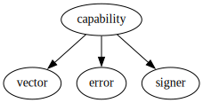
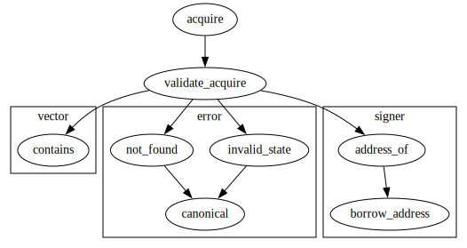
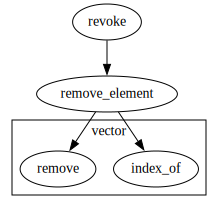

<a name="0x1_capability"></a>

# Module `0x1::capability`

A module which defines the basic concept of
[*capabilities*](https://en.wikipedia.org/wiki/Capability-based_security) for managing access control.

EXPERIMENTAL


<a name="@Overview_0"></a>

## Overview


A capability is a unforgeable token which testifies that a signer has authorized a certain operation.
The token is valid during the transaction where it is obtained. Since the type <code><a href="capability.md#0x1_capability_Cap">capability::Cap</a></code> has
no ability to be stored in global memory, capabilities cannot leak out of a transaction. For every function
called within a transaction which has a capability as a parameter, it is guaranteed that the capability
has been obtained via a proper signer-based authorization step previously in the transaction's execution.


<a name="@Usage_1"></a>

### Usage


Initializing and acquiring capabilities is usually encapsulated in a module with a type
tag which can only be constructed by this module.

```
module Pkg::Feature {
use std::capability::Cap;

/// A type tag used in Cap<Feature>. Only this module can create an instance,
/// and there is no public function other than Self::acquire which returns a value of this type.
/// This way, this module has full control how Cap<Feature> is given out.
struct Feature has drop {}

/// Initializes this module.
public fun initialize(s: &signer) {
// Create capability. This happens once at module initialization time.
// One needs to provide a witness for being the owner of Feature
// in the 2nd parameter.
<<additional conditions allowing to initialize this capability>>
capability::create<Feature>(s, &Feature{});
}

/// Acquires the capability to work with this feature.
public fun acquire(s: &signer): Cap<Feature> {
<<additional conditions allowing to acquire this capability>>
capability::acquire<Feature>(s, &Feature{});
}

/// Does something related to the feature. The caller must pass a Cap<Feature>.
public fun do_something(_cap: Cap<Feature>) { ... }
}
```


<a name="@Delegation_2"></a>

### Delegation


Capabilities come with the optional feature of *delegation*. Via <code><a href="capability.md#0x1_capability_delegate">Self::delegate</a></code>, an owner of a capability
can designate another signer to be also capable of acquiring the capability. Like the original creator,
the delegate needs to present his signer to obtain the capability in his transactions. Delegation can
be revoked via <code><a href="capability.md#0x1_capability_revoke">Self::revoke</a></code>, removing this access right from the delegate.

While the basic authorization mechanism for delegates is the same as with core capabilities, the
target of delegation might be subject of restrictions which need to be specified and verified. This can
be done via global invariants in the specification language. For example, in order to prevent delegation
all together for a capability, one can use the following invariant:

```
invariant forall a: address where capability::spec_has_cap<Feature>(a):
len(capability::spec_delegates<Feature>(a)) == 0;
```

Similarly, the following invariant would enforce that delegates, if existent, must satisfy a certain
predicate:

```
invariant forall a: address where capability::spec_has_cap<Feature>(a):
forall d in capability::spec_delegates<Feature>(a):
is_valid_delegate_for_feature(d);
```


-  [Overview](#@Overview_0)
    -  [Usage](#@Usage_1)
    -  [Delegation](#@Delegation_2)
-  [Struct `Cap`](#0x1_capability_Cap)
-  [Struct `LinearCap`](#0x1_capability_LinearCap)
-  [Resource `CapState`](#0x1_capability_CapState)
-  [Resource `CapDelegateState`](#0x1_capability_CapDelegateState)
-  [Constants](#@Constants_3)
-  [Function `create`](#0x1_capability_create)
-  [Function `acquire`](#0x1_capability_acquire)
-  [Function `acquire_linear`](#0x1_capability_acquire_linear)
-  [Function `validate_acquire`](#0x1_capability_validate_acquire)
-  [Function `root_addr`](#0x1_capability_root_addr)
-  [Function `linear_root_addr`](#0x1_capability_linear_root_addr)
-  [Function `delegate`](#0x1_capability_delegate)
-  [Function `revoke`](#0x1_capability_revoke)
-  [Function `remove_element`](#0x1_capability_remove_element)
-  [Function `add_element`](#0x1_capability_add_element)
-  [Specification](#@Specification_4)


<pre><code><b>use</b> <a href="../../move-stdlib/doc/error.md#0x1_error">0x1::error</a>;
<b>use</b> <a href="../../move-stdlib/doc/signer.md#0x1_signer">0x1::signer</a>;
<b>use</b> <a href="../../move-stdlib/doc/vector.md#0x1_vector">0x1::vector</a>;
</code></pre>


<details>
<summary>Show all the modules that "capability" depends on directly or indirectly</summary>





</details>

<details>
<summary>Show all the modules that depend on "capability" directly or indirectly</summary>


</details>

<a name="0x1_capability_Cap"></a>

## Struct `Cap`

The token representing an acquired capability. Cannot be stored in memory, but copied and dropped freely.


<pre><code><b>struct</b> <a href="capability.md#0x1_capability_Cap">Cap</a>&lt;Feature&gt; <b>has</b> <b>copy</b>, drop
</code></pre>


<details>
<summary>Fields</summary>


<dl>
<dt>
<code>root: <b>address</b></code>
</dt>
<dd>

</dd>
</dl>


</details>

<a name="0x1_capability_LinearCap"></a>

## Struct `LinearCap`

A linear version of a capability token. This can be used if an acquired capability should be enforced
to be used only once for an authorization.


<pre><code><b>struct</b> <a href="capability.md#0x1_capability_LinearCap">LinearCap</a>&lt;Feature&gt; <b>has</b> drop
</code></pre>


<details>
<summary>Fields</summary>


<dl>
<dt>
<code>root: <b>address</b></code>
</dt>
<dd>

</dd>
</dl>


</details>

<a name="0x1_capability_CapState"></a>

## Resource `CapState`

An internal data structure for representing a configured capability.


<pre><code><b>struct</b> <a href="capability.md#0x1_capability_CapState">CapState</a>&lt;Feature&gt; <b>has</b> key
</code></pre>


<details>
<summary>Fields</summary>


<dl>
<dt>
<code>delegates: <a href="../../move-stdlib/doc/vector.md#0x1_vector">vector</a>&lt;<b>address</b>&gt;</code>
</dt>
<dd>

</dd>
</dl>


</details>

<a name="0x1_capability_CapDelegateState"></a>

## Resource `CapDelegateState`

An internal data structure for representing a configured delegated capability.


<pre><code><b>struct</b> <a href="capability.md#0x1_capability_CapDelegateState">CapDelegateState</a>&lt;Feature&gt; <b>has</b> key
</code></pre>


<details>
<summary>Fields</summary>


<dl>
<dt>
<code>root: <b>address</b></code>
</dt>
<dd>

</dd>
</dl>


</details>

<a name="@Constants_3"></a>

## Constants


<a name="0x1_capability_ECAPABILITY_ALREADY_EXISTS"></a>

Capability resource already exists on the specified account


<pre><code><b>const</b> <a href="capability.md#0x1_capability_ECAPABILITY_ALREADY_EXISTS">ECAPABILITY_ALREADY_EXISTS</a>: u64 = 1;
</code></pre>


<a name="0x1_capability_ECAPABILITY_NOT_FOUND"></a>

Capability resource not found


<pre><code><b>const</b> <a href="capability.md#0x1_capability_ECAPABILITY_NOT_FOUND">ECAPABILITY_NOT_FOUND</a>: u64 = 2;
</code></pre>


<a name="0x1_capability_EDELEGATE"></a>

Account does not have delegated permissions


<pre><code><b>const</b> <a href="capability.md#0x1_capability_EDELEGATE">EDELEGATE</a>: u64 = 3;
</code></pre>


<a name="0x1_capability_create"></a>

## Function `create`

Creates a new capability class, owned by the passed signer. A caller must pass a witness that
they own the <code>Feature</code> type parameter.


<pre><code><b>public</b> <b>fun</b> <a href="capability.md#0x1_capability_create">create</a>&lt;Feature&gt;(owner: &<a href="../../move-stdlib/doc/signer.md#0x1_signer">signer</a>, _feature_witness: &Feature)
</code></pre>


<details>
<summary>Implementation</summary>


<pre><code><b>public</b> <b>fun</b> <a href="capability.md#0x1_capability_create">create</a>&lt;Feature&gt;(owner: &<a href="../../move-stdlib/doc/signer.md#0x1_signer">signer</a>, _feature_witness: &Feature) {
    <b>let</b> addr = <a href="../../move-stdlib/doc/signer.md#0x1_signer_address_of">signer::address_of</a>(owner);
    <b>assert</b>!(!<b>exists</b>&lt;<a href="capability.md#0x1_capability_CapState">CapState</a>&lt;Feature&gt;&gt;(addr), <a href="../../move-stdlib/doc/error.md#0x1_error_already_exists">error::already_exists</a>(<a href="capability.md#0x1_capability_ECAPABILITY_ALREADY_EXISTS">ECAPABILITY_ALREADY_EXISTS</a>));
    <b>move_to</b>&lt;<a href="capability.md#0x1_capability_CapState">CapState</a>&lt;Feature&gt;&gt;(owner, <a href="capability.md#0x1_capability_CapState">CapState</a> { delegates: <a href="../../move-stdlib/doc/vector.md#0x1_vector_empty">vector::empty</a>() });
}
</code></pre>


</details>

<details>
<summary>Show all the functions that "create" calls</summary>


</details>

<details>
<summary>Show all the functions that call "create"</summary>


</details>

<a name="0x1_capability_acquire"></a>

## Function `acquire`

Acquires a capability token. Only the owner of the capability class, or an authorized delegate,
can succeed with this operation. A caller must pass a witness that they own the <code>Feature</code> type
parameter.


<pre><code><b>public</b> <b>fun</b> <a href="capability.md#0x1_capability_acquire">acquire</a>&lt;Feature&gt;(requester: &<a href="../../move-stdlib/doc/signer.md#0x1_signer">signer</a>, _feature_witness: &Feature): <a href="capability.md#0x1_capability_Cap">capability::Cap</a>&lt;Feature&gt;
</code></pre>


<details>
<summary>Implementation</summary>


<pre><code><b>public</b> <b>fun</b> <a href="capability.md#0x1_capability_acquire">acquire</a>&lt;Feature&gt;(requester: &<a href="../../move-stdlib/doc/signer.md#0x1_signer">signer</a>, _feature_witness: &Feature): <a href="capability.md#0x1_capability_Cap">Cap</a>&lt;Feature&gt;
<b>acquires</b> <a href="capability.md#0x1_capability_CapState">CapState</a>, <a href="capability.md#0x1_capability_CapDelegateState">CapDelegateState</a> {
    <a href="capability.md#0x1_capability_Cap">Cap</a>&lt;Feature&gt; { root: <a href="capability.md#0x1_capability_validate_acquire">validate_acquire</a>&lt;Feature&gt;(requester) }
}
</code></pre>


</details>

<details>
<summary>Show all the functions that "acquire" calls</summary>





</details>

<details>
<summary>Show all the functions that call "acquire"</summary>


</details>

<a name="0x1_capability_acquire_linear"></a>

## Function `acquire_linear`

Acquires a linear capability token. It is up to the module which owns <code>Feature</code> to decide
whether to expose a linear or non-linear capability.


<pre><code><b>public</b> <b>fun</b> <a href="capability.md#0x1_capability_acquire_linear">acquire_linear</a>&lt;Feature&gt;(requester: &<a href="../../move-stdlib/doc/signer.md#0x1_signer">signer</a>, _feature_witness: &Feature): <a href="capability.md#0x1_capability_LinearCap">capability::LinearCap</a>&lt;Feature&gt;
</code></pre>


<details>
<summary>Implementation</summary>


<pre><code><b>public</b> <b>fun</b> <a href="capability.md#0x1_capability_acquire_linear">acquire_linear</a>&lt;Feature&gt;(requester: &<a href="../../move-stdlib/doc/signer.md#0x1_signer">signer</a>, _feature_witness: &Feature): <a href="capability.md#0x1_capability_LinearCap">LinearCap</a>&lt;Feature&gt;
<b>acquires</b> <a href="capability.md#0x1_capability_CapState">CapState</a>, <a href="capability.md#0x1_capability_CapDelegateState">CapDelegateState</a> {
    <a href="capability.md#0x1_capability_LinearCap">LinearCap</a>&lt;Feature&gt; { root: <a href="capability.md#0x1_capability_validate_acquire">validate_acquire</a>&lt;Feature&gt;(requester) }
}
</code></pre>


</details>

<details>
<summary>Show all the functions that "acquire_linear" calls</summary>


</details>

<details>
<summary>Show all the functions that call "acquire_linear"</summary>


</details>

<a name="0x1_capability_validate_acquire"></a>

## Function `validate_acquire`

Helper to validate an acquire. Returns the root address of the capability.


<pre><code><b>fun</b> <a href="capability.md#0x1_capability_validate_acquire">validate_acquire</a>&lt;Feature&gt;(requester: &<a href="../../move-stdlib/doc/signer.md#0x1_signer">signer</a>): <b>address</b>
</code></pre>


<details>
<summary>Implementation</summary>


<pre><code><b>fun</b> <a href="capability.md#0x1_capability_validate_acquire">validate_acquire</a>&lt;Feature&gt;(requester: &<a href="../../move-stdlib/doc/signer.md#0x1_signer">signer</a>): <b>address</b>
<b>acquires</b> <a href="capability.md#0x1_capability_CapState">CapState</a>, <a href="capability.md#0x1_capability_CapDelegateState">CapDelegateState</a> {
    <b>let</b> addr = <a href="../../move-stdlib/doc/signer.md#0x1_signer_address_of">signer::address_of</a>(requester);
    <b>if</b> (<b>exists</b>&lt;<a href="capability.md#0x1_capability_CapDelegateState">CapDelegateState</a>&lt;Feature&gt;&gt;(addr)) {
        <b>let</b> root_addr = <b>borrow_global</b>&lt;<a href="capability.md#0x1_capability_CapDelegateState">CapDelegateState</a>&lt;Feature&gt;&gt;(addr).root;
        // double check that requester is actually registered <b>as</b> a delegate
        <b>assert</b>!(<b>exists</b>&lt;<a href="capability.md#0x1_capability_CapState">CapState</a>&lt;Feature&gt;&gt;(root_addr), <a href="../../move-stdlib/doc/error.md#0x1_error_invalid_state">error::invalid_state</a>(<a href="capability.md#0x1_capability_EDELEGATE">EDELEGATE</a>));
        <b>assert</b>!(<a href="../../move-stdlib/doc/vector.md#0x1_vector_contains">vector::contains</a>(&<b>borrow_global</b>&lt;<a href="capability.md#0x1_capability_CapState">CapState</a>&lt;Feature&gt;&gt;(root_addr).delegates, &addr),
            <a href="../../move-stdlib/doc/error.md#0x1_error_invalid_state">error::invalid_state</a>(<a href="capability.md#0x1_capability_EDELEGATE">EDELEGATE</a>));
        root_addr
    } <b>else</b> {
        <b>assert</b>!(<b>exists</b>&lt;<a href="capability.md#0x1_capability_CapState">CapState</a>&lt;Feature&gt;&gt;(addr), <a href="../../move-stdlib/doc/error.md#0x1_error_not_found">error::not_found</a>(<a href="capability.md#0x1_capability_ECAPABILITY_NOT_FOUND">ECAPABILITY_NOT_FOUND</a>));
        addr
    }
}
</code></pre>


</details>

<details>
<summary>Show all the functions that "validate_acquire" calls</summary>


</details>

<details>
<summary>Show all the functions that call "validate_acquire"</summary>


</details>

<a name="0x1_capability_root_addr"></a>

## Function `root_addr`

Returns the root address associated with the given capability token. Only the owner
of the feature can do this.


<pre><code><b>public</b> <b>fun</b> <a href="capability.md#0x1_capability_root_addr">root_addr</a>&lt;Feature&gt;(cap: <a href="capability.md#0x1_capability_Cap">capability::Cap</a>&lt;Feature&gt;, _feature_witness: &Feature): <b>address</b>
</code></pre>


<details>
<summary>Implementation</summary>


<pre><code><b>public</b> <b>fun</b> <a href="capability.md#0x1_capability_root_addr">root_addr</a>&lt;Feature&gt;(cap: <a href="capability.md#0x1_capability_Cap">Cap</a>&lt;Feature&gt;, _feature_witness: &Feature): <b>address</b> {
    cap.root
}
</code></pre>


</details>

<details>
<summary>Show all the functions that "root_addr" calls</summary>


</details>

<details>
<summary>Show all the functions that call "root_addr"</summary>


</details>

<a name="0x1_capability_linear_root_addr"></a>

## Function `linear_root_addr`

Returns the root address associated with the given linear capability token.


<pre><code><b>public</b> <b>fun</b> <a href="capability.md#0x1_capability_linear_root_addr">linear_root_addr</a>&lt;Feature&gt;(cap: <a href="capability.md#0x1_capability_LinearCap">capability::LinearCap</a>&lt;Feature&gt;, _feature_witness: &Feature): <b>address</b>
</code></pre>


<details>
<summary>Implementation</summary>


<pre><code><b>public</b> <b>fun</b> <a href="capability.md#0x1_capability_linear_root_addr">linear_root_addr</a>&lt;Feature&gt;(cap: <a href="capability.md#0x1_capability_LinearCap">LinearCap</a>&lt;Feature&gt;, _feature_witness: &Feature): <b>address</b> {
    cap.root
}
</code></pre>


</details>

<details>
<summary>Show all the functions that "linear_root_addr" calls</summary>


</details>

<details>
<summary>Show all the functions that call "linear_root_addr"</summary>


</details>

<a name="0x1_capability_delegate"></a>

## Function `delegate`

Registers a delegation relation. If the relation already exists, this function does
nothing.


<pre><code><b>public</b> <b>fun</b> <a href="capability.md#0x1_capability_delegate">delegate</a>&lt;Feature&gt;(cap: <a href="capability.md#0x1_capability_Cap">capability::Cap</a>&lt;Feature&gt;, _feature_witness: &Feature, <b>to</b>: &<a href="../../move-stdlib/doc/signer.md#0x1_signer">signer</a>)
</code></pre>


<details>
<summary>Implementation</summary>


<pre><code><b>public</b> <b>fun</b> <a href="capability.md#0x1_capability_delegate">delegate</a>&lt;Feature&gt;(cap: <a href="capability.md#0x1_capability_Cap">Cap</a>&lt;Feature&gt;, _feature_witness: &Feature, <b>to</b>: &<a href="../../move-stdlib/doc/signer.md#0x1_signer">signer</a>)
<b>acquires</b> <a href="capability.md#0x1_capability_CapState">CapState</a> {
    <b>let</b> addr = <a href="../../move-stdlib/doc/signer.md#0x1_signer_address_of">signer::address_of</a>(<b>to</b>);
    <b>if</b> (<b>exists</b>&lt;<a href="capability.md#0x1_capability_CapDelegateState">CapDelegateState</a>&lt;Feature&gt;&gt;(addr)) <b>return</b>;
    <b>move_to</b>(<b>to</b>, <a href="capability.md#0x1_capability_CapDelegateState">CapDelegateState</a>&lt;Feature&gt; { root: cap.root });
    <a href="capability.md#0x1_capability_add_element">add_element</a>(&<b>mut</b> <b>borrow_global_mut</b>&lt;<a href="capability.md#0x1_capability_CapState">CapState</a>&lt;Feature&gt;&gt;(cap.root).delegates, addr);
}
</code></pre>


</details>

<details>
<summary>Show all the functions that "delegate" calls</summary>


</details>

<details>
<summary>Show all the functions that call "delegate"</summary>


</details>

<a name="0x1_capability_revoke"></a>

## Function `revoke`

Revokes a delegation relation. If no relation exists, this function does nothing.


<pre><code><b>public</b> <b>fun</b> <a href="capability.md#0x1_capability_revoke">revoke</a>&lt;Feature&gt;(cap: <a href="capability.md#0x1_capability_Cap">capability::Cap</a>&lt;Feature&gt;, _feature_witness: &Feature, from: <b>address</b>)
</code></pre>


<details>
<summary>Implementation</summary>


<pre><code><b>public</b> <b>fun</b> <a href="capability.md#0x1_capability_revoke">revoke</a>&lt;Feature&gt;(cap: <a href="capability.md#0x1_capability_Cap">Cap</a>&lt;Feature&gt;, _feature_witness: &Feature, from: <b>address</b>)
<b>acquires</b> <a href="capability.md#0x1_capability_CapState">CapState</a>, <a href="capability.md#0x1_capability_CapDelegateState">CapDelegateState</a>
{
    <b>if</b> (!<b>exists</b>&lt;<a href="capability.md#0x1_capability_CapDelegateState">CapDelegateState</a>&lt;Feature&gt;&gt;(from)) <b>return</b>;
    <b>let</b> <a href="capability.md#0x1_capability_CapDelegateState">CapDelegateState</a> { root: _root } = <b>move_from</b>&lt;<a href="capability.md#0x1_capability_CapDelegateState">CapDelegateState</a>&lt;Feature&gt;&gt;(from);
    <a href="capability.md#0x1_capability_remove_element">remove_element</a>(&<b>mut</b> <b>borrow_global_mut</b>&lt;<a href="capability.md#0x1_capability_CapState">CapState</a>&lt;Feature&gt;&gt;(cap.root).delegates, &from);
}
</code></pre>


</details>

<details>
<summary>Show all the functions that "revoke" calls</summary>





</details>

<details>
<summary>Show all the functions that call "revoke"</summary>


</details>

<a name="0x1_capability_remove_element"></a>

## Function `remove_element`

Helper to remove an element from a vector.


<pre><code><b>fun</b> <a href="capability.md#0x1_capability_remove_element">remove_element</a>&lt;E: drop&gt;(v: &<b>mut</b> <a href="../../move-stdlib/doc/vector.md#0x1_vector">vector</a>&lt;E&gt;, x: &E)
</code></pre>


<details>
<summary>Implementation</summary>


<pre><code><b>fun</b> <a href="capability.md#0x1_capability_remove_element">remove_element</a>&lt;E: drop&gt;(v: &<b>mut</b> <a href="../../move-stdlib/doc/vector.md#0x1_vector">vector</a>&lt;E&gt;, x: &E) {
    <b>let</b> (found, index) = <a href="../../move-stdlib/doc/vector.md#0x1_vector_index_of">vector::index_of</a>(v, x);
    <b>if</b> (found) {
        <a href="../../move-stdlib/doc/vector.md#0x1_vector_remove">vector::remove</a>(v, index);
    }
}
</code></pre>


</details>

<details>
<summary>Show all the functions that "remove_element" calls</summary>


</details>

<details>
<summary>Show all the functions that call "remove_element"</summary>


</details>

<a name="0x1_capability_add_element"></a>

## Function `add_element`

Helper to add an element to a vector.


<pre><code><b>fun</b> <a href="capability.md#0x1_capability_add_element">add_element</a>&lt;E: drop&gt;(v: &<b>mut</b> <a href="../../move-stdlib/doc/vector.md#0x1_vector">vector</a>&lt;E&gt;, x: E)
</code></pre>


<details>
<summary>Implementation</summary>


<pre><code><b>fun</b> <a href="capability.md#0x1_capability_add_element">add_element</a>&lt;E: drop&gt;(v: &<b>mut</b> <a href="../../move-stdlib/doc/vector.md#0x1_vector">vector</a>&lt;E&gt;, x: E) {
    <b>if</b> (!<a href="../../move-stdlib/doc/vector.md#0x1_vector_contains">vector::contains</a>(v, &x)) {
        <a href="../../move-stdlib/doc/vector.md#0x1_vector_push_back">vector::push_back</a>(v, x)
    }
}
</code></pre>


</details>

<details>
<summary>Show all the functions that "add_element" calls</summary>


</details>

<details>
<summary>Show all the functions that call "add_element"</summary>


</details>

<a name="@Specification_4"></a>

## Specification

Helper specification function to check whether a capability exists at address.


<a name="0x1_capability_spec_has_cap"></a>


<pre><code><b>fun</b> <a href="capability.md#0x1_capability_spec_has_cap">spec_has_cap</a>&lt;Feature&gt;(addr: <b>address</b>): bool {
   <b>exists</b>&lt;<a href="capability.md#0x1_capability_CapState">CapState</a>&lt;Feature&gt;&gt;(addr)
}
</code></pre>


Helper specification function to obtain the delegates of a capability.


<a name="0x1_capability_spec_delegates"></a>


<pre><code><b>fun</b> <a href="capability.md#0x1_capability_spec_delegates">spec_delegates</a>&lt;Feature&gt;(addr: <b>address</b>): <a href="../../move-stdlib/doc/vector.md#0x1_vector">vector</a>&lt;<b>address</b>&gt; {
   <b>global</b>&lt;<a href="capability.md#0x1_capability_CapState">CapState</a>&lt;Feature&gt;&gt;(addr).delegates
}
</code></pre>


[move-book]: https://move-language.github.io/move/introduction.html
