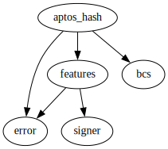
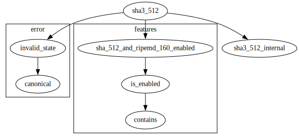
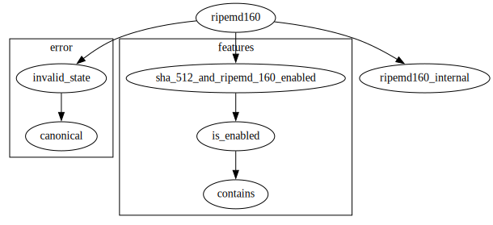

# Module `0x1::aptos_hash`

Cryptographic hashes:
- Keccak-256: see https://keccak.team/keccak.html

In addition, SHA2-256 and SHA3-256 are available in <code>std::hash</code>. Note that SHA3-256 is a variant of Keccak: it is
NOT the same as Keccak-256.

Non-cryptograhic hashes:
- SipHash: an add-rotate-xor (ARX) based family of pseudorandom functions created by Jean-Philippe Aumasson and Daniel J. Bernstein in 2012

-  [Constants](#@Constants_0)
-  [Function `sip_hash`](#0x1_aptos_hash_sip_hash)
-  [Function `sip_hash_from_value`](#0x1_aptos_hash_sip_hash_from_value)
-  [Function `keccak256`](#0x1_aptos_hash_keccak256)
-  [Function `sha2_512`](#0x1_aptos_hash_sha2_512)
-  [Function `sha3_512`](#0x1_aptos_hash_sha3_512)
-  [Function `ripemd160`](#0x1_aptos_hash_ripemd160)
-  [Function `sha2_512_internal`](#0x1_aptos_hash_sha2_512_internal)
-  [Function `sha3_512_internal`](#0x1_aptos_hash_sha3_512_internal)
-  [Function `ripemd160_internal`](#0x1_aptos_hash_ripemd160_internal)
-  [Specification](#@Specification_1)
    -  [Function `sip_hash`](#@Specification_1_sip_hash)
    -  [Function `sip_hash_from_value`](#@Specification_1_sip_hash_from_value)
    -  [Function `keccak256`](#@Specification_1_keccak256)
    -  [Function `sha2_512`](#@Specification_1_sha2_512)
    -  [Function `sha3_512`](#@Specification_1_sha3_512)
    -  [Function `ripemd160`](#@Specification_1_ripemd160)
    -  [Function `sha2_512_internal`](#@Specification_1_sha2_512_internal)
    -  [Function `sha3_512_internal`](#@Specification_1_sha3_512_internal)
    -  [Function `ripemd160_internal`](#@Specification_1_ripemd160_internal)

<pre><code><b>use</b> <a href="../../move-stdlib/doc/bcs.md#0x1_bcs">0x1::bcs</a>;
<b>use</b> <a href="../../move-stdlib/doc/error.md#0x1_error">0x1::error</a>;
<b>use</b> <a href="../../move-stdlib/doc/features.md#0x1_features">0x1::features</a>;
</code></pre>

Show all the modules that "aptos_hash" depends on directly or indirectly

Show all the modules that depend on "aptos_hash" directly or indirectly

## Constants

A newly-added native function is not yet enabled.

<pre><code><b>const</b> <a href="hash.md#0x1_aptos_hash_E_NATIVE_FUN_NOT_AVAILABLE">E_NATIVE_FUN_NOT_AVAILABLE</a>: u64 = 1;
</code></pre>

## Function `sip_hash`

Returns the (non-cryptographic) SipHash of <code>bytes</code>. See https://en.wikipedia.org/wiki/SipHash.

<pre><code><b>public</b> <b>fun</b> <a href="hash.md#0x1_aptos_hash_sip_hash">sip_hash</a>(bytes: <a href="../../move-stdlib/doc/vector.md#0x1_vector">vector</a>&lt;u8&gt;): u64
</code></pre>

Implementation

<pre><code><b>native</b> <b>public</b> <b>fun</b> <a href="hash.md#0x1_aptos_hash_sip_hash">sip_hash</a>(bytes: <a href="../../move-stdlib/doc/vector.md#0x1_vector">vector</a>&lt;u8&gt;): u64;
</code></pre>

Show all the functions that "sip_hash" calls

Show all the functions that call "sip_hash"

## Function `sip_hash_from_value`

Returns the (non-cryptographic) SipHash of the BCS serialization of <code>v</code>. See https://en.wikipedia.org/wiki/SipHash.

<pre><code><b>public</b> <b>fun</b> <a href="hash.md#0x1_aptos_hash_sip_hash_from_value">sip_hash_from_value</a>&lt;MoveValue&gt;(v: &MoveValue): u64
</code></pre>

Implementation

<pre><code><b>public</b> <b>fun</b> <a href="hash.md#0x1_aptos_hash_sip_hash_from_value">sip_hash_from_value</a>&lt;MoveValue&gt;(v: &MoveValue): u64 {
    <b>let</b> bytes = <a href="../../move-stdlib/doc/bcs.md#0x1_bcs_to_bytes">bcs::to_bytes</a>(v);

    <a href="hash.md#0x1_aptos_hash_sip_hash">sip_hash</a>(bytes)
}
</code></pre>

Show all the functions that "sip_hash_from_value" calls

Show all the functions that call "sip_hash_from_value"

## Function `keccak256`

Returns the Keccak-256 hash of <code>bytes</code>.

<pre><code><b>public</b> <b>fun</b> <a href="hash.md#0x1_aptos_hash_keccak256">keccak256</a>(bytes: <a href="../../move-stdlib/doc/vector.md#0x1_vector">vector</a>&lt;u8&gt;): <a href="../../move-stdlib/doc/vector.md#0x1_vector">vector</a>&lt;u8&gt;
</code></pre>

Implementation

<pre><code><b>native</b> <b>public</b> <b>fun</b> <a href="hash.md#0x1_aptos_hash_keccak256">keccak256</a>(bytes: <a href="../../move-stdlib/doc/vector.md#0x1_vector">vector</a>&lt;u8&gt;): <a href="../../move-stdlib/doc/vector.md#0x1_vector">vector</a>&lt;u8&gt;;
</code></pre>

Show all the functions that "keccak256" calls

Show all the functions that call "keccak256"

## Function `sha2_512`

Returns the SHA2-512 hash of <code>bytes</code>.

<pre><code><b>public</b> <b>fun</b> <a href="hash.md#0x1_aptos_hash_sha2_512">sha2_512</a>(bytes: <a href="../../move-stdlib/doc/vector.md#0x1_vector">vector</a>&lt;u8&gt;): <a href="../../move-stdlib/doc/vector.md#0x1_vector">vector</a>&lt;u8&gt;
</code></pre>

Implementation

<pre><code><b>public</b> <b>fun</b> <a href="hash.md#0x1_aptos_hash_sha2_512">sha2_512</a>(bytes: <a href="../../move-stdlib/doc/vector.md#0x1_vector">vector</a>&lt;u8&gt;): <a href="../../move-stdlib/doc/vector.md#0x1_vector">vector</a>&lt;u8&gt; {
    <b>if</b>(!<a href="../../move-stdlib/doc/features.md#0x1_features_sha_512_and_ripemd_160_enabled">features::sha_512_and_ripemd_160_enabled</a>()) {
        <b>abort</b>(std::error::invalid_state(<a href="hash.md#0x1_aptos_hash_E_NATIVE_FUN_NOT_AVAILABLE">E_NATIVE_FUN_NOT_AVAILABLE</a>))
    };

    <a href="hash.md#0x1_aptos_hash_sha2_512_internal">sha2_512_internal</a>(bytes)
}
</code></pre>

Show all the functions that "sha2_512" calls

Show all the functions that call "sha2_512"

## Function `sha3_512`

Returns the SHA3-512 hash of <code>bytes</code>.

<pre><code><b>public</b> <b>fun</b> <a href="hash.md#0x1_aptos_hash_sha3_512">sha3_512</a>(bytes: <a href="../../move-stdlib/doc/vector.md#0x1_vector">vector</a>&lt;u8&gt;): <a href="../../move-stdlib/doc/vector.md#0x1_vector">vector</a>&lt;u8&gt;
</code></pre>

Implementation

<pre><code><b>public</b> <b>fun</b> <a href="hash.md#0x1_aptos_hash_sha3_512">sha3_512</a>(bytes: <a href="../../move-stdlib/doc/vector.md#0x1_vector">vector</a>&lt;u8&gt;): <a href="../../move-stdlib/doc/vector.md#0x1_vector">vector</a>&lt;u8&gt; {
    <b>if</b>(!<a href="../../move-stdlib/doc/features.md#0x1_features_sha_512_and_ripemd_160_enabled">features::sha_512_and_ripemd_160_enabled</a>()) {
        <b>abort</b>(std::error::invalid_state(<a href="hash.md#0x1_aptos_hash_E_NATIVE_FUN_NOT_AVAILABLE">E_NATIVE_FUN_NOT_AVAILABLE</a>))
    };

    <a href="hash.md#0x1_aptos_hash_sha3_512_internal">sha3_512_internal</a>(bytes)
}
</code></pre>

Show all the functions that "sha3_512" calls

Show all the functions that call "sha3_512"

## Function `ripemd160`

Returns the RIPEMD-160 hash of <code>bytes</code>.

WARNING: Only 80-bit security is provided by this function. This means an adversary who can compute roughly 2^80
hashes will, with high probability, find a collision x_1 != x_2 such that RIPEMD-160(x_1) = RIPEMD-160(x_2).

<pre><code><b>public</b> <b>fun</b> <a href="hash.md#0x1_aptos_hash_ripemd160">ripemd160</a>(bytes: <a href="../../move-stdlib/doc/vector.md#0x1_vector">vector</a>&lt;u8&gt;): <a href="../../move-stdlib/doc/vector.md#0x1_vector">vector</a>&lt;u8&gt;
</code></pre>

Implementation

<pre><code><b>public</b> <b>fun</b> <a href="hash.md#0x1_aptos_hash_ripemd160">ripemd160</a>(bytes: <a href="../../move-stdlib/doc/vector.md#0x1_vector">vector</a>&lt;u8&gt;): <a href="../../move-stdlib/doc/vector.md#0x1_vector">vector</a>&lt;u8&gt; {
    <b>if</b>(!<a href="../../move-stdlib/doc/features.md#0x1_features_sha_512_and_ripemd_160_enabled">features::sha_512_and_ripemd_160_enabled</a>()) {
        <b>abort</b>(std::error::invalid_state(<a href="hash.md#0x1_aptos_hash_E_NATIVE_FUN_NOT_AVAILABLE">E_NATIVE_FUN_NOT_AVAILABLE</a>))
    };

    <a href="hash.md#0x1_aptos_hash_ripemd160_internal">ripemd160_internal</a>(bytes)
}
</code></pre>

Show all the functions that "ripemd160" calls

Show all the functions that call "ripemd160"

## Function `sha2_512_internal`

Returns the SHA2-512 hash of <code>bytes</code>.

<pre><code><b>fun</b> <a href="hash.md#0x1_aptos_hash_sha2_512_internal">sha2_512_internal</a>(bytes: <a href="../../move-stdlib/doc/vector.md#0x1_vector">vector</a>&lt;u8&gt;): <a href="../../move-stdlib/doc/vector.md#0x1_vector">vector</a>&lt;u8&gt;
</code></pre>

Implementation

<pre><code><b>native</b> <b>fun</b> <a href="hash.md#0x1_aptos_hash_sha2_512_internal">sha2_512_internal</a>(bytes: <a href="../../move-stdlib/doc/vector.md#0x1_vector">vector</a>&lt;u8&gt;): <a href="../../move-stdlib/doc/vector.md#0x1_vector">vector</a>&lt;u8&gt;;
</code></pre>

Show all the functions that "sha2_512_internal" calls

Show all the functions that call "sha2_512_internal"

## Function `sha3_512_internal`

Returns the SHA3-512 hash of <code>bytes</code>.

<pre><code><b>fun</b> <a href="hash.md#0x1_aptos_hash_sha3_512_internal">sha3_512_internal</a>(bytes: <a href="../../move-stdlib/doc/vector.md#0x1_vector">vector</a>&lt;u8&gt;): <a href="../../move-stdlib/doc/vector.md#0x1_vector">vector</a>&lt;u8&gt;
</code></pre>

Implementation

<pre><code><b>native</b> <b>fun</b> <a href="hash.md#0x1_aptos_hash_sha3_512_internal">sha3_512_internal</a>(bytes: <a href="../../move-stdlib/doc/vector.md#0x1_vector">vector</a>&lt;u8&gt;): <a href="../../move-stdlib/doc/vector.md#0x1_vector">vector</a>&lt;u8&gt;;
</code></pre>

Show all the functions that "sha3_512_internal" calls

Show all the functions that call "sha3_512_internal"

## Function `ripemd160_internal`

Returns the RIPEMD-160 hash of <code>bytes</code>.

WARNING: Only 80-bit security is provided by this function. This means an adversary who can compute roughly 2^80
hashes will, with high probability, find a collision x_1 != x_2 such that RIPEMD-160(x_1) = RIPEMD-160(x_2).

<pre><code><b>fun</b> <a href="hash.md#0x1_aptos_hash_ripemd160_internal">ripemd160_internal</a>(bytes: <a href="../../move-stdlib/doc/vector.md#0x1_vector">vector</a>&lt;u8&gt;): <a href="../../move-stdlib/doc/vector.md#0x1_vector">vector</a>&lt;u8&gt;
</code></pre>

Implementation

<pre><code><b>native</b> <b>fun</b> <a href="hash.md#0x1_aptos_hash_ripemd160_internal">ripemd160_internal</a>(bytes: <a href="../../move-stdlib/doc/vector.md#0x1_vector">vector</a>&lt;u8&gt;): <a href="../../move-stdlib/doc/vector.md#0x1_vector">vector</a>&lt;u8&gt;;
</code></pre>

Show all the functions that "ripemd160_internal" calls

Show all the functions that call "ripemd160_internal"

## Specification

<code>spec_sip_hash</code> is not assumed to be injective.

<pre><code><b>fun</b> <a href="hash.md#0x1_aptos_hash_spec_sip_hash">spec_sip_hash</a>(bytes: <a href="../../move-stdlib/doc/vector.md#0x1_vector">vector</a>&lt;u8&gt;): u64;
</code></pre>

<code>spec_keccak256</code> is an injective function.

<pre><code><b>fun</b> <a href="hash.md#0x1_aptos_hash_spec_keccak256">spec_keccak256</a>(bytes: <a href="../../move-stdlib/doc/vector.md#0x1_vector">vector</a>&lt;u8&gt;): <a href="../../move-stdlib/doc/vector.md#0x1_vector">vector</a>&lt;u8&gt;;
<b>axiom</b> <b>forall</b> b1: <a href="../../move-stdlib/doc/vector.md#0x1_vector">vector</a>&lt;u8&gt;, b2: <a href="../../move-stdlib/doc/vector.md#0x1_vector">vector</a>&lt;u8&gt;:
    (<a href="hash.md#0x1_aptos_hash_spec_keccak256">spec_keccak256</a>(b1) == <a href="hash.md#0x1_aptos_hash_spec_keccak256">spec_keccak256</a>(b2) ==&gt; b1 == b2);
</code></pre>

<code>spec_sha2_512_internal</code> is an injective function.

<pre><code><b>fun</b> <a href="hash.md#0x1_aptos_hash_spec_sha2_512_internal">spec_sha2_512_internal</a>(bytes: <a href="../../move-stdlib/doc/vector.md#0x1_vector">vector</a>&lt;u8&gt;): <a href="../../move-stdlib/doc/vector.md#0x1_vector">vector</a>&lt;u8&gt;;
<b>axiom</b> <b>forall</b> b1: <a href="../../move-stdlib/doc/vector.md#0x1_vector">vector</a>&lt;u8&gt;, b2: <a href="../../move-stdlib/doc/vector.md#0x1_vector">vector</a>&lt;u8&gt;:
    (<a href="hash.md#0x1_aptos_hash_spec_sha2_512_internal">spec_sha2_512_internal</a>(b1) == <a href="hash.md#0x1_aptos_hash_spec_sha2_512_internal">spec_sha2_512_internal</a>(b2) ==&gt; b1 == b2);
</code></pre>

<code>spec_sha3_512_internal</code> is an injective function.

<pre><code><b>fun</b> <a href="hash.md#0x1_aptos_hash_spec_sha3_512_internal">spec_sha3_512_internal</a>(bytes: <a href="../../move-stdlib/doc/vector.md#0x1_vector">vector</a>&lt;u8&gt;): <a href="../../move-stdlib/doc/vector.md#0x1_vector">vector</a>&lt;u8&gt;;
<b>axiom</b> <b>forall</b> b1: <a href="../../move-stdlib/doc/vector.md#0x1_vector">vector</a>&lt;u8&gt;, b2: <a href="../../move-stdlib/doc/vector.md#0x1_vector">vector</a>&lt;u8&gt;:
    (<a href="hash.md#0x1_aptos_hash_spec_sha3_512_internal">spec_sha3_512_internal</a>(b1) == <a href="hash.md#0x1_aptos_hash_spec_sha3_512_internal">spec_sha3_512_internal</a>(b2) ==&gt; b1 == b2);
</code></pre>

<code>spec_ripemd160_internal</code> is an injective function.

<pre><code><b>fun</b> <a href="hash.md#0x1_aptos_hash_spec_ripemd160_internal">spec_ripemd160_internal</a>(bytes: <a href="../../move-stdlib/doc/vector.md#0x1_vector">vector</a>&lt;u8&gt;): <a href="../../move-stdlib/doc/vector.md#0x1_vector">vector</a>&lt;u8&gt;;
<b>axiom</b> <b>forall</b> b1: <a href="../../move-stdlib/doc/vector.md#0x1_vector">vector</a>&lt;u8&gt;, b2: <a href="../../move-stdlib/doc/vector.md#0x1_vector">vector</a>&lt;u8&gt;:
    (<a href="hash.md#0x1_aptos_hash_spec_ripemd160_internal">spec_ripemd160_internal</a>(b1) == <a href="hash.md#0x1_aptos_hash_spec_ripemd160_internal">spec_ripemd160_internal</a>(b2) ==&gt; b1 == b2);
</code></pre>

### Function `sip_hash`

<pre><code><b>public</b> <b>fun</b> <a href="hash.md#0x1_aptos_hash_sip_hash">sip_hash</a>(bytes: <a href="../../move-stdlib/doc/vector.md#0x1_vector">vector</a>&lt;u8&gt;): u64
</code></pre>

<pre><code><b>pragma</b> opaque;
<b>aborts_if</b> [abstract] <b>false</b>;
<b>ensures</b> [abstract] result == <a href="hash.md#0x1_aptos_hash_spec_sip_hash">spec_sip_hash</a>(bytes);
</code></pre>

### Function `sip_hash_from_value`

<pre><code><b>public</b> <b>fun</b> <a href="hash.md#0x1_aptos_hash_sip_hash_from_value">sip_hash_from_value</a>&lt;MoveValue&gt;(v: &MoveValue): u64
</code></pre>

<pre><code><b>pragma</b> opaque;
<b>ensures</b> result == <a href="hash.md#0x1_aptos_hash_spec_sip_hash">spec_sip_hash</a>(<a href="../../move-stdlib/doc/bcs.md#0x1_bcs_serialize">bcs::serialize</a>(v));
</code></pre>

### Function `keccak256`

<pre><code><b>public</b> <b>fun</b> <a href="hash.md#0x1_aptos_hash_keccak256">keccak256</a>(bytes: <a href="../../move-stdlib/doc/vector.md#0x1_vector">vector</a>&lt;u8&gt;): <a href="../../move-stdlib/doc/vector.md#0x1_vector">vector</a>&lt;u8&gt;
</code></pre>

<pre><code><b>pragma</b> opaque;
<b>aborts_if</b> [abstract] <b>false</b>;
<b>ensures</b> [abstract] result == <a href="hash.md#0x1_aptos_hash_spec_keccak256">spec_keccak256</a>(bytes);
</code></pre>

### Function `sha2_512`

<pre><code><b>public</b> <b>fun</b> <a href="hash.md#0x1_aptos_hash_sha2_512">sha2_512</a>(bytes: <a href="../../move-stdlib/doc/vector.md#0x1_vector">vector</a>&lt;u8&gt;): <a href="../../move-stdlib/doc/vector.md#0x1_vector">vector</a>&lt;u8&gt;
</code></pre>

<pre><code><b>pragma</b> opaque;
<b>aborts_if</b> !<a href="../../move-stdlib/doc/features.md#0x1_features_spec_is_enabled">features::spec_is_enabled</a>(<a href="../../move-stdlib/doc/features.md#0x1_features_SHA_512_AND_RIPEMD_160_NATIVES">features::SHA_512_AND_RIPEMD_160_NATIVES</a>);
<b>ensures</b> result == <a href="hash.md#0x1_aptos_hash_spec_sha2_512_internal">spec_sha2_512_internal</a>(bytes);
</code></pre>

### Function `sha3_512`

<pre><code><b>public</b> <b>fun</b> <a href="hash.md#0x1_aptos_hash_sha3_512">sha3_512</a>(bytes: <a href="../../move-stdlib/doc/vector.md#0x1_vector">vector</a>&lt;u8&gt;): <a href="../../move-stdlib/doc/vector.md#0x1_vector">vector</a>&lt;u8&gt;
</code></pre>

<pre><code><b>pragma</b> opaque;
<b>aborts_if</b> !<a href="../../move-stdlib/doc/features.md#0x1_features_spec_is_enabled">features::spec_is_enabled</a>(<a href="../../move-stdlib/doc/features.md#0x1_features_SHA_512_AND_RIPEMD_160_NATIVES">features::SHA_512_AND_RIPEMD_160_NATIVES</a>);
<b>ensures</b> result == <a href="hash.md#0x1_aptos_hash_spec_sha3_512_internal">spec_sha3_512_internal</a>(bytes);
</code></pre>

### Function `ripemd160`

<pre><code><b>public</b> <b>fun</b> <a href="hash.md#0x1_aptos_hash_ripemd160">ripemd160</a>(bytes: <a href="../../move-stdlib/doc/vector.md#0x1_vector">vector</a>&lt;u8&gt;): <a href="../../move-stdlib/doc/vector.md#0x1_vector">vector</a>&lt;u8&gt;
</code></pre>

<pre><code><b>pragma</b> opaque;
<b>aborts_if</b> !<a href="../../move-stdlib/doc/features.md#0x1_features_spec_is_enabled">features::spec_is_enabled</a>(<a href="../../move-stdlib/doc/features.md#0x1_features_SHA_512_AND_RIPEMD_160_NATIVES">features::SHA_512_AND_RIPEMD_160_NATIVES</a>);
<b>ensures</b> result == <a href="hash.md#0x1_aptos_hash_spec_ripemd160_internal">spec_ripemd160_internal</a>(bytes);
</code></pre>

### Function `sha2_512_internal`

<pre><code><b>fun</b> <a href="hash.md#0x1_aptos_hash_sha2_512_internal">sha2_512_internal</a>(bytes: <a href="../../move-stdlib/doc/vector.md#0x1_vector">vector</a>&lt;u8&gt;): <a href="../../move-stdlib/doc/vector.md#0x1_vector">vector</a>&lt;u8&gt;
</code></pre>

<pre><code><b>pragma</b> opaque;
<b>aborts_if</b> [abstract] <b>false</b>;
<b>ensures</b> [abstract] result == <a href="hash.md#0x1_aptos_hash_spec_sha2_512_internal">spec_sha2_512_internal</a>(bytes);
</code></pre>

### Function `sha3_512_internal`

<pre><code><b>fun</b> <a href="hash.md#0x1_aptos_hash_sha3_512_internal">sha3_512_internal</a>(bytes: <a href="../../move-stdlib/doc/vector.md#0x1_vector">vector</a>&lt;u8&gt;): <a href="../../move-stdlib/doc/vector.md#0x1_vector">vector</a>&lt;u8&gt;
</code></pre>

<pre><code><b>pragma</b> opaque;
<b>aborts_if</b> [abstract] <b>false</b>;
<b>ensures</b> [abstract] result == <a href="hash.md#0x1_aptos_hash_spec_sha3_512_internal">spec_sha3_512_internal</a>(bytes);
</code></pre>

### Function `ripemd160_internal`

<pre><code><b>fun</b> <a href="hash.md#0x1_aptos_hash_ripemd160_internal">ripemd160_internal</a>(bytes: <a href="../../move-stdlib/doc/vector.md#0x1_vector">vector</a>&lt;u8&gt;): <a href="../../move-stdlib/doc/vector.md#0x1_vector">vector</a>&lt;u8&gt;
</code></pre>

<pre><code><b>pragma</b> opaque;
<b>aborts_if</b> [abstract] <b>false</b>;
<b>ensures</b> [abstract] result == <a href="hash.md#0x1_aptos_hash_spec_ripemd160_internal">spec_ripemd160_internal</a>(bytes);
</code></pre>

[move-book]: https://move-language.github.io/move/introduction.html
