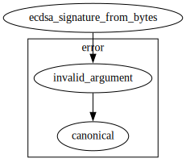
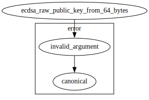
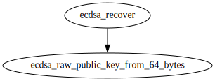
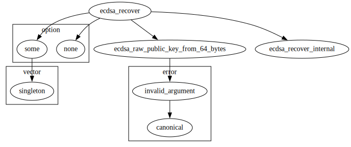

# Module `0x1::secp256k1`

This module implements ECDSA signatures based on the prime-order secp256k1 ellptic curve (i.e., cofactor is 1).

-  [Struct `ECDSARawPublicKey`](#0x1_secp256k1_ECDSARawPublicKey)
-  [Struct `ECDSASignature`](#0x1_secp256k1_ECDSASignature)
-  [Constants](#@Constants_0)
-  [Function `ecdsa_signature_from_bytes`](#0x1_secp256k1_ecdsa_signature_from_bytes)
-  [Function `ecdsa_raw_public_key_from_64_bytes`](#0x1_secp256k1_ecdsa_raw_public_key_from_64_bytes)
-  [Function `ecdsa_raw_public_key_to_bytes`](#0x1_secp256k1_ecdsa_raw_public_key_to_bytes)
-  [Function `ecdsa_signature_to_bytes`](#0x1_secp256k1_ecdsa_signature_to_bytes)
-  [Function `ecdsa_recover`](#0x1_secp256k1_ecdsa_recover)
-  [Function `ecdsa_recover_internal`](#0x1_secp256k1_ecdsa_recover_internal)
-  [Specification](#@Specification_1)
    -  [Function `ecdsa_recover_internal`](#@Specification_1_ecdsa_recover_internal)

<pre><code><b>use</b> <a href="../../move-stdlib/doc/error.md#0x1_error">0x1::error</a>;
<b>use</b> <a href="../../move-stdlib/doc/option.md#0x1_option">0x1::option</a>;
</code></pre>

Show all the modules that "secp256k1" depends on directly or indirectly

Show all the modules that depend on "secp256k1" directly or indirectly

## Struct `ECDSARawPublicKey`

A 64-byte ECDSA public key.

<pre><code><b>struct</b> <a href="secp256k1.md#0x1_secp256k1_ECDSARawPublicKey">ECDSARawPublicKey</a> <b>has</b> <b>copy</b>, drop, store
</code></pre>

Fields

<dl>
<dt>
<code>bytes: <a href="../../move-stdlib/doc/vector.md#0x1_vector">vector</a>&lt;u8&gt;</code>
</dt>
<dd>

</dd>
</dl>

## Struct `ECDSASignature`

A 64-byte ECDSA signature.

<pre><code><b>struct</b> <a href="secp256k1.md#0x1_secp256k1_ECDSASignature">ECDSASignature</a> <b>has</b> <b>copy</b>, drop, store
</code></pre>

Fields

<dl>
<dt>
<code>bytes: <a href="../../move-stdlib/doc/vector.md#0x1_vector">vector</a>&lt;u8&gt;</code>
</dt>
<dd>

</dd>
</dl>

## Constants

The size of a secp256k1-based ECDSA signature, in bytes.

<pre><code><b>const</b> <a href="secp256k1.md#0x1_secp256k1_SIGNATURE_NUM_BYTES">SIGNATURE_NUM_BYTES</a>: u64 = 64;
</code></pre>

An error occurred while deserializing, for example due to wrong input size.

<pre><code><b>const</b> <a href="secp256k1.md#0x1_secp256k1_E_DESERIALIZE">E_DESERIALIZE</a>: u64 = 1;
</code></pre>

The size of a secp256k1-based ECDSA public key, in bytes.

<pre><code><b>const</b> <a href="secp256k1.md#0x1_secp256k1_RAW_PUBLIC_KEY_NUM_BYTES">RAW_PUBLIC_KEY_NUM_BYTES</a>: u64 = 64;
</code></pre>

## Function `ecdsa_signature_from_bytes`

Constructs an ECDSASignature struct from the given 64 bytes.

<pre><code><b>public</b> <b>fun</b> <a href="secp256k1.md#0x1_secp256k1_ecdsa_signature_from_bytes">ecdsa_signature_from_bytes</a>(bytes: <a href="../../move-stdlib/doc/vector.md#0x1_vector">vector</a>&lt;u8&gt;): <a href="secp256k1.md#0x1_secp256k1_ECDSASignature">secp256k1::ECDSASignature</a>
</code></pre>

Implementation

<pre><code><b>public</b> <b>fun</b> <a href="secp256k1.md#0x1_secp256k1_ecdsa_signature_from_bytes">ecdsa_signature_from_bytes</a>(bytes: <a href="../../move-stdlib/doc/vector.md#0x1_vector">vector</a>&lt;u8&gt;): <a href="secp256k1.md#0x1_secp256k1_ECDSASignature">ECDSASignature</a> {
    <b>assert</b>!(std::vector::length(&bytes) == <a href="secp256k1.md#0x1_secp256k1_SIGNATURE_NUM_BYTES">SIGNATURE_NUM_BYTES</a>, std::error::invalid_argument(<a href="secp256k1.md#0x1_secp256k1_E_DESERIALIZE">E_DESERIALIZE</a>));
    <a href="secp256k1.md#0x1_secp256k1_ECDSASignature">ECDSASignature</a> { bytes }
}
</code></pre>

Show all the functions that "ecdsa_signature_from_bytes" calls

Show all the functions that call "ecdsa_signature_from_bytes"

## Function `ecdsa_raw_public_key_from_64_bytes`

Constructs an ECDSARawPublicKey struct, given a 64-byte raw representation.

<pre><code><b>public</b> <b>fun</b> <a href="secp256k1.md#0x1_secp256k1_ecdsa_raw_public_key_from_64_bytes">ecdsa_raw_public_key_from_64_bytes</a>(bytes: <a href="../../move-stdlib/doc/vector.md#0x1_vector">vector</a>&lt;u8&gt;): <a href="secp256k1.md#0x1_secp256k1_ECDSARawPublicKey">secp256k1::ECDSARawPublicKey</a>
</code></pre>

Implementation

<pre><code><b>public</b> <b>fun</b> <a href="secp256k1.md#0x1_secp256k1_ecdsa_raw_public_key_from_64_bytes">ecdsa_raw_public_key_from_64_bytes</a>(bytes: <a href="../../move-stdlib/doc/vector.md#0x1_vector">vector</a>&lt;u8&gt;): <a href="secp256k1.md#0x1_secp256k1_ECDSARawPublicKey">ECDSARawPublicKey</a> {
    <b>assert</b>!(std::vector::length(&bytes) == <a href="secp256k1.md#0x1_secp256k1_RAW_PUBLIC_KEY_NUM_BYTES">RAW_PUBLIC_KEY_NUM_BYTES</a>, std::error::invalid_argument(<a href="secp256k1.md#0x1_secp256k1_E_DESERIALIZE">E_DESERIALIZE</a>));
    <a href="secp256k1.md#0x1_secp256k1_ECDSARawPublicKey">ECDSARawPublicKey</a> { bytes }
}
</code></pre>

Show all the functions that "ecdsa_raw_public_key_from_64_bytes" calls

Show all the functions that call "ecdsa_raw_public_key_from_64_bytes"

## Function `ecdsa_raw_public_key_to_bytes`

Serializes an ECDSARawPublicKey struct to 64-bytes.

<pre><code><b>public</b> <b>fun</b> <a href="secp256k1.md#0x1_secp256k1_ecdsa_raw_public_key_to_bytes">ecdsa_raw_public_key_to_bytes</a>(pk: &<a href="secp256k1.md#0x1_secp256k1_ECDSARawPublicKey">secp256k1::ECDSARawPublicKey</a>): <a href="../../move-stdlib/doc/vector.md#0x1_vector">vector</a>&lt;u8&gt;
</code></pre>

Implementation

<pre><code><b>public</b> <b>fun</b> <a href="secp256k1.md#0x1_secp256k1_ecdsa_raw_public_key_to_bytes">ecdsa_raw_public_key_to_bytes</a>(pk: &<a href="secp256k1.md#0x1_secp256k1_ECDSARawPublicKey">ECDSARawPublicKey</a>): <a href="../../move-stdlib/doc/vector.md#0x1_vector">vector</a>&lt;u8&gt; {
    pk.bytes
}
</code></pre>

Show all the functions that "ecdsa_raw_public_key_to_bytes" calls

Show all the functions that call "ecdsa_raw_public_key_to_bytes"

## Function `ecdsa_signature_to_bytes`

Serializes an ECDSASignature struct to 64-bytes.

<pre><code><b>public</b> <b>fun</b> <a href="secp256k1.md#0x1_secp256k1_ecdsa_signature_to_bytes">ecdsa_signature_to_bytes</a>(sig: &<a href="secp256k1.md#0x1_secp256k1_ECDSASignature">secp256k1::ECDSASignature</a>): <a href="../../move-stdlib/doc/vector.md#0x1_vector">vector</a>&lt;u8&gt;
</code></pre>

Implementation

<pre><code><b>public</b> <b>fun</b> <a href="secp256k1.md#0x1_secp256k1_ecdsa_signature_to_bytes">ecdsa_signature_to_bytes</a>(sig: &<a href="secp256k1.md#0x1_secp256k1_ECDSASignature">ECDSASignature</a>): <a href="../../move-stdlib/doc/vector.md#0x1_vector">vector</a>&lt;u8&gt; {
    sig.bytes
}
</code></pre>

Show all the functions that "ecdsa_signature_to_bytes" calls

Show all the functions that call "ecdsa_signature_to_bytes"

## Function `ecdsa_recover`

Recovers the signer's raw (64-byte) public key from a secp256k1 ECDSA <code>signature</code> given the <code>recovery_id</code> and the signed
<code>message</code> (32 byte digest).

Note that an invalid signature, or a signature from a different message, will result in the recovery of an
incorrect public key. This recovery algorithm can only be used to check validity of a signature if the signer's
public key (or its hash) is known beforehand.

<pre><code><b>public</b> <b>fun</b> <a href="secp256k1.md#0x1_secp256k1_ecdsa_recover">ecdsa_recover</a>(message: <a href="../../move-stdlib/doc/vector.md#0x1_vector">vector</a>&lt;u8&gt;, recovery_id: u8, signature: &<a href="secp256k1.md#0x1_secp256k1_ECDSASignature">secp256k1::ECDSASignature</a>): <a href="../../move-stdlib/doc/option.md#0x1_option_Option">option::Option</a>&lt;<a href="secp256k1.md#0x1_secp256k1_ECDSARawPublicKey">secp256k1::ECDSARawPublicKey</a>&gt;
</code></pre>

Implementation

<pre><code><b>public</b> <b>fun</b> <a href="secp256k1.md#0x1_secp256k1_ecdsa_recover">ecdsa_recover</a>(
    message: <a href="../../move-stdlib/doc/vector.md#0x1_vector">vector</a>&lt;u8&gt;,
    recovery_id: u8,
    signature: &<a href="secp256k1.md#0x1_secp256k1_ECDSASignature">ECDSASignature</a>,
): Option&lt;<a href="secp256k1.md#0x1_secp256k1_ECDSARawPublicKey">ECDSARawPublicKey</a>&gt; {
    <b>let</b> (pk, success) = <a href="secp256k1.md#0x1_secp256k1_ecdsa_recover_internal">ecdsa_recover_internal</a>(message, recovery_id, signature.bytes);
    <b>if</b> (success) {
        std::option::some(<a href="secp256k1.md#0x1_secp256k1_ecdsa_raw_public_key_from_64_bytes">ecdsa_raw_public_key_from_64_bytes</a>(pk))
    } <b>else</b> {
        std::option::none&lt;<a href="secp256k1.md#0x1_secp256k1_ECDSARawPublicKey">ECDSARawPublicKey</a>&gt;()
    }
}
</code></pre>

Show all the functions that "ecdsa_recover" calls

Show all the functions that call "ecdsa_recover"

## Function `ecdsa_recover_internal`

Returns <code>(public_key, <b>true</b>)</code> if <code>signature</code> verifies on <code>message</code> under the recovered <code>public_key</code>
and returns <code>([], <b>false</b>)</code> otherwise.

<pre><code><b>fun</b> <a href="secp256k1.md#0x1_secp256k1_ecdsa_recover_internal">ecdsa_recover_internal</a>(message: <a href="../../move-stdlib/doc/vector.md#0x1_vector">vector</a>&lt;u8&gt;, recovery_id: u8, signature: <a href="../../move-stdlib/doc/vector.md#0x1_vector">vector</a>&lt;u8&gt;): (<a href="../../move-stdlib/doc/vector.md#0x1_vector">vector</a>&lt;u8&gt;, bool)
</code></pre>

Implementation

<pre><code><b>native</b> <b>fun</b> <a href="secp256k1.md#0x1_secp256k1_ecdsa_recover_internal">ecdsa_recover_internal</a>(
    message: <a href="../../move-stdlib/doc/vector.md#0x1_vector">vector</a>&lt;u8&gt;,
    recovery_id: u8,
    signature: <a href="../../move-stdlib/doc/vector.md#0x1_vector">vector</a>&lt;u8&gt;
): (<a href="../../move-stdlib/doc/vector.md#0x1_vector">vector</a>&lt;u8&gt;, bool);
</code></pre>

Show all the functions that "ecdsa_recover_internal" calls

Show all the functions that call "ecdsa_recover_internal"

## Specification

### Function `ecdsa_recover_internal`

<pre><code><b>fun</b> <a href="secp256k1.md#0x1_secp256k1_ecdsa_recover_internal">ecdsa_recover_internal</a>(message: <a href="../../move-stdlib/doc/vector.md#0x1_vector">vector</a>&lt;u8&gt;, recovery_id: u8, signature: <a href="../../move-stdlib/doc/vector.md#0x1_vector">vector</a>&lt;u8&gt;): (<a href="../../move-stdlib/doc/vector.md#0x1_vector">vector</a>&lt;u8&gt;, bool)
</code></pre>

<pre><code><b>pragma</b> opaque;
</code></pre>

[move-book]: https://move-language.github.io/move/introduction.html
