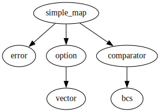
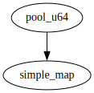
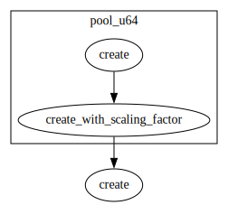
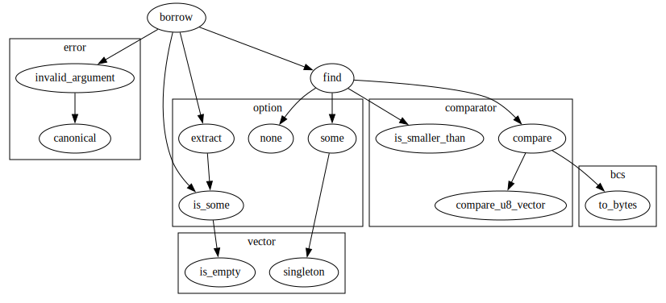
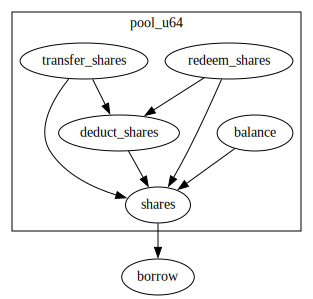
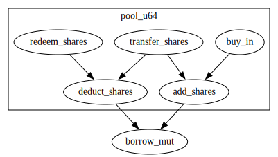
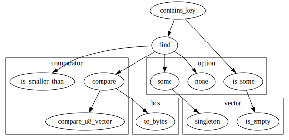
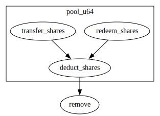
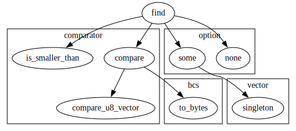
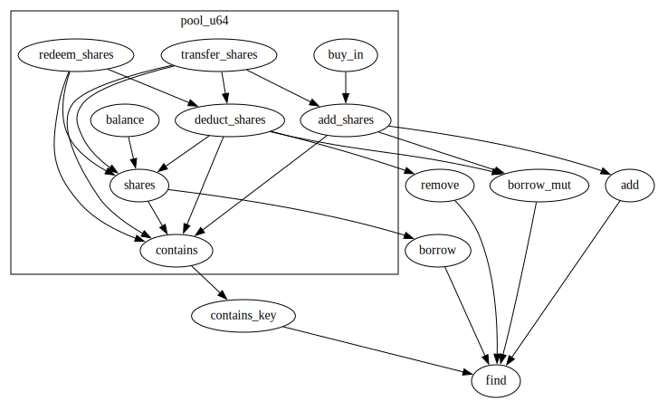

# Module `0x1::simple_map`

This module provides a solution for sorted maps, that is it has the properties that
1) Keys point to Values
2) Each Key must be unique
3) A Key can be found within O(Log N) time
4) The data is stored as sorted by Key
5) Adds and removals take O(N) time

-  [Struct `SimpleMap`](#0x1_simple_map_SimpleMap)
-  [Struct `Element`](#0x1_simple_map_Element)
-  [Constants](#@Constants_0)
-  [Function `length`](#0x1_simple_map_length)
-  [Function `create`](#0x1_simple_map_create)
-  [Function `borrow`](#0x1_simple_map_borrow)
-  [Function `borrow_mut`](#0x1_simple_map_borrow_mut)
-  [Function `contains_key`](#0x1_simple_map_contains_key)
-  [Function `destroy_empty`](#0x1_simple_map_destroy_empty)
-  [Function `add`](#0x1_simple_map_add)
-  [Function `remove`](#0x1_simple_map_remove)
-  [Function `find`](#0x1_simple_map_find)
-  [Specification](#@Specification_1)
    -  [Struct `SimpleMap`](#@Specification_1_SimpleMap)
    -  [Function `length`](#@Specification_1_length)
    -  [Function `create`](#@Specification_1_create)
    -  [Function `borrow`](#@Specification_1_borrow)
    -  [Function `borrow_mut`](#@Specification_1_borrow_mut)
    -  [Function `contains_key`](#@Specification_1_contains_key)
    -  [Function `destroy_empty`](#@Specification_1_destroy_empty)
    -  [Function `add`](#@Specification_1_add)
    -  [Function `remove`](#@Specification_1_remove)
    -  [Function `find`](#@Specification_1_find)

<pre><code><b>use</b> <a href="comparator.md#0x1_comparator">0x1::comparator</a>;
<b>use</b> <a href="../../move-stdlib/doc/error.md#0x1_error">0x1::error</a>;
<b>use</b> <a href="../../move-stdlib/doc/option.md#0x1_option">0x1::option</a>;
</code></pre>

Show all the modules that "simple_map" depends on directly or indirectly

Show all the modules that depend on "simple_map" directly or indirectly

## Struct `SimpleMap`

<pre><code><b>struct</b> <a href="simple_map.md#0x1_simple_map_SimpleMap">SimpleMap</a>&lt;Key, Value&gt; <b>has</b> <b>copy</b>, drop, store
</code></pre>

Fields

<dl>
<dt>
<code>data: <a href="../../move-stdlib/doc/vector.md#0x1_vector">vector</a>&lt;<a href="simple_map.md#0x1_simple_map_Element">simple_map::Element</a>&lt;Key, Value&gt;&gt;</code>
</dt>
<dd>

</dd>
</dl>

## Struct `Element`

<pre><code><b>struct</b> <a href="simple_map.md#0x1_simple_map_Element">Element</a>&lt;Key, Value&gt; <b>has</b> <b>copy</b>, drop, store
</code></pre>

Fields

<dl>
<dt>
<code>key: Key</code>
</dt>
<dd>

</dd>
<dt>
<code>value: Value</code>
</dt>
<dd>

</dd>
</dl>

## Constants

Map key already exists

<pre><code><b>const</b> <a href="simple_map.md#0x1_simple_map_EKEY_ALREADY_EXISTS">EKEY_ALREADY_EXISTS</a>: u64 = 1;
</code></pre>

Map key is not found

<pre><code><b>const</b> <a href="simple_map.md#0x1_simple_map_EKEY_NOT_FOUND">EKEY_NOT_FOUND</a>: u64 = 2;
</code></pre>

## Function `length`

<pre><code><b>public</b> <b>fun</b> <a href="simple_map.md#0x1_simple_map_length">length</a>&lt;Key: store, Value: store&gt;(map: &<a href="simple_map.md#0x1_simple_map_SimpleMap">simple_map::SimpleMap</a>&lt;Key, Value&gt;): u64
</code></pre>

Implementation

<pre><code><b>public</b> <b>fun</b> <a href="simple_map.md#0x1_simple_map_length">length</a>&lt;Key: store, Value: store&gt;(map: &<a href="simple_map.md#0x1_simple_map_SimpleMap">SimpleMap</a>&lt;Key, Value&gt;): u64 {
    <a href="../../move-stdlib/doc/vector.md#0x1_vector_length">vector::length</a>(&map.data)
}
</code></pre>

Show all the functions that "length" calls

Show all the functions that call "length"

## Function `create`

<pre><code><b>public</b> <b>fun</b> <a href="simple_map.md#0x1_simple_map_create">create</a>&lt;Key: store, Value: store&gt;(): <a href="simple_map.md#0x1_simple_map_SimpleMap">simple_map::SimpleMap</a>&lt;Key, Value&gt;
</code></pre>

Implementation

<pre><code><b>public</b> <b>fun</b> <a href="simple_map.md#0x1_simple_map_create">create</a>&lt;Key: store, Value: store&gt;(): <a href="simple_map.md#0x1_simple_map_SimpleMap">SimpleMap</a>&lt;Key, Value&gt; {
    <a href="simple_map.md#0x1_simple_map_SimpleMap">SimpleMap</a> {
        data: <a href="../../move-stdlib/doc/vector.md#0x1_vector_empty">vector::empty</a>(),
    }
}
</code></pre>

Show all the functions that "create" calls

Show all the functions that call "create"

## Function `borrow`

<pre><code><b>public</b> <b>fun</b> <a href="simple_map.md#0x1_simple_map_borrow">borrow</a>&lt;Key: store, Value: store&gt;(map: &<a href="simple_map.md#0x1_simple_map_SimpleMap">simple_map::SimpleMap</a>&lt;Key, Value&gt;, key: &Key): &Value
</code></pre>

Implementation

<pre><code><b>public</b> <b>fun</b> <a href="simple_map.md#0x1_simple_map_borrow">borrow</a>&lt;Key: store, Value: store&gt;(
    map: &<a href="simple_map.md#0x1_simple_map_SimpleMap">SimpleMap</a>&lt;Key, Value&gt;,
    key: &Key,
): &Value {
    <b>let</b> (maybe_idx, _) = <a href="simple_map.md#0x1_simple_map_find">find</a>(map, key);
    <b>assert</b>!(<a href="../../move-stdlib/doc/option.md#0x1_option_is_some">option::is_some</a>(&maybe_idx), <a href="../../move-stdlib/doc/error.md#0x1_error_invalid_argument">error::invalid_argument</a>(<a href="simple_map.md#0x1_simple_map_EKEY_NOT_FOUND">EKEY_NOT_FOUND</a>));
    <b>let</b> idx = <a href="../../move-stdlib/doc/option.md#0x1_option_extract">option::extract</a>(&<b>mut</b> maybe_idx);
    &<a href="../../move-stdlib/doc/vector.md#0x1_vector_borrow">vector::borrow</a>(&map.data, idx).value
}
</code></pre>

Show all the functions that "borrow" calls

Show all the functions that call "borrow"

## Function `borrow_mut`

<pre><code><b>public</b> <b>fun</b> <a href="simple_map.md#0x1_simple_map_borrow_mut">borrow_mut</a>&lt;Key: store, Value: store&gt;(map: &<b>mut</b> <a href="simple_map.md#0x1_simple_map_SimpleMap">simple_map::SimpleMap</a>&lt;Key, Value&gt;, key: &Key): &<b>mut</b> Value
</code></pre>

Implementation

<pre><code><b>public</b> <b>fun</b> <a href="simple_map.md#0x1_simple_map_borrow_mut">borrow_mut</a>&lt;Key: store, Value: store&gt;(
    map: &<b>mut</b> <a href="simple_map.md#0x1_simple_map_SimpleMap">SimpleMap</a>&lt;Key, Value&gt;,
    key: &Key,
): &<b>mut</b> Value {
    <b>let</b> (maybe_idx, _) = <a href="simple_map.md#0x1_simple_map_find">find</a>(map, key);
    <b>assert</b>!(<a href="../../move-stdlib/doc/option.md#0x1_option_is_some">option::is_some</a>(&maybe_idx), <a href="../../move-stdlib/doc/error.md#0x1_error_invalid_argument">error::invalid_argument</a>(<a href="simple_map.md#0x1_simple_map_EKEY_NOT_FOUND">EKEY_NOT_FOUND</a>));
    <b>let</b> idx = <a href="../../move-stdlib/doc/option.md#0x1_option_extract">option::extract</a>(&<b>mut</b> maybe_idx);
    &<b>mut</b> <a href="../../move-stdlib/doc/vector.md#0x1_vector_borrow_mut">vector::borrow_mut</a>(&<b>mut</b> map.data, idx).value
}
</code></pre>

Show all the functions that "borrow_mut" calls

Show all the functions that call "borrow_mut"

## Function `contains_key`

<pre><code><b>public</b> <b>fun</b> <a href="simple_map.md#0x1_simple_map_contains_key">contains_key</a>&lt;Key: store, Value: store&gt;(map: &<a href="simple_map.md#0x1_simple_map_SimpleMap">simple_map::SimpleMap</a>&lt;Key, Value&gt;, key: &Key): bool
</code></pre>

Implementation

<pre><code><b>public</b> <b>fun</b> <a href="simple_map.md#0x1_simple_map_contains_key">contains_key</a>&lt;Key: store, Value: store&gt;(
    map: &<a href="simple_map.md#0x1_simple_map_SimpleMap">SimpleMap</a>&lt;Key, Value&gt;,
    key: &Key,
): bool {
    <b>let</b> (maybe_idx, _) = <a href="simple_map.md#0x1_simple_map_find">find</a>(map, key);
    <a href="../../move-stdlib/doc/option.md#0x1_option_is_some">option::is_some</a>(&maybe_idx)
}
</code></pre>

Show all the functions that "contains_key" calls

Show all the functions that call "contains_key"

## Function `destroy_empty`

<pre><code><b>public</b> <b>fun</b> <a href="simple_map.md#0x1_simple_map_destroy_empty">destroy_empty</a>&lt;Key: store, Value: store&gt;(map: <a href="simple_map.md#0x1_simple_map_SimpleMap">simple_map::SimpleMap</a>&lt;Key, Value&gt;)
</code></pre>

Implementation

<pre><code><b>public</b> <b>fun</b> <a href="simple_map.md#0x1_simple_map_destroy_empty">destroy_empty</a>&lt;Key: store, Value: store&gt;(map: <a href="simple_map.md#0x1_simple_map_SimpleMap">SimpleMap</a>&lt;Key, Value&gt;) {
    <b>let</b> <a href="simple_map.md#0x1_simple_map_SimpleMap">SimpleMap</a> { data } = map;
    <a href="../../move-stdlib/doc/vector.md#0x1_vector_destroy_empty">vector::destroy_empty</a>(data);
}
</code></pre>

Show all the functions that "destroy_empty" calls

Show all the functions that call "destroy_empty"

## Function `add`

<pre><code><b>public</b> <b>fun</b> <a href="simple_map.md#0x1_simple_map_add">add</a>&lt;Key: store, Value: store&gt;(map: &<b>mut</b> <a href="simple_map.md#0x1_simple_map_SimpleMap">simple_map::SimpleMap</a>&lt;Key, Value&gt;, key: Key, value: Value)
</code></pre>

Implementation

<pre><code><b>public</b> <b>fun</b> <a href="simple_map.md#0x1_simple_map_add">add</a>&lt;Key: store, Value: store&gt;(
    map: &<b>mut</b> <a href="simple_map.md#0x1_simple_map_SimpleMap">SimpleMap</a>&lt;Key, Value&gt;,
    key: Key,
    value: Value,
) {
    <b>let</b> (maybe_idx, maybe_placement) = <a href="simple_map.md#0x1_simple_map_find">find</a>(map, &key);
    <b>assert</b>!(<a href="../../move-stdlib/doc/option.md#0x1_option_is_none">option::is_none</a>(&maybe_idx), <a href="../../move-stdlib/doc/error.md#0x1_error_invalid_argument">error::invalid_argument</a>(<a href="simple_map.md#0x1_simple_map_EKEY_ALREADY_EXISTS">EKEY_ALREADY_EXISTS</a>));

    // Append <b>to</b> the end and then swap elements until the list is ordered again
    <a href="../../move-stdlib/doc/vector.md#0x1_vector_push_back">vector::push_back</a>(&<b>mut</b> map.data, <a href="simple_map.md#0x1_simple_map_Element">Element</a> { key, value });

    <b>let</b> placement = <a href="../../move-stdlib/doc/option.md#0x1_option_extract">option::extract</a>(&<b>mut</b> maybe_placement);
    <b>let</b> end = <a href="../../move-stdlib/doc/vector.md#0x1_vector_length">vector::length</a>(&map.data) - 1;
    <b>while</b> (placement &lt; end) {
        <a href="../../move-stdlib/doc/vector.md#0x1_vector_swap">vector::swap</a>(&<b>mut</b> map.data, placement, end);
        placement = placement + 1;
    };
}
</code></pre>

Show all the functions that "add" calls

Show all the functions that call "add"

## Function `remove`

<pre><code><b>public</b> <b>fun</b> <a href="simple_map.md#0x1_simple_map_remove">remove</a>&lt;Key: store, Value: store&gt;(map: &<b>mut</b> <a href="simple_map.md#0x1_simple_map_SimpleMap">simple_map::SimpleMap</a>&lt;Key, Value&gt;, key: &Key): (Key, Value)
</code></pre>

Implementation

<pre><code><b>public</b> <b>fun</b> <a href="simple_map.md#0x1_simple_map_remove">remove</a>&lt;Key: store, Value: store&gt;(
    map: &<b>mut</b> <a href="simple_map.md#0x1_simple_map_SimpleMap">SimpleMap</a>&lt;Key, Value&gt;,
    key: &Key,
): (Key, Value) {
    <b>let</b> (maybe_idx, _) = <a href="simple_map.md#0x1_simple_map_find">find</a>(map, key);
    <b>assert</b>!(<a href="../../move-stdlib/doc/option.md#0x1_option_is_some">option::is_some</a>(&maybe_idx), <a href="../../move-stdlib/doc/error.md#0x1_error_invalid_argument">error::invalid_argument</a>(<a href="simple_map.md#0x1_simple_map_EKEY_NOT_FOUND">EKEY_NOT_FOUND</a>));

    <b>let</b> placement = <a href="../../move-stdlib/doc/option.md#0x1_option_extract">option::extract</a>(&<b>mut</b> maybe_idx);
    <b>let</b> end = <a href="../../move-stdlib/doc/vector.md#0x1_vector_length">vector::length</a>(&map.data) - 1;

    <b>while</b> (placement &lt; end) {
        <a href="../../move-stdlib/doc/vector.md#0x1_vector_swap">vector::swap</a>(&<b>mut</b> map.data, placement, placement + 1);
        placement = placement + 1;
    };

    <b>let</b> <a href="simple_map.md#0x1_simple_map_Element">Element</a> { key, value } = <a href="../../move-stdlib/doc/vector.md#0x1_vector_pop_back">vector::pop_back</a>(&<b>mut</b> map.data);
    (key, value)
}
</code></pre>

Show all the functions that "remove" calls

Show all the functions that call "remove"

## Function `find`

<pre><code><b>fun</b> <a href="simple_map.md#0x1_simple_map_find">find</a>&lt;Key: store, Value: store&gt;(map: &<a href="simple_map.md#0x1_simple_map_SimpleMap">simple_map::SimpleMap</a>&lt;Key, Value&gt;, key: &Key): (<a href="../../move-stdlib/doc/option.md#0x1_option_Option">option::Option</a>&lt;u64&gt;, <a href="../../move-stdlib/doc/option.md#0x1_option_Option">option::Option</a>&lt;u64&gt;)
</code></pre>

Implementation

<pre><code><b>fun</b> <a href="simple_map.md#0x1_simple_map_find">find</a>&lt;Key: store, Value: store&gt;(
    map: &<a href="simple_map.md#0x1_simple_map_SimpleMap">SimpleMap</a>&lt;Key, Value&gt;,
    key: &Key,
): (<a href="../../move-stdlib/doc/option.md#0x1_option_Option">option::Option</a>&lt;u64&gt;, <a href="../../move-stdlib/doc/option.md#0x1_option_Option">option::Option</a>&lt;u64&gt;) {
    <b>let</b> length = <a href="../../move-stdlib/doc/vector.md#0x1_vector_length">vector::length</a>(&map.data);

    <b>if</b> (length == 0) {
        <b>return</b> (<a href="../../move-stdlib/doc/option.md#0x1_option_none">option::none</a>(), <a href="../../move-stdlib/doc/option.md#0x1_option_some">option::some</a>(0))
    };

    <b>let</b> left = 0;
    <b>let</b> right = length;

    <b>while</b> (left != right) {
        <b>let</b> mid = left + (right - left) / 2;
        <b>let</b> potential_key = &<a href="../../move-stdlib/doc/vector.md#0x1_vector_borrow">vector::borrow</a>(&map.data, mid).key;
        <b>if</b> (<a href="comparator.md#0x1_comparator_is_smaller_than">comparator::is_smaller_than</a>(&<a href="comparator.md#0x1_comparator_compare">comparator::compare</a>(potential_key, key))) {
            left = mid + 1;
        } <b>else</b> {
            right = mid;
        };
    };

    <b>if</b> (left != length && key == &<a href="../../move-stdlib/doc/vector.md#0x1_vector_borrow">vector::borrow</a>(&map.data, left).key) {
        (<a href="../../move-stdlib/doc/option.md#0x1_option_some">option::some</a>(left), <a href="../../move-stdlib/doc/option.md#0x1_option_none">option::none</a>())
    } <b>else</b> {
        (<a href="../../move-stdlib/doc/option.md#0x1_option_none">option::none</a>(), <a href="../../move-stdlib/doc/option.md#0x1_option_some">option::some</a>(left))
    }
}
</code></pre>

Show all the functions that "find" calls

Show all the functions that call "find"

## Specification

### Struct `SimpleMap`

<pre><code><b>struct</b> <a href="simple_map.md#0x1_simple_map_SimpleMap">SimpleMap</a>&lt;Key, Value&gt; <b>has</b> <b>copy</b>, drop, store
</code></pre>

<dl>
<dt>
<code>data: <a href="../../move-stdlib/doc/vector.md#0x1_vector">vector</a>&lt;<a href="simple_map.md#0x1_simple_map_Element">simple_map::Element</a>&lt;Key, Value&gt;&gt;</code>
</dt>
<dd>

</dd>
</dl>

<pre><code><b>pragma</b> intrinsic = map,
    map_new = create,
    map_len = length,
    map_destroy_empty = destroy_empty,
    map_has_key = contains_key,
    map_add_no_override = add,
    map_del_return_key = remove,
    map_borrow = borrow,
    map_borrow_mut = borrow_mut,
    map_spec_get = spec_get,
    map_spec_set = spec_add,
    map_spec_del = spec_remove,
    map_spec_has_key = spec_contains_key;
</code></pre>

### Function `length`

<pre><code><b>public</b> <b>fun</b> <a href="simple_map.md#0x1_simple_map_length">length</a>&lt;Key: store, Value: store&gt;(map: &<a href="simple_map.md#0x1_simple_map_SimpleMap">simple_map::SimpleMap</a>&lt;Key, Value&gt;): u64
</code></pre>

<pre><code><b>pragma</b> intrinsic;
</code></pre>

### Function `create`

<pre><code><b>public</b> <b>fun</b> <a href="simple_map.md#0x1_simple_map_create">create</a>&lt;Key: store, Value: store&gt;(): <a href="simple_map.md#0x1_simple_map_SimpleMap">simple_map::SimpleMap</a>&lt;Key, Value&gt;
</code></pre>

<pre><code><b>pragma</b> intrinsic;
</code></pre>

### Function `borrow`

<pre><code><b>public</b> <b>fun</b> <a href="simple_map.md#0x1_simple_map_borrow">borrow</a>&lt;Key: store, Value: store&gt;(map: &<a href="simple_map.md#0x1_simple_map_SimpleMap">simple_map::SimpleMap</a>&lt;Key, Value&gt;, key: &Key): &Value
</code></pre>

<pre><code><b>pragma</b> intrinsic;
</code></pre>

### Function `borrow_mut`

<pre><code><b>public</b> <b>fun</b> <a href="simple_map.md#0x1_simple_map_borrow_mut">borrow_mut</a>&lt;Key: store, Value: store&gt;(map: &<b>mut</b> <a href="simple_map.md#0x1_simple_map_SimpleMap">simple_map::SimpleMap</a>&lt;Key, Value&gt;, key: &Key): &<b>mut</b> Value
</code></pre>

<pre><code><b>pragma</b> intrinsic;
</code></pre>

### Function `contains_key`

<pre><code><b>public</b> <b>fun</b> <a href="simple_map.md#0x1_simple_map_contains_key">contains_key</a>&lt;Key: store, Value: store&gt;(map: &<a href="simple_map.md#0x1_simple_map_SimpleMap">simple_map::SimpleMap</a>&lt;Key, Value&gt;, key: &Key): bool
</code></pre>

<pre><code><b>pragma</b> intrinsic;
</code></pre>

### Function `destroy_empty`

<pre><code><b>public</b> <b>fun</b> <a href="simple_map.md#0x1_simple_map_destroy_empty">destroy_empty</a>&lt;Key: store, Value: store&gt;(map: <a href="simple_map.md#0x1_simple_map_SimpleMap">simple_map::SimpleMap</a>&lt;Key, Value&gt;)
</code></pre>

<pre><code><b>pragma</b> intrinsic;
</code></pre>

### Function `add`

<pre><code><b>public</b> <b>fun</b> <a href="simple_map.md#0x1_simple_map_add">add</a>&lt;Key: store, Value: store&gt;(map: &<b>mut</b> <a href="simple_map.md#0x1_simple_map_SimpleMap">simple_map::SimpleMap</a>&lt;Key, Value&gt;, key: Key, value: Value)
</code></pre>

<pre><code><b>pragma</b> intrinsic;
</code></pre>

### Function `remove`

<pre><code><b>public</b> <b>fun</b> <a href="simple_map.md#0x1_simple_map_remove">remove</a>&lt;Key: store, Value: store&gt;(map: &<b>mut</b> <a href="simple_map.md#0x1_simple_map_SimpleMap">simple_map::SimpleMap</a>&lt;Key, Value&gt;, key: &Key): (Key, Value)
</code></pre>

<pre><code><b>pragma</b> intrinsic;
</code></pre>

### Function `find`

<pre><code><b>fun</b> <a href="simple_map.md#0x1_simple_map_find">find</a>&lt;Key: store, Value: store&gt;(map: &<a href="simple_map.md#0x1_simple_map_SimpleMap">simple_map::SimpleMap</a>&lt;Key, Value&gt;, key: &Key): (<a href="../../move-stdlib/doc/option.md#0x1_option_Option">option::Option</a>&lt;u64&gt;, <a href="../../move-stdlib/doc/option.md#0x1_option_Option">option::Option</a>&lt;u64&gt;)
</code></pre>

<pre><code><b>pragma</b> verify=<b>false</b>;
</code></pre>

<pre><code><b>native</b> <b>fun</b> <a href="simple_map.md#0x1_simple_map_spec_contains_key">spec_contains_key</a>&lt;K, V&gt;(t: <a href="simple_map.md#0x1_simple_map_SimpleMap">SimpleMap</a>&lt;K, V&gt;, k: K): bool;
</code></pre>

<pre><code><b>native</b> <b>fun</b> <a href="simple_map.md#0x1_simple_map_spec_add">spec_add</a>&lt;K, V&gt;(t: <a href="simple_map.md#0x1_simple_map_SimpleMap">SimpleMap</a>&lt;K, V&gt;, k: K, v: V): <a href="simple_map.md#0x1_simple_map_SimpleMap">SimpleMap</a>&lt;K, V&gt;;
</code></pre>

<pre><code><b>native</b> <b>fun</b> <a href="simple_map.md#0x1_simple_map_spec_remove">spec_remove</a>&lt;K, V&gt;(t: <a href="simple_map.md#0x1_simple_map_SimpleMap">SimpleMap</a>&lt;K, V&gt;, k: K): <a href="simple_map.md#0x1_simple_map_SimpleMap">SimpleMap</a>&lt;K, V&gt;;
</code></pre>

<pre><code><b>native</b> <b>fun</b> <a href="simple_map.md#0x1_simple_map_spec_get">spec_get</a>&lt;K, V&gt;(t: <a href="simple_map.md#0x1_simple_map_SimpleMap">SimpleMap</a>&lt;K, V&gt;, k: K): V;
</code></pre>

[move-book]: https://move-language.github.io/move/introduction.html
