

# Module `0x1::table`

Type of large-scale storage tables.
source: https://github.com/move-language/move/blob/1b6b7513dcc1a5c866f178ca5c1e74beb2ce181e/language/extensions/move-table-extension/sources/Table.move#L1

It implements the Table type which supports individual table items to be represented by
separate global state items. The number of items and a unique handle are tracked on the table
struct itself, while the operations are implemented as native functions. No traversal is provided.

-  [Struct `Table`](#0x1_table_Table)
-  [Resource `Box`](#0x1_table_Box)
-  [Function `new`](#0x1_table_new)
-  [Function `add`](#0x1_table_add)
-  [Function `borrow`](#0x1_table_borrow)
-  [Function `borrow_mut`](#0x1_table_borrow_mut)
-  [Function `borrow_mut_with_default`](#0x1_table_borrow_mut_with_default)
-  [Function `upsert`](#0x1_table_upsert)
-  [Function `remove`](#0x1_table_remove)
-  [Function `contains`](#0x1_table_contains)
-  [Function `destroy`](#0x1_table_destroy)
-  [Function `new_table_handle`](#0x1_table_new_table_handle)
-  [Function `add_box`](#0x1_table_add_box)
-  [Function `borrow_box`](#0x1_table_borrow_box)
-  [Function `borrow_box_mut`](#0x1_table_borrow_box_mut)
-  [Function `contains_box`](#0x1_table_contains_box)
-  [Function `remove_box`](#0x1_table_remove_box)
-  [Function `destroy_empty_box`](#0x1_table_destroy_empty_box)
-  [Function `drop_unchecked_box`](#0x1_table_drop_unchecked_box)
-  [Specification](#@Specification_0)
    -  [Struct `Table`](#@Specification_0_Table)
    -  [Function `new`](#@Specification_0_new)
    -  [Function `add`](#@Specification_0_add)
    -  [Function `borrow`](#@Specification_0_borrow)
    -  [Function `borrow_mut`](#@Specification_0_borrow_mut)
    -  [Function `upsert`](#@Specification_0_upsert)
    -  [Function `remove`](#@Specification_0_remove)
    -  [Function `contains`](#@Specification_0_contains)
    -  [Function `destroy`](#@Specification_0_destroy)

<pre><code></code></pre>

Show all the modules that "table" depends on directly or indirectly

Show all the modules that depend on "table" directly or indirectly

## Struct `Table`

Type of tables

<pre><code><b>struct</b> <a href="table.md#0x1_table_Table">Table</a>&lt;K: <b>copy</b>, drop, V&gt; <b>has</b> store
</code></pre>

Fields

<dl>
<dt>
<code>handle: <b>address</b></code>
</dt>
<dd>

</dd>
</dl>

## Resource `Box`

Wrapper for values. Required for making values appear as resources in the implementation.

<pre><code><b>struct</b> <a href="table.md#0x1_table_Box">Box</a>&lt;V&gt; <b>has</b> drop, store, key
</code></pre>

Fields

<dl>
<dt>
<code>val: V</code>
</dt>
<dd>

</dd>
</dl>

## Function `new`

Create a new Table.

<pre><code><b>public</b> <b>fun</b> <a href="table.md#0x1_table_new">new</a>&lt;K: <b>copy</b>, drop, V: store&gt;(): <a href="table.md#0x1_table_Table">table::Table</a>&lt;K, V&gt;
</code></pre>

Implementation

<pre><code><b>public</b> <b>fun</b> <a href="table.md#0x1_table_new">new</a>&lt;K: <b>copy</b> + drop, V: store&gt;(): <a href="table.md#0x1_table_Table">Table</a>&lt;K, V&gt; {
    <a href="table.md#0x1_table_Table">Table</a> {
        handle: <a href="table.md#0x1_table_new_table_handle">new_table_handle</a>&lt;K, V&gt;(),
    }
}
</code></pre>

Show all the functions that "new" calls

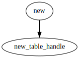

Show all the functions that call "new"

## Function `add`

Add a new entry to the table. Aborts if an entry for this
key already exists. The entry itself is not stored in the
table, and cannot be discovered from it.

<pre><code><b>public</b> <b>fun</b> <a href="table.md#0x1_table_add">add</a>&lt;K: <b>copy</b>, drop, V&gt;(<a href="table.md#0x1_table">table</a>: &<b>mut</b> <a href="table.md#0x1_table_Table">table::Table</a>&lt;K, V&gt;, key: K, val: V)
</code></pre>

Implementation

<pre><code><b>public</b> <b>fun</b> <a href="table.md#0x1_table_add">add</a>&lt;K: <b>copy</b> + drop, V&gt;(<a href="table.md#0x1_table">table</a>: &<b>mut</b> <a href="table.md#0x1_table_Table">Table</a>&lt;K, V&gt;, key: K, val: V) {
    <a href="table.md#0x1_table_add_box">add_box</a>&lt;K, V, <a href="table.md#0x1_table_Box">Box</a>&lt;V&gt;&gt;(<a href="table.md#0x1_table">table</a>, key, <a href="table.md#0x1_table_Box">Box</a> { val })
}
</code></pre>

Show all the functions that "add" calls

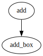

Show all the functions that call "add"

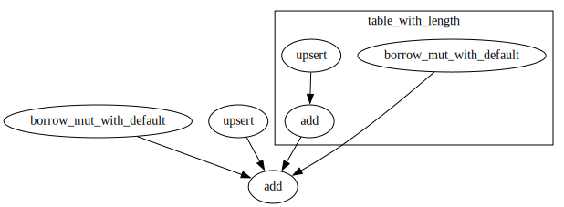

## Function `borrow`

Acquire an immutable reference to the value which <code>key</code> maps to.
Aborts if there is no entry for <code>key</code>.

<pre><code><b>public</b> <b>fun</b> <a href="table.md#0x1_table_borrow">borrow</a>&lt;K: <b>copy</b>, drop, V&gt;(<a href="table.md#0x1_table">table</a>: &<a href="table.md#0x1_table_Table">table::Table</a>&lt;K, V&gt;, key: K): &V
</code></pre>

Implementation

<pre><code><b>public</b> <b>fun</b> <a href="table.md#0x1_table_borrow">borrow</a>&lt;K: <b>copy</b> + drop, V&gt;(<a href="table.md#0x1_table">table</a>: &<a href="table.md#0x1_table_Table">Table</a>&lt;K, V&gt;, key: K): &V {
    &<a href="table.md#0x1_table_borrow_box">borrow_box</a>&lt;K, V, <a href="table.md#0x1_table_Box">Box</a>&lt;V&gt;&gt;(<a href="table.md#0x1_table">table</a>, key).val
}
</code></pre>

Show all the functions that "borrow" calls

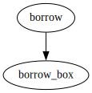

Show all the functions that call "borrow"

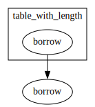

## Function `borrow_mut`

Acquire a mutable reference to the value which <code>key</code> maps to.
Aborts if there is no entry for <code>key</code>.

<pre><code><b>public</b> <b>fun</b> <a href="table.md#0x1_table_borrow_mut">borrow_mut</a>&lt;K: <b>copy</b>, drop, V&gt;(<a href="table.md#0x1_table">table</a>: &<b>mut</b> <a href="table.md#0x1_table_Table">table::Table</a>&lt;K, V&gt;, key: K): &<b>mut</b> V
</code></pre>

Implementation

<pre><code><b>public</b> <b>fun</b> <a href="table.md#0x1_table_borrow_mut">borrow_mut</a>&lt;K: <b>copy</b> + drop, V&gt;(<a href="table.md#0x1_table">table</a>: &<b>mut</b> <a href="table.md#0x1_table_Table">Table</a>&lt;K, V&gt;, key: K): &<b>mut</b> V {
    &<b>mut</b> <a href="table.md#0x1_table_borrow_box_mut">borrow_box_mut</a>&lt;K, V, <a href="table.md#0x1_table_Box">Box</a>&lt;V&gt;&gt;(<a href="table.md#0x1_table">table</a>, key).val
}
</code></pre>

Show all the functions that "borrow_mut" calls

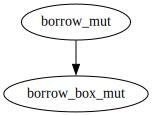

Show all the functions that call "borrow_mut"

## Function `borrow_mut_with_default`

Acquire a mutable reference to the value which <code>key</code> maps to.
Insert the pair (<code>key</code>, <code>default</code>) first if there is no entry for <code>key</code>.

<pre><code><b>public</b> <b>fun</b> <a href="table.md#0x1_table_borrow_mut_with_default">borrow_mut_with_default</a>&lt;K: <b>copy</b>, drop, V: drop&gt;(<a href="table.md#0x1_table">table</a>: &<b>mut</b> <a href="table.md#0x1_table_Table">table::Table</a>&lt;K, V&gt;, key: K, default: V): &<b>mut</b> V
</code></pre>

Implementation

<pre><code><b>public</b> <b>fun</b> <a href="table.md#0x1_table_borrow_mut_with_default">borrow_mut_with_default</a>&lt;K: <b>copy</b> + drop, V: drop&gt;(<a href="table.md#0x1_table">table</a>: &<b>mut</b> <a href="table.md#0x1_table_Table">Table</a>&lt;K, V&gt;, key: K, default: V): &<b>mut</b> V {
    <b>if</b> (!<a href="table.md#0x1_table_contains">contains</a>(<a href="table.md#0x1_table">table</a>, <b>copy</b> key)) {
        <a href="table.md#0x1_table_add">add</a>(<a href="table.md#0x1_table">table</a>, <b>copy</b> key, default)
    };
    <a href="table.md#0x1_table_borrow_mut">borrow_mut</a>(<a href="table.md#0x1_table">table</a>, key)
}
</code></pre>

Show all the functions that "borrow_mut_with_default" calls

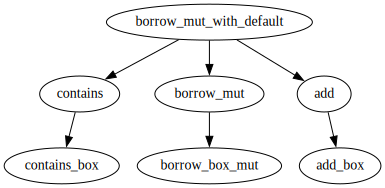

Show all the functions that call "borrow_mut_with_default"

## Function `upsert`

Insert the pair (<code>key</code>, <code>value</code>) if there is no entry for <code>key</code>.
update the value of the entry for <code>key</code> to <code>value</code> otherwise

<pre><code><b>public</b> <b>fun</b> <a href="table.md#0x1_table_upsert">upsert</a>&lt;K: <b>copy</b>, drop, V: drop&gt;(<a href="table.md#0x1_table">table</a>: &<b>mut</b> <a href="table.md#0x1_table_Table">table::Table</a>&lt;K, V&gt;, key: K, value: V)
</code></pre>

Implementation

<pre><code><b>public</b> <b>fun</b> <a href="table.md#0x1_table_upsert">upsert</a>&lt;K: <b>copy</b> + drop, V: drop&gt;(<a href="table.md#0x1_table">table</a>: &<b>mut</b> <a href="table.md#0x1_table_Table">Table</a>&lt;K, V&gt;, key: K, value: V) {
    <b>if</b> (!<a href="table.md#0x1_table_contains">contains</a>(<a href="table.md#0x1_table">table</a>, <b>copy</b> key)) {
        <a href="table.md#0x1_table_add">add</a>(<a href="table.md#0x1_table">table</a>, <b>copy</b> key, value)
    } <b>else</b> {
        <b>let</b> ref = <a href="table.md#0x1_table_borrow_mut">borrow_mut</a>(<a href="table.md#0x1_table">table</a>, key);
        *ref = value;
    };
}
</code></pre>

Show all the functions that "upsert" calls

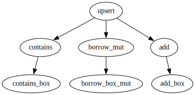

Show all the functions that call "upsert"

## Function `remove`

Remove from <code><a href="table.md#0x1_table">table</a></code> and return the value which <code>key</code> maps to.
Aborts if there is no entry for <code>key</code>.

<pre><code><b>public</b> <b>fun</b> <a href="table.md#0x1_table_remove">remove</a>&lt;K: <b>copy</b>, drop, V&gt;(<a href="table.md#0x1_table">table</a>: &<b>mut</b> <a href="table.md#0x1_table_Table">table::Table</a>&lt;K, V&gt;, key: K): V
</code></pre>

Implementation

<pre><code><b>public</b> <b>fun</b> <a href="table.md#0x1_table_remove">remove</a>&lt;K: <b>copy</b> + drop, V&gt;(<a href="table.md#0x1_table">table</a>: &<b>mut</b> <a href="table.md#0x1_table_Table">Table</a>&lt;K, V&gt;, key: K): V {
    <b>let</b> <a href="table.md#0x1_table_Box">Box</a> { val } = <a href="table.md#0x1_table_remove_box">remove_box</a>&lt;K, V, <a href="table.md#0x1_table_Box">Box</a>&lt;V&gt;&gt;(<a href="table.md#0x1_table">table</a>, key);
    val
}
</code></pre>

Show all the functions that "remove" calls

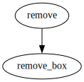

Show all the functions that call "remove"

## Function `contains`

Returns true iff <code><a href="table.md#0x1_table">table</a></code> contains an entry for <code>key</code>.

<pre><code><b>public</b> <b>fun</b> <a href="table.md#0x1_table_contains">contains</a>&lt;K: <b>copy</b>, drop, V&gt;(<a href="table.md#0x1_table">table</a>: &<a href="table.md#0x1_table_Table">table::Table</a>&lt;K, V&gt;, key: K): bool
</code></pre>

Implementation

<pre><code><b>public</b> <b>fun</b> <a href="table.md#0x1_table_contains">contains</a>&lt;K: <b>copy</b> + drop, V&gt;(<a href="table.md#0x1_table">table</a>: &<a href="table.md#0x1_table_Table">Table</a>&lt;K, V&gt;, key: K): bool {
    <a href="table.md#0x1_table_contains_box">contains_box</a>&lt;K, V, <a href="table.md#0x1_table_Box">Box</a>&lt;V&gt;&gt;(<a href="table.md#0x1_table">table</a>, key)
}
</code></pre>

Show all the functions that "contains" calls

Show all the functions that call "contains"

## Function `destroy`

<pre><code><b>public</b>(<b>friend</b>) <b>fun</b> <a href="table.md#0x1_table_destroy">destroy</a>&lt;K: <b>copy</b>, drop, V&gt;(<a href="table.md#0x1_table">table</a>: <a href="table.md#0x1_table_Table">table::Table</a>&lt;K, V&gt;)
</code></pre>

Implementation

<pre><code><b>public</b>(<b>friend</b>) <b>fun</b> <a href="table.md#0x1_table_destroy">destroy</a>&lt;K: <b>copy</b> + drop, V&gt;(<a href="table.md#0x1_table">table</a>: <a href="table.md#0x1_table_Table">Table</a>&lt;K, V&gt;) {
    <a href="table.md#0x1_table_destroy_empty_box">destroy_empty_box</a>&lt;K, V, <a href="table.md#0x1_table_Box">Box</a>&lt;V&gt;&gt;(&<a href="table.md#0x1_table">table</a>);
    <a href="table.md#0x1_table_drop_unchecked_box">drop_unchecked_box</a>&lt;K, V, <a href="table.md#0x1_table_Box">Box</a>&lt;V&gt;&gt;(<a href="table.md#0x1_table">table</a>)
}
</code></pre>

Show all the functions that "destroy" calls

Show all the functions that call "destroy"

## Function `new_table_handle`

<pre><code><b>fun</b> <a href="table.md#0x1_table_new_table_handle">new_table_handle</a>&lt;K, V&gt;(): <b>address</b>
</code></pre>

Implementation

<pre><code><b>native</b> <b>fun</b> <a href="table.md#0x1_table_new_table_handle">new_table_handle</a>&lt;K, V&gt;(): <b>address</b>;
</code></pre>

Show all the functions that "new_table_handle" calls

Show all the functions that call "new_table_handle"

## Function `add_box`

<pre><code><b>fun</b> <a href="table.md#0x1_table_add_box">add_box</a>&lt;K: <b>copy</b>, drop, V, B&gt;(<a href="table.md#0x1_table">table</a>: &<b>mut</b> <a href="table.md#0x1_table_Table">table::Table</a>&lt;K, V&gt;, key: K, val: <a href="table.md#0x1_table_Box">table::Box</a>&lt;V&gt;)
</code></pre>

Implementation

<pre><code><b>native</b> <b>fun</b> <a href="table.md#0x1_table_add_box">add_box</a>&lt;K: <b>copy</b> + drop, V, B&gt;(<a href="table.md#0x1_table">table</a>: &<b>mut</b> <a href="table.md#0x1_table_Table">Table</a>&lt;K, V&gt;, key: K, val: <a href="table.md#0x1_table_Box">Box</a>&lt;V&gt;);
</code></pre>

Show all the functions that "add_box" calls

Show all the functions that call "add_box"

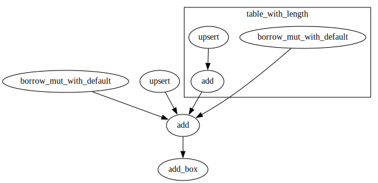

## Function `borrow_box`

<pre><code><b>fun</b> <a href="table.md#0x1_table_borrow_box">borrow_box</a>&lt;K: <b>copy</b>, drop, V, B&gt;(<a href="table.md#0x1_table">table</a>: &<a href="table.md#0x1_table_Table">table::Table</a>&lt;K, V&gt;, key: K): &<a href="table.md#0x1_table_Box">table::Box</a>&lt;V&gt;
</code></pre>

Implementation

<pre><code><b>native</b> <b>fun</b> <a href="table.md#0x1_table_borrow_box">borrow_box</a>&lt;K: <b>copy</b> + drop, V, B&gt;(<a href="table.md#0x1_table">table</a>: &<a href="table.md#0x1_table_Table">Table</a>&lt;K, V&gt;, key: K): &<a href="table.md#0x1_table_Box">Box</a>&lt;V&gt;;
</code></pre>

Show all the functions that "borrow_box" calls

Show all the functions that call "borrow_box"

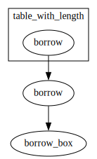

## Function `borrow_box_mut`

<pre><code><b>fun</b> <a href="table.md#0x1_table_borrow_box_mut">borrow_box_mut</a>&lt;K: <b>copy</b>, drop, V, B&gt;(<a href="table.md#0x1_table">table</a>: &<b>mut</b> <a href="table.md#0x1_table_Table">table::Table</a>&lt;K, V&gt;, key: K): &<b>mut</b> <a href="table.md#0x1_table_Box">table::Box</a>&lt;V&gt;
</code></pre>

Implementation

<pre><code><b>native</b> <b>fun</b> <a href="table.md#0x1_table_borrow_box_mut">borrow_box_mut</a>&lt;K: <b>copy</b> + drop, V, B&gt;(<a href="table.md#0x1_table">table</a>: &<b>mut</b> <a href="table.md#0x1_table_Table">Table</a>&lt;K, V&gt;, key: K): &<b>mut</b> <a href="table.md#0x1_table_Box">Box</a>&lt;V&gt;;
</code></pre>

Show all the functions that "borrow_box_mut" calls

Show all the functions that call "borrow_box_mut"

## Function `contains_box`

<pre><code><b>fun</b> <a href="table.md#0x1_table_contains_box">contains_box</a>&lt;K: <b>copy</b>, drop, V, B&gt;(<a href="table.md#0x1_table">table</a>: &<a href="table.md#0x1_table_Table">table::Table</a>&lt;K, V&gt;, key: K): bool
</code></pre>

Implementation

<pre><code><b>native</b> <b>fun</b> <a href="table.md#0x1_table_contains_box">contains_box</a>&lt;K: <b>copy</b> + drop, V, B&gt;(<a href="table.md#0x1_table">table</a>: &<a href="table.md#0x1_table_Table">Table</a>&lt;K, V&gt;, key: K): bool;
</code></pre>

Show all the functions that "contains_box" calls

Show all the functions that call "contains_box"

## Function `remove_box`

<pre><code><b>fun</b> <a href="table.md#0x1_table_remove_box">remove_box</a>&lt;K: <b>copy</b>, drop, V, B&gt;(<a href="table.md#0x1_table">table</a>: &<b>mut</b> <a href="table.md#0x1_table_Table">table::Table</a>&lt;K, V&gt;, key: K): <a href="table.md#0x1_table_Box">table::Box</a>&lt;V&gt;
</code></pre>

Implementation

<pre><code><b>native</b> <b>fun</b> <a href="table.md#0x1_table_remove_box">remove_box</a>&lt;K: <b>copy</b> + drop, V, B&gt;(<a href="table.md#0x1_table">table</a>: &<b>mut</b> <a href="table.md#0x1_table_Table">Table</a>&lt;K, V&gt;, key: K): <a href="table.md#0x1_table_Box">Box</a>&lt;V&gt;;
</code></pre>

Show all the functions that "remove_box" calls

Show all the functions that call "remove_box"

## Function `destroy_empty_box`

<pre><code><b>fun</b> <a href="table.md#0x1_table_destroy_empty_box">destroy_empty_box</a>&lt;K: <b>copy</b>, drop, V, B&gt;(<a href="table.md#0x1_table">table</a>: &<a href="table.md#0x1_table_Table">table::Table</a>&lt;K, V&gt;)
</code></pre>

Implementation

<pre><code><b>native</b> <b>fun</b> <a href="table.md#0x1_table_destroy_empty_box">destroy_empty_box</a>&lt;K: <b>copy</b> + drop, V, B&gt;(<a href="table.md#0x1_table">table</a>: &<a href="table.md#0x1_table_Table">Table</a>&lt;K, V&gt;);
</code></pre>

Show all the functions that "destroy_empty_box" calls

Show all the functions that call "destroy_empty_box"

## Function `drop_unchecked_box`

<pre><code><b>fun</b> <a href="table.md#0x1_table_drop_unchecked_box">drop_unchecked_box</a>&lt;K: <b>copy</b>, drop, V, B&gt;(<a href="table.md#0x1_table">table</a>: <a href="table.md#0x1_table_Table">table::Table</a>&lt;K, V&gt;)
</code></pre>

Implementation

<pre><code><b>native</b> <b>fun</b> <a href="table.md#0x1_table_drop_unchecked_box">drop_unchecked_box</a>&lt;K: <b>copy</b> + drop, V, B&gt;(<a href="table.md#0x1_table">table</a>: <a href="table.md#0x1_table_Table">Table</a>&lt;K, V&gt;);
</code></pre>

Show all the functions that "drop_unchecked_box" calls

Show all the functions that call "drop_unchecked_box"

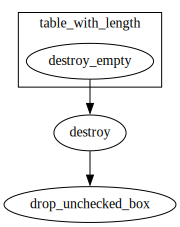

## Specification

### Struct `Table`

<pre><code><b>struct</b> <a href="table.md#0x1_table_Table">Table</a>&lt;K: <b>copy</b>, drop, V&gt; <b>has</b> store
</code></pre>

<dl>
<dt>
<code>handle: <b>address</b></code>
</dt>
<dd>

</dd>
</dl>

<pre><code><b>pragma</b> intrinsic = map,
    map_new = new,
    map_destroy_empty = destroy,
    map_has_key = contains,
    map_add_no_override = add,
    map_add_override_if_exists = upsert,
    map_del_must_exist = remove,
    map_borrow = borrow,
    map_borrow_mut = borrow_mut,
    map_spec_get = spec_get,
    map_spec_set = spec_set,
    map_spec_del = spec_remove,
    map_spec_has_key = spec_contains;
</code></pre>

### Function `new`

<pre><code><b>public</b> <b>fun</b> <a href="table.md#0x1_table_new">new</a>&lt;K: <b>copy</b>, drop, V: store&gt;(): <a href="table.md#0x1_table_Table">table::Table</a>&lt;K, V&gt;
</code></pre>

<pre><code><b>pragma</b> intrinsic;
</code></pre>

### Function `add`

<pre><code><b>public</b> <b>fun</b> <a href="table.md#0x1_table_add">add</a>&lt;K: <b>copy</b>, drop, V&gt;(<a href="table.md#0x1_table">table</a>: &<b>mut</b> <a href="table.md#0x1_table_Table">table::Table</a>&lt;K, V&gt;, key: K, val: V)
</code></pre>

<pre><code><b>pragma</b> intrinsic;
</code></pre>

### Function `borrow`

<pre><code><b>public</b> <b>fun</b> <a href="table.md#0x1_table_borrow">borrow</a>&lt;K: <b>copy</b>, drop, V&gt;(<a href="table.md#0x1_table">table</a>: &<a href="table.md#0x1_table_Table">table::Table</a>&lt;K, V&gt;, key: K): &V
</code></pre>

<pre><code><b>pragma</b> intrinsic;
</code></pre>

### Function `borrow_mut`

<pre><code><b>public</b> <b>fun</b> <a href="table.md#0x1_table_borrow_mut">borrow_mut</a>&lt;K: <b>copy</b>, drop, V&gt;(<a href="table.md#0x1_table">table</a>: &<b>mut</b> <a href="table.md#0x1_table_Table">table::Table</a>&lt;K, V&gt;, key: K): &<b>mut</b> V
</code></pre>

<pre><code><b>pragma</b> intrinsic;
</code></pre>

### Function `upsert`

<pre><code><b>public</b> <b>fun</b> <a href="table.md#0x1_table_upsert">upsert</a>&lt;K: <b>copy</b>, drop, V: drop&gt;(<a href="table.md#0x1_table">table</a>: &<b>mut</b> <a href="table.md#0x1_table_Table">table::Table</a>&lt;K, V&gt;, key: K, value: V)
</code></pre>

<pre><code><b>pragma</b> intrinsic;
</code></pre>

### Function `remove`

<pre><code><b>public</b> <b>fun</b> <a href="table.md#0x1_table_remove">remove</a>&lt;K: <b>copy</b>, drop, V&gt;(<a href="table.md#0x1_table">table</a>: &<b>mut</b> <a href="table.md#0x1_table_Table">table::Table</a>&lt;K, V&gt;, key: K): V
</code></pre>

<pre><code><b>pragma</b> intrinsic;
</code></pre>

### Function `contains`

<pre><code><b>public</b> <b>fun</b> <a href="table.md#0x1_table_contains">contains</a>&lt;K: <b>copy</b>, drop, V&gt;(<a href="table.md#0x1_table">table</a>: &<a href="table.md#0x1_table_Table">table::Table</a>&lt;K, V&gt;, key: K): bool
</code></pre>

<pre><code><b>pragma</b> intrinsic;
</code></pre>

<pre><code><b>native</b> <b>fun</b> <a href="table.md#0x1_table_spec_contains">spec_contains</a>&lt;K, V&gt;(t: <a href="table.md#0x1_table_Table">Table</a>&lt;K, V&gt;, k: K): bool;
</code></pre>

<pre><code><b>native</b> <b>fun</b> <a href="table.md#0x1_table_spec_remove">spec_remove</a>&lt;K, V&gt;(t: <a href="table.md#0x1_table_Table">Table</a>&lt;K, V&gt;, k: K): <a href="table.md#0x1_table_Table">Table</a>&lt;K, V&gt;;
</code></pre>

<pre><code><b>native</b> <b>fun</b> <a href="table.md#0x1_table_spec_set">spec_set</a>&lt;K, V&gt;(t: <a href="table.md#0x1_table_Table">Table</a>&lt;K, V&gt;, k: K, v: V): <a href="table.md#0x1_table_Table">Table</a>&lt;K, V&gt;;
</code></pre>

<pre><code><b>native</b> <b>fun</b> <a href="table.md#0x1_table_spec_get">spec_get</a>&lt;K, V&gt;(t: <a href="table.md#0x1_table_Table">Table</a>&lt;K, V&gt;, k: K): V;
</code></pre>

### Function `destroy`

<pre><code><b>public</b>(<b>friend</b>) <b>fun</b> <a href="table.md#0x1_table_destroy">destroy</a>&lt;K: <b>copy</b>, drop, V&gt;(<a href="table.md#0x1_table">table</a>: <a href="table.md#0x1_table_Table">table::Table</a>&lt;K, V&gt;)
</code></pre>

<pre><code><b>pragma</b> intrinsic;
</code></pre>

[move-book]: https://move-language.github.io/move/introduction.html
