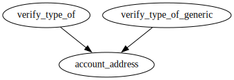
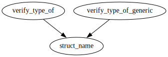
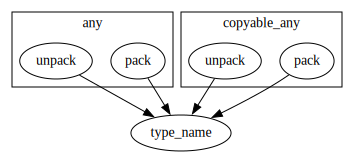
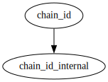

# Module `0x1::type_info`

-  [Struct `TypeInfo`](#0x1_type_info_TypeInfo)
-  [Constants](#@Constants_0)
-  [Function `account_address`](#0x1_type_info_account_address)
-  [Function `module_name`](#0x1_type_info_module_name)
-  [Function `struct_name`](#0x1_type_info_struct_name)
-  [Function `chain_id`](#0x1_type_info_chain_id)
-  [Function `type_of`](#0x1_type_info_type_of)
-  [Function `type_name`](#0x1_type_info_type_name)
-  [Function `chain_id_internal`](#0x1_type_info_chain_id_internal)
-  [Function `verify_type_of`](#0x1_type_info_verify_type_of)
-  [Function `verify_type_of_generic`](#0x1_type_info_verify_type_of_generic)
-  [Specification](#@Specification_1)
    -  [Function `chain_id_internal`](#@Specification_1_chain_id_internal)

<pre><code><b>use</b> <a href="../../move-stdlib/doc/error.md#0x1_error">0x1::error</a>;
<b>use</b> <a href="../../move-stdlib/doc/features.md#0x1_features">0x1::features</a>;
<b>use</b> <a href="../../move-stdlib/doc/string.md#0x1_string">0x1::string</a>;
</code></pre>

Show all the modules that "type_info" depends on directly or indirectly

Show all the modules that depend on "type_info" directly or indirectly

## Struct `TypeInfo`

<pre><code><b>struct</b> <a href="type_info.md#0x1_type_info_TypeInfo">TypeInfo</a> <b>has</b> <b>copy</b>, drop, store
</code></pre>

Fields

<dl>
<dt>
<code>account_address: <b>address</b></code>
</dt>
<dd>

</dd>
<dt>
<code>module_name: <a href="../../move-stdlib/doc/vector.md#0x1_vector">vector</a>&lt;u8&gt;</code>
</dt>
<dd>

</dd>
<dt>
<code>struct_name: <a href="../../move-stdlib/doc/vector.md#0x1_vector">vector</a>&lt;u8&gt;</code>
</dt>
<dd>

</dd>
</dl>

## Constants

<pre><code><b>const</b> <a href="type_info.md#0x1_type_info_E_NATIVE_FUN_NOT_AVAILABLE">E_NATIVE_FUN_NOT_AVAILABLE</a>: u64 = 1;
</code></pre>

## Function `account_address`

<pre><code><b>public</b> <b>fun</b> <a href="type_info.md#0x1_type_info_account_address">account_address</a>(<a href="type_info.md#0x1_type_info">type_info</a>: &<a href="type_info.md#0x1_type_info_TypeInfo">type_info::TypeInfo</a>): <b>address</b>
</code></pre>

Implementation

<pre><code><b>public</b> <b>fun</b> <a href="type_info.md#0x1_type_info_account_address">account_address</a>(<a href="type_info.md#0x1_type_info">type_info</a>: &<a href="type_info.md#0x1_type_info_TypeInfo">TypeInfo</a>): <b>address</b> {
    <a href="type_info.md#0x1_type_info">type_info</a>.account_address
}
</code></pre>

Show all the functions that "account_address" calls

Show all the functions that call "account_address"

## Function `module_name`

<pre><code><b>public</b> <b>fun</b> <a href="type_info.md#0x1_type_info_module_name">module_name</a>(<a href="type_info.md#0x1_type_info">type_info</a>: &<a href="type_info.md#0x1_type_info_TypeInfo">type_info::TypeInfo</a>): <a href="../../move-stdlib/doc/vector.md#0x1_vector">vector</a>&lt;u8&gt;
</code></pre>

Implementation

<pre><code><b>public</b> <b>fun</b> <a href="type_info.md#0x1_type_info_module_name">module_name</a>(<a href="type_info.md#0x1_type_info">type_info</a>: &<a href="type_info.md#0x1_type_info_TypeInfo">TypeInfo</a>): <a href="../../move-stdlib/doc/vector.md#0x1_vector">vector</a>&lt;u8&gt; {
    <a href="type_info.md#0x1_type_info">type_info</a>.module_name
}
</code></pre>

Show all the functions that "module_name" calls

Show all the functions that call "module_name"

## Function `struct_name`

<pre><code><b>public</b> <b>fun</b> <a href="type_info.md#0x1_type_info_struct_name">struct_name</a>(<a href="type_info.md#0x1_type_info">type_info</a>: &<a href="type_info.md#0x1_type_info_TypeInfo">type_info::TypeInfo</a>): <a href="../../move-stdlib/doc/vector.md#0x1_vector">vector</a>&lt;u8&gt;
</code></pre>

Implementation

<pre><code><b>public</b> <b>fun</b> <a href="type_info.md#0x1_type_info_struct_name">struct_name</a>(<a href="type_info.md#0x1_type_info">type_info</a>: &<a href="type_info.md#0x1_type_info_TypeInfo">TypeInfo</a>): <a href="../../move-stdlib/doc/vector.md#0x1_vector">vector</a>&lt;u8&gt; {
    <a href="type_info.md#0x1_type_info">type_info</a>.struct_name
}
</code></pre>

Show all the functions that "struct_name" calls

Show all the functions that call "struct_name"

## Function `chain_id`

Returns the current chain ID, mirroring what <code>aptos_framework::chain_id::get()</code> would return, except in <code>#[test]</code>
functions, where this will always return <code>4u8</code> as the chain ID, whereas <code>aptos_framework::chain_id::get()</code> will
return whichever ID was passed to <code>aptos_framework::chain_id::initialize_for_test()</code>.

<pre><code><b>public</b> <b>fun</b> <a href="type_info.md#0x1_type_info_chain_id">chain_id</a>(): u8
</code></pre>

Implementation

<pre><code><b>public</b> <b>fun</b> <a href="type_info.md#0x1_type_info_chain_id">chain_id</a>(): u8 {
    <b>if</b> (!<a href="../../move-stdlib/doc/features.md#0x1_features_aptos_stdlib_chain_id_enabled">features::aptos_stdlib_chain_id_enabled</a>()) {
        <b>abort</b>(std::error::invalid_state(<a href="type_info.md#0x1_type_info_E_NATIVE_FUN_NOT_AVAILABLE">E_NATIVE_FUN_NOT_AVAILABLE</a>))
    };

    <a href="type_info.md#0x1_type_info_chain_id_internal">chain_id_internal</a>()
}
</code></pre>

Show all the functions that "chain_id" calls

Show all the functions that call "chain_id"

## Function `type_of`

<pre><code><b>public</b> <b>fun</b> <a href="type_info.md#0x1_type_info_type_of">type_of</a>&lt;T&gt;(): <a href="type_info.md#0x1_type_info_TypeInfo">type_info::TypeInfo</a>
</code></pre>

Implementation

<pre><code><b>public</b> <b>native</b> <b>fun</b> <a href="type_info.md#0x1_type_info_type_of">type_of</a>&lt;T&gt;(): <a href="type_info.md#0x1_type_info_TypeInfo">TypeInfo</a>;
</code></pre>

Show all the functions that "type_of" calls

Show all the functions that call "type_of"

## Function `type_name`

<pre><code><b>public</b> <b>fun</b> <a href="type_info.md#0x1_type_info_type_name">type_name</a>&lt;T&gt;(): <a href="../../move-stdlib/doc/string.md#0x1_string_String">string::String</a>
</code></pre>

Implementation

<pre><code><b>public</b> <b>native</b> <b>fun</b> <a href="type_info.md#0x1_type_info_type_name">type_name</a>&lt;T&gt;(): <a href="../../move-stdlib/doc/string.md#0x1_string_String">string::String</a>;
</code></pre>

Show all the functions that "type_name" calls

Show all the functions that call "type_name"

## Function `chain_id_internal`

<pre><code><b>fun</b> <a href="type_info.md#0x1_type_info_chain_id_internal">chain_id_internal</a>(): u8
</code></pre>

Implementation

<pre><code><b>native</b> <b>fun</b> <a href="type_info.md#0x1_type_info_chain_id_internal">chain_id_internal</a>(): u8;
</code></pre>

Show all the functions that "chain_id_internal" calls

Show all the functions that call "chain_id_internal"

## Function `verify_type_of`

<pre><code><b>fun</b> <a href="type_info.md#0x1_type_info_verify_type_of">verify_type_of</a>()
</code></pre>

Implementation

<pre><code><b>fun</b> <a href="type_info.md#0x1_type_info_verify_type_of">verify_type_of</a>() {
    <b>let</b> <a href="type_info.md#0x1_type_info">type_info</a> = <a href="type_info.md#0x1_type_info_type_of">type_of</a>&lt;<a href="type_info.md#0x1_type_info_TypeInfo">TypeInfo</a>&gt;();
    <b>let</b> account_address = <a href="type_info.md#0x1_type_info_account_address">account_address</a>(&<a href="type_info.md#0x1_type_info">type_info</a>);
    <b>let</b> module_name = <a href="type_info.md#0x1_type_info_module_name">module_name</a>(&<a href="type_info.md#0x1_type_info">type_info</a>);
    <b>let</b> struct_name = <a href="type_info.md#0x1_type_info_struct_name">struct_name</a>(&<a href="type_info.md#0x1_type_info">type_info</a>);
    <b>spec</b> {
        <b>assert</b> account_address == @aptos_std;
        <b>assert</b> module_name == b"<a href="type_info.md#0x1_type_info">type_info</a>";
        <b>assert</b> struct_name == b"<a href="type_info.md#0x1_type_info_TypeInfo">TypeInfo</a>";
    };
}
</code></pre>

Show all the functions that "verify_type_of" calls

Show all the functions that call "verify_type_of"

## Function `verify_type_of_generic`

<pre><code><b>fun</b> <a href="type_info.md#0x1_type_info_verify_type_of_generic">verify_type_of_generic</a>&lt;T&gt;()
</code></pre>

Implementation

<pre><code><b>fun</b> <a href="type_info.md#0x1_type_info_verify_type_of_generic">verify_type_of_generic</a>&lt;T&gt;() {
    <b>let</b> <a href="type_info.md#0x1_type_info">type_info</a> = <a href="type_info.md#0x1_type_info_type_of">type_of</a>&lt;T&gt;();
    <b>let</b> account_address = <a href="type_info.md#0x1_type_info_account_address">account_address</a>(&<a href="type_info.md#0x1_type_info">type_info</a>);
    <b>let</b> module_name = <a href="type_info.md#0x1_type_info_module_name">module_name</a>(&<a href="type_info.md#0x1_type_info">type_info</a>);
    <b>let</b> struct_name = <a href="type_info.md#0x1_type_info_struct_name">struct_name</a>(&<a href="type_info.md#0x1_type_info">type_info</a>);
    <b>spec</b> {
        <b>assert</b> account_address == <a href="type_info.md#0x1_type_info_type_of">type_of</a>&lt;T&gt;().account_address;
        <b>assert</b> module_name == <a href="type_info.md#0x1_type_info_type_of">type_of</a>&lt;T&gt;().module_name;
        <b>assert</b> struct_name == <a href="type_info.md#0x1_type_info_type_of">type_of</a>&lt;T&gt;().struct_name;
    };
}
</code></pre>

Show all the functions that "verify_type_of_generic" calls

Show all the functions that call "verify_type_of_generic"

## Specification

### Function `chain_id_internal`

<pre><code><b>fun</b> <a href="type_info.md#0x1_type_info_chain_id_internal">chain_id_internal</a>(): u8
</code></pre>

<pre><code><b>pragma</b> opaque;
</code></pre>

[move-book]: https://move-language.github.io/move/introduction.html
