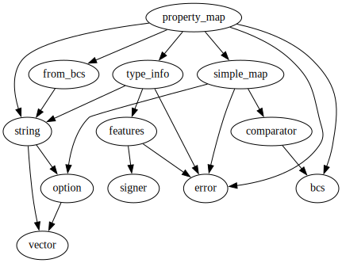
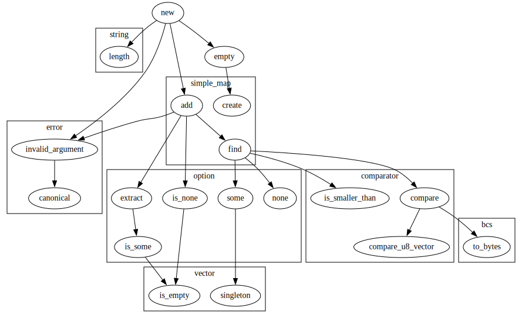
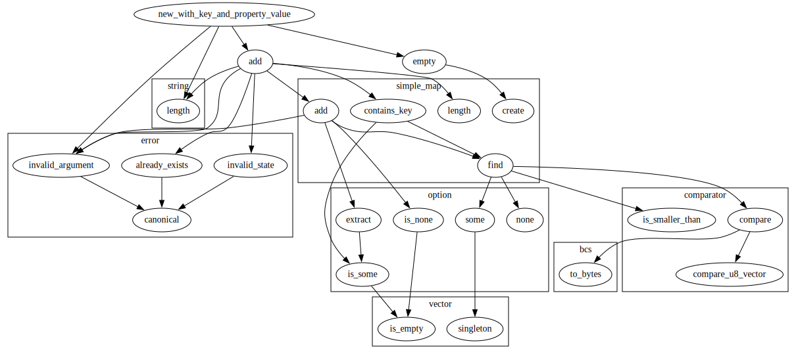
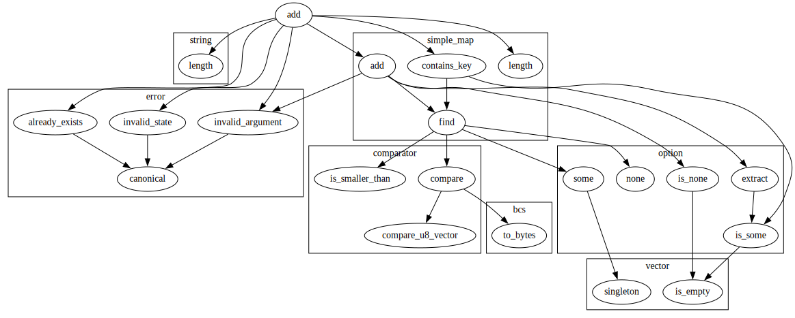
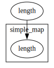
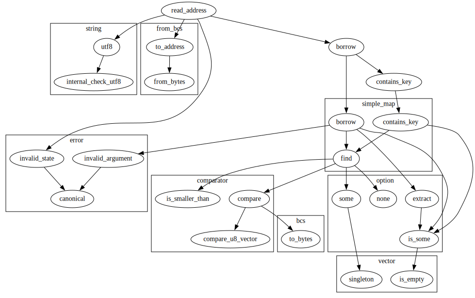
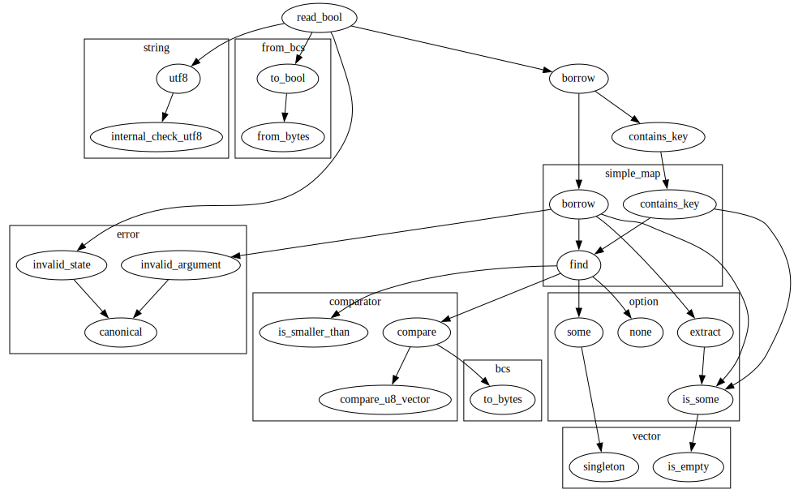
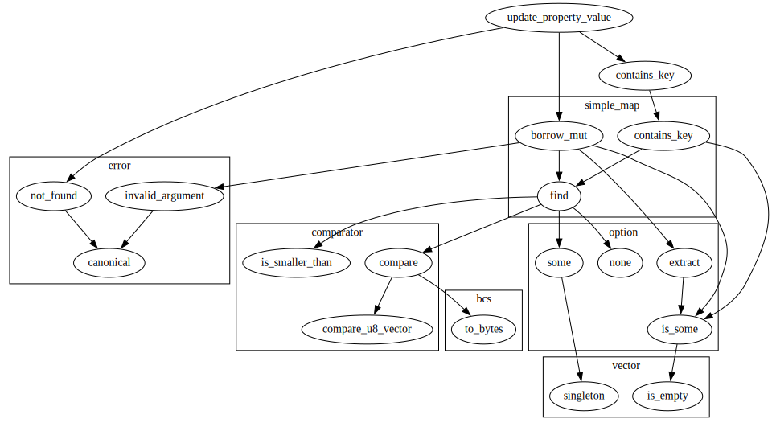
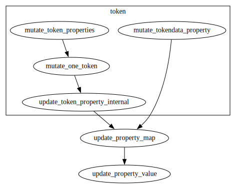

# Module `0x3::property_map`

PropertyMap is a specialization of SimpleMap for Tokens.
It maps a String key to a PropertyValue that consists of type (string) and value (vector<u8>)
It provides basic on-chain serialization of primitive and string to property value with type information
It also supports deserializing property value to it original type.

-  [Struct `PropertyMap`](#0x3_property_map_PropertyMap)
-  [Struct `PropertyValue`](#0x3_property_map_PropertyValue)
-  [Constants](#@Constants_0)
-  [Function `new`](#0x3_property_map_new)
-  [Function `new_with_key_and_property_value`](#0x3_property_map_new_with_key_and_property_value)
-  [Function `empty`](#0x3_property_map_empty)
-  [Function `contains_key`](#0x3_property_map_contains_key)
-  [Function `add`](#0x3_property_map_add)
-  [Function `length`](#0x3_property_map_length)
-  [Function `borrow`](#0x3_property_map_borrow)
-  [Function `read_string`](#0x3_property_map_read_string)
-  [Function `read_u8`](#0x3_property_map_read_u8)
-  [Function `read_u64`](#0x3_property_map_read_u64)
-  [Function `read_address`](#0x3_property_map_read_address)
-  [Function `read_u128`](#0x3_property_map_read_u128)
-  [Function `read_bool`](#0x3_property_map_read_bool)
-  [Function `borrow_value`](#0x3_property_map_borrow_value)
-  [Function `borrow_type`](#0x3_property_map_borrow_type)
-  [Function `remove`](#0x3_property_map_remove)
-  [Function `update_property_map`](#0x3_property_map_update_property_map)
-  [Function `update_property_value`](#0x3_property_map_update_property_value)
-  [Function `create_property_value_raw`](#0x3_property_map_create_property_value_raw)
-  [Function `create_property_value`](#0x3_property_map_create_property_value)

<pre><code><b>use</b> <a href="../../aptos-framework/../aptos-stdlib/../move-stdlib/doc/bcs.md#0x1_bcs">0x1::bcs</a>;
<b>use</b> <a href="../../aptos-framework/../aptos-stdlib/../move-stdlib/doc/error.md#0x1_error">0x1::error</a>;
<b>use</b> <a href="../../aptos-framework/../aptos-stdlib/doc/from_bcs.md#0x1_from_bcs">0x1::from_bcs</a>;
<b>use</b> <a href="../../aptos-framework/../aptos-stdlib/doc/simple_map.md#0x1_simple_map">0x1::simple_map</a>;
<b>use</b> <a href="../../aptos-framework/../aptos-stdlib/../move-stdlib/doc/string.md#0x1_string">0x1::string</a>;
<b>use</b> <a href="../../aptos-framework/../aptos-stdlib/doc/type_info.md#0x1_type_info">0x1::type_info</a>;
</code></pre>

Show all the modules that "property_map" depends on directly or indirectly

Show all the modules that depend on "property_map" directly or indirectly

## Struct `PropertyMap`

<pre><code><b>struct</b> <a href="property_map.md#0x3_property_map_PropertyMap">PropertyMap</a> <b>has</b> <b>copy</b>, drop, store
</code></pre>

Fields

<dl>
<dt>
<code>map: <a href="../../aptos-framework/../aptos-stdlib/doc/simple_map.md#0x1_simple_map_SimpleMap">simple_map::SimpleMap</a>&lt;<a href="../../aptos-framework/../aptos-stdlib/../move-stdlib/doc/string.md#0x1_string_String">string::String</a>, <a href="property_map.md#0x3_property_map_PropertyValue">property_map::PropertyValue</a>&gt;</code>
</dt>
<dd>

</dd>
</dl>

## Struct `PropertyValue`

<pre><code><b>struct</b> <a href="property_map.md#0x3_property_map_PropertyValue">PropertyValue</a> <b>has</b> <b>copy</b>, drop, store
</code></pre>

Fields

<dl>
<dt>
<code>value: <a href="../../aptos-framework/../aptos-stdlib/../move-stdlib/doc/vector.md#0x1_vector">vector</a>&lt;u8&gt;</code>
</dt>
<dd>

</dd>
<dt>
<code>type: <a href="../../aptos-framework/../aptos-stdlib/../move-stdlib/doc/string.md#0x1_string_String">string::String</a></code>
</dt>
<dd>

</dd>
</dl>

## Constants

The property key already exists

<pre><code><b>const</b> <a href="property_map.md#0x3_property_map_EKEY_AREADY_EXIST_IN_PROPERTY_MAP">EKEY_AREADY_EXIST_IN_PROPERTY_MAP</a>: u64 = 1;
</code></pre>

Property key and type count don't match

<pre><code><b>const</b> <a href="property_map.md#0x3_property_map_EKEY_COUNT_NOT_MATCH_TYPE_COUNT">EKEY_COUNT_NOT_MATCH_TYPE_COUNT</a>: u64 = 5;
</code></pre>

Property key and value count don't match

<pre><code><b>const</b> <a href="property_map.md#0x3_property_map_EKEY_COUNT_NOT_MATCH_VALUE_COUNT">EKEY_COUNT_NOT_MATCH_VALUE_COUNT</a>: u64 = 4;
</code></pre>

The name (key) of the property is too long

<pre><code><b>const</b> <a href="property_map.md#0x3_property_map_EPROPERTY_MAP_NAME_TOO_LONG">EPROPERTY_MAP_NAME_TOO_LONG</a>: u64 = 7;
</code></pre>

The property doesn't exist

<pre><code><b>const</b> <a href="property_map.md#0x3_property_map_EPROPERTY_NOT_EXIST">EPROPERTY_NOT_EXIST</a>: u64 = 3;
</code></pre>

The number of property exceeds the limit

<pre><code><b>const</b> <a href="property_map.md#0x3_property_map_EPROPERTY_NUMBER_EXCEED_LIMIT">EPROPERTY_NUMBER_EXCEED_LIMIT</a>: u64 = 2;
</code></pre>

Property type doesn't match

<pre><code><b>const</b> <a href="property_map.md#0x3_property_map_ETYPE_NOT_MATCH">ETYPE_NOT_MATCH</a>: u64 = 6;
</code></pre>

The maximal number of property that can be stored in property map

<pre><code><b>const</b> <a href="property_map.md#0x3_property_map_MAX_PROPERTY_MAP_SIZE">MAX_PROPERTY_MAP_SIZE</a>: u64 = 1000;
</code></pre>

<pre><code><b>const</b> <a href="property_map.md#0x3_property_map_MAX_PROPERTY_NAME_LENGTH">MAX_PROPERTY_NAME_LENGTH</a>: u64 = 128;
</code></pre>

## Function `new`

<pre><code><b>public</b> <b>fun</b> <a href="property_map.md#0x3_property_map_new">new</a>(keys: <a href="../../aptos-framework/../aptos-stdlib/../move-stdlib/doc/vector.md#0x1_vector">vector</a>&lt;<a href="../../aptos-framework/../aptos-stdlib/../move-stdlib/doc/string.md#0x1_string_String">string::String</a>&gt;, values: <a href="../../aptos-framework/../aptos-stdlib/../move-stdlib/doc/vector.md#0x1_vector">vector</a>&lt;<a href="../../aptos-framework/../aptos-stdlib/../move-stdlib/doc/vector.md#0x1_vector">vector</a>&lt;u8&gt;&gt;, types: <a href="../../aptos-framework/../aptos-stdlib/../move-stdlib/doc/vector.md#0x1_vector">vector</a>&lt;<a href="../../aptos-framework/../aptos-stdlib/../move-stdlib/doc/string.md#0x1_string_String">string::String</a>&gt;): <a href="property_map.md#0x3_property_map_PropertyMap">property_map::PropertyMap</a>
</code></pre>

Implementation

<pre><code><b>public</b> <b>fun</b> <a href="property_map.md#0x3_property_map_new">new</a>(
    keys: <a href="../../aptos-framework/../aptos-stdlib/../move-stdlib/doc/vector.md#0x1_vector">vector</a>&lt;String&gt;,
    values: <a href="../../aptos-framework/../aptos-stdlib/../move-stdlib/doc/vector.md#0x1_vector">vector</a>&lt;<a href="../../aptos-framework/../aptos-stdlib/../move-stdlib/doc/vector.md#0x1_vector">vector</a>&lt;u8&gt;&gt;,
    types: <a href="../../aptos-framework/../aptos-stdlib/../move-stdlib/doc/vector.md#0x1_vector">vector</a>&lt;String&gt;
): <a href="property_map.md#0x3_property_map_PropertyMap">PropertyMap</a> {
    <b>let</b> length = <a href="../../aptos-framework/../aptos-stdlib/../move-stdlib/doc/vector.md#0x1_vector_length">vector::length</a>(&keys);
    <b>assert</b>!(<a href="property_map.md#0x3_property_map_length">length</a> &lt;= <a href="property_map.md#0x3_property_map_MAX_PROPERTY_MAP_SIZE">MAX_PROPERTY_MAP_SIZE</a>, <a href="../../aptos-framework/../aptos-stdlib/../move-stdlib/doc/error.md#0x1_error_invalid_argument">error::invalid_argument</a>(<a href="property_map.md#0x3_property_map_EPROPERTY_NUMBER_EXCEED_LIMIT">EPROPERTY_NUMBER_EXCEED_LIMIT</a>));
    <b>assert</b>!(length == <a href="../../aptos-framework/../aptos-stdlib/../move-stdlib/doc/vector.md#0x1_vector_length">vector::length</a>(&values), <a href="../../aptos-framework/../aptos-stdlib/../move-stdlib/doc/error.md#0x1_error_invalid_argument">error::invalid_argument</a>(<a href="property_map.md#0x3_property_map_EKEY_COUNT_NOT_MATCH_VALUE_COUNT">EKEY_COUNT_NOT_MATCH_VALUE_COUNT</a>));
    <b>assert</b>!(length == <a href="../../aptos-framework/../aptos-stdlib/../move-stdlib/doc/vector.md#0x1_vector_length">vector::length</a>(&types), <a href="../../aptos-framework/../aptos-stdlib/../move-stdlib/doc/error.md#0x1_error_invalid_argument">error::invalid_argument</a>(<a href="property_map.md#0x3_property_map_EKEY_COUNT_NOT_MATCH_TYPE_COUNT">EKEY_COUNT_NOT_MATCH_TYPE_COUNT</a>));

    <b>let</b> properties = <a href="property_map.md#0x3_property_map_empty">empty</a>();

    <b>let</b> i = 0;
    <b>while</b> (i &lt; length) {
        <b>let</b> key = *<a href="../../aptos-framework/../aptos-stdlib/../move-stdlib/doc/vector.md#0x1_vector_borrow">vector::borrow</a>(&keys, i);
        <b>assert</b>!(<a href="../../aptos-framework/../aptos-stdlib/../move-stdlib/doc/string.md#0x1_string_length">string::length</a>(&key) &lt;= <a href="property_map.md#0x3_property_map_MAX_PROPERTY_NAME_LENGTH">MAX_PROPERTY_NAME_LENGTH</a>, <a href="../../aptos-framework/../aptos-stdlib/../move-stdlib/doc/error.md#0x1_error_invalid_argument">error::invalid_argument</a>(<a href="property_map.md#0x3_property_map_EPROPERTY_MAP_NAME_TOO_LONG">EPROPERTY_MAP_NAME_TOO_LONG</a>));
        <a href="../../aptos-framework/../aptos-stdlib/doc/simple_map.md#0x1_simple_map_add">simple_map::add</a>(
            &<b>mut</b> properties.map,
            key,
            <a href="property_map.md#0x3_property_map_PropertyValue">PropertyValue</a> { value: *<a href="../../aptos-framework/../aptos-stdlib/../move-stdlib/doc/vector.md#0x1_vector_borrow">vector::borrow</a>(&values, i), type: *<a href="../../aptos-framework/../aptos-stdlib/../move-stdlib/doc/vector.md#0x1_vector_borrow">vector::borrow</a>(&types, i) }
        );
        i = i + 1;
    };
    properties
}
</code></pre>

Show all the functions that "new" calls

Show all the functions that call "new"

## Function `new_with_key_and_property_value`

Create property map directly from key and property value

<pre><code><b>public</b> <b>fun</b> <a href="property_map.md#0x3_property_map_new_with_key_and_property_value">new_with_key_and_property_value</a>(keys: <a href="../../aptos-framework/../aptos-stdlib/../move-stdlib/doc/vector.md#0x1_vector">vector</a>&lt;<a href="../../aptos-framework/../aptos-stdlib/../move-stdlib/doc/string.md#0x1_string_String">string::String</a>&gt;, values: <a href="../../aptos-framework/../aptos-stdlib/../move-stdlib/doc/vector.md#0x1_vector">vector</a>&lt;<a href="property_map.md#0x3_property_map_PropertyValue">property_map::PropertyValue</a>&gt;): <a href="property_map.md#0x3_property_map_PropertyMap">property_map::PropertyMap</a>
</code></pre>

Implementation

<pre><code><b>public</b> <b>fun</b> <a href="property_map.md#0x3_property_map_new_with_key_and_property_value">new_with_key_and_property_value</a>(
    keys: <a href="../../aptos-framework/../aptos-stdlib/../move-stdlib/doc/vector.md#0x1_vector">vector</a>&lt;String&gt;,
    values: <a href="../../aptos-framework/../aptos-stdlib/../move-stdlib/doc/vector.md#0x1_vector">vector</a>&lt;<a href="property_map.md#0x3_property_map_PropertyValue">PropertyValue</a>&gt;
): <a href="property_map.md#0x3_property_map_PropertyMap">PropertyMap</a> {
    <b>let</b> length = <a href="../../aptos-framework/../aptos-stdlib/../move-stdlib/doc/vector.md#0x1_vector_length">vector::length</a>(&keys);
    <b>assert</b>!(<a href="property_map.md#0x3_property_map_length">length</a> &lt;= <a href="property_map.md#0x3_property_map_MAX_PROPERTY_MAP_SIZE">MAX_PROPERTY_MAP_SIZE</a>, <a href="../../aptos-framework/../aptos-stdlib/../move-stdlib/doc/error.md#0x1_error_invalid_argument">error::invalid_argument</a>(<a href="property_map.md#0x3_property_map_EPROPERTY_NUMBER_EXCEED_LIMIT">EPROPERTY_NUMBER_EXCEED_LIMIT</a>));
    <b>assert</b>!(length == <a href="../../aptos-framework/../aptos-stdlib/../move-stdlib/doc/vector.md#0x1_vector_length">vector::length</a>(&values), <a href="../../aptos-framework/../aptos-stdlib/../move-stdlib/doc/error.md#0x1_error_invalid_argument">error::invalid_argument</a>(<a href="property_map.md#0x3_property_map_EKEY_COUNT_NOT_MATCH_VALUE_COUNT">EKEY_COUNT_NOT_MATCH_VALUE_COUNT</a>));

    <b>let</b> properties = <a href="property_map.md#0x3_property_map_empty">empty</a>();

    <b>let</b> i = 0;
    <b>while</b> (i &lt; length) {
        <b>let</b> key = *<a href="../../aptos-framework/../aptos-stdlib/../move-stdlib/doc/vector.md#0x1_vector_borrow">vector::borrow</a>(&keys, i);
        <b>let</b> val = *<a href="../../aptos-framework/../aptos-stdlib/../move-stdlib/doc/vector.md#0x1_vector_borrow">vector::borrow</a>(&values, i);
        <b>assert</b>!(<a href="../../aptos-framework/../aptos-stdlib/../move-stdlib/doc/string.md#0x1_string_length">string::length</a>(&key) &lt;= <a href="property_map.md#0x3_property_map_MAX_PROPERTY_NAME_LENGTH">MAX_PROPERTY_NAME_LENGTH</a>, <a href="../../aptos-framework/../aptos-stdlib/../move-stdlib/doc/error.md#0x1_error_invalid_argument">error::invalid_argument</a>(<a href="property_map.md#0x3_property_map_EPROPERTY_MAP_NAME_TOO_LONG">EPROPERTY_MAP_NAME_TOO_LONG</a>));
        <a href="property_map.md#0x3_property_map_add">add</a>(&<b>mut</b> properties, key, val);
        i = i + 1;
    };
    properties
}
</code></pre>

Show all the functions that "new_with_key_and_property_value" calls

Show all the functions that call "new_with_key_and_property_value"

## Function `empty`

<pre><code><b>public</b> <b>fun</b> <a href="property_map.md#0x3_property_map_empty">empty</a>(): <a href="property_map.md#0x3_property_map_PropertyMap">property_map::PropertyMap</a>
</code></pre>

Implementation

<pre><code><b>public</b> <b>fun</b> <a href="property_map.md#0x3_property_map_empty">empty</a>(): <a href="property_map.md#0x3_property_map_PropertyMap">PropertyMap</a> {
    <a href="property_map.md#0x3_property_map_PropertyMap">PropertyMap</a> {
        map: <a href="../../aptos-framework/../aptos-stdlib/doc/simple_map.md#0x1_simple_map_create">simple_map::create</a>&lt;String, <a href="property_map.md#0x3_property_map_PropertyValue">PropertyValue</a>&gt;(),
    }
}
</code></pre>

Show all the functions that "empty" calls

Show all the functions that call "empty"

## Function `contains_key`

<pre><code><b>public</b> <b>fun</b> <a href="property_map.md#0x3_property_map_contains_key">contains_key</a>(map: &<a href="property_map.md#0x3_property_map_PropertyMap">property_map::PropertyMap</a>, key: &<a href="../../aptos-framework/../aptos-stdlib/../move-stdlib/doc/string.md#0x1_string_String">string::String</a>): bool
</code></pre>

Implementation

<pre><code><b>public</b> <b>fun</b> <a href="property_map.md#0x3_property_map_contains_key">contains_key</a>(map: &<a href="property_map.md#0x3_property_map_PropertyMap">PropertyMap</a>, key: &String): bool {
    <a href="../../aptos-framework/../aptos-stdlib/doc/simple_map.md#0x1_simple_map_contains_key">simple_map::contains_key</a>(&map.map, key)
}
</code></pre>

Show all the functions that "contains_key" calls

Show all the functions that call "contains_key"

## Function `add`

<pre><code><b>public</b> <b>fun</b> <a href="property_map.md#0x3_property_map_add">add</a>(map: &<b>mut</b> <a href="property_map.md#0x3_property_map_PropertyMap">property_map::PropertyMap</a>, key: <a href="../../aptos-framework/../aptos-stdlib/../move-stdlib/doc/string.md#0x1_string_String">string::String</a>, value: <a href="property_map.md#0x3_property_map_PropertyValue">property_map::PropertyValue</a>)
</code></pre>

Implementation

<pre><code><b>public</b> <b>fun</b> <a href="property_map.md#0x3_property_map_add">add</a>(map: &<b>mut</b> <a href="property_map.md#0x3_property_map_PropertyMap">PropertyMap</a>, key: String, value: <a href="property_map.md#0x3_property_map_PropertyValue">PropertyValue</a>) {
    <b>assert</b>!(<a href="../../aptos-framework/../aptos-stdlib/../move-stdlib/doc/string.md#0x1_string_length">string::length</a>(&key) &lt;= <a href="property_map.md#0x3_property_map_MAX_PROPERTY_NAME_LENGTH">MAX_PROPERTY_NAME_LENGTH</a>, <a href="../../aptos-framework/../aptos-stdlib/../move-stdlib/doc/error.md#0x1_error_invalid_argument">error::invalid_argument</a>(<a href="property_map.md#0x3_property_map_EPROPERTY_MAP_NAME_TOO_LONG">EPROPERTY_MAP_NAME_TOO_LONG</a>));
    <b>assert</b>!(!<a href="../../aptos-framework/../aptos-stdlib/doc/simple_map.md#0x1_simple_map_contains_key">simple_map::contains_key</a>(&map.map, &key), <a href="../../aptos-framework/../aptos-stdlib/../move-stdlib/doc/error.md#0x1_error_already_exists">error::already_exists</a>(<a href="property_map.md#0x3_property_map_EKEY_AREADY_EXIST_IN_PROPERTY_MAP">EKEY_AREADY_EXIST_IN_PROPERTY_MAP</a>));
    <b>assert</b>!(<a href="../../aptos-framework/../aptos-stdlib/doc/simple_map.md#0x1_simple_map_length">simple_map::length</a>&lt;String, <a href="property_map.md#0x3_property_map_PropertyValue">PropertyValue</a>&gt;(&map.map) &lt; <a href="property_map.md#0x3_property_map_MAX_PROPERTY_MAP_SIZE">MAX_PROPERTY_MAP_SIZE</a>, <a href="../../aptos-framework/../aptos-stdlib/../move-stdlib/doc/error.md#0x1_error_invalid_state">error::invalid_state</a>(<a href="property_map.md#0x3_property_map_EPROPERTY_NUMBER_EXCEED_LIMIT">EPROPERTY_NUMBER_EXCEED_LIMIT</a>));
    <a href="../../aptos-framework/../aptos-stdlib/doc/simple_map.md#0x1_simple_map_add">simple_map::add</a>(&<b>mut</b> map.map, key, value);
}
</code></pre>

Show all the functions that "add" calls

Show all the functions that call "add"

## Function `length`

<pre><code><b>public</b> <b>fun</b> <a href="property_map.md#0x3_property_map_length">length</a>(map: &<a href="property_map.md#0x3_property_map_PropertyMap">property_map::PropertyMap</a>): u64
</code></pre>

Implementation

<pre><code><b>public</b> <b>fun</b> <a href="property_map.md#0x3_property_map_length">length</a>(map: &<a href="property_map.md#0x3_property_map_PropertyMap">PropertyMap</a>): u64 {
    <a href="../../aptos-framework/../aptos-stdlib/doc/simple_map.md#0x1_simple_map_length">simple_map::length</a>(&map.map)
}
</code></pre>

Show all the functions that "length" calls

Show all the functions that call "length"

## Function `borrow`

<pre><code><b>public</b> <b>fun</b> <a href="property_map.md#0x3_property_map_borrow">borrow</a>(map: &<a href="property_map.md#0x3_property_map_PropertyMap">property_map::PropertyMap</a>, key: &<a href="../../aptos-framework/../aptos-stdlib/../move-stdlib/doc/string.md#0x1_string_String">string::String</a>): &<a href="property_map.md#0x3_property_map_PropertyValue">property_map::PropertyValue</a>
</code></pre>

Implementation

<pre><code><b>public</b> <b>fun</b> <a href="property_map.md#0x3_property_map_borrow">borrow</a>(map: &<a href="property_map.md#0x3_property_map_PropertyMap">PropertyMap</a>, key: &String): &<a href="property_map.md#0x3_property_map_PropertyValue">PropertyValue</a> {
    <b>let</b> found = <a href="property_map.md#0x3_property_map_contains_key">contains_key</a>(map, key);
    <b>assert</b>!(found, <a href="property_map.md#0x3_property_map_EPROPERTY_NOT_EXIST">EPROPERTY_NOT_EXIST</a>);
    <a href="../../aptos-framework/../aptos-stdlib/doc/simple_map.md#0x1_simple_map_borrow">simple_map::borrow</a>(&map.map, key)
}
</code></pre>

Show all the functions that "borrow" calls

Show all the functions that call "borrow"

## Function `read_string`

<pre><code><b>public</b> <b>fun</b> <a href="property_map.md#0x3_property_map_read_string">read_string</a>(map: &<a href="property_map.md#0x3_property_map_PropertyMap">property_map::PropertyMap</a>, key: &<a href="../../aptos-framework/../aptos-stdlib/../move-stdlib/doc/string.md#0x1_string_String">string::String</a>): <a href="../../aptos-framework/../aptos-stdlib/../move-stdlib/doc/string.md#0x1_string_String">string::String</a>
</code></pre>

Implementation

<pre><code><b>public</b> <b>fun</b> <a href="property_map.md#0x3_property_map_read_string">read_string</a>(map: &<a href="property_map.md#0x3_property_map_PropertyMap">PropertyMap</a>, key: &String): String {
    <b>let</b> prop = <a href="property_map.md#0x3_property_map_borrow">borrow</a>(map, key);
    <b>assert</b>!(prop.type == <a href="../../aptos-framework/../aptos-stdlib/../move-stdlib/doc/string.md#0x1_string_utf8">string::utf8</a>(b"<a href="../../aptos-framework/../aptos-stdlib/../move-stdlib/doc/string.md#0x1_string_String">0x1::string::String</a>"), <a href="../../aptos-framework/../aptos-stdlib/../move-stdlib/doc/error.md#0x1_error_invalid_state">error::invalid_state</a>(<a href="property_map.md#0x3_property_map_ETYPE_NOT_MATCH">ETYPE_NOT_MATCH</a>));
    <a href="../../aptos-framework/../aptos-stdlib/doc/from_bcs.md#0x1_from_bcs_to_string">from_bcs::to_string</a>(prop.value)
}
</code></pre>

Show all the functions that "read_string" calls

Show all the functions that call "read_string"

## Function `read_u8`

<pre><code><b>public</b> <b>fun</b> <a href="property_map.md#0x3_property_map_read_u8">read_u8</a>(map: &<a href="property_map.md#0x3_property_map_PropertyMap">property_map::PropertyMap</a>, key: &<a href="../../aptos-framework/../aptos-stdlib/../move-stdlib/doc/string.md#0x1_string_String">string::String</a>): u8
</code></pre>

Implementation

<pre><code><b>public</b> <b>fun</b> <a href="property_map.md#0x3_property_map_read_u8">read_u8</a>(map: &<a href="property_map.md#0x3_property_map_PropertyMap">PropertyMap</a>, key: &String): u8 {
    <b>let</b> prop = <a href="property_map.md#0x3_property_map_borrow">borrow</a>(map, key);
    <b>assert</b>!(prop.type == <a href="../../aptos-framework/../aptos-stdlib/../move-stdlib/doc/string.md#0x1_string_utf8">string::utf8</a>(b"u8"), <a href="../../aptos-framework/../aptos-stdlib/../move-stdlib/doc/error.md#0x1_error_invalid_state">error::invalid_state</a>(<a href="property_map.md#0x3_property_map_ETYPE_NOT_MATCH">ETYPE_NOT_MATCH</a>));
    <a href="../../aptos-framework/../aptos-stdlib/doc/from_bcs.md#0x1_from_bcs_to_u8">from_bcs::to_u8</a>(prop.value)
}
</code></pre>

Show all the functions that "read_u8" calls

Show all the functions that call "read_u8"

## Function `read_u64`

<pre><code><b>public</b> <b>fun</b> <a href="property_map.md#0x3_property_map_read_u64">read_u64</a>(map: &<a href="property_map.md#0x3_property_map_PropertyMap">property_map::PropertyMap</a>, key: &<a href="../../aptos-framework/../aptos-stdlib/../move-stdlib/doc/string.md#0x1_string_String">string::String</a>): u64
</code></pre>

Implementation

<pre><code><b>public</b> <b>fun</b> <a href="property_map.md#0x3_property_map_read_u64">read_u64</a>(map: &<a href="property_map.md#0x3_property_map_PropertyMap">PropertyMap</a>, key: &String): u64 {
    <b>let</b> prop = <a href="property_map.md#0x3_property_map_borrow">borrow</a>(map, key);
    <b>assert</b>!(prop.type == <a href="../../aptos-framework/../aptos-stdlib/../move-stdlib/doc/string.md#0x1_string_utf8">string::utf8</a>(b"u64"), <a href="../../aptos-framework/../aptos-stdlib/../move-stdlib/doc/error.md#0x1_error_invalid_state">error::invalid_state</a>(<a href="property_map.md#0x3_property_map_ETYPE_NOT_MATCH">ETYPE_NOT_MATCH</a>));
    <a href="../../aptos-framework/../aptos-stdlib/doc/from_bcs.md#0x1_from_bcs_to_u64">from_bcs::to_u64</a>(prop.value)
}
</code></pre>

Show all the functions that "read_u64" calls

Show all the functions that call "read_u64"

## Function `read_address`

<pre><code><b>public</b> <b>fun</b> <a href="property_map.md#0x3_property_map_read_address">read_address</a>(map: &<a href="property_map.md#0x3_property_map_PropertyMap">property_map::PropertyMap</a>, key: &<a href="../../aptos-framework/../aptos-stdlib/../move-stdlib/doc/string.md#0x1_string_String">string::String</a>): <b>address</b>
</code></pre>

Implementation

<pre><code><b>public</b> <b>fun</b> <a href="property_map.md#0x3_property_map_read_address">read_address</a>(map: &<a href="property_map.md#0x3_property_map_PropertyMap">PropertyMap</a>, key: &String): <b>address</b> {
    <b>let</b> prop = <a href="property_map.md#0x3_property_map_borrow">borrow</a>(map, key);
    <b>assert</b>!(prop.type == <a href="../../aptos-framework/../aptos-stdlib/../move-stdlib/doc/string.md#0x1_string_utf8">string::utf8</a>(b"<b>address</b>"), <a href="../../aptos-framework/../aptos-stdlib/../move-stdlib/doc/error.md#0x1_error_invalid_state">error::invalid_state</a>(<a href="property_map.md#0x3_property_map_ETYPE_NOT_MATCH">ETYPE_NOT_MATCH</a>));
    <a href="../../aptos-framework/../aptos-stdlib/doc/from_bcs.md#0x1_from_bcs_to_address">from_bcs::to_address</a>(prop.value)
}
</code></pre>

Show all the functions that "read_address" calls

Show all the functions that call "read_address"

## Function `read_u128`

<pre><code><b>public</b> <b>fun</b> <a href="property_map.md#0x3_property_map_read_u128">read_u128</a>(map: &<a href="property_map.md#0x3_property_map_PropertyMap">property_map::PropertyMap</a>, key: &<a href="../../aptos-framework/../aptos-stdlib/../move-stdlib/doc/string.md#0x1_string_String">string::String</a>): u128
</code></pre>

Implementation

<pre><code><b>public</b> <b>fun</b> <a href="property_map.md#0x3_property_map_read_u128">read_u128</a>(map: &<a href="property_map.md#0x3_property_map_PropertyMap">PropertyMap</a>, key: &String): u128 {
    <b>let</b> prop = <a href="property_map.md#0x3_property_map_borrow">borrow</a>(map, key);
    <b>assert</b>!(prop.type == <a href="../../aptos-framework/../aptos-stdlib/../move-stdlib/doc/string.md#0x1_string_utf8">string::utf8</a>(b"u128"), <a href="../../aptos-framework/../aptos-stdlib/../move-stdlib/doc/error.md#0x1_error_invalid_state">error::invalid_state</a>(<a href="property_map.md#0x3_property_map_ETYPE_NOT_MATCH">ETYPE_NOT_MATCH</a>));
    <a href="../../aptos-framework/../aptos-stdlib/doc/from_bcs.md#0x1_from_bcs_to_u128">from_bcs::to_u128</a>(prop.value)
}
</code></pre>

Show all the functions that "read_u128" calls

Show all the functions that call "read_u128"

## Function `read_bool`

<pre><code><b>public</b> <b>fun</b> <a href="property_map.md#0x3_property_map_read_bool">read_bool</a>(map: &<a href="property_map.md#0x3_property_map_PropertyMap">property_map::PropertyMap</a>, key: &<a href="../../aptos-framework/../aptos-stdlib/../move-stdlib/doc/string.md#0x1_string_String">string::String</a>): bool
</code></pre>

Implementation

<pre><code><b>public</b> <b>fun</b> <a href="property_map.md#0x3_property_map_read_bool">read_bool</a>(map: &<a href="property_map.md#0x3_property_map_PropertyMap">PropertyMap</a>, key: &String): bool {
    <b>let</b> prop = <a href="property_map.md#0x3_property_map_borrow">borrow</a>(map, key);
    <b>assert</b>!(prop.type == <a href="../../aptos-framework/../aptos-stdlib/../move-stdlib/doc/string.md#0x1_string_utf8">string::utf8</a>(b"bool"), <a href="../../aptos-framework/../aptos-stdlib/../move-stdlib/doc/error.md#0x1_error_invalid_state">error::invalid_state</a>(<a href="property_map.md#0x3_property_map_ETYPE_NOT_MATCH">ETYPE_NOT_MATCH</a>));
    <a href="../../aptos-framework/../aptos-stdlib/doc/from_bcs.md#0x1_from_bcs_to_bool">from_bcs::to_bool</a>(prop.value)
}
</code></pre>

Show all the functions that "read_bool" calls

Show all the functions that call "read_bool"

## Function `borrow_value`

<pre><code><b>public</b> <b>fun</b> <a href="property_map.md#0x3_property_map_borrow_value">borrow_value</a>(property: &<a href="property_map.md#0x3_property_map_PropertyValue">property_map::PropertyValue</a>): <a href="../../aptos-framework/../aptos-stdlib/../move-stdlib/doc/vector.md#0x1_vector">vector</a>&lt;u8&gt;
</code></pre>

Implementation

<pre><code><b>public</b> <b>fun</b> <a href="property_map.md#0x3_property_map_borrow_value">borrow_value</a>(property: &<a href="property_map.md#0x3_property_map_PropertyValue">PropertyValue</a>): <a href="../../aptos-framework/../aptos-stdlib/../move-stdlib/doc/vector.md#0x1_vector">vector</a>&lt;u8&gt; {
    *&property.value
}
</code></pre>

Show all the functions that "borrow_value" calls

Show all the functions that call "borrow_value"

## Function `borrow_type`

<pre><code><b>public</b> <b>fun</b> <a href="property_map.md#0x3_property_map_borrow_type">borrow_type</a>(property: &<a href="property_map.md#0x3_property_map_PropertyValue">property_map::PropertyValue</a>): <a href="../../aptos-framework/../aptos-stdlib/../move-stdlib/doc/string.md#0x1_string_String">string::String</a>
</code></pre>

Implementation

<pre><code><b>public</b> <b>fun</b> <a href="property_map.md#0x3_property_map_borrow_type">borrow_type</a>(property: &<a href="property_map.md#0x3_property_map_PropertyValue">PropertyValue</a>): String {
    *&property.type
}
</code></pre>

Show all the functions that "borrow_type" calls

Show all the functions that call "borrow_type"

## Function `remove`

<pre><code><b>public</b> <b>fun</b> <a href="property_map.md#0x3_property_map_remove">remove</a>(map: &<b>mut</b> <a href="property_map.md#0x3_property_map_PropertyMap">property_map::PropertyMap</a>, key: &<a href="../../aptos-framework/../aptos-stdlib/../move-stdlib/doc/string.md#0x1_string_String">string::String</a>): (<a href="../../aptos-framework/../aptos-stdlib/../move-stdlib/doc/string.md#0x1_string_String">string::String</a>, <a href="property_map.md#0x3_property_map_PropertyValue">property_map::PropertyValue</a>)
</code></pre>

Implementation

<pre><code><b>public</b> <b>fun</b> <a href="property_map.md#0x3_property_map_remove">remove</a>(
    map: &<b>mut</b> <a href="property_map.md#0x3_property_map_PropertyMap">PropertyMap</a>,
    key: &String
): (String, <a href="property_map.md#0x3_property_map_PropertyValue">PropertyValue</a>) {
    <b>let</b> found = <a href="property_map.md#0x3_property_map_contains_key">contains_key</a>(map, key);
    <b>assert</b>!(found, <a href="../../aptos-framework/../aptos-stdlib/../move-stdlib/doc/error.md#0x1_error_not_found">error::not_found</a>(<a href="property_map.md#0x3_property_map_EPROPERTY_NOT_EXIST">EPROPERTY_NOT_EXIST</a>));
    <a href="../../aptos-framework/../aptos-stdlib/doc/simple_map.md#0x1_simple_map_remove">simple_map::remove</a>(&<b>mut</b> map.map, key)
}
</code></pre>

Show all the functions that "remove" calls

Show all the functions that call "remove"

## Function `update_property_map`

Update the property in the existing property map
Allow updating existing keys' value and add new key-value pairs

<pre><code><b>public</b> <b>fun</b> <a href="property_map.md#0x3_property_map_update_property_map">update_property_map</a>(map: &<b>mut</b> <a href="property_map.md#0x3_property_map_PropertyMap">property_map::PropertyMap</a>, keys: <a href="../../aptos-framework/../aptos-stdlib/../move-stdlib/doc/vector.md#0x1_vector">vector</a>&lt;<a href="../../aptos-framework/../aptos-stdlib/../move-stdlib/doc/string.md#0x1_string_String">string::String</a>&gt;, values: <a href="../../aptos-framework/../aptos-stdlib/../move-stdlib/doc/vector.md#0x1_vector">vector</a>&lt;<a href="../../aptos-framework/../aptos-stdlib/../move-stdlib/doc/vector.md#0x1_vector">vector</a>&lt;u8&gt;&gt;, types: <a href="../../aptos-framework/../aptos-stdlib/../move-stdlib/doc/vector.md#0x1_vector">vector</a>&lt;<a href="../../aptos-framework/../aptos-stdlib/../move-stdlib/doc/string.md#0x1_string_String">string::String</a>&gt;)
</code></pre>

Implementation

<pre><code><b>public</b> <b>fun</b> <a href="property_map.md#0x3_property_map_update_property_map">update_property_map</a>(
    map: &<b>mut</b> <a href="property_map.md#0x3_property_map_PropertyMap">PropertyMap</a>,
    keys: <a href="../../aptos-framework/../aptos-stdlib/../move-stdlib/doc/vector.md#0x1_vector">vector</a>&lt;String&gt;,
    values: <a href="../../aptos-framework/../aptos-stdlib/../move-stdlib/doc/vector.md#0x1_vector">vector</a>&lt;<a href="../../aptos-framework/../aptos-stdlib/../move-stdlib/doc/vector.md#0x1_vector">vector</a>&lt;u8&gt;&gt;,
    types: <a href="../../aptos-framework/../aptos-stdlib/../move-stdlib/doc/vector.md#0x1_vector">vector</a>&lt;String&gt;,
) {
    <b>let</b> key_len = <a href="../../aptos-framework/../aptos-stdlib/../move-stdlib/doc/vector.md#0x1_vector_length">vector::length</a>(&keys);
    <b>let</b> val_len = <a href="../../aptos-framework/../aptos-stdlib/../move-stdlib/doc/vector.md#0x1_vector_length">vector::length</a>(&values);
    <b>let</b> typ_len = <a href="../../aptos-framework/../aptos-stdlib/../move-stdlib/doc/vector.md#0x1_vector_length">vector::length</a>(&types);
    <b>assert</b>!(key_len == val_len, <a href="../../aptos-framework/../aptos-stdlib/../move-stdlib/doc/error.md#0x1_error_invalid_state">error::invalid_state</a>(<a href="property_map.md#0x3_property_map_EKEY_COUNT_NOT_MATCH_VALUE_COUNT">EKEY_COUNT_NOT_MATCH_VALUE_COUNT</a>));
    <b>assert</b>!(key_len == typ_len, <a href="../../aptos-framework/../aptos-stdlib/../move-stdlib/doc/error.md#0x1_error_invalid_state">error::invalid_state</a>(<a href="property_map.md#0x3_property_map_EKEY_COUNT_NOT_MATCH_TYPE_COUNT">EKEY_COUNT_NOT_MATCH_TYPE_COUNT</a>));

    <b>let</b> i = 0;
    <b>while</b> (i &lt; <a href="../../aptos-framework/../aptos-stdlib/../move-stdlib/doc/vector.md#0x1_vector_length">vector::length</a>(&keys)) {
        <b>let</b> key = <a href="../../aptos-framework/../aptos-stdlib/../move-stdlib/doc/vector.md#0x1_vector_borrow">vector::borrow</a>(&keys, i);
        <b>let</b> prop_val = <a href="property_map.md#0x3_property_map_PropertyValue">PropertyValue</a> {
            value: *<a href="../../aptos-framework/../aptos-stdlib/../move-stdlib/doc/vector.md#0x1_vector_borrow">vector::borrow</a>(&values, i),
            type: *<a href="../../aptos-framework/../aptos-stdlib/../move-stdlib/doc/vector.md#0x1_vector_borrow">vector::borrow</a>(&types, i),
        };
        <b>if</b> (<a href="property_map.md#0x3_property_map_contains_key">contains_key</a>(map, key)) {
            <a href="property_map.md#0x3_property_map_update_property_value">update_property_value</a>(map, key, prop_val);
        } <b>else</b> {
            <a href="property_map.md#0x3_property_map_add">add</a>(map, *key, prop_val);
        };
        i = i + 1;
    }
}
</code></pre>

Show all the functions that "update_property_map" calls

Show all the functions that call "update_property_map"

## Function `update_property_value`

<pre><code><b>public</b> <b>fun</b> <a href="property_map.md#0x3_property_map_update_property_value">update_property_value</a>(map: &<b>mut</b> <a href="property_map.md#0x3_property_map_PropertyMap">property_map::PropertyMap</a>, key: &<a href="../../aptos-framework/../aptos-stdlib/../move-stdlib/doc/string.md#0x1_string_String">string::String</a>, value: <a href="property_map.md#0x3_property_map_PropertyValue">property_map::PropertyValue</a>)
</code></pre>

Implementation

<pre><code><b>public</b> <b>fun</b> <a href="property_map.md#0x3_property_map_update_property_value">update_property_value</a>(
    map: &<b>mut</b> <a href="property_map.md#0x3_property_map_PropertyMap">PropertyMap</a>,
    key: &String,
    value: <a href="property_map.md#0x3_property_map_PropertyValue">PropertyValue</a>
) {
    <b>let</b> found = <a href="property_map.md#0x3_property_map_contains_key">contains_key</a>(map, key);
    <b>assert</b>!(found, <a href="../../aptos-framework/../aptos-stdlib/../move-stdlib/doc/error.md#0x1_error_not_found">error::not_found</a>(<a href="property_map.md#0x3_property_map_EPROPERTY_NOT_EXIST">EPROPERTY_NOT_EXIST</a>));
    <b>let</b> property_val = <a href="../../aptos-framework/../aptos-stdlib/doc/simple_map.md#0x1_simple_map_borrow_mut">simple_map::borrow_mut</a>(&<b>mut</b> map.map, key);
    *property_val = value;
}
</code></pre>

Show all the functions that "update_property_value" calls

Show all the functions that call "update_property_value"

## Function `create_property_value_raw`

<pre><code><b>public</b> <b>fun</b> <a href="property_map.md#0x3_property_map_create_property_value_raw">create_property_value_raw</a>(value: <a href="../../aptos-framework/../aptos-stdlib/../move-stdlib/doc/vector.md#0x1_vector">vector</a>&lt;u8&gt;, type: <a href="../../aptos-framework/../aptos-stdlib/../move-stdlib/doc/string.md#0x1_string_String">string::String</a>): <a href="property_map.md#0x3_property_map_PropertyValue">property_map::PropertyValue</a>
</code></pre>

Implementation

<pre><code><b>public</b> <b>fun</b> <a href="property_map.md#0x3_property_map_create_property_value_raw">create_property_value_raw</a>(
    value: <a href="../../aptos-framework/../aptos-stdlib/../move-stdlib/doc/vector.md#0x1_vector">vector</a>&lt;u8&gt;,
    type: String
): <a href="property_map.md#0x3_property_map_PropertyValue">PropertyValue</a> {
    <a href="property_map.md#0x3_property_map_PropertyValue">PropertyValue</a> {
        value,
        type,
    }
}
</code></pre>

Show all the functions that "create_property_value_raw" calls

Show all the functions that call "create_property_value_raw"

## Function `create_property_value`

create a property value from generic type data

<pre><code><b>public</b> <b>fun</b> <a href="property_map.md#0x3_property_map_create_property_value">create_property_value</a>&lt;T: <b>copy</b>&gt;(data: &T): <a href="property_map.md#0x3_property_map_PropertyValue">property_map::PropertyValue</a>
</code></pre>

Implementation

<pre><code><b>public</b> <b>fun</b> <a href="property_map.md#0x3_property_map_create_property_value">create_property_value</a>&lt;T: <b>copy</b>&gt;(data: &T): <a href="property_map.md#0x3_property_map_PropertyValue">PropertyValue</a> {
    <b>let</b> name = type_name&lt;T&gt;();
    <b>if</b> (
        name == <a href="../../aptos-framework/../aptos-stdlib/../move-stdlib/doc/string.md#0x1_string_utf8">string::utf8</a>(b"bool") ||
            name == <a href="../../aptos-framework/../aptos-stdlib/../move-stdlib/doc/string.md#0x1_string_utf8">string::utf8</a>(b"u8") ||
            name == <a href="../../aptos-framework/../aptos-stdlib/../move-stdlib/doc/string.md#0x1_string_utf8">string::utf8</a>(b"u64") ||
            name == <a href="../../aptos-framework/../aptos-stdlib/../move-stdlib/doc/string.md#0x1_string_utf8">string::utf8</a>(b"u128") ||
            name == <a href="../../aptos-framework/../aptos-stdlib/../move-stdlib/doc/string.md#0x1_string_utf8">string::utf8</a>(b"<b>address</b>") ||
            name == <a href="../../aptos-framework/../aptos-stdlib/../move-stdlib/doc/string.md#0x1_string_utf8">string::utf8</a>(b"<a href="../../aptos-framework/../aptos-stdlib/../move-stdlib/doc/string.md#0x1_string_String">0x1::string::String</a>")
    ) {
        <a href="property_map.md#0x3_property_map_create_property_value_raw">create_property_value_raw</a>(<a href="../../aptos-framework/../aptos-stdlib/../move-stdlib/doc/bcs.md#0x1_bcs_to_bytes">bcs::to_bytes</a>&lt;T&gt;(data), name)
    } <b>else</b> {
        <a href="property_map.md#0x3_property_map_create_property_value_raw">create_property_value_raw</a>(<a href="../../aptos-framework/../aptos-stdlib/../move-stdlib/doc/bcs.md#0x1_bcs_to_bytes">bcs::to_bytes</a>&lt;T&gt;(data), <a href="../../aptos-framework/../aptos-stdlib/../move-stdlib/doc/string.md#0x1_string_utf8">string::utf8</a>(b"<a href="../../aptos-framework/../aptos-stdlib/../move-stdlib/doc/vector.md#0x1_vector">vector</a>&lt;u8&gt;"))
    }
}
</code></pre>

Show all the functions that "create_property_value" calls

Show all the functions that call "create_property_value"

[move-book]: https://move-language.github.io/move/introduction.html
