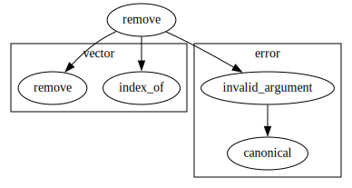
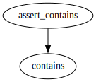

# Module `0x1::acl`

Access control list (acl) module. An acl is a list of account addresses who
have the access permission to a certain object.
This module uses a <code><a href="vector.md#0x1_vector">vector</a></code> to represent the list, but can be refactored to
use a "set" instead when it's available in the language in the future.

-  [Struct `ACL`](#0x1_acl_ACL)
-  [Constants](#@Constants_0)
-  [Function `empty`](#0x1_acl_empty)
-  [Function `add`](#0x1_acl_add)
-  [Function `remove`](#0x1_acl_remove)
-  [Function `contains`](#0x1_acl_contains)
-  [Function `assert_contains`](#0x1_acl_assert_contains)

<pre><code><b>use</b> <a href="error.md#0x1_error">0x1::error</a>;
<b>use</b> <a href="vector.md#0x1_vector">0x1::vector</a>;
</code></pre>

Show all the modules that "acl" depends on directly or indirectly

Show all the modules that depend on "acl" directly or indirectly

## Struct `ACL`

<pre><code><b>struct</b> <a href="acl.md#0x1_acl_ACL">ACL</a> <b>has</b> <b>copy</b>, drop, store
</code></pre>

Fields

<dl>
<dt>
<code>list: <a href="vector.md#0x1_vector">vector</a>&lt;<b>address</b>&gt;</code>
</dt>
<dd>

</dd>
</dl>

## Constants

The ACL already contains the address.

<pre><code><b>const</b> <a href="acl.md#0x1_acl_ECONTAIN">ECONTAIN</a>: u64 = 0;
</code></pre>

The ACL does not contain the address.

<pre><code><b>const</b> <a href="acl.md#0x1_acl_ENOT_CONTAIN">ENOT_CONTAIN</a>: u64 = 1;
</code></pre>

## Function `empty`

Return an empty ACL.

<pre><code><b>public</b> <b>fun</b> <a href="acl.md#0x1_acl_empty">empty</a>(): <a href="acl.md#0x1_acl_ACL">acl::ACL</a>
</code></pre>

Implementation

<pre><code><b>public</b> <b>fun</b> <a href="acl.md#0x1_acl_empty">empty</a>(): <a href="acl.md#0x1_acl_ACL">ACL</a> {
    <a href="acl.md#0x1_acl_ACL">ACL</a>{ list: <a href="vector.md#0x1_vector_empty">vector::empty</a>&lt;<b>address</b>&gt;() }
}
</code></pre>

Show all the functions that "empty" calls

Show all the functions that call "empty"

## Function `add`

Add the address to the ACL.

<pre><code><b>public</b> <b>fun</b> <a href="acl.md#0x1_acl_add">add</a>(<a href="acl.md#0x1_acl">acl</a>: &<b>mut</b> <a href="acl.md#0x1_acl_ACL">acl::ACL</a>, addr: <b>address</b>)
</code></pre>

Implementation

<pre><code><b>public</b> <b>fun</b> <a href="acl.md#0x1_acl_add">add</a>(<a href="acl.md#0x1_acl">acl</a>: &<b>mut</b> <a href="acl.md#0x1_acl_ACL">ACL</a>, addr: <b>address</b>) {
    <b>assert</b>!(!<a href="vector.md#0x1_vector_contains">vector::contains</a>(&<b>mut</b> <a href="acl.md#0x1_acl">acl</a>.list, &addr), <a href="error.md#0x1_error_invalid_argument">error::invalid_argument</a>(<a href="acl.md#0x1_acl_ECONTAIN">ECONTAIN</a>));
    <a href="vector.md#0x1_vector_push_back">vector::push_back</a>(&<b>mut</b> <a href="acl.md#0x1_acl">acl</a>.list, addr);
}
</code></pre>

Show all the functions that "add" calls

Show all the functions that call "add"

## Function `remove`

Remove the address from the ACL.

<pre><code><b>public</b> <b>fun</b> <a href="acl.md#0x1_acl_remove">remove</a>(<a href="acl.md#0x1_acl">acl</a>: &<b>mut</b> <a href="acl.md#0x1_acl_ACL">acl::ACL</a>, addr: <b>address</b>)
</code></pre>

Implementation

<pre><code><b>public</b> <b>fun</b> <a href="acl.md#0x1_acl_remove">remove</a>(<a href="acl.md#0x1_acl">acl</a>: &<b>mut</b> <a href="acl.md#0x1_acl_ACL">ACL</a>, addr: <b>address</b>) {
    <b>let</b> (found, index) = <a href="vector.md#0x1_vector_index_of">vector::index_of</a>(&<b>mut</b> <a href="acl.md#0x1_acl">acl</a>.list, &addr);
    <b>assert</b>!(found, <a href="error.md#0x1_error_invalid_argument">error::invalid_argument</a>(<a href="acl.md#0x1_acl_ENOT_CONTAIN">ENOT_CONTAIN</a>));
    <a href="vector.md#0x1_vector_remove">vector::remove</a>(&<b>mut</b> <a href="acl.md#0x1_acl">acl</a>.list, index);
}
</code></pre>

Show all the functions that "remove" calls

Show all the functions that call "remove"

## Function `contains`

Return true iff the ACL contains the address.

<pre><code><b>public</b> <b>fun</b> <a href="acl.md#0x1_acl_contains">contains</a>(<a href="acl.md#0x1_acl">acl</a>: &<a href="acl.md#0x1_acl_ACL">acl::ACL</a>, addr: <b>address</b>): bool
</code></pre>

Implementation

<pre><code><b>public</b> <b>fun</b> <a href="acl.md#0x1_acl_contains">contains</a>(<a href="acl.md#0x1_acl">acl</a>: &<a href="acl.md#0x1_acl_ACL">ACL</a>, addr: <b>address</b>): bool {
    <a href="vector.md#0x1_vector_contains">vector::contains</a>(&<a href="acl.md#0x1_acl">acl</a>.list, &addr)
}
</code></pre>

Show all the functions that "contains" calls

Show all the functions that call "contains"

## Function `assert_contains`

assert! that the ACL has the address.

<pre><code><b>public</b> <b>fun</b> <a href="acl.md#0x1_acl_assert_contains">assert_contains</a>(<a href="acl.md#0x1_acl">acl</a>: &<a href="acl.md#0x1_acl_ACL">acl::ACL</a>, addr: <b>address</b>)
</code></pre>

Implementation

<pre><code><b>public</b> <b>fun</b> <a href="acl.md#0x1_acl_assert_contains">assert_contains</a>(<a href="acl.md#0x1_acl">acl</a>: &<a href="acl.md#0x1_acl_ACL">ACL</a>, addr: <b>address</b>) {
    <b>assert</b>!(<a href="acl.md#0x1_acl_contains">contains</a>(<a href="acl.md#0x1_acl">acl</a>, addr), <a href="error.md#0x1_error_invalid_argument">error::invalid_argument</a>(<a href="acl.md#0x1_acl_ENOT_CONTAIN">ENOT_CONTAIN</a>));
}
</code></pre>

Show all the functions that "assert_contains" calls

Show all the functions that call "assert_contains"

[move-book]: https://move-language.github.io/move/introduction.html
