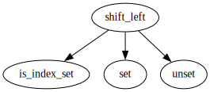
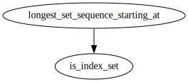

# Module `0x1::bit_vector`

-  [Struct `BitVector`](#0x1_bit_vector_BitVector)
-  [Constants](#@Constants_0)
-  [Function `new`](#0x1_bit_vector_new)
-  [Function `set`](#0x1_bit_vector_set)
-  [Function `unset`](#0x1_bit_vector_unset)
-  [Function `shift_left`](#0x1_bit_vector_shift_left)
-  [Function `is_index_set`](#0x1_bit_vector_is_index_set)
-  [Function `length`](#0x1_bit_vector_length)
-  [Function `longest_set_sequence_starting_at`](#0x1_bit_vector_longest_set_sequence_starting_at)
-  [Specification](#@Specification_1)
    -  [Function `new`](#@Specification_1_new)
    -  [Function `set`](#@Specification_1_set)
    -  [Function `unset`](#@Specification_1_unset)
    -  [Function `is_index_set`](#@Specification_1_is_index_set)

<pre><code></code></pre>

Show all the modules that "bit_vector" depends on directly or indirectly

Show all the modules that depend on "bit_vector" directly or indirectly

## Struct `BitVector`

<pre><code><b>struct</b> <a href="bit_vector.md#0x1_bit_vector_BitVector">BitVector</a> <b>has</b> <b>copy</b>, drop, store
</code></pre>

Fields

<dl>
<dt>
<code>length: u64</code>
</dt>
<dd>

</dd>
<dt>
<code>bit_field: <a href="vector.md#0x1_vector">vector</a>&lt;bool&gt;</code>
</dt>
<dd>

</dd>
</dl>

## Constants

The provided index is out of bounds

<pre><code><b>const</b> <a href="bit_vector.md#0x1_bit_vector_EINDEX">EINDEX</a>: u64 = 131072;
</code></pre>

An invalid length of bitvector was given

<pre><code><b>const</b> <a href="bit_vector.md#0x1_bit_vector_ELENGTH">ELENGTH</a>: u64 = 131073;
</code></pre>

The maximum allowed bitvector size

<pre><code><b>const</b> <a href="bit_vector.md#0x1_bit_vector_MAX_SIZE">MAX_SIZE</a>: u64 = 1024;
</code></pre>

<pre><code><b>const</b> <a href="bit_vector.md#0x1_bit_vector_WORD_SIZE">WORD_SIZE</a>: u64 = 1;
</code></pre>

## Function `new`

<pre><code><b>public</b> <b>fun</b> <a href="bit_vector.md#0x1_bit_vector_new">new</a>(length: u64): <a href="bit_vector.md#0x1_bit_vector_BitVector">bit_vector::BitVector</a>
</code></pre>

Implementation

<pre><code><b>public</b> <b>fun</b> <a href="bit_vector.md#0x1_bit_vector_new">new</a>(length: u64): <a href="bit_vector.md#0x1_bit_vector_BitVector">BitVector</a> {
    <b>assert</b>!(length &gt; 0, <a href="bit_vector.md#0x1_bit_vector_ELENGTH">ELENGTH</a>);
    <b>assert</b>!(<a href="bit_vector.md#0x1_bit_vector_length">length</a> &lt; <a href="bit_vector.md#0x1_bit_vector_MAX_SIZE">MAX_SIZE</a>, <a href="bit_vector.md#0x1_bit_vector_ELENGTH">ELENGTH</a>);
    <b>let</b> counter = 0;
    <b>let</b> bit_field = <a href="vector.md#0x1_vector_empty">vector::empty</a>();
    <b>while</b> ({<b>spec</b> {
        <b>invariant</b> counter &lt;= length;
        <b>invariant</b> len(bit_field) == counter;
    };
        (counter &lt; length)}) {
        <a href="vector.md#0x1_vector_push_back">vector::push_back</a>(&<b>mut</b> bit_field, <b>false</b>);
        counter = counter + 1;
    };
    <b>spec</b> {
        <b>assert</b> counter == length;
        <b>assert</b> len(bit_field) == length;
    };

    <a href="bit_vector.md#0x1_bit_vector_BitVector">BitVector</a> {
        length,
        bit_field,
    }
}
</code></pre>

Show all the functions that "new" calls

Show all the functions that call "new"

## Function `set`

Set the bit at <code>bit_index</code> in the <code>bitvector</code> regardless of its previous state.

<pre><code><b>public</b> <b>fun</b> <a href="bit_vector.md#0x1_bit_vector_set">set</a>(bitvector: &<b>mut</b> <a href="bit_vector.md#0x1_bit_vector_BitVector">bit_vector::BitVector</a>, bit_index: u64)
</code></pre>

Implementation

<pre><code><b>public</b> <b>fun</b> <a href="bit_vector.md#0x1_bit_vector_set">set</a>(bitvector: &<b>mut</b> <a href="bit_vector.md#0x1_bit_vector_BitVector">BitVector</a>, bit_index: u64) {
    <b>assert</b>!(bit_index &lt; <a href="vector.md#0x1_vector_length">vector::length</a>(&bitvector.bit_field), <a href="bit_vector.md#0x1_bit_vector_EINDEX">EINDEX</a>);
    <b>let</b> x = <a href="vector.md#0x1_vector_borrow_mut">vector::borrow_mut</a>(&<b>mut</b> bitvector.bit_field, bit_index);
    *x = <b>true</b>;
}
</code></pre>

Show all the functions that "set" calls

Show all the functions that call "set"

## Function `unset`

Unset the bit at <code>bit_index</code> in the <code>bitvector</code> regardless of its previous state.

<pre><code><b>public</b> <b>fun</b> <a href="bit_vector.md#0x1_bit_vector_unset">unset</a>(bitvector: &<b>mut</b> <a href="bit_vector.md#0x1_bit_vector_BitVector">bit_vector::BitVector</a>, bit_index: u64)
</code></pre>

Implementation

<pre><code><b>public</b> <b>fun</b> <a href="bit_vector.md#0x1_bit_vector_unset">unset</a>(bitvector: &<b>mut</b> <a href="bit_vector.md#0x1_bit_vector_BitVector">BitVector</a>, bit_index: u64) {
    <b>assert</b>!(bit_index &lt; <a href="vector.md#0x1_vector_length">vector::length</a>(&bitvector.bit_field), <a href="bit_vector.md#0x1_bit_vector_EINDEX">EINDEX</a>);
    <b>let</b> x = <a href="vector.md#0x1_vector_borrow_mut">vector::borrow_mut</a>(&<b>mut</b> bitvector.bit_field, bit_index);
    *x = <b>false</b>;
}
</code></pre>

Show all the functions that "unset" calls

Show all the functions that call "unset"

## Function `shift_left`

Shift the <code>bitvector</code> left by <code>amount</code>. If <code>amount</code> is greater than the
bitvector's length the bitvector will be zeroed out.

<pre><code><b>public</b> <b>fun</b> <a href="bit_vector.md#0x1_bit_vector_shift_left">shift_left</a>(bitvector: &<b>mut</b> <a href="bit_vector.md#0x1_bit_vector_BitVector">bit_vector::BitVector</a>, amount: u64)
</code></pre>

Implementation

<pre><code><b>public</b> <b>fun</b> <a href="bit_vector.md#0x1_bit_vector_shift_left">shift_left</a>(bitvector: &<b>mut</b> <a href="bit_vector.md#0x1_bit_vector_BitVector">BitVector</a>, amount: u64) {
    <b>if</b> (amount &gt;= bitvector.length) {
       <b>let</b> len = <a href="vector.md#0x1_vector_length">vector::length</a>(&bitvector.bit_field);
       <b>let</b> i = 0;
       <b>while</b> (i &lt; len) {
           <b>let</b> elem = <a href="vector.md#0x1_vector_borrow_mut">vector::borrow_mut</a>(&<b>mut</b> bitvector.bit_field, i);
           *elem = <b>false</b>;
           i = i + 1;
       };
    } <b>else</b> {
        <b>let</b> i = amount;

        <b>while</b> (i &lt; bitvector.length) {
            <b>if</b> (<a href="bit_vector.md#0x1_bit_vector_is_index_set">is_index_set</a>(bitvector, i)) <a href="bit_vector.md#0x1_bit_vector_set">set</a>(bitvector, i - amount)
            <b>else</b> <a href="bit_vector.md#0x1_bit_vector_unset">unset</a>(bitvector, i - amount);
            i = i + 1;
        };

        i = bitvector.length - amount;

        <b>while</b> (i &lt; bitvector.length) {
            <a href="bit_vector.md#0x1_bit_vector_unset">unset</a>(bitvector, i);
            i = i + 1;
        };
    }
}
</code></pre>

Show all the functions that "shift_left" calls

Show all the functions that call "shift_left"

## Function `is_index_set`

Return the value of the bit at <code>bit_index</code> in the <code>bitvector</code>. <code><b>true</b></code>
represents "1" and <code><b>false</b></code> represents a 0

<pre><code><b>public</b> <b>fun</b> <a href="bit_vector.md#0x1_bit_vector_is_index_set">is_index_set</a>(bitvector: &<a href="bit_vector.md#0x1_bit_vector_BitVector">bit_vector::BitVector</a>, bit_index: u64): bool
</code></pre>

Implementation

<pre><code><b>public</b> <b>fun</b> <a href="bit_vector.md#0x1_bit_vector_is_index_set">is_index_set</a>(bitvector: &<a href="bit_vector.md#0x1_bit_vector_BitVector">BitVector</a>, bit_index: u64): bool {
    <b>assert</b>!(bit_index &lt; <a href="vector.md#0x1_vector_length">vector::length</a>(&bitvector.bit_field), <a href="bit_vector.md#0x1_bit_vector_EINDEX">EINDEX</a>);
    *<a href="vector.md#0x1_vector_borrow">vector::borrow</a>(&bitvector.bit_field, bit_index)
}
</code></pre>

Show all the functions that "is_index_set" calls

Show all the functions that call "is_index_set"

## Function `length`

Return the length (number of usable bits) of this bitvector

<pre><code><b>public</b> <b>fun</b> <a href="bit_vector.md#0x1_bit_vector_length">length</a>(bitvector: &<a href="bit_vector.md#0x1_bit_vector_BitVector">bit_vector::BitVector</a>): u64
</code></pre>

Implementation

<pre><code><b>public</b> <b>fun</b> <a href="bit_vector.md#0x1_bit_vector_length">length</a>(bitvector: &<a href="bit_vector.md#0x1_bit_vector_BitVector">BitVector</a>): u64 {
    <a href="vector.md#0x1_vector_length">vector::length</a>(&bitvector.bit_field)
}
</code></pre>

Show all the functions that "length" calls

Show all the functions that call "length"

## Function `longest_set_sequence_starting_at`

Returns the length of the longest sequence of set bits starting at (and
including) <code>start_index</code> in the <code>bitvector</code>. If there is no such
sequence, then <code>0</code> is returned.

<pre><code><b>public</b> <b>fun</b> <a href="bit_vector.md#0x1_bit_vector_longest_set_sequence_starting_at">longest_set_sequence_starting_at</a>(bitvector: &<a href="bit_vector.md#0x1_bit_vector_BitVector">bit_vector::BitVector</a>, start_index: u64): u64
</code></pre>

Implementation

<pre><code><b>public</b> <b>fun</b> <a href="bit_vector.md#0x1_bit_vector_longest_set_sequence_starting_at">longest_set_sequence_starting_at</a>(bitvector: &<a href="bit_vector.md#0x1_bit_vector_BitVector">BitVector</a>, start_index: u64): u64 {
    <b>assert</b>!(start_index &lt; bitvector.length, <a href="bit_vector.md#0x1_bit_vector_EINDEX">EINDEX</a>);
    <b>let</b> index = start_index;

    // Find the greatest index in the <a href="vector.md#0x1_vector">vector</a> such that all indices less than it are set.
    <b>while</b> (index &lt; bitvector.length) {
        <b>if</b> (!<a href="bit_vector.md#0x1_bit_vector_is_index_set">is_index_set</a>(bitvector, index)) <b>break</b>;
        index = index + 1;
    };

    index - start_index
}
</code></pre>

Show all the functions that "longest_set_sequence_starting_at" calls

Show all the functions that call "longest_set_sequence_starting_at"

## Specification

### Function `new`

<pre><code><b>public</b> <b>fun</b> <a href="bit_vector.md#0x1_bit_vector_new">new</a>(length: u64): <a href="bit_vector.md#0x1_bit_vector_BitVector">bit_vector::BitVector</a>
</code></pre>

<pre><code><b>include</b> <a href="bit_vector.md#0x1_bit_vector_NewAbortsIf">NewAbortsIf</a>;
<b>ensures</b> result.length == length;
<b>ensures</b> len(result.bit_field) == length;
</code></pre>

<pre><code><b>schema</b> <a href="bit_vector.md#0x1_bit_vector_NewAbortsIf">NewAbortsIf</a> {
    length: u64;
    <b>aborts_if</b> <a href="bit_vector.md#0x1_bit_vector_length">length</a> &lt;= 0 <b>with</b> <a href="bit_vector.md#0x1_bit_vector_ELENGTH">ELENGTH</a>;
    <b>aborts_if</b> length &gt;= <a href="bit_vector.md#0x1_bit_vector_MAX_SIZE">MAX_SIZE</a> <b>with</b> <a href="bit_vector.md#0x1_bit_vector_ELENGTH">ELENGTH</a>;
}
</code></pre>

### Function `set`

<pre><code><b>public</b> <b>fun</b> <a href="bit_vector.md#0x1_bit_vector_set">set</a>(bitvector: &<b>mut</b> <a href="bit_vector.md#0x1_bit_vector_BitVector">bit_vector::BitVector</a>, bit_index: u64)
</code></pre>

<pre><code><b>include</b> <a href="bit_vector.md#0x1_bit_vector_SetAbortsIf">SetAbortsIf</a>;
<b>ensures</b> bitvector.bit_field[bit_index];
</code></pre>

<pre><code><b>schema</b> <a href="bit_vector.md#0x1_bit_vector_SetAbortsIf">SetAbortsIf</a> {
    bitvector: <a href="bit_vector.md#0x1_bit_vector_BitVector">BitVector</a>;
    bit_index: u64;
    <b>aborts_if</b> bit_index &gt;= <a href="bit_vector.md#0x1_bit_vector_length">length</a>(bitvector) <b>with</b> <a href="bit_vector.md#0x1_bit_vector_EINDEX">EINDEX</a>;
}
</code></pre>

### Function `unset`

<pre><code><b>public</b> <b>fun</b> <a href="bit_vector.md#0x1_bit_vector_unset">unset</a>(bitvector: &<b>mut</b> <a href="bit_vector.md#0x1_bit_vector_BitVector">bit_vector::BitVector</a>, bit_index: u64)
</code></pre>

<pre><code><b>include</b> <a href="bit_vector.md#0x1_bit_vector_UnsetAbortsIf">UnsetAbortsIf</a>;
<b>ensures</b> !bitvector.bit_field[bit_index];
</code></pre>

<pre><code><b>schema</b> <a href="bit_vector.md#0x1_bit_vector_UnsetAbortsIf">UnsetAbortsIf</a> {
    bitvector: <a href="bit_vector.md#0x1_bit_vector_BitVector">BitVector</a>;
    bit_index: u64;
    <b>aborts_if</b> bit_index &gt;= <a href="bit_vector.md#0x1_bit_vector_length">length</a>(bitvector) <b>with</b> <a href="bit_vector.md#0x1_bit_vector_EINDEX">EINDEX</a>;
}
</code></pre>

### Function `is_index_set`

<pre><code><b>public</b> <b>fun</b> <a href="bit_vector.md#0x1_bit_vector_is_index_set">is_index_set</a>(bitvector: &<a href="bit_vector.md#0x1_bit_vector_BitVector">bit_vector::BitVector</a>, bit_index: u64): bool
</code></pre>

<pre><code><b>include</b> <a href="bit_vector.md#0x1_bit_vector_IsIndexSetAbortsIf">IsIndexSetAbortsIf</a>;
<b>ensures</b> result == bitvector.bit_field[bit_index];
</code></pre>

<pre><code><b>schema</b> <a href="bit_vector.md#0x1_bit_vector_IsIndexSetAbortsIf">IsIndexSetAbortsIf</a> {
    bitvector: <a href="bit_vector.md#0x1_bit_vector_BitVector">BitVector</a>;
    bit_index: u64;
    <b>aborts_if</b> bit_index &gt;= <a href="bit_vector.md#0x1_bit_vector_length">length</a>(bitvector) <b>with</b> <a href="bit_vector.md#0x1_bit_vector_EINDEX">EINDEX</a>;
}
</code></pre>

<pre><code><b>fun</b> <a href="bit_vector.md#0x1_bit_vector_spec_is_index_set">spec_is_index_set</a>(bitvector: <a href="bit_vector.md#0x1_bit_vector_BitVector">BitVector</a>, bit_index: u64): bool {
   <b>if</b> (bit_index &gt;= <a href="bit_vector.md#0x1_bit_vector_length">length</a>(bitvector)) {
       <b>false</b>
   } <b>else</b> {
       bitvector.bit_field[bit_index]
   }
}
</code></pre>

[move-book]: https://move-language.github.io/move/introduction.html
