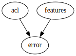
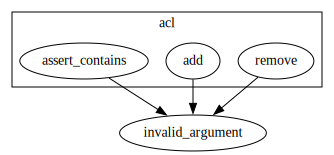
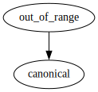
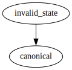
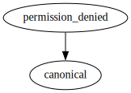
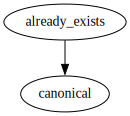
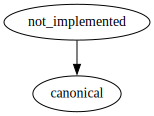

<a name="0x1_error"></a>

# Module `0x1::error`

This module defines a set of canonical error codes which are optional to use by applications for the
<code><b>abort</b></code> and <code><b>assert</b>!</code> features.

Canonical error codes use the 3 lowest bytes of the u64 abort code range (the upper 5 bytes are free for other use).
Of those, the highest byte represents the *error category* and the lower two bytes the *error reason*.
Given an error category <code>0x1</code> and a reason <code>0x3</code>, a canonical abort code looks as <code>0x10003</code>.

A module can use a canonical code with a constant declaration of the following form:

```
///  An invalid ASCII character was encountered when creating a string.
const EINVALID_CHARACTER: u64 = 0x010003;
```

This code is both valid in the worlds with and without canonical errors. It can be used as a plain module local
error reason understand by the existing error map tooling, or as a canonical code.

The actual canonical categories have been adopted from Google's canonical error codes, which in turn are derived
from Unix error codes [see here](https://cloud.google.com/apis/design/errors#handling_errors). Each code has an
associated HTTP error code which can be used in REST apis. The mapping from error code to http code is not 1:1;
error codes here are a bit richer than HTTP codes.


-  [Constants](#@Constants_0)
-  [Function `canonical`](#0x1_error_canonical)
-  [Function `invalid_argument`](#0x1_error_invalid_argument)
-  [Function `out_of_range`](#0x1_error_out_of_range)
-  [Function `invalid_state`](#0x1_error_invalid_state)
-  [Function `unauthenticated`](#0x1_error_unauthenticated)
-  [Function `permission_denied`](#0x1_error_permission_denied)
-  [Function `not_found`](#0x1_error_not_found)
-  [Function `aborted`](#0x1_error_aborted)
-  [Function `already_exists`](#0x1_error_already_exists)
-  [Function `resource_exhausted`](#0x1_error_resource_exhausted)
-  [Function `internal`](#0x1_error_internal)
-  [Function `not_implemented`](#0x1_error_not_implemented)
-  [Function `unavailable`](#0x1_error_unavailable)
-  [Specification](#@Specification_1)
    -  [Function `canonical`](#@Specification_1_canonical)


<pre><code></code></pre>


<details>
<summary>Show all the modules that "error" depends on directly or indirectly</summary>


</details>

<details>
<summary>Show all the modules that depend on "error" directly or indirectly</summary>





</details>

<a name="@Constants_0"></a>

## Constants


<a name="0x1_error_ABORTED"></a>

Concurrency conflict, such as read-modify-write conflict (http: 409)


<pre><code><b>const</b> <a href="error.md#0x1_error_ABORTED">ABORTED</a>: u64 = 7;
</code></pre>


<a name="0x1_error_ALREADY_EXISTS"></a>

The resource that a client tried to create already exists (http: 409)


<pre><code><b>const</b> <a href="error.md#0x1_error_ALREADY_EXISTS">ALREADY_EXISTS</a>: u64 = 8;
</code></pre>


<a name="0x1_error_CANCELLED"></a>

Request cancelled by the client (http: 499)


<pre><code><b>const</b> <a href="error.md#0x1_error_CANCELLED">CANCELLED</a>: u64 = 10;
</code></pre>


<a name="0x1_error_INTERNAL"></a>

Internal error (http: 500)


<pre><code><b>const</b> <a href="error.md#0x1_error_INTERNAL">INTERNAL</a>: u64 = 11;
</code></pre>


<a name="0x1_error_INVALID_ARGUMENT"></a>

Caller specified an invalid argument (http: 400)


<pre><code><b>const</b> <a href="error.md#0x1_error_INVALID_ARGUMENT">INVALID_ARGUMENT</a>: u64 = 1;
</code></pre>


<a name="0x1_error_INVALID_STATE"></a>

The system is not in a state where the operation can be performed (http: 400)


<pre><code><b>const</b> <a href="error.md#0x1_error_INVALID_STATE">INVALID_STATE</a>: u64 = 3;
</code></pre>


<a name="0x1_error_NOT_FOUND"></a>

A specified resource is not found (http: 404)


<pre><code><b>const</b> <a href="error.md#0x1_error_NOT_FOUND">NOT_FOUND</a>: u64 = 6;
</code></pre>


<a name="0x1_error_NOT_IMPLEMENTED"></a>

Feature not implemented (http: 501)


<pre><code><b>const</b> <a href="error.md#0x1_error_NOT_IMPLEMENTED">NOT_IMPLEMENTED</a>: u64 = 12;
</code></pre>


<a name="0x1_error_OUT_OF_RANGE"></a>

An input or result of a computation is out of range (http: 400)


<pre><code><b>const</b> <a href="error.md#0x1_error_OUT_OF_RANGE">OUT_OF_RANGE</a>: u64 = 2;
</code></pre>


<a name="0x1_error_PERMISSION_DENIED"></a>

client does not have sufficient permission (http: 403)


<pre><code><b>const</b> <a href="error.md#0x1_error_PERMISSION_DENIED">PERMISSION_DENIED</a>: u64 = 5;
</code></pre>


<a name="0x1_error_RESOURCE_EXHAUSTED"></a>

Out of gas or other forms of quota (http: 429)


<pre><code><b>const</b> <a href="error.md#0x1_error_RESOURCE_EXHAUSTED">RESOURCE_EXHAUSTED</a>: u64 = 9;
</code></pre>


<a name="0x1_error_UNAUTHENTICATED"></a>

Request not authenticated due to missing, invalid, or expired auth token (http: 401)


<pre><code><b>const</b> <a href="error.md#0x1_error_UNAUTHENTICATED">UNAUTHENTICATED</a>: u64 = 4;
</code></pre>


<a name="0x1_error_UNAVAILABLE"></a>

The service is currently unavailable. Indicates that a retry could solve the issue (http: 503)


<pre><code><b>const</b> <a href="error.md#0x1_error_UNAVAILABLE">UNAVAILABLE</a>: u64 = 13;
</code></pre>


<a name="0x1_error_canonical"></a>

## Function `canonical`

Construct a canonical error code from a category and a reason.


<pre><code><b>public</b> <b>fun</b> <a href="error.md#0x1_error_canonical">canonical</a>(category: u64, reason: u64): u64
</code></pre>


<details>
<summary>Implementation</summary>


<pre><code><b>public</b> <b>fun</b> <a href="error.md#0x1_error_canonical">canonical</a>(category: u64, reason: u64): u64 {
  (category &lt;&lt; 16) + reason
}
</code></pre>


</details>

<details>
<summary>Show all the functions that "canonical" calls</summary>


</details>

<details>
<summary>Show all the functions that call "canonical"</summary>


</details>

<a name="0x1_error_invalid_argument"></a>

## Function `invalid_argument`

Functions to construct a canonical error code of the given category.


<pre><code><b>public</b> <b>fun</b> <a href="error.md#0x1_error_invalid_argument">invalid_argument</a>(r: u64): u64
</code></pre>


<details>
<summary>Implementation</summary>


<pre><code><b>public</b> <b>fun</b> <a href="error.md#0x1_error_invalid_argument">invalid_argument</a>(r: u64): u64 {  <a href="error.md#0x1_error_canonical">canonical</a>(<a href="error.md#0x1_error_INVALID_ARGUMENT">INVALID_ARGUMENT</a>, r) }
</code></pre>


</details>

<details>
<summary>Show all the functions that "invalid_argument" calls</summary>


</details>

<details>
<summary>Show all the functions that call "invalid_argument"</summary>





</details>

<a name="0x1_error_out_of_range"></a>

## Function `out_of_range`


<pre><code><b>public</b> <b>fun</b> <a href="error.md#0x1_error_out_of_range">out_of_range</a>(r: u64): u64
</code></pre>


<details>
<summary>Implementation</summary>


<pre><code><b>public</b> <b>fun</b> <a href="error.md#0x1_error_out_of_range">out_of_range</a>(r: u64): u64 {  <a href="error.md#0x1_error_canonical">canonical</a>(<a href="error.md#0x1_error_OUT_OF_RANGE">OUT_OF_RANGE</a>, r) }
</code></pre>


</details>

<details>
<summary>Show all the functions that "out_of_range" calls</summary>





</details>

<details>
<summary>Show all the functions that call "out_of_range"</summary>


</details>

<a name="0x1_error_invalid_state"></a>

## Function `invalid_state`


<pre><code><b>public</b> <b>fun</b> <a href="error.md#0x1_error_invalid_state">invalid_state</a>(r: u64): u64
</code></pre>


<details>
<summary>Implementation</summary>


<pre><code><b>public</b> <b>fun</b> <a href="error.md#0x1_error_invalid_state">invalid_state</a>(r: u64): u64 {  <a href="error.md#0x1_error_canonical">canonical</a>(<a href="error.md#0x1_error_INVALID_STATE">INVALID_STATE</a>, r) }
</code></pre>


</details>

<details>
<summary>Show all the functions that "invalid_state" calls</summary>





</details>

<details>
<summary>Show all the functions that call "invalid_state"</summary>


</details>

<a name="0x1_error_unauthenticated"></a>

## Function `unauthenticated`


<pre><code><b>public</b> <b>fun</b> <a href="error.md#0x1_error_unauthenticated">unauthenticated</a>(r: u64): u64
</code></pre>


<details>
<summary>Implementation</summary>


<pre><code><b>public</b> <b>fun</b> <a href="error.md#0x1_error_unauthenticated">unauthenticated</a>(r: u64): u64 { <a href="error.md#0x1_error_canonical">canonical</a>(<a href="error.md#0x1_error_UNAUTHENTICATED">UNAUTHENTICATED</a>, r) }
</code></pre>


</details>

<details>
<summary>Show all the functions that "unauthenticated" calls</summary>


</details>

<details>
<summary>Show all the functions that call "unauthenticated"</summary>


</details>

<a name="0x1_error_permission_denied"></a>

## Function `permission_denied`


<pre><code><b>public</b> <b>fun</b> <a href="error.md#0x1_error_permission_denied">permission_denied</a>(r: u64): u64
</code></pre>


<details>
<summary>Implementation</summary>


<pre><code><b>public</b> <b>fun</b> <a href="error.md#0x1_error_permission_denied">permission_denied</a>(r: u64): u64 { <a href="error.md#0x1_error_canonical">canonical</a>(<a href="error.md#0x1_error_PERMISSION_DENIED">PERMISSION_DENIED</a>, r) }
</code></pre>


</details>

<details>
<summary>Show all the functions that "permission_denied" calls</summary>





</details>

<details>
<summary>Show all the functions that call "permission_denied"</summary>


</details>

<a name="0x1_error_not_found"></a>

## Function `not_found`


<pre><code><b>public</b> <b>fun</b> <a href="error.md#0x1_error_not_found">not_found</a>(r: u64): u64
</code></pre>


<details>
<summary>Implementation</summary>


<pre><code><b>public</b> <b>fun</b> <a href="error.md#0x1_error_not_found">not_found</a>(r: u64): u64 { <a href="error.md#0x1_error_canonical">canonical</a>(<a href="error.md#0x1_error_NOT_FOUND">NOT_FOUND</a>, r) }
</code></pre>


</details>

<details>
<summary>Show all the functions that "not_found" calls</summary>


</details>

<details>
<summary>Show all the functions that call "not_found"</summary>


</details>

<a name="0x1_error_aborted"></a>

## Function `aborted`


<pre><code><b>public</b> <b>fun</b> <a href="error.md#0x1_error_aborted">aborted</a>(r: u64): u64
</code></pre>


<details>
<summary>Implementation</summary>


<pre><code><b>public</b> <b>fun</b> <a href="error.md#0x1_error_aborted">aborted</a>(r: u64): u64 { <a href="error.md#0x1_error_canonical">canonical</a>(<a href="error.md#0x1_error_ABORTED">ABORTED</a>, r) }
</code></pre>


</details>

<details>
<summary>Show all the functions that "aborted" calls</summary>


</details>

<details>
<summary>Show all the functions that call "aborted"</summary>


</details>

<a name="0x1_error_already_exists"></a>

## Function `already_exists`


<pre><code><b>public</b> <b>fun</b> <a href="error.md#0x1_error_already_exists">already_exists</a>(r: u64): u64
</code></pre>


<details>
<summary>Implementation</summary>


<pre><code><b>public</b> <b>fun</b> <a href="error.md#0x1_error_already_exists">already_exists</a>(r: u64): u64 { <a href="error.md#0x1_error_canonical">canonical</a>(<a href="error.md#0x1_error_ALREADY_EXISTS">ALREADY_EXISTS</a>, r) }
</code></pre>


</details>

<details>
<summary>Show all the functions that "already_exists" calls</summary>





</details>

<details>
<summary>Show all the functions that call "already_exists"</summary>


</details>

<a name="0x1_error_resource_exhausted"></a>

## Function `resource_exhausted`


<pre><code><b>public</b> <b>fun</b> <a href="error.md#0x1_error_resource_exhausted">resource_exhausted</a>(r: u64): u64
</code></pre>


<details>
<summary>Implementation</summary>


<pre><code><b>public</b> <b>fun</b> <a href="error.md#0x1_error_resource_exhausted">resource_exhausted</a>(r: u64): u64 {  <a href="error.md#0x1_error_canonical">canonical</a>(<a href="error.md#0x1_error_RESOURCE_EXHAUSTED">RESOURCE_EXHAUSTED</a>, r) }
</code></pre>


</details>

<details>
<summary>Show all the functions that "resource_exhausted" calls</summary>


</details>

<details>
<summary>Show all the functions that call "resource_exhausted"</summary>


</details>

<a name="0x1_error_internal"></a>

## Function `internal`


<pre><code><b>public</b> <b>fun</b> <b>internal</b>(r: u64): u64
</code></pre>


<details>
<summary>Implementation</summary>


<pre><code><b>public</b> <b>fun</b> <b>internal</b>(r: u64): u64 {  <a href="error.md#0x1_error_canonical">canonical</a>(<a href="error.md#0x1_error_INTERNAL">INTERNAL</a>, r) }
</code></pre>


</details>

<details>
<summary>Show all the functions that "internal" calls</summary>


</details>

<details>
<summary>Show all the functions that call "internal"</summary>


</details>

<a name="0x1_error_not_implemented"></a>

## Function `not_implemented`


<pre><code><b>public</b> <b>fun</b> <a href="error.md#0x1_error_not_implemented">not_implemented</a>(r: u64): u64
</code></pre>


<details>
<summary>Implementation</summary>


<pre><code><b>public</b> <b>fun</b> <a href="error.md#0x1_error_not_implemented">not_implemented</a>(r: u64): u64 {  <a href="error.md#0x1_error_canonical">canonical</a>(<a href="error.md#0x1_error_NOT_IMPLEMENTED">NOT_IMPLEMENTED</a>, r) }
</code></pre>


</details>

<details>
<summary>Show all the functions that "not_implemented" calls</summary>





</details>

<details>
<summary>Show all the functions that call "not_implemented"</summary>


</details>

<a name="0x1_error_unavailable"></a>

## Function `unavailable`


<pre><code><b>public</b> <b>fun</b> <a href="error.md#0x1_error_unavailable">unavailable</a>(r: u64): u64
</code></pre>


<details>
<summary>Implementation</summary>


<pre><code><b>public</b> <b>fun</b> <a href="error.md#0x1_error_unavailable">unavailable</a>(r: u64): u64 { <a href="error.md#0x1_error_canonical">canonical</a>(<a href="error.md#0x1_error_UNAVAILABLE">UNAVAILABLE</a>, r) }
</code></pre>


</details>

<details>
<summary>Show all the functions that "unavailable" calls</summary>


</details>

<details>
<summary>Show all the functions that call "unavailable"</summary>


</details>

<a name="@Specification_1"></a>

## Specification


<a name="@Specification_1_canonical"></a>

### Function `canonical`


<pre><code><b>public</b> <b>fun</b> <a href="error.md#0x1_error_canonical">canonical</a>(category: u64, reason: u64): u64
</code></pre>


<pre><code><b>pragma</b> opaque = <b>true</b>;
<b>let</b> shl_res = (category * 65536) % 18446744073709551616;
<b>ensures</b> [concrete] result == shl_res + reason;
<b>aborts_if</b> [abstract] <b>false</b>;
<b>ensures</b> [abstract] result == category;
</code></pre>


[move-book]: https://move-language.github.io/move/introduction.html
