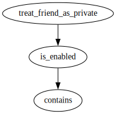
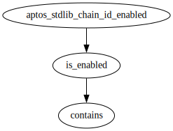

# Module `0x1::features`

Defines feature flags for Aptos. Those are used in Aptos specific implementations of features in
the Move stdlib, the Aptos stdlib, and the Aptos framework.

-  [Resource `Features`](#0x1_features_Features)
-  [Constants](#@Constants_0)
-  [Function `code_dependency_check_enabled`](#0x1_features_code_dependency_check_enabled)
-  [Function `treat_friend_as_private`](#0x1_features_treat_friend_as_private)
-  [Function `get_sha_512_and_ripemd_160_feature`](#0x1_features_get_sha_512_and_ripemd_160_feature)
-  [Function `sha_512_and_ripemd_160_enabled`](#0x1_features_sha_512_and_ripemd_160_enabled)
-  [Function `get_aptos_stdlib_chain_id_feature`](#0x1_features_get_aptos_stdlib_chain_id_feature)
-  [Function `aptos_stdlib_chain_id_enabled`](#0x1_features_aptos_stdlib_chain_id_enabled)
-  [Function `change_feature_flags`](#0x1_features_change_feature_flags)
-  [Function `is_enabled`](#0x1_features_is_enabled)
-  [Function `set`](#0x1_features_set)
-  [Function `contains`](#0x1_features_contains)
-  [Specification](#@Specification_1)
    -  [Function `code_dependency_check_enabled`](#@Specification_1_code_dependency_check_enabled)
    -  [Function `change_feature_flags`](#@Specification_1_change_feature_flags)
    -  [Function `is_enabled`](#@Specification_1_is_enabled)
    -  [Function `set`](#@Specification_1_set)
    -  [Function `contains`](#@Specification_1_contains)

<pre><code><b>use</b> <a href="error.md#0x1_error">0x1::error</a>;
<b>use</b> <a href="signer.md#0x1_signer">0x1::signer</a>;
</code></pre>

Show all the modules that "features" depends on directly or indirectly

Show all the modules that depend on "features" directly or indirectly

## Resource `Features`

The enabled features, represented by a bitset stored on chain.

<pre><code><b>struct</b> <a href="features.md#0x1_features_Features">Features</a> <b>has</b> key
</code></pre>

Fields

<dl>
<dt>
<code><a href="features.md#0x1_features">features</a>: <a href="vector.md#0x1_vector">vector</a>&lt;u8&gt;</code>
</dt>
<dd>

</dd>
</dl>

## Constants

Whether the new <code>aptos_stdlib::type_info::chain_id()</code> native for fetching the chain ID is enabled.
This is needed because of the introduction of a new native function.
Lifetime: transient

<pre><code><b>const</b> <a href="features.md#0x1_features_APTOS_STD_CHAIN_ID_NATIVES">APTOS_STD_CHAIN_ID_NATIVES</a>: u64 = 4;
</code></pre>

Whether validation of package dependencies is enabled, and the related native function is
available. This is needed because of introduction of a new native function.
Lifetime: transient

<pre><code><b>const</b> <a href="features.md#0x1_features_CODE_DEPENDENCY_CHECK">CODE_DEPENDENCY_CHECK</a>: u64 = 1;
</code></pre>

The provided signer has not a framework address.

<pre><code><b>const</b> <a href="features.md#0x1_features_EFRAMEWORK_SIGNER_NEEDED">EFRAMEWORK_SIGNER_NEEDED</a>: u64 = 1;
</code></pre>

Whether the new SHA2-512, SHA3-512 and RIPEMD-160 hash function natives are enabled.
This is needed because of the introduction of new native functions.
Lifetime: transient

<pre><code><b>const</b> <a href="features.md#0x1_features_SHA_512_AND_RIPEMD_160_NATIVES">SHA_512_AND_RIPEMD_160_NATIVES</a>: u64 = 3;
</code></pre>

Whether during upgrade compatibility checking, friend functions should be treated similar like
private functions.
Lifetime: ephemeral

<pre><code><b>const</b> <a href="features.md#0x1_features_TREAT_FRIEND_AS_PRIVATE">TREAT_FRIEND_AS_PRIVATE</a>: u64 = 2;
</code></pre>

## Function `code_dependency_check_enabled`

<pre><code><b>public</b> <b>fun</b> <a href="features.md#0x1_features_code_dependency_check_enabled">code_dependency_check_enabled</a>(): bool
</code></pre>

Implementation

<pre><code><b>public</b> <b>fun</b> <a href="features.md#0x1_features_code_dependency_check_enabled">code_dependency_check_enabled</a>(): bool <b>acquires</b> <a href="features.md#0x1_features_Features">Features</a> {
    <a href="features.md#0x1_features_is_enabled">is_enabled</a>(<a href="features.md#0x1_features_CODE_DEPENDENCY_CHECK">CODE_DEPENDENCY_CHECK</a>)
}
</code></pre>

Show all the functions that "code_dependency_check_enabled" calls

Show all the functions that call "code_dependency_check_enabled"

## Function `treat_friend_as_private`

<pre><code><b>public</b> <b>fun</b> <a href="features.md#0x1_features_treat_friend_as_private">treat_friend_as_private</a>(): bool
</code></pre>

Implementation

<pre><code><b>public</b> <b>fun</b> <a href="features.md#0x1_features_treat_friend_as_private">treat_friend_as_private</a>(): bool <b>acquires</b> <a href="features.md#0x1_features_Features">Features</a> {
    <a href="features.md#0x1_features_is_enabled">is_enabled</a>(<a href="features.md#0x1_features_TREAT_FRIEND_AS_PRIVATE">TREAT_FRIEND_AS_PRIVATE</a>)
}
</code></pre>

Show all the functions that "treat_friend_as_private" calls

Show all the functions that call "treat_friend_as_private"

## Function `get_sha_512_and_ripemd_160_feature`

<pre><code><b>public</b> <b>fun</b> <a href="features.md#0x1_features_get_sha_512_and_ripemd_160_feature">get_sha_512_and_ripemd_160_feature</a>(): u64
</code></pre>

Implementation

<pre><code><b>public</b> <b>fun</b> <a href="features.md#0x1_features_get_sha_512_and_ripemd_160_feature">get_sha_512_and_ripemd_160_feature</a>(): u64 { <a href="features.md#0x1_features_SHA_512_AND_RIPEMD_160_NATIVES">SHA_512_AND_RIPEMD_160_NATIVES</a> }
</code></pre>

Show all the functions that "get_sha_512_and_ripemd_160_feature" calls

Show all the functions that call "get_sha_512_and_ripemd_160_feature"

## Function `sha_512_and_ripemd_160_enabled`

<pre><code><b>public</b> <b>fun</b> <a href="features.md#0x1_features_sha_512_and_ripemd_160_enabled">sha_512_and_ripemd_160_enabled</a>(): bool
</code></pre>

Implementation

<pre><code><b>public</b> <b>fun</b> <a href="features.md#0x1_features_sha_512_and_ripemd_160_enabled">sha_512_and_ripemd_160_enabled</a>(): bool <b>acquires</b> <a href="features.md#0x1_features_Features">Features</a> {
    <a href="features.md#0x1_features_is_enabled">is_enabled</a>(<a href="features.md#0x1_features_SHA_512_AND_RIPEMD_160_NATIVES">SHA_512_AND_RIPEMD_160_NATIVES</a>)
}
</code></pre>

Show all the functions that "sha_512_and_ripemd_160_enabled" calls

Show all the functions that call "sha_512_and_ripemd_160_enabled"

## Function `get_aptos_stdlib_chain_id_feature`

<pre><code><b>public</b> <b>fun</b> <a href="features.md#0x1_features_get_aptos_stdlib_chain_id_feature">get_aptos_stdlib_chain_id_feature</a>(): u64
</code></pre>

Implementation

<pre><code><b>public</b> <b>fun</b> <a href="features.md#0x1_features_get_aptos_stdlib_chain_id_feature">get_aptos_stdlib_chain_id_feature</a>(): u64 { <a href="features.md#0x1_features_APTOS_STD_CHAIN_ID_NATIVES">APTOS_STD_CHAIN_ID_NATIVES</a> }
</code></pre>

Show all the functions that "get_aptos_stdlib_chain_id_feature" calls

Show all the functions that call "get_aptos_stdlib_chain_id_feature"

## Function `aptos_stdlib_chain_id_enabled`

<pre><code><b>public</b> <b>fun</b> <a href="features.md#0x1_features_aptos_stdlib_chain_id_enabled">aptos_stdlib_chain_id_enabled</a>(): bool
</code></pre>

Implementation

<pre><code><b>public</b> <b>fun</b> <a href="features.md#0x1_features_aptos_stdlib_chain_id_enabled">aptos_stdlib_chain_id_enabled</a>(): bool <b>acquires</b> <a href="features.md#0x1_features_Features">Features</a> {
    <a href="features.md#0x1_features_is_enabled">is_enabled</a>(<a href="features.md#0x1_features_APTOS_STD_CHAIN_ID_NATIVES">APTOS_STD_CHAIN_ID_NATIVES</a>)
}
</code></pre>

Show all the functions that "aptos_stdlib_chain_id_enabled" calls

Show all the functions that call "aptos_stdlib_chain_id_enabled"

## Function `change_feature_flags`

Function to enable and disable features. Can only be called by a signer of @std.

<pre><code><b>public</b> <b>fun</b> <a href="features.md#0x1_features_change_feature_flags">change_feature_flags</a>(framework: &<a href="signer.md#0x1_signer">signer</a>, enable: <a href="vector.md#0x1_vector">vector</a>&lt;u64&gt;, disable: <a href="vector.md#0x1_vector">vector</a>&lt;u64&gt;)
</code></pre>

Implementation

<pre><code><b>public</b> <b>fun</b> <a href="features.md#0x1_features_change_feature_flags">change_feature_flags</a>(framework: &<a href="signer.md#0x1_signer">signer</a>, enable: <a href="vector.md#0x1_vector">vector</a>&lt;u64&gt;, disable: <a href="vector.md#0x1_vector">vector</a>&lt;u64&gt;)
<b>acquires</b> <a href="features.md#0x1_features_Features">Features</a> {
    <b>assert</b>!(<a href="signer.md#0x1_signer_address_of">signer::address_of</a>(framework) == @std, <a href="error.md#0x1_error_permission_denied">error::permission_denied</a>(<a href="features.md#0x1_features_EFRAMEWORK_SIGNER_NEEDED">EFRAMEWORK_SIGNER_NEEDED</a>));
    <b>if</b> (!<b>exists</b>&lt;<a href="features.md#0x1_features_Features">Features</a>&gt;(@std)) {
        <b>move_to</b>&lt;<a href="features.md#0x1_features_Features">Features</a>&gt;(framework, <a href="features.md#0x1_features_Features">Features</a>{<a href="features.md#0x1_features">features</a>: <a href="vector.md#0x1_vector">vector</a>[]})
    };
    <b>let</b> <a href="features.md#0x1_features">features</a> = &<b>mut</b> <b>borrow_global_mut</b>&lt;<a href="features.md#0x1_features_Features">Features</a>&gt;(@std).<a href="features.md#0x1_features">features</a>;
    <b>let</b> i = 0;
    <b>let</b> n = <a href="vector.md#0x1_vector_length">vector::length</a>(&enable);
    <b>while</b> (i &lt; n) {
        <a href="features.md#0x1_features_set">set</a>(<a href="features.md#0x1_features">features</a>, *<a href="vector.md#0x1_vector_borrow">vector::borrow</a>(&enable, i), <b>true</b>);
        i = i + 1
    };
    <b>let</b> i = 0;
    <b>let</b> n = <a href="vector.md#0x1_vector_length">vector::length</a>(&disable);
    <b>while</b> (i &lt; n) {
        <a href="features.md#0x1_features_set">set</a>(<a href="features.md#0x1_features">features</a>, *<a href="vector.md#0x1_vector_borrow">vector::borrow</a>(&disable, i), <b>false</b>);
        i = i + 1
    };
}
</code></pre>

Show all the functions that "change_feature_flags" calls

Show all the functions that call "change_feature_flags"

## Function `is_enabled`

Check whether the feature is enabled.

<pre><code><b>fun</b> <a href="features.md#0x1_features_is_enabled">is_enabled</a>(feature: u64): bool
</code></pre>

Implementation

<pre><code><b>fun</b> <a href="features.md#0x1_features_is_enabled">is_enabled</a>(feature: u64): bool <b>acquires</b> <a href="features.md#0x1_features_Features">Features</a> {
    <b>exists</b>&lt;<a href="features.md#0x1_features_Features">Features</a>&gt;(@std) &&
    <a href="features.md#0x1_features_contains">contains</a>(&<b>borrow_global</b>&lt;<a href="features.md#0x1_features_Features">Features</a>&gt;(@std).<a href="features.md#0x1_features">features</a>, feature)
}
</code></pre>

Show all the functions that "is_enabled" calls

Show all the functions that call "is_enabled"

## Function `set`

Helper to include or exclude a feature flag.

<pre><code><b>fun</b> <a href="features.md#0x1_features_set">set</a>(<a href="features.md#0x1_features">features</a>: &<b>mut</b> <a href="vector.md#0x1_vector">vector</a>&lt;u8&gt;, feature: u64, <b>include</b>: bool)
</code></pre>

Implementation

<pre><code><b>fun</b> <a href="features.md#0x1_features_set">set</a>(<a href="features.md#0x1_features">features</a>: &<b>mut</b> <a href="vector.md#0x1_vector">vector</a>&lt;u8&gt;, feature: u64, <b>include</b>: bool) {
    <b>let</b> byte_index = feature / 8;
    <b>let</b> bit_mask = 1 &lt;&lt; ((feature % 8) <b>as</b> u8);
    <b>while</b> (<a href="vector.md#0x1_vector_length">vector::length</a>(<a href="features.md#0x1_features">features</a>) &lt;= byte_index) {
        <a href="vector.md#0x1_vector_push_back">vector::push_back</a>(<a href="features.md#0x1_features">features</a>, 0)
    };
    <b>let</b> entry = <a href="vector.md#0x1_vector_borrow_mut">vector::borrow_mut</a>(<a href="features.md#0x1_features">features</a>, byte_index);
    <b>if</b> (<b>include</b>)
        *entry = *entry | bit_mask
    <b>else</b>
        *entry = *entry & (0xff ^ bit_mask)
}
</code></pre>

Show all the functions that "set" calls

Show all the functions that call "set"

## Function `contains`

Helper to check whether a feature flag is enabled.

<pre><code><b>fun</b> <a href="features.md#0x1_features_contains">contains</a>(<a href="features.md#0x1_features">features</a>: &<a href="vector.md#0x1_vector">vector</a>&lt;u8&gt;, feature: u64): bool
</code></pre>

Implementation

<pre><code><b>fun</b> <a href="features.md#0x1_features_contains">contains</a>(<a href="features.md#0x1_features">features</a>: &<a href="vector.md#0x1_vector">vector</a>&lt;u8&gt;, feature: u64): bool {
    <b>let</b> byte_index = feature / 8;
    <b>let</b> bit_mask = 1 &lt;&lt; ((feature % 8) <b>as</b> u8);
    byte_index &lt; <a href="vector.md#0x1_vector_length">vector::length</a>(<a href="features.md#0x1_features">features</a>) && (*<a href="vector.md#0x1_vector_borrow">vector::borrow</a>(<a href="features.md#0x1_features">features</a>, byte_index) & bit_mask) != 0
}
</code></pre>

Show all the functions that "contains" calls

Show all the functions that call "contains"

## Specification

<pre><code><b>pragma</b> verify = <b>false</b>;
</code></pre>

### Function `code_dependency_check_enabled`

<pre><code><b>public</b> <b>fun</b> <a href="features.md#0x1_features_code_dependency_check_enabled">code_dependency_check_enabled</a>(): bool
</code></pre>

<pre><code><b>pragma</b> opaque = <b>true</b>;
</code></pre>

### Function `change_feature_flags`

<pre><code><b>public</b> <b>fun</b> <a href="features.md#0x1_features_change_feature_flags">change_feature_flags</a>(framework: &<a href="signer.md#0x1_signer">signer</a>, enable: <a href="vector.md#0x1_vector">vector</a>&lt;u64&gt;, disable: <a href="vector.md#0x1_vector">vector</a>&lt;u64&gt;)
</code></pre>

<pre><code><b>pragma</b> opaque = <b>true</b>;
<b>modifies</b> <b>global</b>&lt;<a href="features.md#0x1_features_Features">Features</a>&gt;(@std);
</code></pre>

### Function `is_enabled`

<pre><code><b>fun</b> <a href="features.md#0x1_features_is_enabled">is_enabled</a>(feature: u64): bool
</code></pre>

<pre><code><b>pragma</b> opaque;
<b>aborts_if</b> [abstract] <b>false</b>;
<b>ensures</b> [abstract] result == <a href="features.md#0x1_features_spec_is_enabled">spec_is_enabled</a>(feature);
</code></pre>

<pre><code><b>fun</b> <a href="features.md#0x1_features_spec_is_enabled">spec_is_enabled</a>(feature: u64): bool;
</code></pre>

### Function `set`

<pre><code><b>fun</b> <a href="features.md#0x1_features_set">set</a>(<a href="features.md#0x1_features">features</a>: &<b>mut</b> <a href="vector.md#0x1_vector">vector</a>&lt;u8&gt;, feature: u64, <b>include</b>: bool)
</code></pre>

<pre><code><b>pragma</b> opaque;
</code></pre>

### Function `contains`

<pre><code><b>fun</b> <a href="features.md#0x1_features_contains">contains</a>(<a href="features.md#0x1_features">features</a>: &<a href="vector.md#0x1_vector">vector</a>&lt;u8&gt;, feature: u64): bool
</code></pre>

<pre><code><b>pragma</b> opaque;
</code></pre>

[move-book]: https://move-language.github.io/move/introduction.html
