

# Module `0x1::option`

This module defines the Option type and its methods to represent and handle an optional value.

-  [Struct `Option`](#0x1_option_Option)
-  [Constants](#@Constants_0)
-  [Function `none`](#0x1_option_none)
-  [Function `some`](#0x1_option_some)
-  [Function `is_none`](#0x1_option_is_none)
-  [Function `is_some`](#0x1_option_is_some)
-  [Function `contains`](#0x1_option_contains)
-  [Function `borrow`](#0x1_option_borrow)
-  [Function `borrow_with_default`](#0x1_option_borrow_with_default)
-  [Function `get_with_default`](#0x1_option_get_with_default)
-  [Function `fill`](#0x1_option_fill)
-  [Function `extract`](#0x1_option_extract)
-  [Function `borrow_mut`](#0x1_option_borrow_mut)
-  [Function `swap`](#0x1_option_swap)
-  [Function `swap_or_fill`](#0x1_option_swap_or_fill)
-  [Function `destroy_with_default`](#0x1_option_destroy_with_default)
-  [Function `destroy_some`](#0x1_option_destroy_some)
-  [Function `destroy_none`](#0x1_option_destroy_none)
-  [Function `to_vec`](#0x1_option_to_vec)
-  [Specification](#@Specification_1)
    -  [Helper Schema](#@Helper_Schema_2)
    -  [Struct `Option`](#@Specification_1_Option)
    -  [Function `none`](#@Specification_1_none)
    -  [Function `some`](#@Specification_1_some)
    -  [Function `is_none`](#@Specification_1_is_none)
    -  [Function `is_some`](#@Specification_1_is_some)
    -  [Function `contains`](#@Specification_1_contains)
    -  [Function `borrow`](#@Specification_1_borrow)
    -  [Function `borrow_with_default`](#@Specification_1_borrow_with_default)
    -  [Function `get_with_default`](#@Specification_1_get_with_default)
    -  [Function `fill`](#@Specification_1_fill)
    -  [Function `extract`](#@Specification_1_extract)
    -  [Function `borrow_mut`](#@Specification_1_borrow_mut)
    -  [Function `swap`](#@Specification_1_swap)
    -  [Function `swap_or_fill`](#@Specification_1_swap_or_fill)
    -  [Function `destroy_with_default`](#@Specification_1_destroy_with_default)
    -  [Function `destroy_some`](#@Specification_1_destroy_some)
    -  [Function `destroy_none`](#@Specification_1_destroy_none)
    -  [Function `to_vec`](#@Specification_1_to_vec)

<pre><code><b>use</b> <a href="vector.md#0x1_vector">0x1::vector</a>;
</code></pre>

Show all the modules that "option" depends on directly or indirectly

Show all the modules that depend on "option" directly or indirectly

## Struct `Option`

Abstraction of a value that may or may not be present. Implemented with a vector of size
zero or one because Move bytecode does not have ADTs.

<pre><code><b>struct</b> <a href="option.md#0x1_option_Option">Option</a>&lt;Element&gt; <b>has</b> <b>copy</b>, drop, store
</code></pre>

Fields

<dl>
<dt>
<code>vec: <a href="vector.md#0x1_vector">vector</a>&lt;Element&gt;</code>
</dt>
<dd>

</dd>
</dl>

## Constants

The <code><a href="option.md#0x1_option_Option">Option</a></code> is in an invalid state for the operation attempted.
The <code><a href="option.md#0x1_option_Option">Option</a></code> is <code>Some</code> while it should be <code>None</code>.

<pre><code><b>const</b> <a href="option.md#0x1_option_EOPTION_IS_SET">EOPTION_IS_SET</a>: u64 = 262144;
</code></pre>

The <code><a href="option.md#0x1_option_Option">Option</a></code> is in an invalid state for the operation attempted.
The <code><a href="option.md#0x1_option_Option">Option</a></code> is <code>None</code> while it should be <code>Some</code>.

<pre><code><b>const</b> <a href="option.md#0x1_option_EOPTION_NOT_SET">EOPTION_NOT_SET</a>: u64 = 262145;
</code></pre>

## Function `none`

Return an empty <code><a href="option.md#0x1_option_Option">Option</a></code>

<pre><code><b>public</b> <b>fun</b> <a href="option.md#0x1_option_none">none</a>&lt;Element&gt;(): <a href="option.md#0x1_option_Option">option::Option</a>&lt;Element&gt;
</code></pre>

Implementation

<pre><code><b>public</b> <b>fun</b> <a href="option.md#0x1_option_none">none</a>&lt;Element&gt;(): <a href="option.md#0x1_option_Option">Option</a>&lt;Element&gt; {
    <a href="option.md#0x1_option_Option">Option</a> { vec: <a href="vector.md#0x1_vector_empty">vector::empty</a>() }
}
</code></pre>

Show all the functions that "none" calls

Show all the functions that call "none"

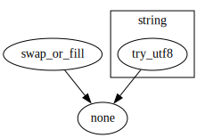

## Function `some`

Return an <code><a href="option.md#0x1_option_Option">Option</a></code> containing <code>e</code>

<pre><code><b>public</b> <b>fun</b> <a href="option.md#0x1_option_some">some</a>&lt;Element&gt;(e: Element): <a href="option.md#0x1_option_Option">option::Option</a>&lt;Element&gt;
</code></pre>

Implementation

<pre><code><b>public</b> <b>fun</b> <a href="option.md#0x1_option_some">some</a>&lt;Element&gt;(e: Element): <a href="option.md#0x1_option_Option">Option</a>&lt;Element&gt; {
    <a href="option.md#0x1_option_Option">Option</a> { vec: <a href="vector.md#0x1_vector_singleton">vector::singleton</a>(e) }
}
</code></pre>

Show all the functions that "some" calls

Show all the functions that call "some"

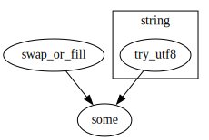

## Function `is_none`

Return true if <code>t</code> does not hold a value

<pre><code><b>public</b> <b>fun</b> <a href="option.md#0x1_option_is_none">is_none</a>&lt;Element&gt;(t: &<a href="option.md#0x1_option_Option">option::Option</a>&lt;Element&gt;): bool
</code></pre>

Implementation

<pre><code><b>public</b> <b>fun</b> <a href="option.md#0x1_option_is_none">is_none</a>&lt;Element&gt;(t: &<a href="option.md#0x1_option_Option">Option</a>&lt;Element&gt;): bool {
    <a href="vector.md#0x1_vector_is_empty">vector::is_empty</a>(&t.vec)
}
</code></pre>

Show all the functions that "is_none" calls

Show all the functions that call "is_none"

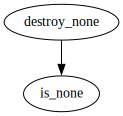

## Function `is_some`

Return true if <code>t</code> holds a value

<pre><code><b>public</b> <b>fun</b> <a href="option.md#0x1_option_is_some">is_some</a>&lt;Element&gt;(t: &<a href="option.md#0x1_option_Option">option::Option</a>&lt;Element&gt;): bool
</code></pre>

Implementation

<pre><code><b>public</b> <b>fun</b> <a href="option.md#0x1_option_is_some">is_some</a>&lt;Element&gt;(t: &<a href="option.md#0x1_option_Option">Option</a>&lt;Element&gt;): bool {
    !<a href="vector.md#0x1_vector_is_empty">vector::is_empty</a>(&t.vec)
}
</code></pre>

Show all the functions that "is_some" calls

Show all the functions that call "is_some"

## Function `contains`

Return true if the value in <code>t</code> is equal to <code>e_ref</code>
Always returns <code><b>false</b></code> if <code>t</code> does not hold a value

<pre><code><b>public</b> <b>fun</b> <a href="option.md#0x1_option_contains">contains</a>&lt;Element&gt;(t: &<a href="option.md#0x1_option_Option">option::Option</a>&lt;Element&gt;, e_ref: &Element): bool
</code></pre>

Implementation

<pre><code><b>public</b> <b>fun</b> <a href="option.md#0x1_option_contains">contains</a>&lt;Element&gt;(t: &<a href="option.md#0x1_option_Option">Option</a>&lt;Element&gt;, e_ref: &Element): bool {
    <a href="vector.md#0x1_vector_contains">vector::contains</a>(&t.vec, e_ref)
}
</code></pre>

Show all the functions that "contains" calls

Show all the functions that call "contains"

## Function `borrow`

Return an immutable reference to the value inside <code>t</code>
Aborts if <code>t</code> does not hold a value

<pre><code><b>public</b> <b>fun</b> <a href="option.md#0x1_option_borrow">borrow</a>&lt;Element&gt;(t: &<a href="option.md#0x1_option_Option">option::Option</a>&lt;Element&gt;): &Element
</code></pre>

Implementation

<pre><code><b>public</b> <b>fun</b> <a href="option.md#0x1_option_borrow">borrow</a>&lt;Element&gt;(t: &<a href="option.md#0x1_option_Option">Option</a>&lt;Element&gt;): &Element {
    <b>assert</b>!(<a href="option.md#0x1_option_is_some">is_some</a>(t), <a href="option.md#0x1_option_EOPTION_NOT_SET">EOPTION_NOT_SET</a>);
    <a href="vector.md#0x1_vector_borrow">vector::borrow</a>(&t.vec, 0)
}
</code></pre>

Show all the functions that "borrow" calls

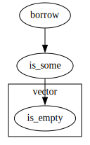

Show all the functions that call "borrow"

## Function `borrow_with_default`

Return a reference to the value inside <code>t</code> if it holds one
Return <code>default_ref</code> if <code>t</code> does not hold a value

<pre><code><b>public</b> <b>fun</b> <a href="option.md#0x1_option_borrow_with_default">borrow_with_default</a>&lt;Element&gt;(t: &<a href="option.md#0x1_option_Option">option::Option</a>&lt;Element&gt;, default_ref: &Element): &Element
</code></pre>

Implementation

<pre><code><b>public</b> <b>fun</b> <a href="option.md#0x1_option_borrow_with_default">borrow_with_default</a>&lt;Element&gt;(t: &<a href="option.md#0x1_option_Option">Option</a>&lt;Element&gt;, default_ref: &Element): &Element {
    <b>let</b> vec_ref = &t.vec;
    <b>if</b> (<a href="vector.md#0x1_vector_is_empty">vector::is_empty</a>(vec_ref)) default_ref
    <b>else</b> <a href="vector.md#0x1_vector_borrow">vector::borrow</a>(vec_ref, 0)
}
</code></pre>

Show all the functions that "borrow_with_default" calls

Show all the functions that call "borrow_with_default"

## Function `get_with_default`

Return the value inside <code>t</code> if it holds one
Return <code>default</code> if <code>t</code> does not hold a value

<pre><code><b>public</b> <b>fun</b> <a href="option.md#0x1_option_get_with_default">get_with_default</a>&lt;Element: <b>copy</b>, drop&gt;(t: &<a href="option.md#0x1_option_Option">option::Option</a>&lt;Element&gt;, default: Element): Element
</code></pre>

Implementation

<pre><code><b>public</b> <b>fun</b> <a href="option.md#0x1_option_get_with_default">get_with_default</a>&lt;Element: <b>copy</b> + drop&gt;(
    t: &<a href="option.md#0x1_option_Option">Option</a>&lt;Element&gt;,
    default: Element,
): Element {
    <b>let</b> vec_ref = &t.vec;
    <b>if</b> (<a href="vector.md#0x1_vector_is_empty">vector::is_empty</a>(vec_ref)) default
    <b>else</b> *<a href="vector.md#0x1_vector_borrow">vector::borrow</a>(vec_ref, 0)
}
</code></pre>

Show all the functions that "get_with_default" calls

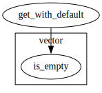

Show all the functions that call "get_with_default"

## Function `fill`

Convert the none option <code>t</code> to a some option by adding <code>e</code>.
Aborts if <code>t</code> already holds a value

<pre><code><b>public</b> <b>fun</b> <a href="option.md#0x1_option_fill">fill</a>&lt;Element&gt;(t: &<b>mut</b> <a href="option.md#0x1_option_Option">option::Option</a>&lt;Element&gt;, e: Element)
</code></pre>

Implementation

<pre><code><b>public</b> <b>fun</b> <a href="option.md#0x1_option_fill">fill</a>&lt;Element&gt;(t: &<b>mut</b> <a href="option.md#0x1_option_Option">Option</a>&lt;Element&gt;, e: Element) {
    <b>let</b> vec_ref = &<b>mut</b> t.vec;
    <b>if</b> (<a href="vector.md#0x1_vector_is_empty">vector::is_empty</a>(vec_ref)) <a href="vector.md#0x1_vector_push_back">vector::push_back</a>(vec_ref, e)
    <b>else</b> <b>abort</b> <a href="option.md#0x1_option_EOPTION_IS_SET">EOPTION_IS_SET</a>
}
</code></pre>

Show all the functions that "fill" calls

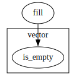

Show all the functions that call "fill"

## Function `extract`

Convert a <code>some</code> option to a <code>none</code> by removing and returning the value stored inside <code>t</code>
Aborts if <code>t</code> does not hold a value

<pre><code><b>public</b> <b>fun</b> <a href="option.md#0x1_option_extract">extract</a>&lt;Element&gt;(t: &<b>mut</b> <a href="option.md#0x1_option_Option">option::Option</a>&lt;Element&gt;): Element
</code></pre>

Implementation

<pre><code><b>public</b> <b>fun</b> <a href="option.md#0x1_option_extract">extract</a>&lt;Element&gt;(t: &<b>mut</b> <a href="option.md#0x1_option_Option">Option</a>&lt;Element&gt;): Element {
    <b>assert</b>!(<a href="option.md#0x1_option_is_some">is_some</a>(t), <a href="option.md#0x1_option_EOPTION_NOT_SET">EOPTION_NOT_SET</a>);
    <a href="vector.md#0x1_vector_pop_back">vector::pop_back</a>(&<b>mut</b> t.vec)
}
</code></pre>

Show all the functions that "extract" calls

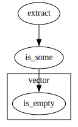

Show all the functions that call "extract"

## Function `borrow_mut`

Return a mutable reference to the value inside <code>t</code>
Aborts if <code>t</code> does not hold a value

<pre><code><b>public</b> <b>fun</b> <a href="option.md#0x1_option_borrow_mut">borrow_mut</a>&lt;Element&gt;(t: &<b>mut</b> <a href="option.md#0x1_option_Option">option::Option</a>&lt;Element&gt;): &<b>mut</b> Element
</code></pre>

Implementation

<pre><code><b>public</b> <b>fun</b> <a href="option.md#0x1_option_borrow_mut">borrow_mut</a>&lt;Element&gt;(t: &<b>mut</b> <a href="option.md#0x1_option_Option">Option</a>&lt;Element&gt;): &<b>mut</b> Element {
    <b>assert</b>!(<a href="option.md#0x1_option_is_some">is_some</a>(t), <a href="option.md#0x1_option_EOPTION_NOT_SET">EOPTION_NOT_SET</a>);
    <a href="vector.md#0x1_vector_borrow_mut">vector::borrow_mut</a>(&<b>mut</b> t.vec, 0)
}
</code></pre>

Show all the functions that "borrow_mut" calls

Show all the functions that call "borrow_mut"

## Function `swap`

Swap the old value inside <code>t</code> with <code>e</code> and return the old value
Aborts if <code>t</code> does not hold a value

<pre><code><b>public</b> <b>fun</b> <a href="option.md#0x1_option_swap">swap</a>&lt;Element&gt;(t: &<b>mut</b> <a href="option.md#0x1_option_Option">option::Option</a>&lt;Element&gt;, e: Element): Element
</code></pre>

Implementation

<pre><code><b>public</b> <b>fun</b> <a href="option.md#0x1_option_swap">swap</a>&lt;Element&gt;(t: &<b>mut</b> <a href="option.md#0x1_option_Option">Option</a>&lt;Element&gt;, e: Element): Element {
    <b>assert</b>!(<a href="option.md#0x1_option_is_some">is_some</a>(t), <a href="option.md#0x1_option_EOPTION_NOT_SET">EOPTION_NOT_SET</a>);
    <b>let</b> vec_ref = &<b>mut</b> t.vec;
    <b>let</b> old_value = <a href="vector.md#0x1_vector_pop_back">vector::pop_back</a>(vec_ref);
    <a href="vector.md#0x1_vector_push_back">vector::push_back</a>(vec_ref, e);
    old_value
}
</code></pre>

Show all the functions that "swap" calls

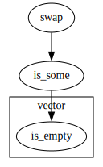

Show all the functions that call "swap"

## Function `swap_or_fill`

Swap the old value inside <code>t</code> with <code>e</code> and return the old value;
or if there is no old value, fill it with <code>e</code>.
Different from swap(), swap_or_fill() allows for <code>t</code> not holding a value.

<pre><code><b>public</b> <b>fun</b> <a href="option.md#0x1_option_swap_or_fill">swap_or_fill</a>&lt;Element&gt;(t: &<b>mut</b> <a href="option.md#0x1_option_Option">option::Option</a>&lt;Element&gt;, e: Element): <a href="option.md#0x1_option_Option">option::Option</a>&lt;Element&gt;
</code></pre>

Implementation

<pre><code><b>public</b> <b>fun</b> <a href="option.md#0x1_option_swap_or_fill">swap_or_fill</a>&lt;Element&gt;(t: &<b>mut</b> <a href="option.md#0x1_option_Option">Option</a>&lt;Element&gt;, e: Element): <a href="option.md#0x1_option_Option">Option</a>&lt;Element&gt; {
    <b>let</b> vec_ref = &<b>mut</b> t.vec;
    <b>let</b> old_value = <b>if</b> (<a href="vector.md#0x1_vector_is_empty">vector::is_empty</a>(vec_ref)) <a href="option.md#0x1_option_none">none</a>()
        <b>else</b> <a href="option.md#0x1_option_some">some</a>(<a href="vector.md#0x1_vector_pop_back">vector::pop_back</a>(vec_ref));
    <a href="vector.md#0x1_vector_push_back">vector::push_back</a>(vec_ref, e);
    old_value
}
</code></pre>

Show all the functions that "swap_or_fill" calls

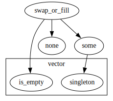

Show all the functions that call "swap_or_fill"

## Function `destroy_with_default`

Destroys <code>t.</code> If <code>t</code> holds a value, return it. Returns <code>default</code> otherwise

<pre><code><b>public</b> <b>fun</b> <a href="option.md#0x1_option_destroy_with_default">destroy_with_default</a>&lt;Element: drop&gt;(t: <a href="option.md#0x1_option_Option">option::Option</a>&lt;Element&gt;, default: Element): Element
</code></pre>

Implementation

<pre><code><b>public</b> <b>fun</b> <a href="option.md#0x1_option_destroy_with_default">destroy_with_default</a>&lt;Element: drop&gt;(t: <a href="option.md#0x1_option_Option">Option</a>&lt;Element&gt;, default: Element): Element {
    <b>let</b> <a href="option.md#0x1_option_Option">Option</a> { vec } = t;
    <b>if</b> (<a href="vector.md#0x1_vector_is_empty">vector::is_empty</a>(&<b>mut</b> vec)) default
    <b>else</b> <a href="vector.md#0x1_vector_pop_back">vector::pop_back</a>(&<b>mut</b> vec)
}
</code></pre>

Show all the functions that "destroy_with_default" calls

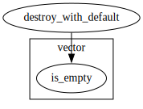

Show all the functions that call "destroy_with_default"

## Function `destroy_some`

Unpack <code>t</code> and return its contents
Aborts if <code>t</code> does not hold a value

<pre><code><b>public</b> <b>fun</b> <a href="option.md#0x1_option_destroy_some">destroy_some</a>&lt;Element&gt;(t: <a href="option.md#0x1_option_Option">option::Option</a>&lt;Element&gt;): Element
</code></pre>

Implementation

<pre><code><b>public</b> <b>fun</b> <a href="option.md#0x1_option_destroy_some">destroy_some</a>&lt;Element&gt;(t: <a href="option.md#0x1_option_Option">Option</a>&lt;Element&gt;): Element {
    <b>assert</b>!(<a href="option.md#0x1_option_is_some">is_some</a>(&t), <a href="option.md#0x1_option_EOPTION_NOT_SET">EOPTION_NOT_SET</a>);
    <b>let</b> <a href="option.md#0x1_option_Option">Option</a> { vec } = t;
    <b>let</b> elem = <a href="vector.md#0x1_vector_pop_back">vector::pop_back</a>(&<b>mut</b> vec);
    <a href="vector.md#0x1_vector_destroy_empty">vector::destroy_empty</a>(vec);
    elem
}
</code></pre>

Show all the functions that "destroy_some" calls

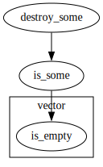

Show all the functions that call "destroy_some"

## Function `destroy_none`

Unpack <code>t</code>
Aborts if <code>t</code> holds a value

<pre><code><b>public</b> <b>fun</b> <a href="option.md#0x1_option_destroy_none">destroy_none</a>&lt;Element&gt;(t: <a href="option.md#0x1_option_Option">option::Option</a>&lt;Element&gt;)
</code></pre>

Implementation

<pre><code><b>public</b> <b>fun</b> <a href="option.md#0x1_option_destroy_none">destroy_none</a>&lt;Element&gt;(t: <a href="option.md#0x1_option_Option">Option</a>&lt;Element&gt;) {
    <b>assert</b>!(<a href="option.md#0x1_option_is_none">is_none</a>(&t), <a href="option.md#0x1_option_EOPTION_IS_SET">EOPTION_IS_SET</a>);
    <b>let</b> <a href="option.md#0x1_option_Option">Option</a> { vec } = t;
    <a href="vector.md#0x1_vector_destroy_empty">vector::destroy_empty</a>(vec)
}
</code></pre>

Show all the functions that "destroy_none" calls

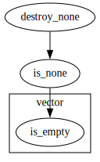

Show all the functions that call "destroy_none"

## Function `to_vec`

Convert <code>t</code> into a vector of length 1 if it is <code>Some</code>,
and an empty vector otherwise

<pre><code><b>public</b> <b>fun</b> <a href="option.md#0x1_option_to_vec">to_vec</a>&lt;Element&gt;(t: <a href="option.md#0x1_option_Option">option::Option</a>&lt;Element&gt;): <a href="vector.md#0x1_vector">vector</a>&lt;Element&gt;
</code></pre>

Implementation

<pre><code><b>public</b> <b>fun</b> <a href="option.md#0x1_option_to_vec">to_vec</a>&lt;Element&gt;(t: <a href="option.md#0x1_option_Option">Option</a>&lt;Element&gt;): <a href="vector.md#0x1_vector">vector</a>&lt;Element&gt; {
    <b>let</b> <a href="option.md#0x1_option_Option">Option</a> { vec } = t;
    vec
}
</code></pre>

Show all the functions that "to_vec" calls

Show all the functions that call "to_vec"

## Specification

<pre><code><b>pragma</b> aborts_if_is_strict;
</code></pre>

### Helper Schema

<pre><code><b>schema</b> <a href="option.md#0x1_option_AbortsIfNone">AbortsIfNone</a>&lt;Element&gt; {
    t: <a href="option.md#0x1_option_Option">Option</a>&lt;Element&gt;;
    <b>aborts_if</b> <a href="option.md#0x1_option_is_none">is_none</a>(t) <b>with</b> <a href="option.md#0x1_option_EOPTION_NOT_SET">EOPTION_NOT_SET</a>;
}
</code></pre>

### Struct `Option`

<pre><code><b>struct</b> <a href="option.md#0x1_option_Option">Option</a>&lt;Element&gt; <b>has</b> <b>copy</b>, drop, store
</code></pre>

<dl>
<dt>
<code>vec: <a href="vector.md#0x1_vector">vector</a>&lt;Element&gt;</code>
</dt>
<dd>

</dd>
</dl>

The size of vector is always less than equal to 1
because it's 0 for "none" or 1 for "some".

<pre><code><b>invariant</b> len(vec) &lt;= 1;
</code></pre>

### Function `none`

<pre><code><b>public</b> <b>fun</b> <a href="option.md#0x1_option_none">none</a>&lt;Element&gt;(): <a href="option.md#0x1_option_Option">option::Option</a>&lt;Element&gt;
</code></pre>

<pre><code><b>pragma</b> opaque;
<b>aborts_if</b> <b>false</b>;
<b>ensures</b> result == <a href="option.md#0x1_option_spec_none">spec_none</a>&lt;Element&gt;();
</code></pre>

<pre><code><b>fun</b> <a href="option.md#0x1_option_spec_none">spec_none</a>&lt;Element&gt;(): <a href="option.md#0x1_option_Option">Option</a>&lt;Element&gt; {
   <a href="option.md#0x1_option_Option">Option</a>{ vec: vec() }
}
</code></pre>

### Function `some`

<pre><code><b>public</b> <b>fun</b> <a href="option.md#0x1_option_some">some</a>&lt;Element&gt;(e: Element): <a href="option.md#0x1_option_Option">option::Option</a>&lt;Element&gt;
</code></pre>

<pre><code><b>pragma</b> opaque;
<b>aborts_if</b> <b>false</b>;
<b>ensures</b> result == <a href="option.md#0x1_option_spec_some">spec_some</a>(e);
</code></pre>

<pre><code><b>fun</b> <a href="option.md#0x1_option_spec_some">spec_some</a>&lt;Element&gt;(e: Element): <a href="option.md#0x1_option_Option">Option</a>&lt;Element&gt; {
   <a href="option.md#0x1_option_Option">Option</a>{ vec: vec(e) }
}
</code></pre>

### Function `is_none`

<pre><code><b>public</b> <b>fun</b> <a href="option.md#0x1_option_is_none">is_none</a>&lt;Element&gt;(t: &<a href="option.md#0x1_option_Option">option::Option</a>&lt;Element&gt;): bool
</code></pre>

<pre><code><b>pragma</b> opaque;
<b>aborts_if</b> <b>false</b>;
<b>ensures</b> result == <a href="option.md#0x1_option_is_none">is_none</a>(t);
</code></pre>

### Function `is_some`

<pre><code><b>public</b> <b>fun</b> <a href="option.md#0x1_option_is_some">is_some</a>&lt;Element&gt;(t: &<a href="option.md#0x1_option_Option">option::Option</a>&lt;Element&gt;): bool
</code></pre>

<pre><code><b>pragma</b> opaque;
<b>aborts_if</b> <b>false</b>;
<b>ensures</b> result == <a href="option.md#0x1_option_is_some">is_some</a>(t);
</code></pre>

### Function `contains`

<pre><code><b>public</b> <b>fun</b> <a href="option.md#0x1_option_contains">contains</a>&lt;Element&gt;(t: &<a href="option.md#0x1_option_Option">option::Option</a>&lt;Element&gt;, e_ref: &Element): bool
</code></pre>

<pre><code><b>pragma</b> opaque;
<b>aborts_if</b> <b>false</b>;
<b>ensures</b> result == <a href="option.md#0x1_option_spec_contains">spec_contains</a>(t, e_ref);
</code></pre>

<pre><code><b>fun</b> <a href="option.md#0x1_option_spec_contains">spec_contains</a>&lt;Element&gt;(t: <a href="option.md#0x1_option_Option">Option</a>&lt;Element&gt;, e: Element): bool {
   <a href="option.md#0x1_option_is_some">is_some</a>(t) && <a href="option.md#0x1_option_borrow">borrow</a>(t) == e
}
</code></pre>

### Function `borrow`

<pre><code><b>public</b> <b>fun</b> <a href="option.md#0x1_option_borrow">borrow</a>&lt;Element&gt;(t: &<a href="option.md#0x1_option_Option">option::Option</a>&lt;Element&gt;): &Element
</code></pre>

<pre><code><b>pragma</b> opaque;
<b>include</b> <a href="option.md#0x1_option_AbortsIfNone">AbortsIfNone</a>&lt;Element&gt;;
<b>ensures</b> result == <a href="option.md#0x1_option_borrow">borrow</a>(t);
</code></pre>

### Function `borrow_with_default`

<pre><code><b>public</b> <b>fun</b> <a href="option.md#0x1_option_borrow_with_default">borrow_with_default</a>&lt;Element&gt;(t: &<a href="option.md#0x1_option_Option">option::Option</a>&lt;Element&gt;, default_ref: &Element): &Element
</code></pre>

<pre><code><b>pragma</b> opaque;
<b>aborts_if</b> <b>false</b>;
<b>ensures</b> result == (<b>if</b> (<a href="option.md#0x1_option_is_some">is_some</a>(t)) <a href="option.md#0x1_option_borrow">borrow</a>(t) <b>else</b> default_ref);
</code></pre>

### Function `get_with_default`

<pre><code><b>public</b> <b>fun</b> <a href="option.md#0x1_option_get_with_default">get_with_default</a>&lt;Element: <b>copy</b>, drop&gt;(t: &<a href="option.md#0x1_option_Option">option::Option</a>&lt;Element&gt;, default: Element): Element
</code></pre>

<pre><code><b>pragma</b> opaque;
<b>aborts_if</b> <b>false</b>;
<b>ensures</b> result == (<b>if</b> (<a href="option.md#0x1_option_is_some">is_some</a>(t)) <a href="option.md#0x1_option_borrow">borrow</a>(t) <b>else</b> default);
</code></pre>

### Function `fill`

<pre><code><b>public</b> <b>fun</b> <a href="option.md#0x1_option_fill">fill</a>&lt;Element&gt;(t: &<b>mut</b> <a href="option.md#0x1_option_Option">option::Option</a>&lt;Element&gt;, e: Element)
</code></pre>

<pre><code><b>pragma</b> opaque;
<b>aborts_if</b> <a href="option.md#0x1_option_is_some">is_some</a>(t) <b>with</b> <a href="option.md#0x1_option_EOPTION_IS_SET">EOPTION_IS_SET</a>;
<b>ensures</b> <a href="option.md#0x1_option_is_some">is_some</a>(t);
<b>ensures</b> <a href="option.md#0x1_option_borrow">borrow</a>(t) == e;
</code></pre>

### Function `extract`

<pre><code><b>public</b> <b>fun</b> <a href="option.md#0x1_option_extract">extract</a>&lt;Element&gt;(t: &<b>mut</b> <a href="option.md#0x1_option_Option">option::Option</a>&lt;Element&gt;): Element
</code></pre>

<pre><code><b>pragma</b> opaque;
<b>include</b> <a href="option.md#0x1_option_AbortsIfNone">AbortsIfNone</a>&lt;Element&gt;;
<b>ensures</b> result == <a href="option.md#0x1_option_borrow">borrow</a>(<b>old</b>(t));
<b>ensures</b> <a href="option.md#0x1_option_is_none">is_none</a>(t);
</code></pre>

### Function `borrow_mut`

<pre><code><b>public</b> <b>fun</b> <a href="option.md#0x1_option_borrow_mut">borrow_mut</a>&lt;Element&gt;(t: &<b>mut</b> <a href="option.md#0x1_option_Option">option::Option</a>&lt;Element&gt;): &<b>mut</b> Element
</code></pre>

<pre><code><b>pragma</b> opaque;
<b>include</b> <a href="option.md#0x1_option_AbortsIfNone">AbortsIfNone</a>&lt;Element&gt;;
<b>ensures</b> result == <a href="option.md#0x1_option_borrow">borrow</a>(t);
</code></pre>

### Function `swap`

<pre><code><b>public</b> <b>fun</b> <a href="option.md#0x1_option_swap">swap</a>&lt;Element&gt;(t: &<b>mut</b> <a href="option.md#0x1_option_Option">option::Option</a>&lt;Element&gt;, e: Element): Element
</code></pre>

<pre><code><b>pragma</b> opaque;
<b>include</b> <a href="option.md#0x1_option_AbortsIfNone">AbortsIfNone</a>&lt;Element&gt;;
<b>ensures</b> result == <a href="option.md#0x1_option_borrow">borrow</a>(<b>old</b>(t));
<b>ensures</b> <a href="option.md#0x1_option_is_some">is_some</a>(t);
<b>ensures</b> <a href="option.md#0x1_option_borrow">borrow</a>(t) == e;
</code></pre>

### Function `swap_or_fill`

<pre><code><b>public</b> <b>fun</b> <a href="option.md#0x1_option_swap_or_fill">swap_or_fill</a>&lt;Element&gt;(t: &<b>mut</b> <a href="option.md#0x1_option_Option">option::Option</a>&lt;Element&gt;, e: Element): <a href="option.md#0x1_option_Option">option::Option</a>&lt;Element&gt;
</code></pre>

<pre><code><b>pragma</b> opaque;
<b>ensures</b> result == <b>old</b>(t);
<b>ensures</b> <a href="option.md#0x1_option_borrow">borrow</a>(t) == e;
</code></pre>

### Function `destroy_with_default`

<pre><code><b>public</b> <b>fun</b> <a href="option.md#0x1_option_destroy_with_default">destroy_with_default</a>&lt;Element: drop&gt;(t: <a href="option.md#0x1_option_Option">option::Option</a>&lt;Element&gt;, default: Element): Element
</code></pre>

<pre><code><b>pragma</b> opaque;
<b>aborts_if</b> <b>false</b>;
<b>ensures</b> result == (<b>if</b> (<a href="option.md#0x1_option_is_some">is_some</a>(t)) <a href="option.md#0x1_option_borrow">borrow</a>(t) <b>else</b> default);
</code></pre>

### Function `destroy_some`

<pre><code><b>public</b> <b>fun</b> <a href="option.md#0x1_option_destroy_some">destroy_some</a>&lt;Element&gt;(t: <a href="option.md#0x1_option_Option">option::Option</a>&lt;Element&gt;): Element
</code></pre>

<pre><code><b>pragma</b> opaque;
<b>include</b> <a href="option.md#0x1_option_AbortsIfNone">AbortsIfNone</a>&lt;Element&gt;;
<b>ensures</b> result == <a href="option.md#0x1_option_borrow">borrow</a>(t);
</code></pre>

### Function `destroy_none`

<pre><code><b>public</b> <b>fun</b> <a href="option.md#0x1_option_destroy_none">destroy_none</a>&lt;Element&gt;(t: <a href="option.md#0x1_option_Option">option::Option</a>&lt;Element&gt;)
</code></pre>

<pre><code><b>pragma</b> opaque;
<b>aborts_if</b> <a href="option.md#0x1_option_is_some">is_some</a>(t) <b>with</b> <a href="option.md#0x1_option_EOPTION_IS_SET">EOPTION_IS_SET</a>;
</code></pre>

### Function `to_vec`

<pre><code><b>public</b> <b>fun</b> <a href="option.md#0x1_option_to_vec">to_vec</a>&lt;Element&gt;(t: <a href="option.md#0x1_option_Option">option::Option</a>&lt;Element&gt;): <a href="vector.md#0x1_vector">vector</a>&lt;Element&gt;
</code></pre>

<pre><code><b>pragma</b> opaque;
<b>aborts_if</b> <b>false</b>;
<b>ensures</b> result == t.vec;
</code></pre>

[move-book]: https://move-language.github.io/move/introduction.html
